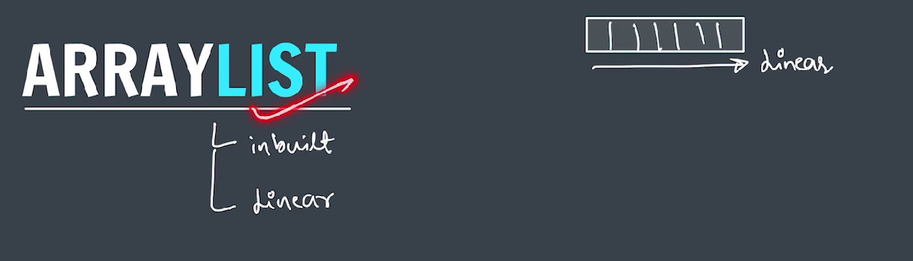
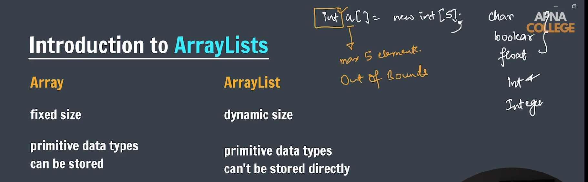
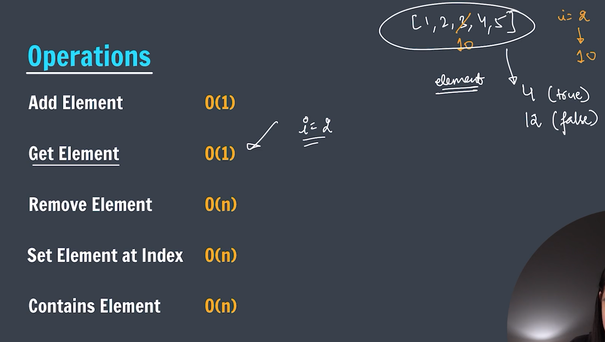

### **ArrayList Topic**

---

**_-> ArrayList is a linear data structure. It is dynamic in nature._**




---

---

### 📌 Basic Operations & Their Time Complexities

| **Operation**                     | **Description**                     | **Time Complexity**   |
| --------------------------------- | ----------------------------------- | --------------------- |
| `add(E e)`                        | Adds element to the end             | **O(1)** (amortized)  |
| `add(int index, E element)`       | Inserts element at index            | **O(n)**              |
| `get(int index)`                  | Retrieves element at index          | **O(1)**              |
| `set(int index, E element)`       | Replaces element at index           | **O(1)**              |
| `remove(int index)`               | Removes element at index            | **O(n)**              |
| `remove(Object o)`                | Removes first occurrence of object  | **O(n)**              |
| `contains(Object o)`              | Checks if element exists            | **O(n)**              |
| `indexOf(Object o)`               | Returns index of first occurrence   | **O(n)**              |
| `lastIndexOf(Object o)`           | Returns index of last occurrence    | **O(n)**              |
| `size()`                          | Returns the number of elements      | **O(1)**              |
| `clear()`                         | Removes all elements                | **O(n)**              |
| `isEmpty()`                       | Checks if list is empty             | **O(1)**              |
| Iteration (e.g. for-each loop)    | Traverse the list                   | **O(n)**              |
| `toArray()`                       | Converts list to array              | **O(n)**              |
| `ensureCapacity(int minCapacity)` | Ensures capacity (can cause resize) | **O(n)** (worst case) |

---

### ⚙️ Explanation of Amortized `O(1)` for `add(E e)`

When adding an element at the **end**, if the internal array has room, it's **O(1)**. If the array is full, it resizes (typically doubles in size), which is an **O(n)** operation. However, this happens rarely, so the **amortized** time remains **O(1)**.

---

### 🚫 When to Avoid `ArrayList`

- **Frequent inserts/deletes in the middle** → use `LinkedList` instead.
- **Need for thread safety** → consider `Collections.synchronizedList()` or `CopyOnWriteArrayList`.

---



---

### Size of an arrayList

```java
import java.util.*;
public class Main {
    Public static void main(String[] args) {
        ArrayList<Integer> arr = new ArrayList<>();
        arr.add(1);
        arr.add(2);
        System.out.println(arr.size());
    }
}
```

---

**_🔍 Output:_**

2

---

**_reverse an arrayList_**

```java
package Arraylist;

import java.util.ArrayList;
import java.util.Collections;

public class printReverse {
    public static void main(String[] args) {

        ArrayList<Integer> arr = new ArrayList<>();
        for (int i = 1; i <= 5; i++) {
            arr.add(i);
        }

        // print reverse of arraylist
        // for (int i = arr.size() - 1; i >= 0; i--) {
        // System.out.print(arr.get(i) + " ");
        // }

        Collections.reverse(arr);

        for (int i = 0; i < arr.size(); i++) {
            System.out.print(arr.get(i) + " ");
        }
        System.out.println();

    }
}
```

---

**_🔍 Output:_**

5 4 3 2 1

---

**_-> Find maximum in arraylist_**

```java
package Arraylist;

import java.util.Scanner;
import java.util.ArrayList;
import java.util.Collections;

public class findMaximum {

    public static void main(String[] args) {

        // arraylist data = 2 5 9 3 6

        Scanner sc = new Scanner(System.in);

        // ArrayList creation
        ArrayList<Integer> arr = new ArrayList<>();

        System.out.println("Enter values: ");
        for (int i = 0; i < 5; i++) {
            arr.add(sc.nextInt());
        }

        // *** Method 1 (Using inbuilt functions) ***
        Collections.sort(arr);
        System.out.println("The maximum number is: " + arr.get(arr.size() - 1));

        // *** Method 2 (Manually)***
        int max = Integer.MIN_VALUE;
        for (int i = 0; i < arr.size(); i++) {
            if (max < arr.get(i)) {
                max = arr.get(i);
            }
        }

        System.out.println("Maximum number: " + max);

        sc.close();

    }

}

```

---

**_-> Swap two numbers in arrylist_**

```java
package Arraylist;

import java.util.ArrayList;

public class swapNumber {
    public static void main(String[] args) {

        ArrayList<Integer> arr = new ArrayList<>();
        arr.add(2);
        arr.add(5);
        arr.add(9);
        arr.add(3);
        arr.add(6);

        int idx1 = 1, idx2 = 3;

        int temp = arr.get(idx1);
        arr.set(idx1, arr.get(idx2));
        arr.set(idx2, temp);

        for (int i = 0; i < arr.size(); i++) {
            System.out.print(arr.get(i) + " ");
        }
        System.out.println();

    }
}
```
