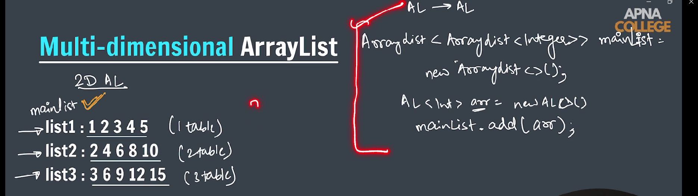
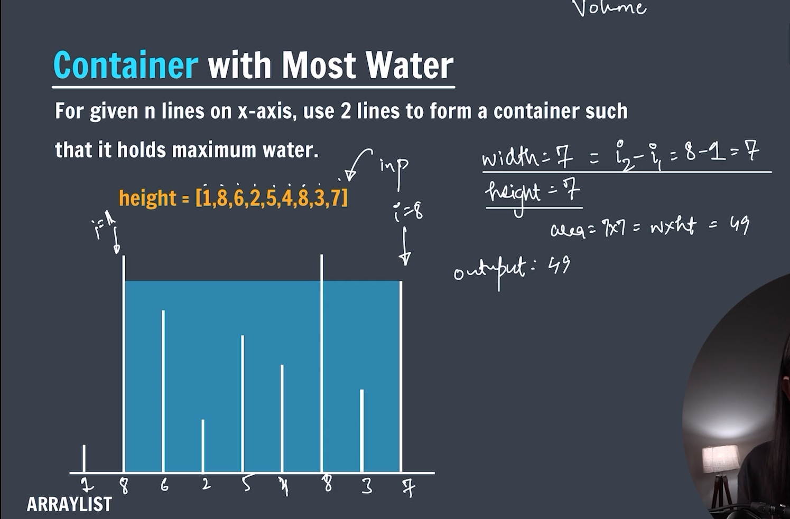
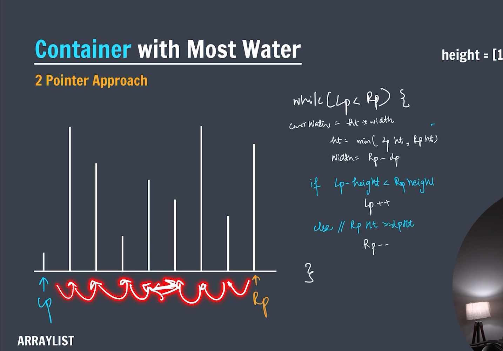
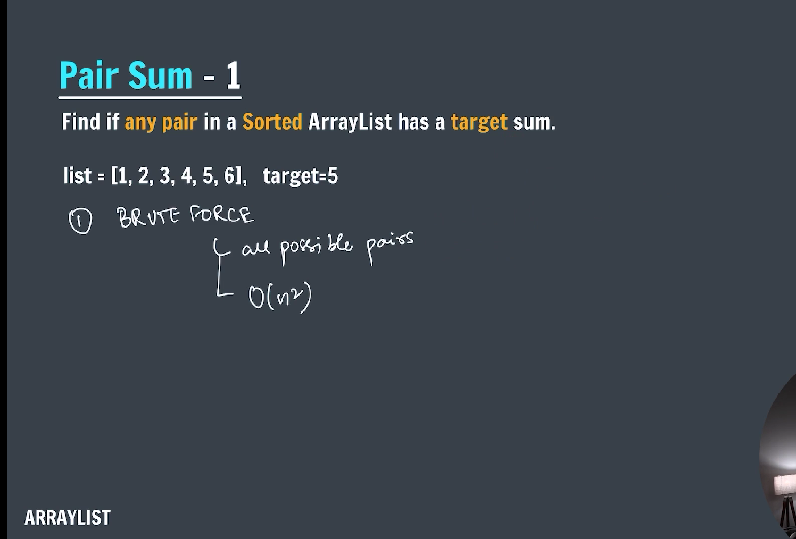
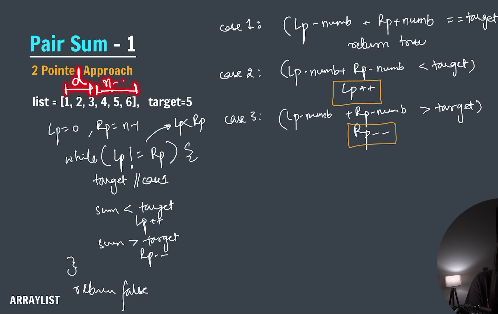

### **ArrayList Topic**

---

**_-> ArrayList is a linear data structure. It is dynamic in nature._**


---

---

### 📌 Basic Operations & Their Time Complexities

| **Operation**                     | **Description**                     | **Time Complexity**   |
| --------------------------------- | ----------------------------------- | --------------------- |
| `add(E e)`                        | Adds element to the end             | **O(1)** (amortized)  |
| `add(int index, E element)`       | Inserts element at index            | **O(n)**              |
| `get(int index)`                  | Retrieves element at index          | **O(1)**              |
| `set(int index, E element)`       | Replaces element at index           | **O(1)**              |
| `remove(int index)`               | Removes element at index            | **O(n)**              |
| `remove(Object o)`                | Removes first occurrence of object  | **O(n)**              |
| `contains(Object o)`              | Checks if element exists            | **O(n)**              |
| `indexOf(Object o)`               | Returns index of first occurrence   | **O(n)**              |
| `lastIndexOf(Object o)`           | Returns index of last occurrence    | **O(n)**              |
| `size()`                          | Returns the number of elements      | **O(1)**              |
| `clear()`                         | Removes all elements                | **O(n)**              |
| `isEmpty()`                       | Checks if list is empty             | **O(1)**              |
| Iteration (e.g. for-each loop)    | Traverse the list                   | **O(n)**              |
| `toArray()`                       | Converts list to array              | **O(n)**              |
| `ensureCapacity(int minCapacity)` | Ensures capacity (can cause resize) | **O(n)** (worst case) |

---

### ⚙️ Explanation of Amortized `O(1)` for `add(E e)`

When adding an element at the **end**, if the internal array has room, it's **O(1)**. If the array is full, it resizes (typically doubles in size), which is an **O(n)** operation. However, this happens rarely, so the **amortized** time remains **O(1)**.

---

### 🚫 When to Avoid `ArrayList`

- **Frequent inserts/deletes in the middle** → use `LinkedList` instead.
- **Need for thread safety** → consider `Collections.synchronizedList()` or `CopyOnWriteArrayList`.

---


---

### Size of an arrayList

```java
import java.util.*;
public class Main {
    Public static void main(String[] args) {
        ArrayList<Integer> arr = new ArrayList<>();
        arr.add(1);
        arr.add(2);
        System.out.println(arr.size());
    }
}
```

---

**_🔍 Output:_**

2

---

**_reverse an arrayList_**

```java

import java.util.ArrayList;
import java.util.Collections;

public class printReverse {
    public static void main(String[] args) {

        ArrayList<Integer> arr = new ArrayList<>();
        for (int i = 1; i <= 5; i++) {
            arr.add(i);
        }

        // print reverse of arraylist
        // for (int i = arr.size() - 1; i >= 0; i--) {
        // System.out.print(arr.get(i) + " ");
        // }

        Collections.reverse(arr);

        for (int i = 0; i < arr.size(); i++) {
            System.out.print(arr.get(i) + " ");
        }
        System.out.println();

    }
}
```

---

**_🔍 Output:_**

5 4 3 2 1

---

**_-> Find maximum in arraylist_**

```java

import java.util.Scanner;
import java.util.ArrayList;
import java.util.Collections;

public class findMaximum {

    public static void main(String[] args) {

        // arraylist data = 2 5 9 3 6

        Scanner sc = new Scanner(System.in);

        // ArrayList creation
        ArrayList<Integer> arr = new ArrayList<>();

        System.out.println("Enter values: ");
        for (int i = 0; i < 5; i++) {
            arr.add(sc.nextInt());
        }

        // *** Method 1 (Using inbuilt functions) ***
        Collections.sort(arr);
        System.out.println("The maximum number is: " + arr.get(arr.size() - 1));

        // *** Method 2 (Manually)***
        int max = Integer.MIN_VALUE;
        for (int i = 0; i < arr.size(); i++) {
            if (max < arr.get(i)) {
                max = arr.get(i);
            }
        }

        System.out.println("Maximum number: " + max);

        sc.close();

    }

}

```

---

**_🔍 Output:_**
The maximum number is: 9
Maximum number: 9

---

**_-> Swap two numbers in arrylist_**

```java

import java.util.ArrayList;

public class swapNumber {
    public static void main(String[] args) {

        ArrayList<Integer> arr = new ArrayList<>();
        arr.add(2);
        arr.add(5);
        arr.add(9);
        arr.add(3);
        arr.add(6);

        int idx1 = 1, idx2 = 3;

        int temp = arr.get(idx1);
        arr.set(idx1, arr.get(idx2));
        arr.set(idx2, temp);

        for (int i = 0; i < arr.size(); i++) {
            System.out.print(arr.get(i) + " ");
        }
        System.out.println();

    }
}
```

---

**_🔍 Output:_**
2 3 9 5 6

---

**_-> Sorting on arraylist_**

```java

import java.util.*;

public class sorting {
    public static void main(String[] args) {
        // data = 2 5 9 3 6

        ArrayList<Integer> arr = new ArrayList<>();
        arr.add(2);
        arr.add(5);
        arr.add(9);
        arr.add(3);
        arr.add(6);

        System.out.println(arr);

        // sorting in ascending order
        Collections.sort(arr);
        System.out.println("Sorted in ascending order.");
        System.out.println(arr);

        // sorting in descending order
        Collections.sort(arr, Collections.reverseOrder());
        System.out.println("Sorted in descending order.");
        System.out.println(arr);
    }
}
```

---

**_🔍 Output:_**

[2, 5, 9, 3, 6]
Sorted in ascending order.
[2, 3, 5, 6, 9]
Sorted in descending order.
[9, 6, 5, 3, 2]

---

**_-> 2D ArrayList (Multidimensional arraylist)_**


---

```java

import java.util.ArrayList;

public class twoDArrayList {
    public static void main(String[] args) {

        ArrayList<ArrayList<Integer>> mainList = new ArrayList<>();

        ArrayList<Integer> list1 = new ArrayList<>();
        list1.add(1);
        list1.add(2);

        mainList.add(list1);

        ArrayList<Integer> list2 = new ArrayList<>();
        list2.add(3);
        list2.add(4);

        mainList.add(list2);

        // print 2d ArrayList

        for (int i = 0; i < mainList.size(); i++) {
            ArrayList<Integer> currList = mainList.get(i);

            System.out.println(currList);
        }

    }
}
```

---

**_🔍 Output:_**

[1, 2]
[3, 4]

---

**_-> Find container with most Water (Brute force approach)_**

---



---

## Time complexity : $$O(n^2)$$

---

```java

import java.util.Scanner;

public class containerWithMostWater_bruteForce {

    static int maximumWater(int container[]) {

        int maxWater = Integer.MIN_VALUE;

        for (int i = 0; i < container.length; i++) {
            int currWater = 0;

            for (int j = i + 1; j < container.length; j++) {

                int length = j - i;
                int width = Math.min(container[i], container[j]);

                if (currWater < (length * width)) {
                    currWater = length * width;
                }

            }

            maxWater = Math.max(maxWater, currWater);
        }

        return maxWater;

    }

    public static void main(String[] args) {

        // int container[] = { 1, 8, 6, 2, 5, 8, 3, 4, 7 };

        Scanner sc = new Scanner(System.in);
        System.out.print("Enter the size of the array: ");
        int n = sc.nextInt();
        System.out.println("Enter the elements in the array: ");
        int[] container = new int[n];

        for (int i = 0; i < n; i++) {
            container[i] = sc.nextInt();
        }

        int maxWater = maximumWater(container);

        System.out.println("The maximum water can be hold is: " + maxWater);

        sc.close();

    }
}
```

---

**_🔍 Output:_**
[The maximum water can be hold is: 49]

---

**_-> Find container with most Water optimal (two pointer approach)_**



---

Time complexity : $$O(n)$$

---

```java

import java.util.Scanner;
import java.util.ArrayList;

public class containerWithMostWater_twoPointer {

    static int containerWithMostWater(ArrayList<Integer> container) { // O(n)

        int mostWater = 0;
        int left = 0, right = container.size() - 1;

        while (left < right) {

            // calculate most water
            int minHt = Math.min(container.get(left), container.get(right));
            int width = right - left;

            mostWater = Math.max(mostWater, (minHt * width));

            // update pointers
            if (container.get(left) < container.get(right)) {
                left++;
            } else {
                right--;
            }
        }

        return mostWater;

    }

    public static void main(String[] args) {
        // int container[] = { 1, 8, 6, 2, 5, 8, 3, 4, 7 };

        Scanner sc = new Scanner(System.in);
        System.out.print("Enter the number of elements: ");

        int n = sc.nextInt();

        System.out.println("Enter elements in ArrayList: ");

        ArrayList<Integer> container = new ArrayList<>();

        for (int i = 0; i < n; i++) {
            container.add(sc.nextInt());
        }

        int mostWater = containerWithMostWater(container);

        System.out.println("Container with most water: " + mostWater);

        sc.close();

    }
}
```

---

**_🔍 Output:_**
[Container with most water: 49]

---

**_->Pair Sum (Brute force)_**


---

Time Complexity : $$O(n^2)$$

---

```java

import java.util.Scanner;
import java.util.ArrayList;

public class pairSum1_bruteForce {

    public static void pairSum(ArrayList<Integer> pair, int target) {

        for (int i = 0; i < pair.size(); i++) {
            for (int j = i + 1; j < pair.size(); j++) {
                if ((pair.get(i) + pair.get(j)) == target) {
                    System.out.println("Pairs are -> " + i + " " + j);
                    return;
                }
            }
        }

    }

    public static void main(String[] args) {

        // int arr[] = { 1, 2, 3, 4, 5, 6 };
        // int target = 5;

        Scanner sc = new Scanner(System.in);
        System.out.print("Enter the number of elements: ");
        int n = sc.nextInt();

        System.out.println("Enter elements in ArrayList: ");
        ArrayList<Integer> pair = new ArrayList<>();
        for (int i = 0; i < n; i++) {

            pair.add(sc.nextInt());
        }

        System.out.print("Enter the target: ");
        int target = sc.nextInt();

        pairSum(pair, target);

        sc.close();

    }
}
```

---

**_🔍 Output:_**
"Pairs are -> 0 3"

---

**_->Pair Sum(2 pointer)_**


---

Time Complexity : $$O(n)$$

---

```java

import java.util.Scanner;
import java.util.ArrayList;

public class pairSum1_2pointer {

    static void pairSum1(ArrayList<Integer> pair, int target) {

        int left = 0, right = pair.size() - 1;

        while (left < right) {
            int sum = pair.get(left) + pair.get(right);

            if (sum == target) {
                System.out.println("Pair is: " + left + " " + right);
                return;
            }

            if (sum > target) {
                right--;
            } else if (sum < target) {
                left++;
            }
        }

    }

    public static void main(String[] args) {

        // int arr[] = { 1, 2, 3, 4, 5, 6 };
        // int target = 5;

        Scanner sc = new Scanner(System.in);
        System.out.print("Enter the size of arraylist: ");
        int n = sc.nextInt();

        System.out.println("Enter element: ");
        ArrayList<Integer> pair = new ArrayList<>();

        for (int i = 0; i < n; i++) {
            pair.add(sc.nextInt());
        }

        System.out.print("Enter target: ");
        int target = sc.nextInt();

        pairSum1(pair, target);

        sc.close();

    }
}
```

---
