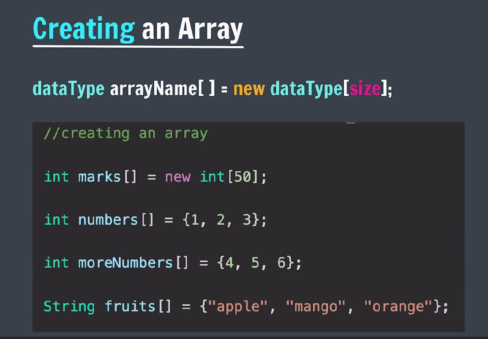
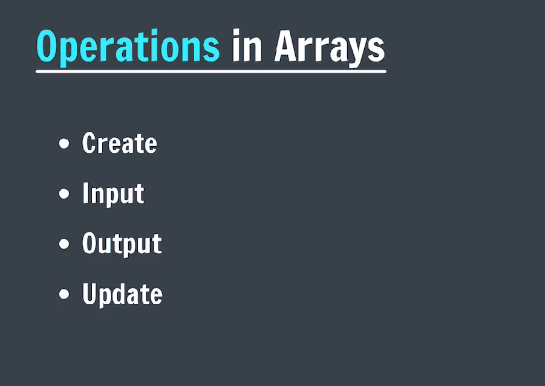
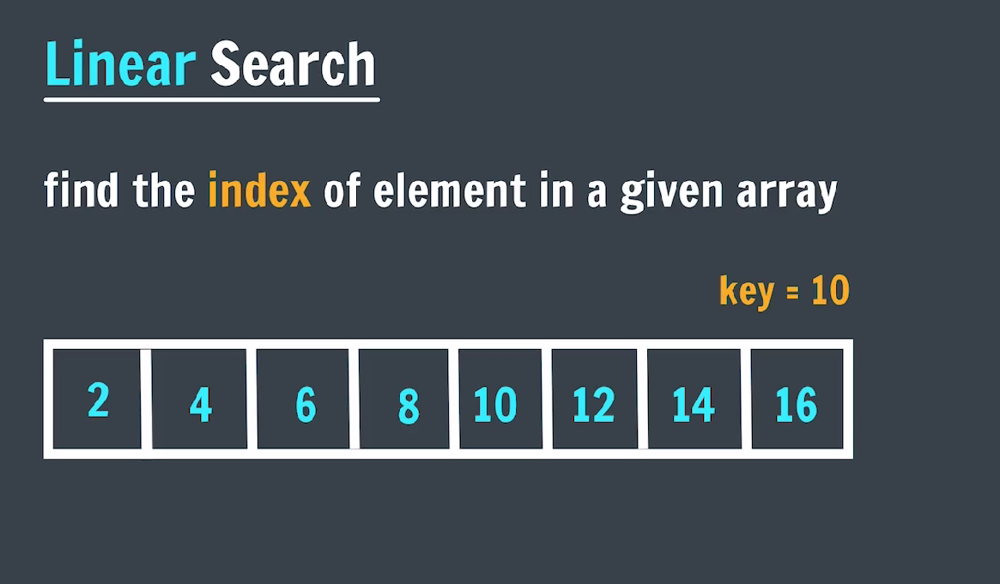
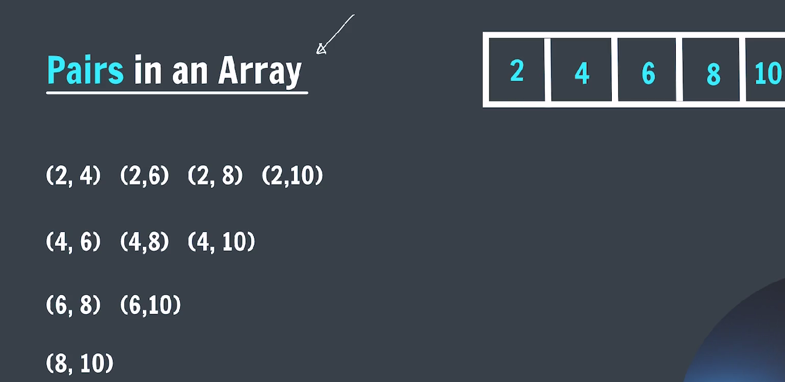

### ARRAYS --> Array is collection of similar types of data



#### Operations on array



**_Linear Search_**
**_->Linear search, also known as sequential search, is a simple algorithm for finding a specific value in a list or array. It works by sequentially comparing each element in the data structure with the target value until a match is found or the end of the data structure is reached._**


#### CODE

```java

public class linearSearch {
    public static void main(String[] args) {
        int arr[] = { 2, 4, 6, 8, 10, 12, 14, 16 };
        int key = 10;

        for (int i = 0; i < arr.length; i++) {
            if (arr[i] == key) {
                System.out.println("Element found at index: " + i);
                break; // Exit the loop once the element is found
            }
        }
    }
}
```

#### -> Largest number in an array

#### CODE

```java

public class largestInArray {
    public static void main(String[] args) {
        int arr[] = { 1, 2, 6, 3, 5 };
        int largest = Integer.MIN_VALUE;

        for (int i = 0; i < arr.length; i++) {
            if (arr[i] > largest) {
                largest = arr[i];
            }
        }

        System.out.println("The largest Element in the Array is: " + largest);
    }
}
```

**_Binary Search_**
**_->Binary search is a fast and efficient algorithm used to find a specific value within a sorted list (like an array). It works by repeatedly dividing the search interval in half. Unlike linear search, which checks each element one by one, binary search narrows down the search range by comparing the target value with the middle element of the current interval._**

#### CODE

```java

public class binarySearch {

    public static int binSearch(int arr[], int key) {
        int low = 0;
        int high = arr.length - 1;

        while (low < high) {
            int mid = low + (high - low) / 2;

            if (arr[mid] == key) {
                return mid;
            } else if (arr[mid] > key) {
                high = mid - 1;
            } else {
                low = mid + 1;
            }
        }

        return -1; // Element not found
    }

    public static void main(String[] args) {

        int arr[] = { 2, 4, 6, 8, 10, 12 };
        int key = 10;
        int result = binSearch(arr, key);
        if (result != -1) {
            System.out.println("Element found at index: " + result);
        } else {
            System.out.println("Element not found in the array.");
        }

    }

}
```

#### -> Reverse an array

```java

import java.util.Scanner;

public class reverseArray {
    public static void reverse(int arr[]) {
        int left = 0;
        int right = arr.length - 1;

        while (left < right) {
            int temp = arr[left];
            arr[left] = arr[right];
            arr[right] = temp;

            left++;
            right--;
        }
    }

    public static void main(String[] args) {
        Scanner sc = new Scanner(System.in);
        System.out.print("Enter the number of element in the array: ");
        int n = sc.nextInt();
        int arr[] = new int[n];

        System.out.println("Enter the elements of the array:");
        for (int i = 0; i < n; i++) {
            arr[i] = sc.nextInt();
        }

        System.out.print("The original array is: ");
        for (int i = 0; i < n; i++) {
            System.out.print(arr[i] + " ");
        }

        reverse(arr);

        System.out.print("\nThe revered array is: ");

        for (int i = 0; i < n; i++) {
            System.out.print(arr[i] + " ");
        }

        sc.close();

    }
}
```

#### -> Pairs in an array



```java

import java.util.Scanner;

public class pairsInArray {
    public static void main(String[] args) {
        Scanner sc = new Scanner(System.in);
        System.out.print("Enter the number of elements to be in an array: ");
        int n = sc.nextInt();

        int arr[] = new int[n];
        System.out.print("Enter the elements in an array: ");

        for (int i = 0; i < n; i++) {
            arr[i] = sc.nextInt();
        }

        System.out.println("Pairs in the array are: ");
        for (int i = 0; i < n; i++) {
            for (int j = i + 1; j < n; j++) {

                System.out.print("( " + arr[i] + ", " + arr[j] + ") " + ",");
            }
            System.out.println();
        }

        sc.close();
    }
}
```

#### -> Subarray of the given array

```java

import java.util.Scanner;

public class subArray {
    public static void main(String[] args) {
        Scanner sc = new Scanner(System.in);
        System.out.print("Enter the number of elements in the array: ");
        int n = sc.nextInt();
        int arr[] = new int[n];

        System.out.print("Enter the elements of the array: ");
        for (int i = 0; i < n; i++) {
            arr[i] = sc.nextInt();
        }

        System.out.println("Subarrays of the given array are: ");
        for (int i = 0; i < n; i++) {
            for (int j = i; j < n; j++) {
                System.out.print("( ");
                for (int k = i; k <= j; k++) {
                    System.out.print(arr[k] + " ");
                }
                System.out.print(")");
                System.out.println();
            }
            System.out.println("-------------------");
        }

        sc.close();
    }
}
```

#### -> Calculate maximum subarray sum

```java

import java.util.Scanner;

public class maxSubSum {

    public static void sum(int[] arr) {
        int n = arr.length;
        int maxSum = Integer.MIN_VALUE;

        for (int i = 0; i < n; i++) {
            for (int j = i + 1; j < n; j++) {
                int currentSum = 0;
                for (int k = i; k <= j; k++) {
                    currentSum += arr[k];
                }
                System.out.println("Current sum: " + currentSum);
                if (currentSum > maxSum) {
                    maxSum = currentSum;
                }
            }
        }

        System.out.println("Maximum subarray sum is: " + maxSum);
    }

    public static void main(String[] args) {
        Scanner sc = new Scanner(System.in);
        System.out.print("Enter the number of elements in the array: ");
        int n = sc.nextInt();
        int[] arr = new int[n];
        System.out.println("Enter the elements of the array:");
        for (int i = 0; i < n; i++) {
            arr[i] = sc.nextInt();
        }

        sum(arr);

        sc.close();
    }
}
```

#### -> Calculate maximum subarray sum by the help of prefix sum array

```java

import java.util.Scanner;

public class subarraySumPrefix {

    public static void sum(int arr[]) {
        int n = arr.length;
        int maxSum = Integer.MIN_VALUE;
        int currentSum = 0;

        int[] prefix = new int[n];

        prefix[0] = arr[0];
        for (int i = 1; i < n; i++) {
            prefix[i] = prefix[i - 1] + arr[i];
        }

        for (int i = 0; i < n; i++) {
            int start = i;
            for (int j = i + 1; j < n; j++) {
                int end = j;

                currentSum = 0;

                currentSum = start == 0 ? prefix[end] : prefix[end] - prefix[start - 1];

                if (currentSum > maxSum) {
                    maxSum = currentSum;
                }
            }
        }

        System.out.println("Maximum subarray sum is: " + maxSum);
    }

    public static void main(String[] args) {
        Scanner sc = new Scanner(System.in);
        System.out.print("Enter the number of elements in the array: ");
        int n = sc.nextInt();
        int[] arr = new int[n];
        System.out.println("Enter the elements of the array:");
        for (int i = 0; i < n; i++) {
            arr[i] = sc.nextInt();
        }

        // int arr[] = { 1, -2, 6, -1, 3 };
        sum(arr);

        sc.close();
    }
}
```

#### -> Calculate maximum subarray sum by the help of kadane's

```java

import java.util.Scanner;

public class maxSubarrayKadanes {

    static void kadanesSum(int arr[]) {
        int maxSum = Integer.MIN_VALUE;
        int currentSum = 0;
        for (int i = 0; i < arr.length; i++) {
            currentSum = currentSum + arr[i];
            if (currentSum < 0) {
                currentSum = 0;
            }

            maxSum = Math.max(currentSum, maxSum);
        }

        System.out.println("Maximum subarray sum is: " + maxSum);
    }

    public static void main(String[] args) {
        // int arr[] = { 1, -2, 6, -1, 3 };
        // int arr[] = { -2, -3, 4, -1, -2, 1, 5, -3 };

        Scanner sc = new Scanner(System.in);
        System.out.print("Enter the number of elements in the array: ");
        int n = sc.nextInt();
        int arr[] = new int[n];
        System.out.print("Enter the elements of the array: ");
        for (int i = 0; i < n; i++) {
            arr[i] = sc.nextInt();
        }

        kadanesSum(arr);
        sc.close();
    }
}
```
