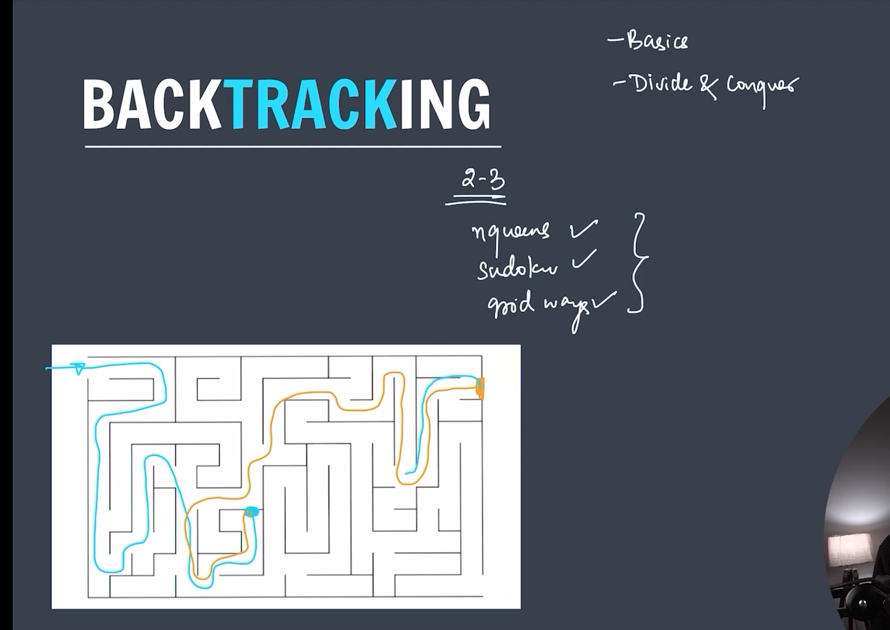
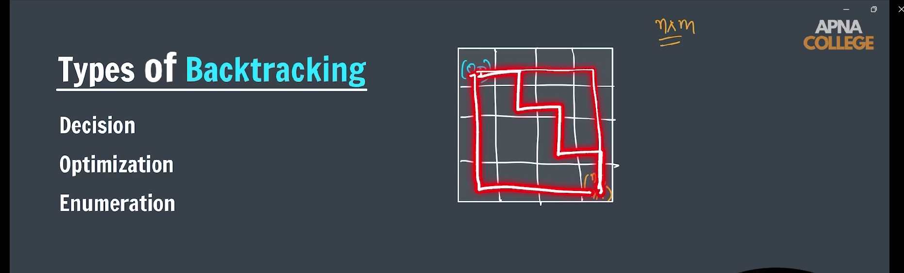
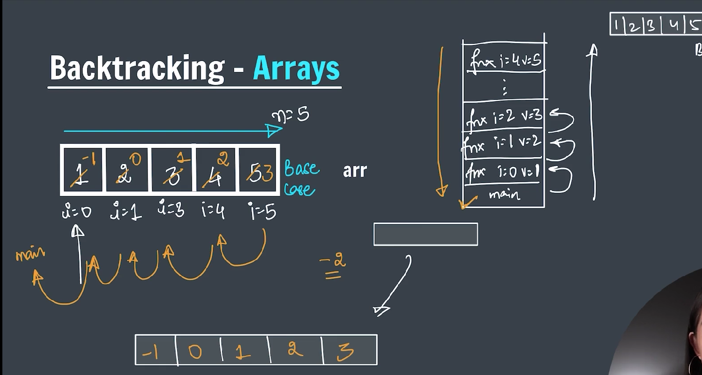
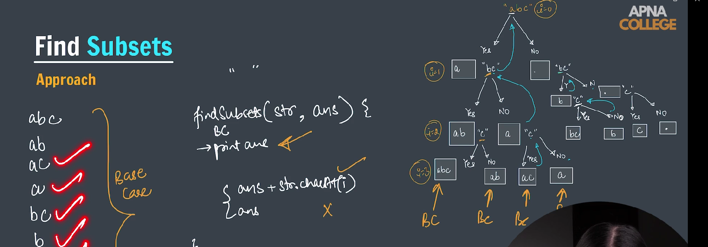
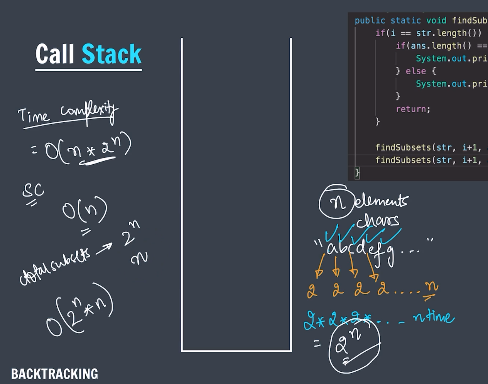
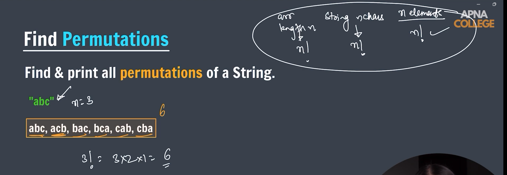
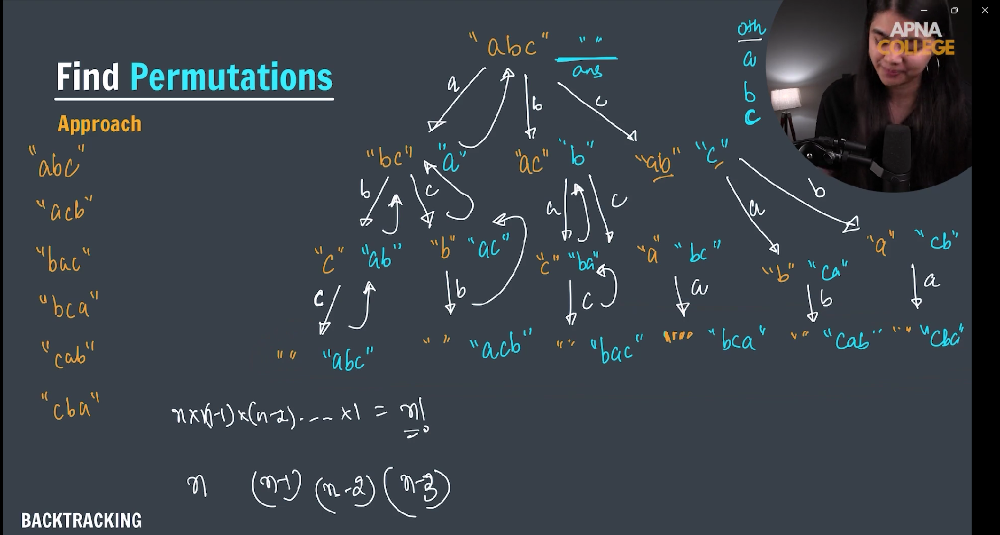
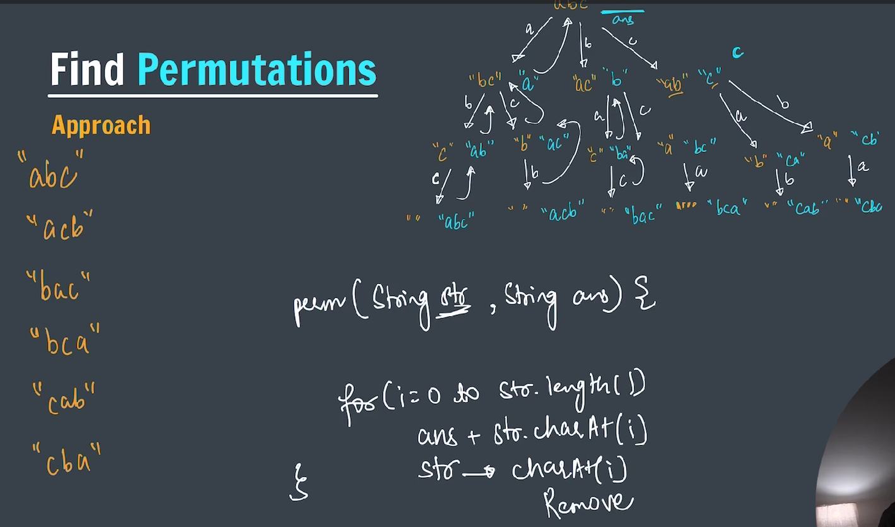
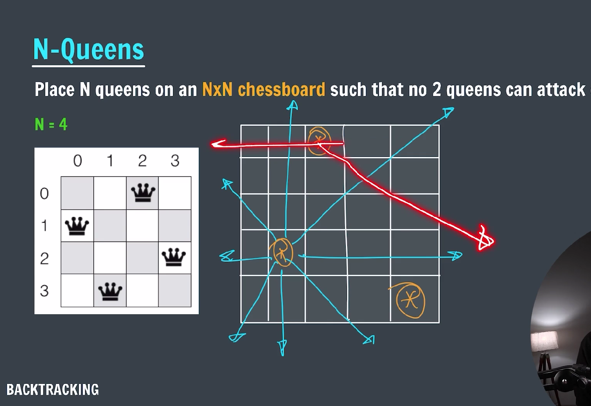
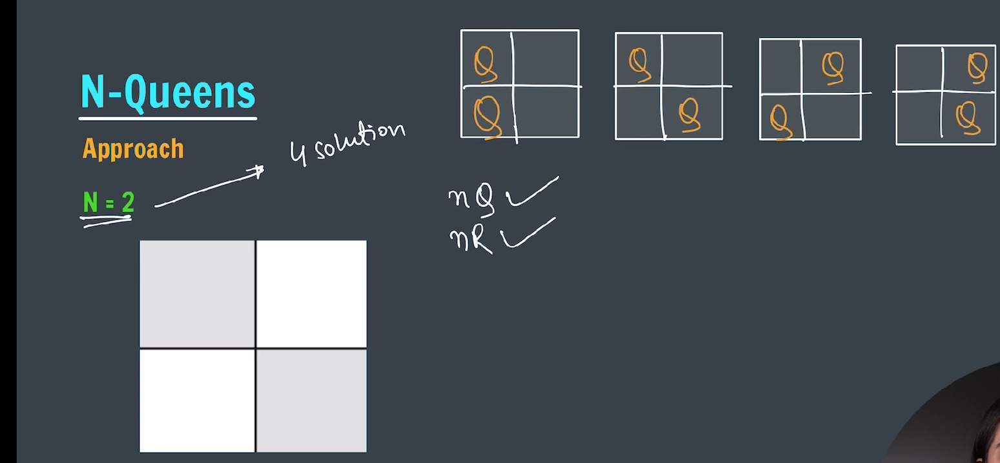

### BackTracking

---

**Backtracking** is a general algorithmic technique for solving problems incrementally by trying partial solutions and then abandoning ("backtracking") them if they do not lead to a complete solution. It is often used for solving **constraint satisfaction problems**, **combinatorial problems**, and **puzzle solving**.

---

### 🔍 **Core Concept of Backtracking**

Backtracking is essentially a **depth-first search (DFS)** of all possible configurations of a solution. At each step, you:

1. Choose an option.
2. Proceed recursively.
3. If a solution is invalid or complete, backtrack by undoing the last choice and trying the next option.

---

### 🧱 **Key Elements of Backtracking**

1. **Decision Space**: All possible choices at each step.
2. **Constraints**: Conditions that must be satisfied.
3. **Goal/Objective**: A valid and possibly optimal solution.
4. **Backtrack Condition**: When a partial solution violates constraints or cannot lead to a valid solution.

---

### 📚 **Common Problems Solved Using Backtracking**

| Problem Type            | Example                             |
| ----------------------- | ----------------------------------- |
| Combinatorial           | Permutations, combinations, subsets |
| Puzzle Solving          | Sudoku, N-Queens, Crossword         |
| Constraint Satisfaction | Map coloring, Scheduling            |
| Path Finding            | Maze solving, Knight’s Tour         |
| Game Theory             | Minimax in game trees               |

---

### 🔄 **Difference Between Backtracking and Other Techniques**

| Technique               | Description                                                  |
| ----------------------- | ------------------------------------------------------------ |
| **Brute Force**         | Tries all possibilities without pruning                      |
| **Backtracking**        | Tries possibilities with early pruning                       |
| **Dynamic Programming** | Solves subproblems and stores results to avoid recomputation |
| **Greedy**              | Makes local optimal choices, no backtracking                 |

---

### 🧠 **Optimizations Used with Backtracking**

- **Pruning**: Skip paths that cannot possibly lead to a solution.
- **Heuristics**: Choose the most promising candidates first.
- **Memoization**: Avoid re-solving the same subproblem.

---



---



---

### **Types of Backtrack**

- **Decision**: Check whether the solution exists or not
- **Optimization**: Choose best solutions among all the solutions
- **Enumeration**: List all the possible solutions for the particular question

---

**_-> Backtracking on Arrays_**


---

```java
package BackTracking;

public class backtrackOnArray {

    public static void changeArr(int[] arr, int i, int val) {

        // base case
        if (i == arr.length) {
            printArr(arr);
            return;
        }

        // kaam

        arr[i] = val;
        changeArr(arr, i + 1, val + 1);
        arr[i] = arr[i] - 2; // Backtrack while returning and reduce the value by 2

    }

    public static void printArr(int arr[]) {
        for (int i = 0; i < arr.length; i++) {
            System.out.print(arr[i] + " ");
        }
        System.out.println();
    }

    public static void main(String[] args) {

        int arr[] = new int[5];
        changeArr(arr, 0, 1);
        printArr(arr);

    }
}
```

---

**_🔍 Output:_**
1 2 3 4 5
-1 0 1 2 3

---

**_-> Find Subset_**


---

```java
package BackTracking;

public class findSubset {

    public static void subset(String str, String ans, int index) {

        // base case

        if (index == str.length()) {
            if (ans.length() == 0) {
                System.out.println("null");
            } else {
                System.out.println(ans);
            }

            return;
        }

        // recursion

        // yes choice
        subset(str, ans + str.charAt(index), index + 1);

        // no choice
        subset(str, ans, index + 1);
    }

    public static void main(String[] args) {
        String str = "abc";

        subset(str, "", 0);

    }
}
```

---

**_🔍 Output:_**
abc
ab
ac
a
bc
b
c
null

---

### Call Stack

---



---

**_-> Find permutation_**


---



---



---

```java
package BackTracking;

public class findPermutation {

    public static void permutation(String str, String ans) {
        // base case
        if (str.length() == 0) {
            System.out.println(ans);
            return;
        }

        // recursion
        // TIME COMPLEXITY = O(n * n!)
        for (int i = 0; i < str.length(); i++) {
            char curr = str.charAt(i);

            String newStr = str.substring(0, i) + str.substring(i + 1);

            permutation(newStr, ans + curr);
        }
    }

    public static void main(String[] args) {

        String str = "abc";
        permutation(str, "");

    }
}
```

---

**_🔍 Output:_**
abc
acb
bac
bca
cab
cba

---

**_-> N-Queens problem where just place the queens (Don't bother about attacks)_**


---



---

```java
package BackTracking;

public class nQueens {

    public static void placeQueens(char board[][], int row) {

        // base case
        if (row == board.length) {
            printBoard(board);
            return;
        }

        // recusion
        for (int j = 0; j < board.length; j++) {

            board[row][j] = 'Q';
            placeQueens(board, row + 1); // function call
            board[row][j] = '.'; // backtrack
        }
    }

    public static void printBoard(char[][] board) {
        System.out.println("------------ chess board ----------");

        for (int i = 0; i < board.length; i++) {
            for (int j = 0; j < board[0].length; j++) {
                System.out.print(board[i][j] + " ");
            }
            System.out.println();
        }
    }

    public static void main(String[] args) {

        int n = 2;
        char board[][] = new char[n][n];

        for (int i = 0; i < n; i++) {
            for (int j = 0; j < n; j++) {
                board[i][j] = '.';
            }
        }

        placeQueens(board, 0);

    }
}
```
