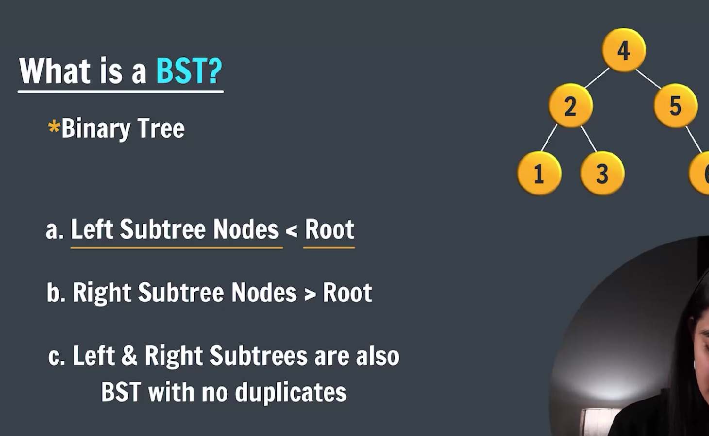
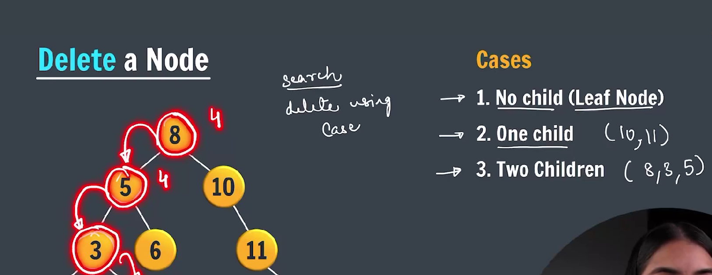
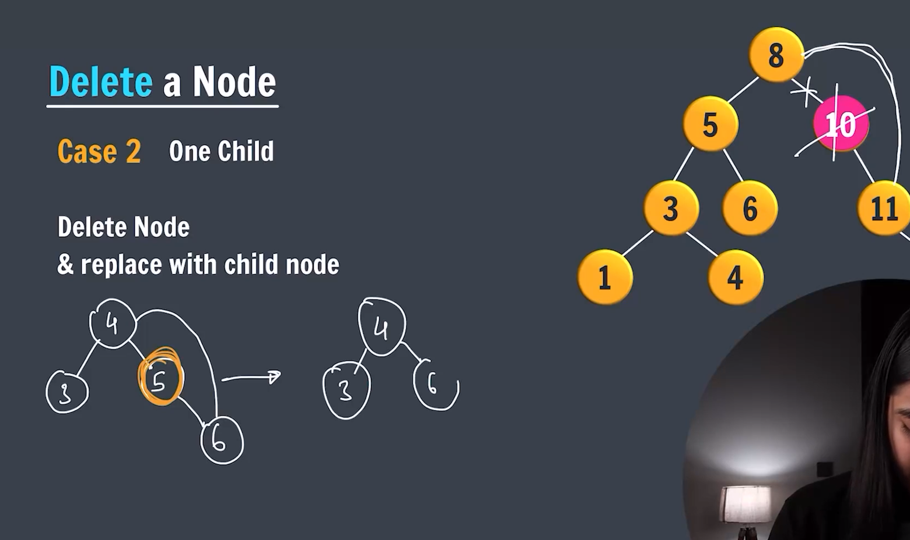
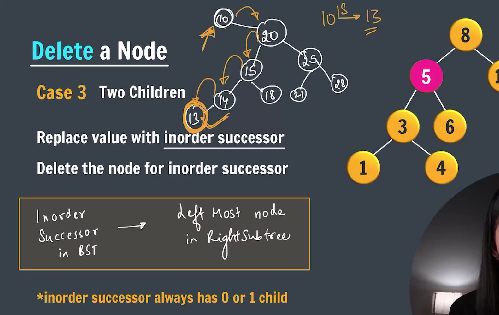
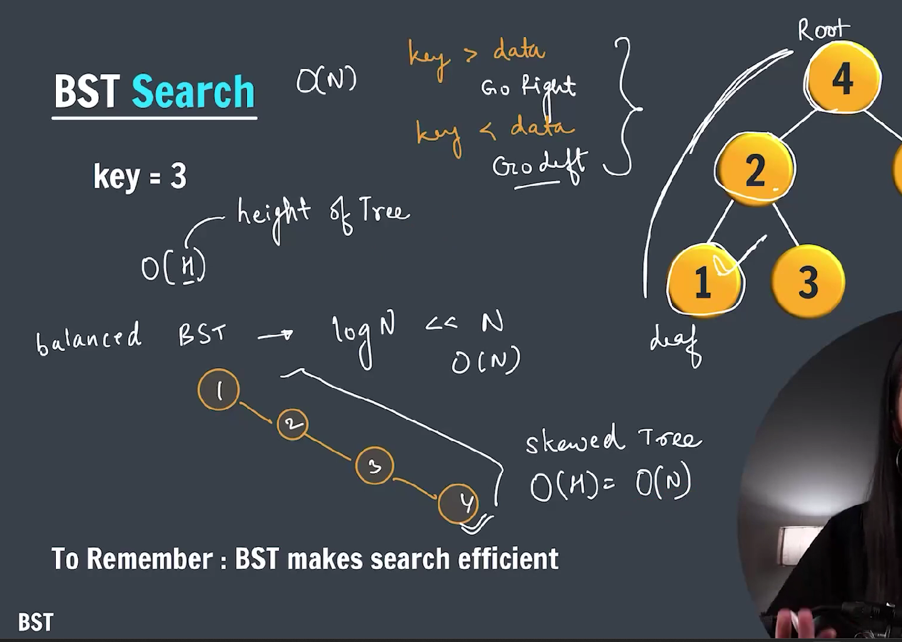

### **Binary Search Tree (BST)**



---

## What is a **Binary Search Tree (BST)?**

A **BST** is a special kind of **binary tree** with the following properties:

1. **Each node has at most two children** — commonly called left and right child.
2. For every node:

   - All nodes in the **left subtree** have values **less than** the node’s value.
   - All nodes in the **right subtree** have values **greater than** the node’s value.

3. There are **no duplicate values** (usually).

---

> Build BST

```java

class Node {
    int data;
    Node left, right;

    Node(int data) {
        this.data = data;
        this.left = this.right = null;
    }
}

public class BuildBST {

    static Node build(Node node, int data) {
        if (node == null) {
            return new Node(data);
        }

        if (node.data == data) {
            return node;
        }

        if (data < node.data) {
            node.left = build(node.left, data);
        } else {
            node.right = build(node.right, data);
        }

        return node;
    }

    public static void main(String[] args) {
        Node root = null;

        root = build(root, 50);
        root = build(root, 30);
        root = build(root, 20);
        root = build(root, 40);
        root = build(root, 70);
        root = build(root, 60);
        root = build(root, 80);
    }

}
```

---

## Why use a BST?

- **Fast searching:** Average-case search time is **O(log n)**.
- **Fast insertion and deletion** operations (on average).
- Maintains elements in **sorted order**.
- Useful for dynamic datasets where data is frequently inserted or removed.

---

## Basic operations on a BST

| Operation     | Description                                | Average Time Complexity |
| ------------- | ------------------------------------------ | ----------------------- |
| **Search**    | Find if a value exists in the tree         | O(log n)                |
| **Insert**    | Add a new value preserving BST property    | O(log n)                |
| **Delete**    | Remove a value while maintaining structure | O(log n)                |
| **Traversal** | Inorder traversal returns sorted order     | O(n)                    |

---

## Example BST:

```
        8
       / \
      3   10
     / \    \
    1   6    14
       / \   /
      4   7 13
```

- Left subtree of `8` has all values < 8.
- Right subtree of `8` has all values > 8.
- This property holds recursively for every node.

---

## Sample Java class for BST Node:

```java
class Node {
    int val;
    Node left, right;

    Node(int val) {
        this.val = val;
        left = right = null;
    }
}
```

---

## Insert operation example:

```java

class Node {
    int data;
    Node left, right;

    Node(int data) {
        this.data = data;
        this.left = this.right = null;
    }
}

public class InsertionInBST {

    static Node insert(Node node, int data) {

        if (node == null) {
            return new Node(data);
        }

        // do not allow duplicate values
        if (node.data == data) {
            return node;
        }

        if (data < node.data) {
            node.left = insert(node.left, data);
        } else {
            node.right = insert(node.right, data);
        }
        return node;
    }

    static void inOrder(Node node) {
        if (node != null) {
            inOrder(node.left);
            System.out.print(node.data + " ");
            inOrder(node.right);
        }
    }

    public static void main(String args[]) {

        Node root = null;

        root = insert(root, 50);
        root = insert(root, 30);
        root = insert(root, 20);
        root = insert(root, 40);
        root = insert(root, 70);
        root = insert(root, 60);
        root = insert(root, 80);

        inOrder(root);

    }
}

```

### Dletion in BST

**Case 1. Delete a Leaf Node in BST**



---

**Case 2. Delete a Node with Single Child in BST**

> Deleting a single child node is also simple in BST. Copy the child to the node and delete the node.



---

**Case 3. Delete a Node with Both Children in BST**

> Deleting a node with both children is not so simple. Here we have to delete the node is such a way, that the resulting tree follows the properties of a BST.

> The trick is to find the inorder successor of the node. Copy contents of the inorder successor to the node, and delete the inorder successor.



---

```java

class Node {
    int data;
    Node left, right;

    Node(int data) {
        this.data = data;
        this.left = this.right = null;
    }
}

public class DeleteNodeInBST {

    static Node insert(Node node, int data) {
        if (node == null) {
            return new Node(data);
        }

        if (node.data == data) {
            return node;
        }

        if (node.data > data) {
            node.left = insert(node.left, data);
        } else {
            node.right = insert(node.right, data);
        }

        return node;
    }

    static void inOrder(Node node) {

        if (node != null) {
            inOrder(node.left);
            System.out.print(node.data + " ");
            inOrder(node.right);
        }
    }

    static Node deleteNode(Node node, int data) {
        if (node.data > data) {
            node.left = deleteNode(node.left, data);
        } else if (node.data < data) {
            node.right = deleteNode(node.right, data);
        } else {
            // case 1: leaf node
            if (node.left == null && node.right == null) {
                return null;
            }

            // case 2: Single child
            if (node.left == null) {
                return node.right;
            } else if (node.right == null) {
                return node.left;
            }

            // case 3 : Both child
            Node IS = findInorderSuccessor(node.right);
            node.data = IS.data;
            node.right = deleteNode(node.right, IS.data);

        }

        return node;
    }

    static Node findInorderSuccessor(Node node) {
        while (node.left != null) {
            node = node.left;
        }

        return node;
    }

    public static void main(String[] args) {

        int values[] = { 8, 5, 3, 1, 4, 6, 10, 11, 14 };
        Node root = null;

        for (int i = 0; i < values.length; i++) {
            root = insert(root, values[i]);
        }

        inOrder(root);

        deleteNode(root, 14);
        System.out.println();

        inOrder(root);

    }

}
```

---

## Summary

- BSTs efficiently **store, search, and manage** sorted data.
- Structure is based on the **ordering property**: left < node < right.
- Traversing BST inorder produces sorted data.

---

### Concept of Search in BST



---

The **concept of search in a Binary Search Tree (BST)** in Java is based on the **properties of BST**:

- The left subtree of a node contains only nodes with keys **less than** the node’s key.
- The right subtree contains only nodes with keys **greater than** the node’s key.
- Both left and right subtrees must also be BSTs.

### 🔍 Concept of Searching in BST:

To **search for a value `key`** in a BST:

1. Start from the root node.
2. Compare the key with the current node's data:

   - If `key == node.data`: return the node (key found).
   - If `key < node.data`: recursively search the **left subtree**.
   - If `key > node.data`: recursively search the **right subtree**.

3. If you reach a null node, the key is **not present** in the tree.

---

### ✅ Java Implementation of Search in BST

```java

class Node {
    int data;
    Node left, right;

    Node(int data) {
        this.data = data;
        this.left = this.right = null;
    }
}

public class SearchingInBST {

    static Node insert(Node node, int data) {
        if (node == null) {
            return new Node(data);
        }

        if (node.data == data) {
            return node;
        }

        if (data < node.data) {
            node.left = insert(node.left, data);
        } else {
            node.right = insert(node.right, data);
        }

        return node;
    }

    static void inOrder(Node node) {
        if (node == null) {
            return;
        }

        inOrder(node.left);
        System.out.print(node.data + " ");
        inOrder(node.right);
    }

    static boolean search(Node node, int key) {

        if (node != null) {
            if (node.data == key) {
                return true;
            }

            if (key < node.data) {
                return search(node.left, key);
            } else {
                return search(node.right, key);
            }
        }

        return false;

    }

    public static void main(String[] args) {

        Node root = null;

        root = insert(root, 50);
        root = insert(root, 30);
        root = insert(root, 20);
        root = insert(root, 40);
        root = insert(root, 70);
        root = insert(root, 60);
        root = insert(root, 80);

        inOrder(root);

        System.out.println("Searching in BST.");
        if (search(root, 20)) {
            System.out.println("Key is found.");
        } else {
            System.out.println("Key is not found.");
        }
    }
}

```

---

### 🔁 Time Complexity:

- **Average case**: O(log n) -> O(H) [H -> Height of the tree]
- **Worst case**: O(n) — happens when the tree becomes skewed (like a linked list)

---

### Find minimum in BST

```java

class Node {
    int data;
    Node left, right;

    Node(int data) {
        this.data = data;
        this.left = this.right = null;
    }
}

public class MinimumInBST {

    static Node insert(Node node, int data) {
        if (node == null) {
            return new Node(data);
        }

        if (node.data == data) {
            return node;
        }

        if (node.data > data) {
            node.left = insert(node.left, data);
        } else {
            node.right = insert(node.right, data);
        }

        return node;
    }

    static void inOrder(Node node) {
        if (node != null) {
            inOrder(node.left);
            System.out.print(node.data + " ");
            inOrder(node.right);
        }
    }

    static int findMinimum(Node node) {
        if (node == null) {
            return -1;
        }

        Node curr = node;

        while (curr.left != null) {
            curr = curr.left;
        }

        return curr.data;
    }

    public static void main(String args[]) {

        Node root = null;
        root = insert(root, 50);
        root = insert(root, 30);
        root = insert(root, 20);
        root = insert(root, 40);
        root = insert(root, 70);
        root = insert(root, 60);
        root = insert(root, 80);

        inOrder(root);
        System.out.println();
        System.out.println(findMinimum(root));
    }

}
```

---

### Find Maximum in BST

```java

class Node {
    int data;
    Node left, right;

    Node(int data) {
        this.data = data;
        this.left = this.right = null;
    }
}

public class MaximumInBST {

    static Node insert(Node node, int data) {
        if (node == null) {
            return new Node(data);
        }

        if (node.data == data) {
            return node;
        }

        if (data < node.data) {
            node.left = insert(node.left, data);
        }

        else {
            node.right = insert(node.right, data);
        }

        return node;
    }

    static void inOrder(Node node) {
        if (node == null) {
            return;
        }

        inOrder(node.left);
        System.out.print(node.data + " ");
        inOrder(node.right);
    }

    static int findMaximum(Node node) {

        if (node == null) {
            return -1;
        }

        Node current = node;

        while (current.right != null) {
            current = current.right;
        }

        return current.data;
    }

    public static void main(String[] args) {

        Node root = null;

        root = insert(root, 50);
        root = insert(root, 30);
        root = insert(root, 20);
        root = insert(root, 40);
        root = insert(root, 70);
        root = insert(root, 60);
        root = insert(root, 80);

        inOrder(root);

        System.out.println();
        System.out.println("Maximum Element in tree is : " + findMaximum(root));
    }

}
```

---

### Floor in Binary Search Tree(BST)

> Given a Binary Search Tree and a number x, the task is to find the floor of x in the given BST, where floor means the greatest value node of the BST which is smaller than or equal to x. if x is smaller than the smallest node of BST then return -1.

```java

class Node {
    int data;
    Node left, right;

    Node(int data) {
        this.data = data;
        this.left = this.right = null;
    }
}

public class FloorInBST {

    static Node insert(Node node, int data) {
        if (node == null) {
            return new Node(data);
        }

        if (node.data == data) {
            return node;
        }

        if (data < node.data) {
            node.left = insert(node.left, data);
        } else {
            node.right = insert(node.right, data);
        }

        return node;
    }

    static void inOrder(Node node) {
        if (node != null) {
            inOrder(node.left);
            System.out.print(node.data + " ");
            inOrder(node.right);
        }
    }

    static int floorValue(Node node, int x) {
        if (node == null) {
            return -1;
        }

        if (node.data == x) {
            return node.data;
        }

        if (node.data > x) {
            return floorValue(node.left, x);
        }

        int floorValue = floorValue(node.right, x);

        return (floorValue <= x && floorValue != -1) ? floorValue : node.data;
    }

    public static void main(String[] args) {
        Node root = null;

        root = insert(root, 50);
        root = insert(root, 30);
        root = insert(root, 20);
        root = insert(root, 40);
        root = insert(root, 70);
        root = insert(root, 60);
        root = insert(root, 80);

        inOrder(root);

        System.out.println();
        System.out.println("Floor value: " + floorValue(root, 70));

    }

}
```
