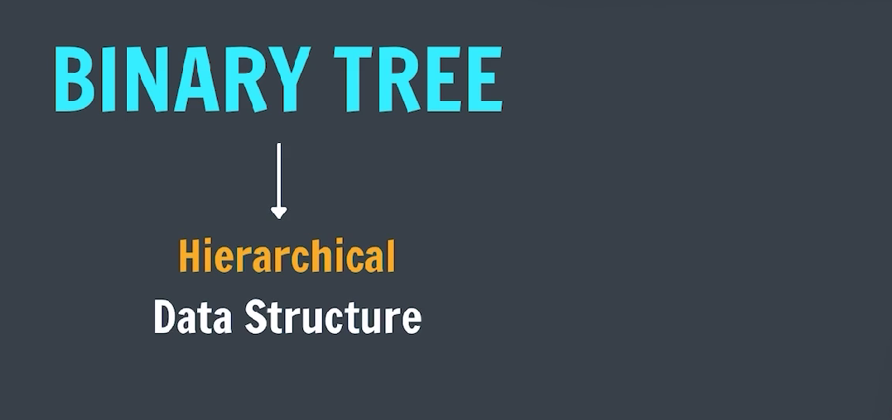
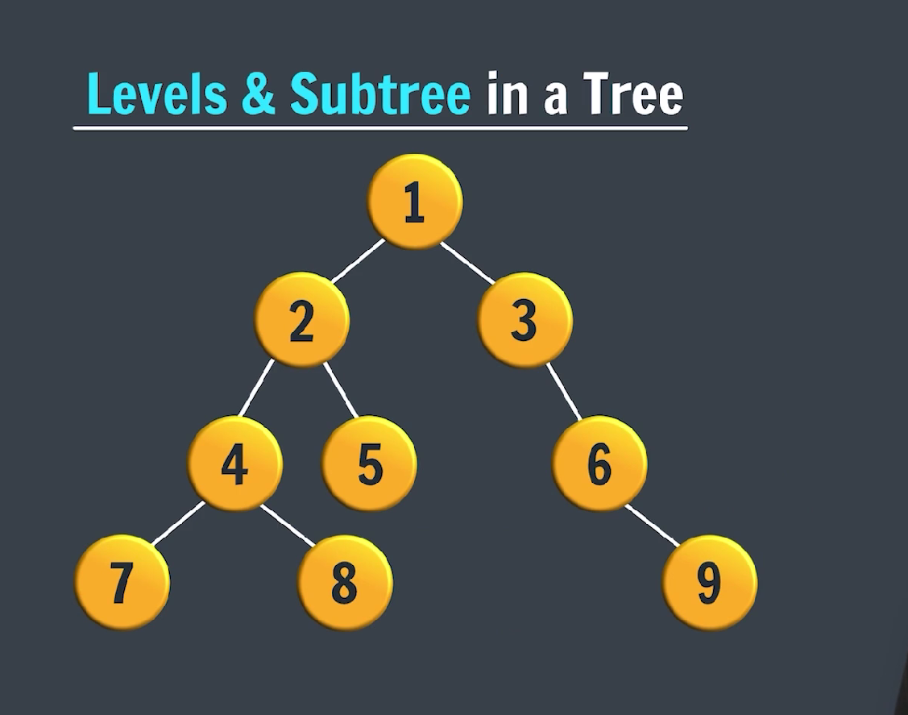
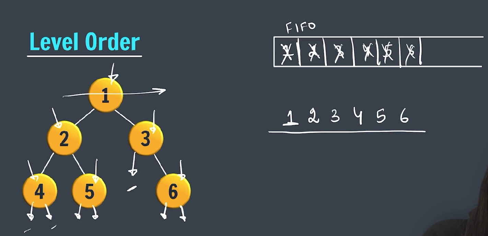

### Binary tree



---



---

## 🌳 What is a Binary Tree?

A **binary tree** is a tree data structure in which each node has at most **two children**, referred to as the **left child** and the **right child**.

Each node typically contains:

- **Data (value)**
- A reference to the **left child**
- A reference to the **right child**

```plaintext
Example:

        1
       / \
      2   3
     / \
    4   5
```

---

## 🧱 Structure of a Node in Java

In Java, a basic binary tree node looks like this:

```java
class Node {
    int data;
    Node left;
    Node right;

    public Node(int value) {
        data = value;
        left = right = null;
    }
}
```

---

## 📚 Types of Binary Trees

1. **Full Binary Tree**
   Every node has 0 or 2 children.

2. **Perfect Binary Tree**
   All internal nodes have two children, and all leaves are at the same level.

3. **Complete Binary Tree**
   All levels are completely filled except possibly the last, which is filled from left to right.

4. **Balanced Binary Tree**
   The difference between heights of left and right subtrees is not more than 1.

5. **Binary Search Tree (BST)**
   A binary tree where for each node:

   - Left subtree contains only nodes with values **less than** the node’s value.
   - Right subtree contains only nodes with values **greater than** the node’s value.

---

## 🔁 Common Tree Traversal Techniques

Tree traversal means visiting every node in a tree exactly once in a specific order:

1. **In-order (Left, Root, Right)**
   → Used for retrieving values from a BST in sorted order.

2. **Pre-order (Root, Left, Right)**
   → Used to create a copy of the tree.

3. **Post-order (Left, Right, Root)**
   → Used to delete the tree.

4. **Level-order (Breadth-First Search)**
   → Visits nodes level by level.

---

## ⚙️ Common Binary Tree Operations

| Operation    | Description                           |
| ------------ | ------------------------------------- |
| Insert       | Add a new node into the tree.         |
| Search       | Find a node in the tree.              |
| Delete       | Remove a node (often more complex).   |
| Traverse     | Visit all nodes in a specific order.  |
| Height/Depth | Measure how tall or deep the tree is. |

---

## 🛠 Applications of Binary Trees

- **Binary Search Trees (BSTs):** Efficient searching and sorting.
- **Heaps:** Priority queues.
- **Expression Trees:** Parsing expressions in compilers.
- **Routing tables:** In networking (e.g., binary tries).
- **File Systems:** Directory hierarchies.

---

## ✅ Summary

- A binary tree is a fundamental data structure for hierarchical data.
- It enables efficient searching, sorting, and hierarchical representation.
- Binary trees form the base for many advanced structures like AVL trees, heaps, and B-trees.

---

### 🔁 In-order Traversal in a Binary Tree (Java)

**In-order traversal** is a type of **depth-first traversal** where you visit nodes in the following order:

> **Left → Root → Right**

This is especially useful in a **Binary Search Tree (BST)** because it gives you the values in **sorted order**.

---

### ✅ In-order Traversal Example:

For the following binary tree:

```
        1
       / \
      2   3
     / \   \
    4   5   6
```

**In-order traversal output:**  
`4 2 5 1 3 6`

---

### 🧑‍💻 Java Code for In-order Traversal

Here’s a simple implementation in Java:

```java
// Node class
class Node {
    int data;
    Node left, right;

    Node(int value) {
        data = value;
        left = right = null;
    }
}

public class BinaryTree {
    Node root;

    public void inorder(Node node) {
        if (node == null) return;

        inorder(node.left);
        System.out.print(node.data + " ");
        inorder(node.right);
    }

    public static void main(String[] args) {
        BinaryTree tree = new BinaryTree();

        tree.root = new Node(1);
        tree.root.left = new Node(2);
        tree.root.right = new Node(3);
        tree.root.left.left = new Node(4);
        tree.root.left.right = new Node(5);
        tree.root.right.right = new Node(6);

        // In-order traversal output
        System.out.print("In-order Traversal: ");
        tree.inorder(tree.root);
    }
}
```

---

### 🧪 Output:

```
In-order Traversal: 4 2 5 1 3 6
```

---

### 🔁 Pre-order Traversal in a Binary Tree (Java)

**Pre-order traversal** is a **depth-first** tree traversal where nodes are visited in the following order:

> **Root → Left → Right**

This is useful for:

- Copying a tree
- Generating prefix expressions from expression trees
- Saving tree structure

---

### ✅ Example Tree:

```
        1
       / \
      2   3
     / \   \
    4   5   6
```

**Pre-order traversal output:**  
`1 2 4 5 3 6`

---

### 🧑‍💻 Java Code for Pre-order Traversal

```java

class Node {
    int data;
    Node left, right;

    Node(int data) {
        this.data = data;
        this.left = this.right = null;
    }
}

public class binaryTreePreOrder {

    Node root;

    public void preOrder(Node node) {
        if (node == null) {
            return;
        }
        System.out.print(node.data + " ");
        preOrder(node.left);
        preOrder(node.right);
    }

    public static void main(String[] args) {

        binaryTreePreOrder preOrder = new binaryTreePreOrder();

        preOrder.root = new Node(1);
        preOrder.root.left = new Node(2);
        preOrder.root.right = new Node(3);
        preOrder.root.left.left = new Node(4);
        preOrder.root.left.right = new Node(5);
        preOrder.root.right.right = new Node(6);

        System.out.print("Pre-order Traversal: ");
        preOrder.preOrder(preOrder.root);
        System.out.println();

    }
}

```

---

### 🧪 Output:

```
Pre-order Traversal: 1 2 4 5 3 6
```

---

### 📘 Summary:

- Pre-order = **Root → Left → Right**
- Useful for:
  - Saving tree structure
  - Prefix notation in expressions
  - Copying trees
- Can be implemented recursively (as above) or iteratively using a stack.

---

### 🔁 Post-order Traversal in a Binary Tree (Java)

**Post-order traversal** is a type of **depth-first traversal** where nodes are visited in the order:

> **Left → Right → Root**

---

### ✅ Example Tree:

```
        1
       / \
      2   3
     / \   \
    4   5   6
```

**Post-order Traversal Output:**  
`4 5 2 6 3 1`

---

### 📘 When to Use Post-order:

- To **delete** a tree (children first, then parent)
- To **evaluate** expression trees
- When the node should be processed **after** its children

---

### 🧑‍💻 Java Code: Post-order Traversal (Recursive)

```java

class Node {
    int data;
    Node left, right;

    Node(int data) {
        this.data = data;
        this.left = this.right = null;
    }
}

public class binaryTreePostorder {

    Node root;

    public void postOrder(Node node) {
        if (node == null) {
            return;
        }
        postOrder(node.left);
        postOrder(node.right);
        System.out.print(node.data + " ");
    }

    public static void main(String[] args) {

        binaryTreePostorder postorder = new binaryTreePostorder();

        postorder.root = new Node(1);
        postorder.root.left = new Node(2);
        postorder.root.right = new Node(3);
        postorder.root.left.left = new Node(4);
        postorder.root.left.right = new Node(5);
        postorder.root.right.right = new Node(6);

        System.out.print("Post-order Traversal: ");
        postorder.postOrder(postorder.root);
        System.out.println();

    }
}

```

---

### 🧪 Output:

```
Post-order Traversal: 4 5 2 6 3 1
```

---

### 📌 Summary:

- **Post-order = Left → Right → Root**
- Useful when children must be handled before the parent
- Often used in:
  - Tree deletion
  - Expression tree evaluation
- Can also be implemented **iteratively using two stacks**

---

### Level Order Trversal (Breadth first search)



---

### 🔁 Level Order Traversal in a Binary Tree (Java)

**Level Order Traversal** is also known as **Breadth-First Traversal**.  
It visits nodes **level by level from top to bottom, left to right** using a **queue**.

---

### ✅ Tree Example:

```
        1
       / \
      2   3
     / \   \
    4   5   6
```

**Level-order traversal output:**  
`1 2 3 4 5 6`

---

### 📘 How It Works

1. Start with the **root node**.
2. Use a **queue** to keep track of nodes.
3. Enqueue the root.
4. While the queue is not empty:
   - Dequeue a node.
   - Print its value.
   - Enqueue its left and right children (if not null).

---

### 🧑‍💻 Java Code: Level Order Traversal

```java

import java.util.LinkedList;
import java.util.Queue;

class Node {
    int data;
    Node left, right;

    Node(int data) {
        this.data = data;
        this.left = this.right = null;
    }
}

public class binaryTreeLevelOrder {

    Node root;

    public void levelOrder(Node node) {

        if (node == null) {
            return;
        }

        Queue<Node> queue = new LinkedList<>();
        queue.add(root);
        queue.add(null);

        while (!queue.isEmpty()) {
            Node current = queue.poll();

            if (current == null) {
                System.out.println();
                if (queue.isEmpty()) {
                    break;
                } else {
                    queue.add(null);
                }
            }

            else {
                System.out.print(current.data + " ");

                if (current.left != null) {
                    queue.add(current.left);
                }
                if (current.right != null) {
                    queue.add(current.right);
                }
            }
        }

    }

    public static void main(String[] args) {

        binaryTreeLevelOrder level = new binaryTreeLevelOrder();

        level.root = new Node(1);
        level.root.left = new Node(2);
        level.root.right = new Node(3);
        level.root.left.left = new Node(4);
        level.root.left.right = new Node(5);
        level.root.right.right = new Node(6);

        System.out.println("level-order traversal: ");
        level.levelOrder(level.root);
        System.out.println();

    }
}

```

---

### 🧪 Output:

```
Level Order Traversal:
1
2 3
4 5 6
```

---

### 📌 Summary

- **Order:** Top → Down, Left → Right
- **Data structure used:** Queue (`LinkedList` in Java)
- **Time complexity:** `O(n)`
- **Space complexity:** `O(n)` (queue holds nodes of a level)

---
