### Binary tree


---


---

## 🌳 What is a Binary Tree?

A **binary tree** is a tree data structure in which each node has at most **two children**, referred to as the **left child** and the **right child**.

Each node typically contains:

- **Data (value)**
- A reference to the **left child**
- A reference to the **right child**

```plaintext
Example:

        1
       / \
      2   3
     / \
    4   5
```

---

## 🧱 Structure of a Node in Java

In Java, a basic binary tree node looks like this:

```java
class Node {
    int data;
    Node left;
    Node right;

    public Node(int value) {
        data = value;
        left = right = null;
    }
}
```

---

## 📚 Types of Binary Trees

1. **Full Binary Tree**
   Every node has 0 or 2 children.

2. **Perfect Binary Tree**
   All internal nodes have two children, and all leaves are at the same level.

3. **Complete Binary Tree**
   All levels are completely filled except possibly the last, which is filled from left to right.

4. **Balanced Binary Tree**
   The difference between heights of left and right subtrees is not more than 1.

5. **Binary Search Tree (BST)**
   A binary tree where for each node:

   - Left subtree contains only nodes with values **less than** the node’s value.
   - Right subtree contains only nodes with values **greater than** the node’s value.

---

## 🔁 Common Tree Traversal Techniques

Tree traversal means visiting every node in a tree exactly once in a specific order:

1. **In-order (Left, Root, Right)**
   → Used for retrieving values from a BST in sorted order.

2. **Pre-order (Root, Left, Right)**
   → Used to create a copy of the tree.

3. **Post-order (Left, Right, Root)**
   → Used to delete the tree.

4. **Level-order (Breadth-First Search)**
   → Visits nodes level by level.

---

## ⚙️ Common Binary Tree Operations

| Operation    | Description                           |
| ------------ | ------------------------------------- |
| Insert       | Add a new node into the tree.         |
| Search       | Find a node in the tree.              |
| Delete       | Remove a node (often more complex).   |
| Traverse     | Visit all nodes in a specific order.  |
| Height/Depth | Measure how tall or deep the tree is. |

---

## 🛠 Applications of Binary Trees

- **Binary Search Trees (BSTs):** Efficient searching and sorting.
- **Heaps:** Priority queues.
- **Expression Trees:** Parsing expressions in compilers.
- **Routing tables:** In networking (e.g., binary tries).
- **File Systems:** Directory hierarchies.

---

## ✅ Summary

- A binary tree is a fundamental data structure for hierarchical data.
- It enables efficient searching, sorting, and hierarchical representation.
- Binary trees form the base for many advanced structures like AVL trees, heaps, and B-trees.

---

### 🔁 In-order Traversal in a Binary Tree (Java)

**In-order traversal** is a type of **depth-first traversal** where you visit nodes in the following order:

> **Left → Root → Right**

This is especially useful in a **Binary Search Tree (BST)** because it gives you the values in **sorted order**.

---

### ✅ In-order Traversal Example:

For the following binary tree:

```
        1
       / \
      2   3
     / \   \
    4   5   6
```

**In-order traversal output:**  
`4 2 5 1 3 6`

---

### 🧑‍💻 Java Code for In-order Traversal

Here’s a simple implementation in Java:

```java
// Node class
class Node {
    int data;
    Node left, right;

    Node(int value) {
        data = value;
        left = right = null;
    }
}

public class BinaryTree {
    Node root;

    public void inorder(Node node) {
        if (node == null) return;

        inorder(node.left);
        System.out.print(node.data + " ");
        inorder(node.right);
    }

    public static void main(String[] args) {
        BinaryTree tree = new BinaryTree();

        tree.root = new Node(1);
        tree.root.left = new Node(2);
        tree.root.right = new Node(3);
        tree.root.left.left = new Node(4);
        tree.root.left.right = new Node(5);
        tree.root.right.right = new Node(6);

        // In-order traversal output
        System.out.print("In-order Traversal: ");
        tree.inorder(tree.root);
    }
}
```

---

### 🧪 Output:

```
In-order Traversal: 4 2 5 1 3 6
```

---

### 🔁 Pre-order Traversal in a Binary Tree (Java)

**Pre-order traversal** is a **depth-first** tree traversal where nodes are visited in the following order:

> **Root → Left → Right**

This is useful for:

- Copying a tree
- Generating prefix expressions from expression trees
- Saving tree structure

---

### ✅ Example Tree:

```
        1
       / \
      2   3
     / \   \
    4   5   6
```

**Pre-order traversal output:**  
`1 2 4 5 3 6`

---

### 🧑‍💻 Java Code for Pre-order Traversal

```java

class Node {
    int data;
    Node left, right;

    Node(int data) {
        this.data = data;
        this.left = this.right = null;
    }
}

public class binaryTreePreOrder {

    Node root;

    public void preOrder(Node node) {
        if (node == null) {
            return;
        }
        System.out.print(node.data + " ");
        preOrder(node.left);
        preOrder(node.right);
    }

    public static void main(String[] args) {

        binaryTreePreOrder preOrder = new binaryTreePreOrder();

        preOrder.root = new Node(1);
        preOrder.root.left = new Node(2);
        preOrder.root.right = new Node(3);
        preOrder.root.left.left = new Node(4);
        preOrder.root.left.right = new Node(5);
        preOrder.root.right.right = new Node(6);

        System.out.print("Pre-order Traversal: ");
        preOrder.preOrder(preOrder.root);
        System.out.println();

    }
}

```

---

### 🧪 Output:

```
Pre-order Traversal: 1 2 4 5 3 6
```

---

### 📘 Summary:

- Pre-order = **Root → Left → Right**
- Useful for:
  - Saving tree structure
  - Prefix notation in expressions
  - Copying trees
- Can be implemented recursively (as above) or iteratively using a stack.

---

### 🔁 Post-order Traversal in a Binary Tree (Java)

**Post-order traversal** is a type of **depth-first traversal** where nodes are visited in the order:

> **Left → Right → Root**

---

### ✅ Example Tree:

```
        1
       / \
      2   3
     / \   \
    4   5   6
```

**Post-order Traversal Output:**  
`4 5 2 6 3 1`

---

### 📘 When to Use Post-order:

- To **delete** a tree (children first, then parent)
- To **evaluate** expression trees
- When the node should be processed **after** its children

---

### 🧑‍💻 Java Code: Post-order Traversal (Recursive)

```java

class Node {
    int data;
    Node left, right;

    Node(int data) {
        this.data = data;
        this.left = this.right = null;
    }
}

public class binaryTreePostorder {

    Node root;

    public void postOrder(Node node) {
        if (node == null) {
            return;
        }
        postOrder(node.left);
        postOrder(node.right);
        System.out.print(node.data + " ");
    }

    public static void main(String[] args) {

        binaryTreePostorder postorder = new binaryTreePostorder();

        postorder.root = new Node(1);
        postorder.root.left = new Node(2);
        postorder.root.right = new Node(3);
        postorder.root.left.left = new Node(4);
        postorder.root.left.right = new Node(5);
        postorder.root.right.right = new Node(6);

        System.out.print("Post-order Traversal: ");
        postorder.postOrder(postorder.root);
        System.out.println();

    }
}

```

---

### 🧪 Output:

```
Post-order Traversal: 4 5 2 6 3 1
```

---

### 📌 Summary:

- **Post-order = Left → Right → Root**
- Useful when children must be handled before the parent
- Often used in:
  - Tree deletion
  - Expression tree evaluation
- Can also be implemented **iteratively using two stacks**

---

### Level Order Trversal (Breadth first search)


---

### 🔁 Level Order Traversal in a Binary Tree (Java)

**Level Order Traversal** is also known as **Breadth-First Traversal**.  
It visits nodes **level by level from top to bottom, left to right** using a **queue**.

---

### ✅ Tree Example:

```
        1
       / \
      2   3
     / \   \
    4   5   6
```

**Level-order traversal output:**  
`1 2 3 4 5 6`

---

### 📘 How It Works

1. Start with the **root node**.
2. Use a **queue** to keep track of nodes.
3. Enqueue the root.
4. While the queue is not empty:
   - Dequeue a node.
   - Print its value.
   - Enqueue its left and right children (if not null).

---

### 🧑‍💻 Java Code: Level Order Traversal

```java

import java.util.LinkedList;
import java.util.Queue;

class Node {
    int data;
    Node left, right;

    Node(int data) {
        this.data = data;
        this.left = this.right = null;
    }
}

public class binaryTreeLevelOrder {

    Node root;

    public void levelOrder(Node node) {

        if (node == null) {
            return;
        }

        Queue<Node> queue = new LinkedList<>();
        queue.add(root);
        queue.add(null);

        while (!queue.isEmpty()) {
            Node current = queue.poll();

            if (current == null) {
                System.out.println();
                if (queue.isEmpty()) {
                    break;
                } else {
                    queue.add(null);
                }
            }

            else {
                System.out.print(current.data + " ");

                if (current.left != null) {
                    queue.add(current.left);
                }
                if (current.right != null) {
                    queue.add(current.right);
                }
            }
        }

    }

    public static void main(String[] args) {

        binaryTreeLevelOrder level = new binaryTreeLevelOrder();

        level.root = new Node(1);
        level.root.left = new Node(2);
        level.root.right = new Node(3);
        level.root.left.left = new Node(4);
        level.root.left.right = new Node(5);
        level.root.right.right = new Node(6);

        System.out.println("level-order traversal: ");
        level.levelOrder(level.root);
        System.out.println();

    }
}

```

---

### 🧪 Output:

```
Level Order Traversal:
1
2 3
4 5 6
```

---

### 📌 Summary

- **Order:** Top → Down, Left → Right
- **Data structure used:** Queue (`LinkedList` in Java)
- **Time complexity:** `O(n)`
- **Space complexity:** `O(n)` (queue holds nodes of a level)

---

### All types of traversal

```java

import java.util.LinkedList;
import java.util.Queue;

class Node {
    int data;
    Node left, right;

    Node(int data) {
        this.data = data;
        this.left = this.right = null;
    }
}

public class Tree {

    Node root;

    // in-order traversal
    public void inOrder(Node node) {
        if (node == null) {
            return;
        }
        inOrder(node.left);
        System.out.print(node.data + " ");
        inOrder(node.right);
    }

    // pre-order traversal
    public void preOrder(Node node) {
        if (node == null) {
            return;
        }

        System.out.print(node.data + " ");
        preOrder(node.left);
        preOrder(node.right);

    }

    // post-order traversal
    public void postOrder(Node node) {
        if (node == null) {
            return;
        }

        postOrder(node.left);
        postOrder(node.right);
        System.out.print(node.data + " ");
    }

    // level-order traversal
    public void levelOrder(Node node) {

        if (node == null) {
            return;
        }

        Queue<Node> queue = new LinkedList<>();
        queue.add(root);
        queue.add(null);

        while (!queue.isEmpty()) {

            Node current = queue.remove();

            if (current == null) {
                System.out.println();
                if (queue.isEmpty()) {
                    break;
                } else {
                    queue.add(null);
                }
            }

            else {
                System.out.print(current.data + " ");

                if (current.left != null) {
                    queue.add(current.left);
                }
                if (current.right != null) {
                    queue.add(current.right);
                }
            }
        }
    }

    public static void main(String args[]) {

        Tree tree = new Tree();

        tree.root = new Node(1);
        tree.root.left = new Node(2);
        tree.root.right = new Node(3);
        tree.root.left.left = new Node(4);
        tree.root.left.right = new Node(5);
        tree.root.right.right = new Node(6);

        // inorder
        System.out.println("Inorder Traversal.");
        tree.inOrder(tree.root);
        System.out.println();

        // preorder
        System.out.println("PreOrder Traversal.");
        tree.preOrder(tree.root);
        System.out.println();

        // postOrder
        System.out.println("PostOrder Traversal.");
        tree.postOrder(tree.root);
        System.out.println();

        // level order
        System.out.println("Level-Order Traversal.");
        tree.levelOrder(tree.root);
        System.out.println();

    }
}
```

---

### Height of a Binary Tree

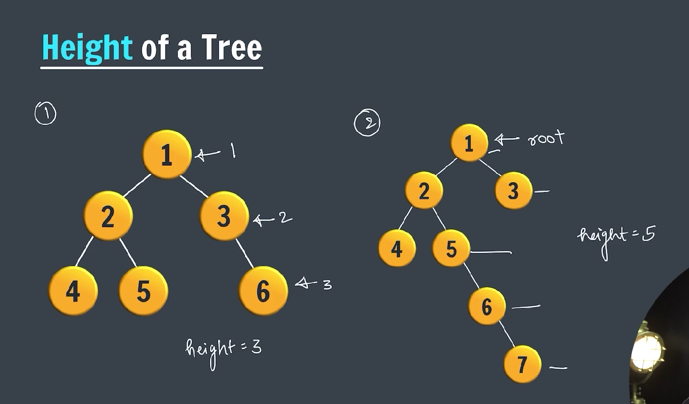

---

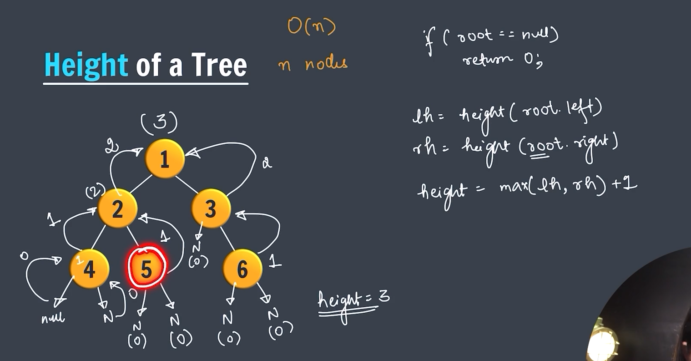

---

```java

public class HeightOfTree {

    static class Node {
        int data;
        Node left;
        Node right;

        Node(int data) {
            this.data = data;
            this.left = this.right = null;
        }
    }

    public static int height(Node node) {
        if (node == null) {
            return 0;
        }

        int lh = height(node.left);
        int rh = height(node.right);

        int maxHeight = Math.max(lh, rh) + 1;

        return maxHeight;
    }

    public static void main(String args[]) {

        Node root = new Node(1);
        root.left = new Node(2);
        root.right = new Node(3);
        root.left.left = new Node(4);
        root.left.right = new Node(5);
        root.right.left = new Node(6);
        root.right.right = new Node(7);

        System.out.println(height(root));
    }
}
```

---

### Count the number of nodes

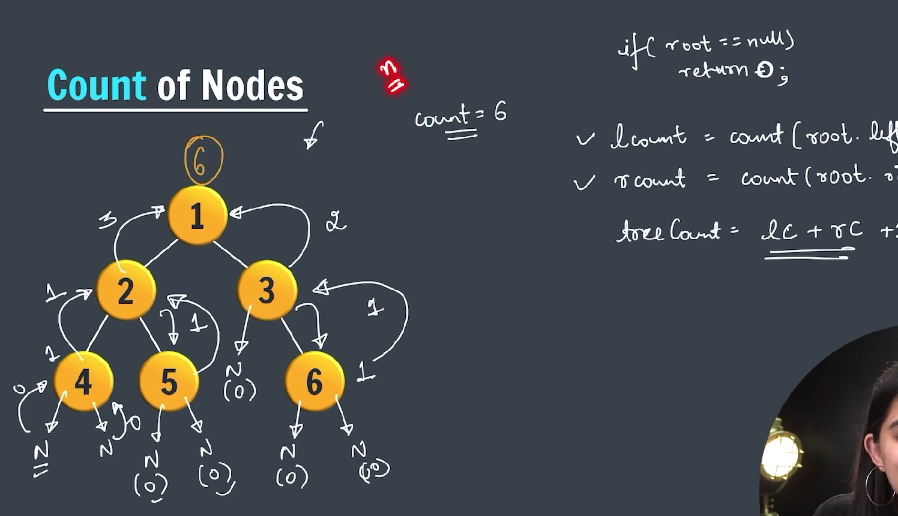

---

```java

public class CountOfNodes {

    static class Node {
        int data;
        Node left;
        Node right;

        Node(int data) {
            this.data = data;
            this.left = this.right = null;
        }
    }

    public static int count(Node root) {
        if (root == null) {
            return 0;
        }

        int lc = count(root.left);
        int rc = count(root.right);

        return lc + rc + 1;
    }

    public static void main(String args) {

        Node root = new Node(1);
        root.left = new Node(2);
        root.right = new Node(3);
        root.left.left = new Node(4);
        root.left.right = new Node(5);
        root.right.left = new Node(6);
        root.right.right = new Node(7);

        System.out.println(count(root));
    }
}
```

---

### Sum of nodes

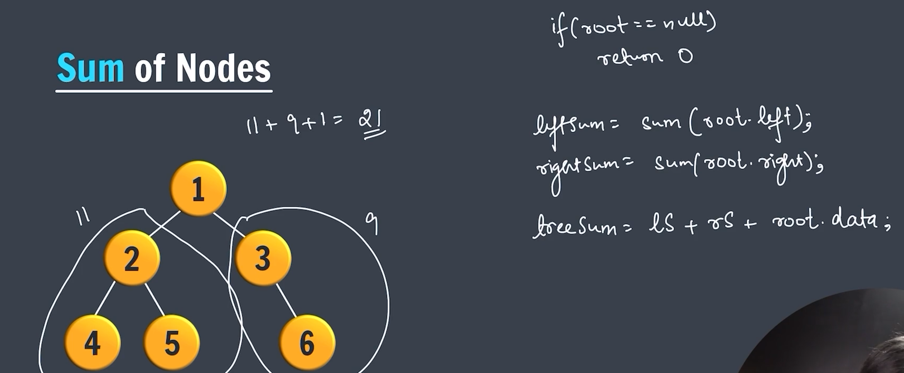

---

```java

import java.util.LinkedList;
import java.util.Queue;

class Node {
    int data;
    Node left, right;

    Node(int data) {
        this.data = data;
        this.left = this.right = null;
    }
}

public class SumOfNodes {

    Node root;

    public int levelOrderSum(Node node) {

        if (node == null) {
            return 0;
        }

        int sum = 0;
        Queue<Node> queue = new LinkedList<>();
        queue.add(node);

        while (!queue.isEmpty()) {
            Node current = queue.remove();

            sum += current.data;

            if (current.left != null) {
                queue.add(current.left);
            }
            if (current.right != null) {
                queue.add(current.right);
            }

        }

        return sum;
    }

    // calculate sum recursively
    int calculateSumOfNodes(Node node) {
        if (node == null) {
            return 0;
        }

        return node.data + calculateSumOfNodes(node.left) + calculateSumOfNodes(node.right);
    }

    public static void main(String[] args) {

        SumOfNodes sum = new SumOfNodes();
        sum.root = new Node(1);
        sum.root.left = new Node(2);
        sum.root.right = new Node(3);
        sum.root.left.left = new Node(4);
        sum.root.left.right = new Node(5);
        sum.root.right.right = new Node(6);

        System.out.println(sum.levelOrderSum(sum.root));

        System.out.println(sum.calculateSumOfNodes(sum.root));

    }
}
```

---

### Diameter of a Binary Tree

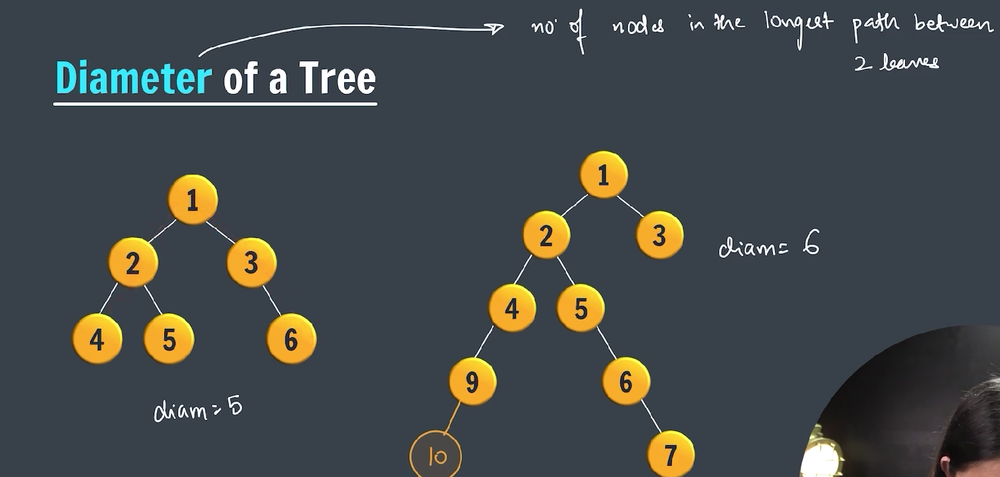

---

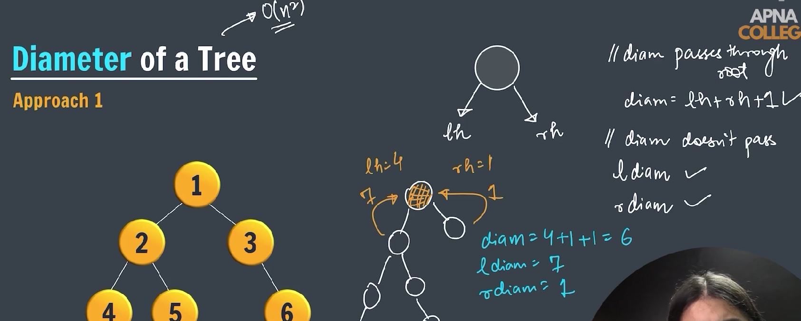

---

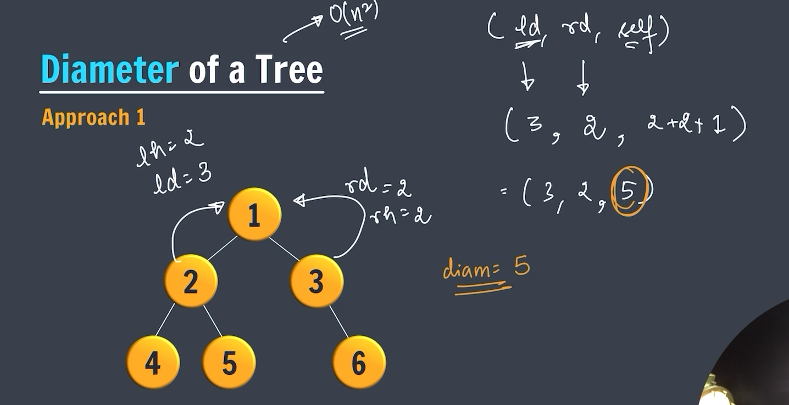

---

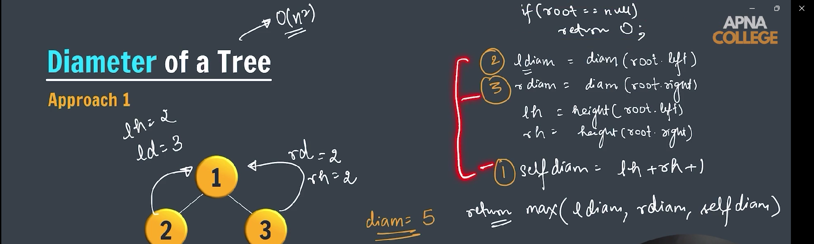

---

Calculating the **diameter of a binary tree** is a classic tree problem.

---

### ✅ **What is the Diameter of a Binary Tree?**

The **diameter** (also called the **width** or **longest path**) of a binary tree is the **length of the longest path between any two nodes** in the tree. This path **may or may not pass through the root**.

- The length is measured in **number of nodes** or **number of edges**.
- You can define it either way, but usually:

  - **In terms of edges**: `diameter = number of nodes on the path - 1`

---

### ✅ Java Code to Calculate Diameter of a Binary Tree

Here’s a clean and efficient way to calculate the **diameter in terms of edges**:

```java

public class Diameter {
    static class Node {
        int data;
        Node left, right;

        Node(int data) {
            this.data = data;
            this.left = this.right = null;
        }
    }

    public static int height(Node node) {
        if (node == null) {
            return 0;
        }

        int lh = height(node.left);
        int rh = height(node.right);

        return Math.max(lh, rh) + 1;
    }

    public static int diam(Node node) {
        if (node == null) {
            return 0;
        }

        int lDiam = diam(node.left);
        int rDiam = diam(node.right);

        int lh = height(node.left);
        int rh = height(node.right);

        return Math.max(lh + rh + 1, Math.max(lDiam, rDiam));
    }

    public static void main(String[] args) {
        Node root = new Node(1);
        root.left = new Node(2);
        root.right = new Node(3);
        root.left.left = new Node(4);
        root.left.right = new Node(5);
        root.right.left = new Node(6);
        root.right.right = new Node(7);

        System.out.println(diam(root));
    }
}

```

---

### Diameter of a Tree (Approach 2) -> Optimized

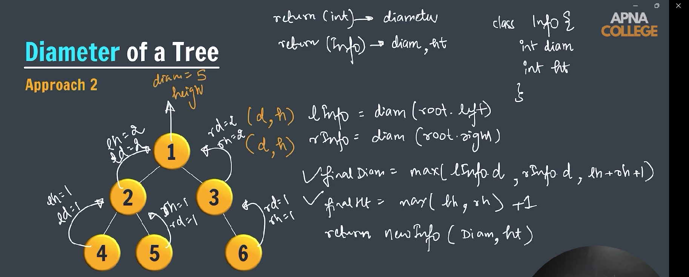

---

```java
public class Diameter {
    static class Node {
        int data;
        Node left, right;

        Node(int data) {
            this.data = data;
            this.left = this.right = null;
        }
    }

    public static int height(Node node) {
        if (node == null) {
            return 0;
        }

        int lh = height(node.left);
        int rh = height(node.right);

        return Math.max(lh, rh) + 1;
    }

    public static int diam2(Node node) {
        if (node == null) {
            return 0;
        }

        int lDiam = diam2(node.left);
        int rDiam = diam2(node.right);

        int lh = height(node.left);
        int rh = height(node.right);

        return Math.max(lh + rh + 1, Math.max(lDiam, rDiam));
    }

    // Approach 2

    static class Info {
        int diam;
        int ht;

        Info(int diam, int ht) {
            this.diam = diam;
            this.ht = ht;
        }
    }

    public static Info diam(Node root) { // O(n)
        if (root == null) {
            return new Info(0, 0);
        }

        Info ldiam = diam(root.left);
        Info rdiam = diam(root.right);

        int diameter = Math.max(Math.max(ldiam.diam, rdiam.diam), ldiam.ht + rdiam.ht + 1);
        int ht = Math.max(ldiam.ht, rdiam.ht) + 1;

        return new Info(diameter, ht);

    }

    public static void main(String[] args) {
        Node root = new Node(1);
        root.left = new Node(2);
        root.right = new Node(3);
        root.left.left = new Node(4);
        root.left.right = new Node(5);
        root.right.left = new Node(6);
        root.right.right = new Node(7);

        System.out.println(diam2(root));

        System.out.println(diam(root).diam);
    }
}
```

---

### Subtree of a tree

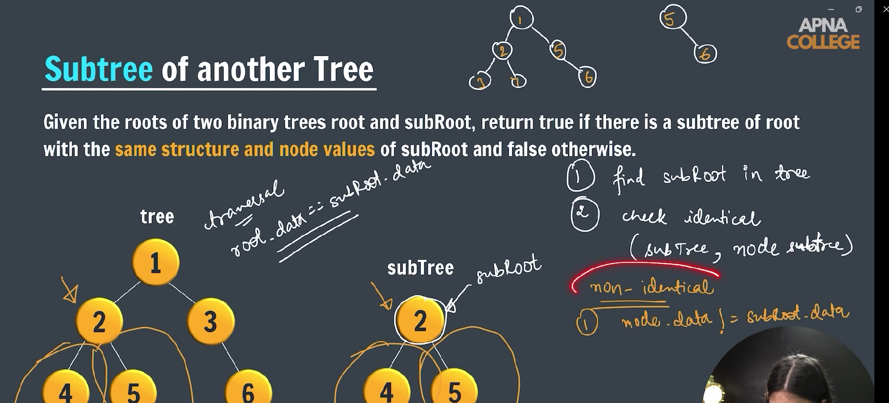

---

> 4 Conditions to check whether the SubTree is a part of Tree

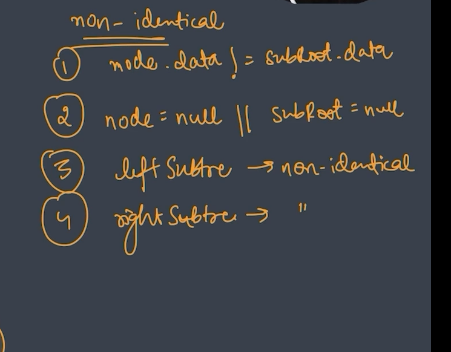

---

```java

public class SunTreeOfTree {

    // Main Tree
    static class Node {
        int data;
        Node left;
        Node right;

        Node(int data) {
            this.data = data;
            this.left = this.right = null;
        }
    }

    // subtree
    public static boolean isSubTree(Node root, Node subRoot) {
        if (root == null) {
            return false;
        }

        if (isSame(root, subRoot)) {
            return true;
        }

        return isSubTree(root.left, subRoot) || isSubTree(root.right, subRoot);
    }

    public static boolean isSame(Node root, Node subRoot) {
        if (root == null && subRoot == null) {
            return true;
        }
        if (root == null || subRoot == null) {
            return false;
        }

        if (root.data != subRoot.data) {
            return false;
        }

        return isSame(root.left, subRoot.left) && isSame(root.right, subRoot.right);
    }

    public static void main(String[] args) {

        // main tree
        Node root = new Node(1);
        root.left = new Node(2);
        root.right = new Node(3);
        root.left.left = new Node(4);
        root.left.right = new Node(5);
        root.right.left = new Node(6);
        root.right.right = new Node(7);

        // suntree
        Node subtree = new Node(2);
        subtree.left = new Node(4);
        subtree.right = new Node(5);

        System.out.println(isSubTree(root, subtree));

    }
}
```
