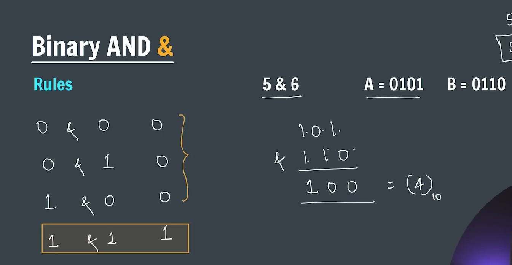
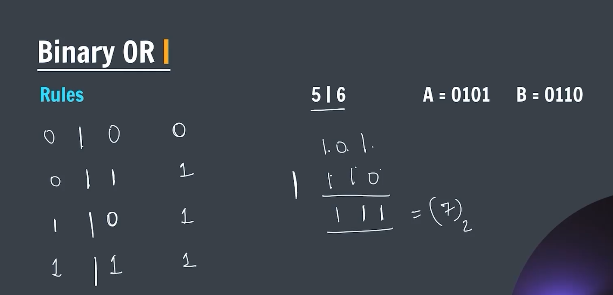

### Bit Manipulation

**_Binary Number System_**


**_Bitwise operator_**


**_Binary AND(&) operator_**


**_-> CODE_**

```java
package BitManipulation;

public class binaryAND {
    public static void main(String[] args) {
        System.out.println("The AND(&) operation of 5 and 6 is : " + (5 & 6));
    }
}
```

**_Binary OR ( | ) operator_**


**_-> CODE_**

```java
package BitManipulation;

public class binaryOR {
    public static void main(String[] args) {
        System.out.println("The binary OR( | ) operation on two number resulting in : " + (5 | 6));
    }
}
```

**_Binary XOR ( ^ ) operator_**

**_-> CODE_**

```java
package BitManipulation;

public class binaryXOR {
    public static void main(String[] args) {
        System.out.println("The XOR(^) operation of two numbers : " + (5 ^ 6));
    }
}
```

**_Binary One's Complement_**


**_-> CODE_**

```java
package BitManipulation;

public class binaryOneComplement {
    public static void main(String[] args) {
        System.out.println((~0)); // result = -1
        System.out.println((~5)); // result = -6
    }
}
```

**_Binary Left shift operator ( << )_**


**\_-> Formula [ (a << b) = a * 2^b ]\***
**_-> CODE_**

```java
package BitManipulation;

public class binaryLeftShift {
    public static void main(String[] args) {
        System.out.println("Binary left shift operator: " + (5 << 2));

        /*
         * Formula for left shift
         * a << b = (a * 2^b)
         */
    }
}
```

**_Binary Right shift operator ( >> )_**


**_-> Formula [(a >> b) = a/2^b]_**
**_-> CODE_**

```java
package BitManipulation;

public class binaryRightShift {
    public static void main(String[] args) {
        System.out.println("Right shift ( >> ) operator --> " + (7 >> 1));

        /*
         * Formula
         * a >> b = a/(2)^b
         */
    }
}
```

**_-> Problem to check whether the given number is odd or even using bit manipulation_**


```java
package BitManipulation;

import java.util.Scanner;

public class oddOrEven {
    public static void oddEven(int n) {

        int bitmask = 1;
        if ((n & bitmask) == 0) {
            System.out.println("The number is even.");
        } else {
            System.out.println("The number is odd.");
        }

    }

    public static void main(String[] args) {

        Scanner sc = new Scanner(System.in);
        System.out.print("Enter a number to check whether the number is odd or even : ");
        int n = sc.nextInt();

        oddEven(n);

        sc.close();

    }
}
```

**_-> Problem of how to get ith bit_**


```java
package BitManipulation;

import java.util.Scanner;

public class ithPositionBit {

    static int getIthBit(int n, int i) {
        int bitmask = (1 << i);

        if ((n & bitmask) == 0) {
            return 0;
        } else {
            return 1;
        }
    }

    public static void main(String[] args) {

        Scanner sc = new Scanner((System.in));
        System.out.print("Enter the number: ");
        int n = sc.nextInt();
        System.out.print("Enter the ith position: ");
        int i = sc.nextInt();

        System.out.println("The ith position bit is : " + getIthBit(n, i));

        sc.close();
    }
}
```
