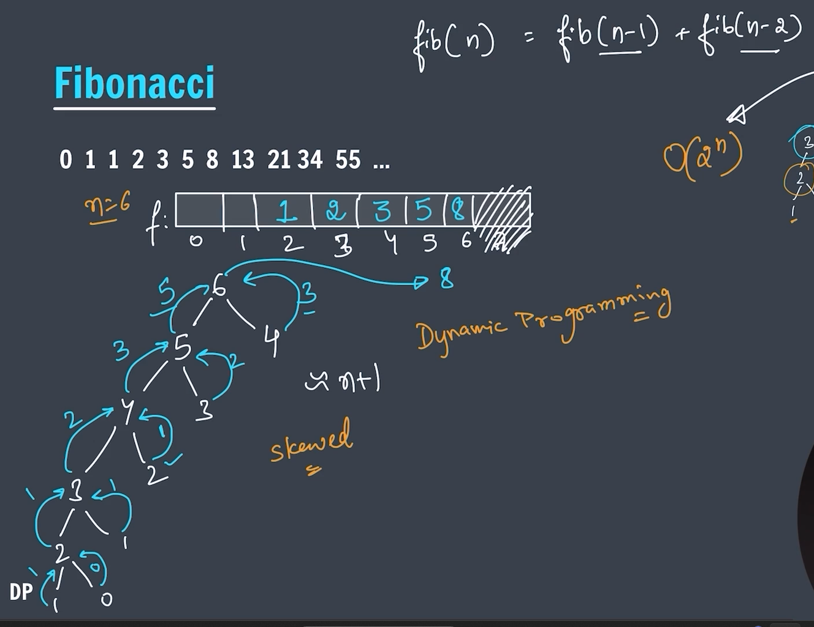

## DP (Dynamic Programming)

---

## 🔍 What is Dynamic Programming?

**Dynamic Programming (DP)** is a method used in algorithm design to solve problems by **breaking them down into simpler subproblems**, solving each subproblem **once**, and **storing their results** for future use. It is useful when a problem has:

- **Overlapping subproblems**
- **Optimal substructure**

---

## 🔄 When to Use DP

You use DP when:

1. **Subproblems repeat** — the problem can be broken into smaller pieces that recur.
2. **Storing previous results** avoids recomputation and saves time.

---

## 🧠 Key Concepts

### 1. **Memoization (Top-Down)**

- Solves the problem recursively.
- Stores results in a data structure (usually a dictionary or array) to avoid duplicate work.
- Example:

```java
import java.util.HashMap;

public class FibonacciMemo {

    static HashMap<Integer, Integer> memo = new HashMap<>();

    public static int fib(int n) {
        if (memo.containsKey(n)) {
            return memo.get(n);
        }

        if (n <= 1) {
            return n;
        }

        int result = fib(n - 1) + fib(n - 2);
        memo.put(n, result);
        return result;
    }

    public static void main(String[] args) {
        int n = 10;  // Example: 10th Fibonacci number
        System.out.println("Fibonacci of " + n + " is " + fib(n));
    }
}

```

### 2. **Tabulation (Bottom-Up)**

- Solves the problem iteratively.
- Starts from the base cases and builds up.
- Example:

```java
public class FibonacciTab {

    public static int fib(int n) {
        if (n <= 1) {
            return n;
        }

        int[] dp = new int[n + 1];
        dp[0] = 0;
        dp[1] = 1;

        for (int i = 2; i <= n; i++) {
            dp[i] = dp[i - 1] + dp[i - 2];
        }

        return dp[n];
    }

    public static void main(String[] args) {
        int n = 10;  // Example: 10th Fibonacci number
        System.out.println("Fibonacci of " + n + " is " + fib(n));
    }
}
```

---

## 📦 Common DP Problems

| Problem Type | Examples                                                                   |
| ------------ | -------------------------------------------------------------------------- |
| Fibonacci    | `fib(n)`                                                                   |
| Knapsack     | `0/1 Knapsack`, `Unbounded Knapsack`                                       |
| Subsequence  | `Longest Common Subsequence (LCS)`, `Longest Increasing Subsequence (LIS)` |
| Partitioning | `Subset Sum`, `Equal Sum Partition`                                        |
| Matrix DP    | `Unique Paths`, `Minimum Path Sum`, `Edit Distance`                        |
| String DP    | `Palindrome Partitioning`, `Regular Expression Matching`                   |

---

## 🧭 How to Approach a DP Problem

1. **Identify if DP is needed**:

   - Are there overlapping subproblems?
   - Is there an optimal substructure?

2. **Define the state**:

   - What parameters define a subproblem? (e.g., `dp[i][j]`)

3. **Write the recurrence relation**:

   - How does a problem relate to its subproblems?

4. **Decide memoization or tabulation**.

5. **Implement base cases**.

6. **Build solution using your DP array or recursive function**.

---

## 📌 Summary

| Technique   | Approach                      | Time Saved               |
| ----------- | ----------------------------- | ------------------------ |
| Memoization | Top-down (recursion + cache)  | Avoids recomputation     |
| Tabulation  | Bottom-up (iterative + table) | Builds up from base case |

---

### Calulate fibonacci number

Great question!

---

The **Fibonacci sequence** is a series of numbers where:

> Each number is the **sum of the two preceding ones**.

The sequence starts with:

```
0, 1, 1, 2, 3, 5, 8, 13, 21, 34, ...
```

---

### 🧠 Formula:

For a given position `n`, the Fibonacci number `F(n)` is:

```
F(0) = 0
F(1) = 1
F(n) = F(n - 1) + F(n - 2)   for n ≥ 2
```

So:

- F(2) = 1 + 0 = 1
- F(3) = 1 + 1 = 2
- F(4) = 2 + 1 = 3
- F(5) = 3 + 2 = 5
- and so on...

> Solving fibonacci number by the help of Recursion


---

```java
// ******* Recursion based fibonacci code || Time complexity-> O(2^n) & Space
    // Complexity-> O(n) [due to stack calls]*********
public static int fibonacci(int n) {
    if (n == 0 || n == 1) {
        return n;
    }
    return fibonacci(n - 1) + fibonacci(n - 2);
}
```

---

```markdown
| Complexity | Value                         |
| ---------- | ----------------------------- |
| Time       | O(2^n)                        |
| Space      | O(n) [Due to recursion stack] |
```

---

> Solving fibonacci number by the help of DP(Dynamic Programming) [Tabulation (Bottom-Up) Method]



---

### Fibonacci with Tabulation (Bottom-Up)

> Tabulation is a bottom-up dynamic programming approach. You solve smaller subproblems first and build up to the final solution.

---

```java
// ****** Calculate fibonacci by using DP (Tabulation method) || Time
    // complexity-> O(n) & Space complexity-> O(n) *******
public static int fibonacciDP(int n) {

    if (n <= 1) {
        return n;
    }

    int dp[] = new int[n + 1];
    dp[0] = 0;
    dp[1] = 1;

    for (int i = 2; i <= n; i++) {
        dp[i] = dp[i - 1] + dp[i - 2];
    }
    return dp[n];
}
```

---

```markdown
| Complexity | Value |
| ---------- | ----- |
| Time       | O(n)  |
| Space      | O(n)  |
```

---

> Solving fibonacci number by the help of DP(Dynamic Programming) [Memoization (Top-Down) method]

### Fibonacci with Memoization (Top-Down)

> Memoization is a top-down dynamic programming approach. You solve the problem recursively, but you store (memoize) the results of subproblems so that you don’t compute them again.

---

```java
// ****** Calculate fibonacci by using dp (Memoization (Top-Down) method) ||
    // Time Complexity-> O(n) & Space complexity-> O(n) *******
public static int fibonacci(int n, int dp[]) {

    if (n <= 1) {
        return n;
    }

    if (dp[n] != 0) {
        return dp[n];
    }

    dp[n] = fibonacci(n - 1, dp) + fibonacci(n - 2, dp);

    return dp[n];
}
```

---

```markdown
| Complexity | Value |
| ---------- | ----- |
| Time       | O(n)  |
| Space      | O(n)  |
```

---

> Solving Recusion problem by the help of swapping

```java
// ******* Normal function by swapping the values || Time complexity-> O(n) &
    // Space complexity-> O(1) ***********
@SuppressWarnings("unused")
public static int fibonacciSwapping(int n) {
    if (n <= 1) {
        return n;
    }

    int fib = 0;
    int fib1 = 0, fib2 = 1;

    for (int i = 2; i <= n; i++) {
        fib = fib1 + fib2;

        int temp = fib1;
        fib1 = fib2;
        fib2 = fib;
    }

    return fib;
}
```

---

```markdown
| Complexity | Value |
| ---------- | ----- |
| Time       | O(n)  |
| Space      | O(1)  |
```

---

### ** Important Questions on DP (Dynamic Programming) **


---


---

### Tribonacci Sequence

```java

public class TribonacciSequence {

    // ****** Calculate Tribonacci by using simple recursion ******
    public static int tribonacci(int n) {
        if (n == 0 || n == 1) {
            return 0;
        }
        if (n == 2) {
            return 1;
        }

        return tribonacci(n - 1) + tribonacci(n - 2) + tribonacci(n - 3);

    }

    // ***** Calculate Tribonacci by using DP [Tabulation method] *****
    static int fibonacciDP(int n) {
        if (n == 0 || n == 1) {
            return 0;
        }
        if (n == 2) {
            return 1;
        }

        int dp[] = new int[n + 1];
        dp[0] = 0;
        dp[1] = 0;
        dp[2] = 1;

        for (int i = 3; i <= n; i++) {
            dp[i] = dp[i - 1] + dp[i - 2] + dp[i - 3];
        }

        return dp[n];
    }

    // ***** Calculate Tribonacci by using DP [Memoization method] *****

    static int tribonacci(int n, int dp[]) {
        if (n == 0 || n == 1) {
            return 0;
        }
        if (n == 2) {
            return 1;
        }

        if (dp[n] != 0) {
            return dp[n];
        }

        dp[n] = tribonacci(n - 1, dp) + tribonacci(n - 2, dp) + tribonacci(n - 3, dp);

        return dp[n];
    }

    // ***** Calculate Tribonacci By using Swapping technique *****

    @SuppressWarnings("unused")
    static int tribonacciSwap(int n) {
        if (n == 0 || n == 1) {
            return 0;
        }
        if (n == 2) {
            return 1;
        }

        int prev1 = 0, prev2 = 0, prev3 = 1;
        for (int i = 3; i <= n; i++) {
            int trib = prev1 + prev2 + prev3;

            int temp = prev1;
            prev1 = prev2;
            prev2 = prev3;
            prev3 = trib;
        }

        return prev3;
    }

    public static void main(String[] args) {

        int n = 5;
        System.out.println("Calculate Tribonacci using simple recursion.");
        for (int i = 0; i <= n; i++) {
            System.out.print(tribonacci(i) + " ");
        }
        System.out.println();

        System.out.println("Calculate Tribonacci by using DP [Tabulation method].");
        for (int i = 0; i <= n; i++) {
            System.out.print(fibonacciDP(i) + " ");
        }
        System.out.println();

        System.out.println("Calculate Tribonacci by using DP [Memoization method].");
        int dp[] = new int[n + 1];
        for (int i = 0; i <= n; i++) {
            System.out.print(tribonacci(i, dp) + " ");
        }
        System.out.println();

        System.out.println("Calculate Tribonacci By using Swapping technique.");
        for (int i = 0; i <= n; i++) {
            System.out.print(tribonacciSwap(i) + " ");
        }
        System.out.println();

    }
}
```

---

### **"climbing stairs" problem**


---


---

### Problem statement:

You are climbing a staircase that has `n` steps. Each time you can climb either 1 or 2 steps. How many distinct ways are there to reach the top?

---

### Explanation:

- If you're at step `i`, you could have gotten there either from step `i-1` (by taking 1 step) or step `i-2` (by taking 2 steps).
- So the number of ways to reach step `i` is the sum of ways to reach `i-1` and `i-2`.

---

### Simple Java solution (using Dynamic Programming):

```java

import java.util.Scanner;

public class ClimbingStairs {

    // ****** Recursion solution O(2^n) ******
    static int climbingStairs(int n) {

        if (n == 1 || n == 2) {
            return n;
        }

        return climbingStairs(n - 1) + climbingStairs(n - 2);
    }

    // ****** DP(Dynamic programming) [Tabulation method] O(n) ******
    static int climbingStairsDP(int n) {

        if (n <= 2) {
            return n;
        }

        int dp[] = new int[n + 1];
        dp[1] = 1;
        dp[2] = 2;

        for (int i = 3; i <= n; i++) {
            dp[i] = dp[i - 1] + dp[i - 2];
        }

        return dp[n];

    }

    public static void main(String[] args) {

        Scanner sc = new Scanner(System.in);

        System.out.print("Enter n: ");
        int n = sc.nextInt();

        System.out.println("Calculate climbing stairs by using recursion: " + climbingStairs(n));

        System.out.println("Calculate climbing stairs by using DP [Tabulation method]: " + climbingStairsDP(n));

        sc.close();

    }
}

```

---

### Explanation of the code:

- `dp[i]` stores the number of ways to reach step `i`.
- Base cases: `dp[1] = 1`, `dp[2] = 2`.
- Then we build up from `3` to `n` using the relation `dp[i] = dp[i-1] + dp[i-2]`.
- Finally, return `dp[n]`.

---

### Climbing Stairs variations

> The person can jump 1 step, 2 step, or 3 step.

```java

import java.util.Scanner;

public class ClimbingStairsVariation {

    // ******* Recusion method ******
    static int climbingStairs(int n) {

        if (n <= 2) {
            return n;
        }
        if (n == 3) {
            return 4;
        }

        return climbingStairs(n - 1) + climbingStairs(n - 2) + climbingStairs(n - 3);
    }

    // ******* Using DP *******
    static int climbingStairsDP(int n) {

        if (n <= 3) {
            if (n == 3) {
                return 4;
            } else {
                return n;
            }
        }

        int dp[] = new int[n + 1];

        dp[1] = 1;
        dp[2] = 2;
        dp[3] = 4;

        for (int i = 4; i <= n; i++) {
            dp[i] = dp[i - 1] + dp[i - 2] + dp[i - 3];
        }

        return dp[n];
    }

    public static void main(String[] args) {

        Scanner sc = new Scanner(System.in);

        System.out.print("Enter n: ");
        int n = sc.nextInt();

        System.out.println(climbingStairs(n));
        System.out.println(climbingStairsDP(n));

        sc.close();
    }
}
```
