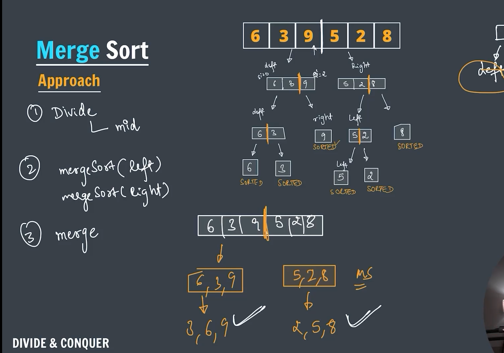
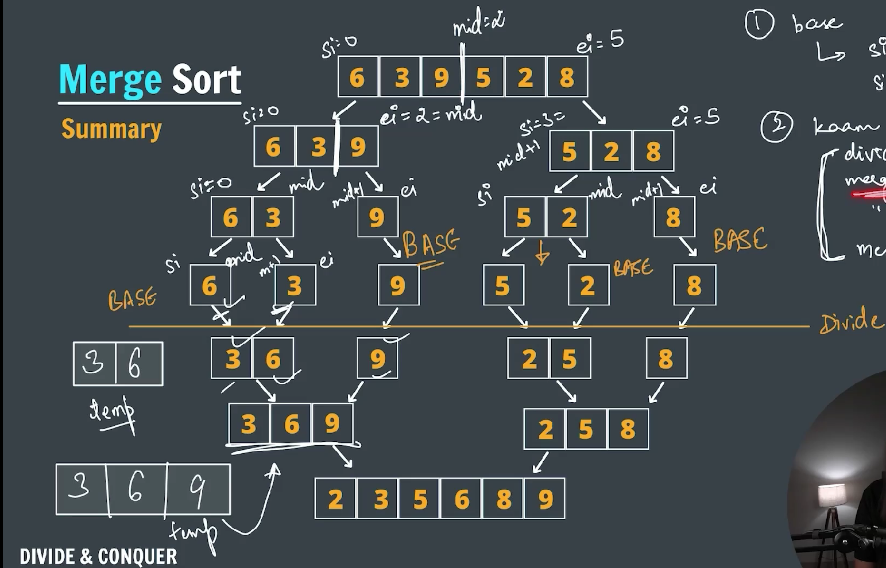
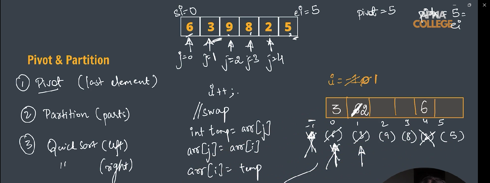
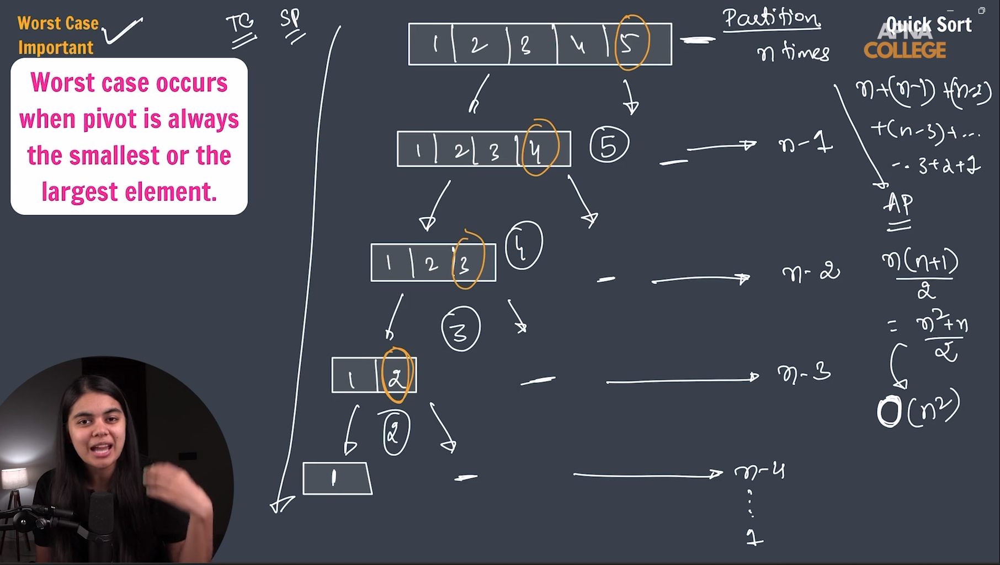

### Divide and Conquer


**_-> Merge sort: Can be solved by using divide and conquer technique_**




**_TC = O(nlogn)_** ||
**_SC = O(n)_**

```java
package DivideAndConquer;

import java.util.Scanner;

// TC = O(nlogn)
// SC = O(n)

public class mergeSort {

    public static void mergersort(int arr[], int si, int ei) {

        // base case
        if (si >= ei) {
            return;
        }

        int mid = si + (ei - si) / 2;

        mergersort(arr, si, mid); // recursively break left part
        mergersort(arr, mid + 1, ei); // recursively break right part

        // merge those parts
        merge(arr, si, mid, ei);
    }

    public static void merge(int arr[], int si, int mid, int ei) {

        int temp[] = new int[ei - si + 1];

        int i = si; // iterator for left part
        int j = mid + 1; // iterator for right part
        int k = 0; // iterator for temp array

        while (i <= mid && j <= ei) {
            if (arr[i] < arr[j]) {
                temp[k] = arr[i];
                i++;
                k++;
            } else {
                temp[k] = arr[j];
                j++;
                k++;
            }
        }

        // left part
        while (i <= mid) {
            temp[k++] = arr[i++];
        }

        // right part
        while (j <= ei) {
            temp[k++] = arr[j++];
        }

        // copy temp array values into original array
        for (k = 0, i = si; k < temp.length; k++, i++) {
            arr[i] = temp[k];
        }

    }

    public static void main(String[] args) {
        // int arr[] = { 6, 3, 9, 5, 2, 8 };

        Scanner sc = new Scanner(System.in);

        System.out.print("Enter the size of the array: ");
        int n = sc.nextInt();

        System.out.println("Enter elements into array: ");
        int arr[] = new int[n];

        for (int i = 0; i < n; i++) {
            arr[i] = sc.nextInt();
        }

        mergersort(arr, 0, n - 1);

        System.out.println("Array after sorting.");

        for (int i = 0; i < n; i++) {
            System.out.print(arr[i] + " ");
        }

        sc.close();

    }
}
```

**_-> Quick sort_**


**_[Average case] TC = O(nlogn)_** ||
**_SC = O(1)_**


**_[Worst case in the quick will occur when the pivot is always a largest element or the smallest element]_**
|| **_TC = O(n^2)_**

```java
package DivideAndConquer;

import java.util.Scanner;

public class quickSort {

    public static void quicksort(int arr[], int si, int ei) {

        // base case
        if (si >= ei) {
            return;
        }

        int pIdx = partition(arr, si, ei);

        quicksort(arr, si, pIdx - 1);
        quicksort(arr, pIdx + 1, ei);

    }

    public static int partition(int arr[], int si, int ei) {

        int pivot = arr[ei];
        int i = si - 1;

        for (int j = si; j < ei; j++) {
            if (arr[j] <= pivot) {
                i++;
                // swap
                int temp = arr[j];
                arr[j] = arr[i];
                arr[i] = temp;
            }
        }

        i++;
        // swap
        int temp = pivot;
        arr[ei] = arr[i];
        arr[i] = temp;

        return i;

    }

    public static void main(String[] args) {
        // int arr[] = { 6, 3, 9, 8, 2, 5 };

        Scanner sc = new Scanner(System.in);
        System.out.print("Enter the size of the array: ");
        int n = sc.nextInt();

        System.out.println("Enter elements in the array.");
        int arr[] = new int[n];
        for (int i = 0; i < n; i++) {
            arr[i] = sc.nextInt();
        }

        System.out.println("After using quicksort.");
        quicksort(arr, 0, n - 1);

        for (int i = 0; i < n; i++) {
            System.out.print(arr[i] + " ");
        }
        System.out.println();

        sc.close();

    }
}
```
