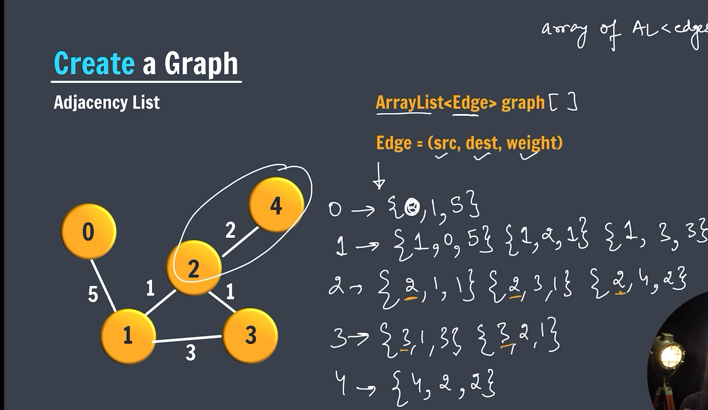
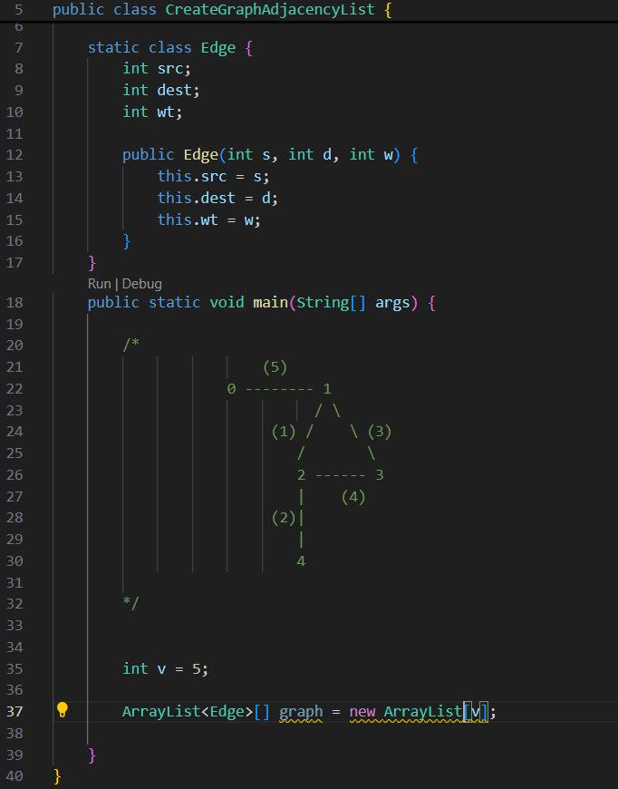
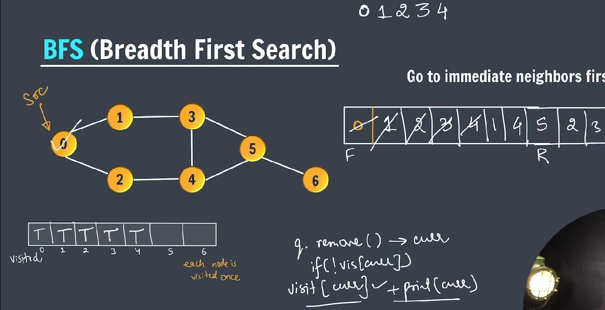
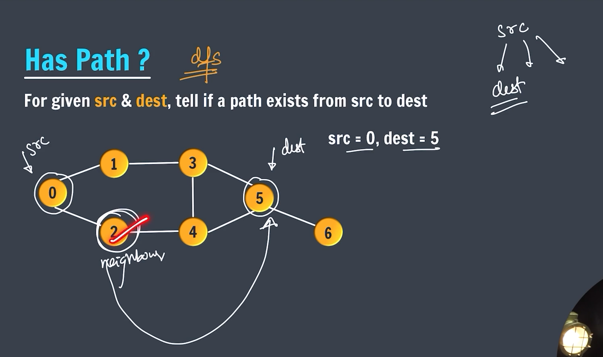

### Graph

A **graph** is a data structure that consists of:

- A set of **nodes** (also called **vertices**).
- A set of **edges** connecting pairs of nodes.

---


---

### Types of Graph (Based on edge)

> 1. Uni-Directional Graph
> 2. Un-Directional Graph
> 3. Bi-Directional Graph

---


---

### Types of Graph (Based on Weigth)

> 1. Weights Graph
> 2. Un-Weightd Graph

---


---

### Representation of Graph / Storing a Graph


---

1. **Adjacency List** (most common and efficient for sparse graphs)
2. **Adjacency Matrix**
3. **Edge List**

---

### ✅ 1. Graph Using **Adjacency List**

---


---

### Create Graph using Adjacency List



---

### ➤ graph structure



---

#### ➤ Example: Undirected Graph using Adjacency List

```java

import java.util.ArrayList;

public class CreateGraphAdjacencyList {

    static class Edge {
        int src;
        int dest;
        int wt;

        public Edge(int s, int d, int w) {
            this.src = s;
            this.dest = d;
            this.wt = w;
        }
    }

    public static void main(String[] args) {

        /*
         * (5)
         * 0 -------- 1
         * / \
         * (1) / \ (3)
         * / \
         * 2 ------ 3
         * | (4)
         * (2)|
         * |
         * 4
         *
         */

        int v = 5;

        @SuppressWarnings("unchecked")
        ArrayList<Edge>[] graph = new ArrayList[v];

        for (int i = 0; i < v; i++) {
            graph[i] = new ArrayList<>();
        }

        // 0 - vertex
        graph[0].add(new Edge(0, 1, 5));

        // 1 - vertex
        graph[1].add(new Edge(1, 0, 5));
        graph[1].add(new Edge(1, 2, 1));
        graph[1].add(new Edge(1, 3, 3));

        // 2 - vertex
        graph[2].add(new Edge(2, 1, 1));
        graph[2].add(new Edge(2, 3, 4));
        graph[2].add(new Edge(2, 4, 2));

        // 3 - vertex
        graph[3].add(new Edge(3, 1, 3));
        graph[3].add(new Edge(3, 2, 4));

        // 4 - vertex
        graph[4].add(new Edge(4, 2, 2));

        // 2's neighbors
        for (int i = 0; i < graph[2].size(); i++) {
            Edge e = graph[2].get(i); // src, dest, wt
            System.out.println("src: " + e.src);
            System.out.println("dest: " + e.dest);
            System.out.println("Full path form src->dest->wt : " + e.src + "->" + e.dest + "->" + e.wt);
        }

    }
}

```

---

### Output:

```
src: 2
dest: 1
Full path form src->dest->wt : 2->1->1
src: 2
dest: 3
Full path form src->dest->wt : 2->3->4
src: 2
dest: 4
Full path form src->dest->wt : 2->4->2
```

---

### ✅ 2. Graph Using **Adjacency Matrix**

---


---

Useful for **dense** graphs.

```java
public class GraphMatrix {
    private int[][] adjMatrix;
    private int numVertices;

    public GraphMatrix(int numVertices) {
        this.numVertices = numVertices;
        adjMatrix = new int[numVertices][numVertices];
    }

    public void addEdge(int i, int j) {
        adjMatrix[i][j] = 1;
        adjMatrix[j][i] = 1; // remove this for directed
    }

    public void printGraph() {
        for (int i = 0; i < numVertices; i++) {
            System.out.print(i + ": ");
            for (int j = 0; j < numVertices; j++) {
                System.out.print(adjMatrix[i][j] + " ");
            }
            System.out.println();
        }
    }

    public static void main(String[] args) {
        GraphMatrix graph = new GraphMatrix(5);
        graph.addEdge(0, 1);
        graph.addEdge(0, 4);
        graph.addEdge(1, 2);
        graph.addEdge(1, 3);
        graph.addEdge(1, 4);

        graph.printGraph();
    }
}
```

---

### ✅ 3. Directed vs Undirected Graph

- **Directed Graph**: Only one direction is added: `v1 → v2`
- **Undirected Graph**: Add both: `v1 → v2` and `v2 → v1`

---

### ✅ 4. Weighted Graph

```java
class WeightedGraph {
    private Map<Integer, List<Edge>> adjList = new HashMap<>();

    static class Edge {
        int dest, weight;
        Edge(int d, int w) {
            dest = d;
            weight = w;
        }

        public String toString() {
            return "(" + dest + ", weight: " + weight + ")";
        }
    }

    public void addEdge(int src, int dest, int weight) {
        adjList.putIfAbsent(src, new ArrayList<>());
        adjList.get(src).add(new Edge(dest, weight));
        // for undirected: add the reverse edge
        adjList.putIfAbsent(dest, new ArrayList<>());
        adjList.get(dest).add(new Edge(src, weight));
    }

    public void printGraph() {
        for (int node : adjList.keySet()) {
            System.out.println(node + " -> " + adjList.get(node));
        }
    }

    public static void main(String[] args) {
        WeightedGraph g = new WeightedGraph();
        g.addEdge(1, 2, 10);
        g.addEdge(1, 3, 5);
        g.addEdge(2, 4, 3);
        g.printGraph();
    }
}
```

---

### ✅ Summary of Use Cases

| Graph Type       | Recommended Representation     |
| ---------------- | ------------------------------ |
| Sparse Graph     | Adjacency List                 |
| Dense Graph      | Adjacency Matrix               |
| Weighted Graph   | Adjacency List with Edge class |
| Simple Edge List | List of `Edge` objects         |

---

### ✅ Applications of graph

Graph data structures are widely used in computer science and real-world applications due to their ability to represent complex relationships and connections. Here are some of the key **applications of graph data structures**, categorized by domain:

---

### **1. Computer Science and Software Engineering**

- **Social Networks**
  Represent users as nodes and relationships (friendships, followers) as edges.
  ➤ Example: Facebook, LinkedIn, Twitter.

- **Web Page Ranking (Search Engines)**
  The web is a directed graph where web pages are nodes and hyperlinks are edges.
  ➤ Used in algorithms like Google's **PageRank**.

- **Recommendation Systems**
  Users and products can be represented as a bipartite graph.
  ➤ Example: Netflix recommending movies, Amazon recommending products.

- **Compilers and Linkers**
  Dependency graphs are used to determine the order of compilation or linking.

- **Version Control Systems (e.g., Git)**
  Commits and branches are modeled as a directed acyclic graph (DAG).

---

### **2. Networking and Communication**

- **Routing Algorithms in Computer Networks**
  Routers and switches are nodes; connections are edges.
  ➤ Algorithms: Dijkstra’s, Bellman-Ford, A\*.

- **Internet Structure**
  IP networks, domains, and routers form a complex graph.

- **Peer-to-Peer Networks**
  Nodes are peers, edges represent data sharing or connection.

---

### **3. Artificial Intelligence and Machine Learning**

- **Knowledge Graphs**
  Represent relationships between entities in natural language or semantic data.
  ➤ Used by Google for search enhancement.

- **Graph Neural Networks (GNNs)**
  Deep learning on graph data for tasks like node classification or link prediction.

- **Pathfinding in Games and Robotics**
  Use graphs to represent maps or possible moves.
  ➤ Algorithms: A\*, BFS, DFS.

---

### **4. Transportation and Navigation**

- **Maps and GPS Navigation**
  Cities or intersections are nodes; roads are edges.
  ➤ Used by apps like Google Maps for shortest route calculations.

- **Airline Route Maps**
  Airports are nodes; flights are edges. Used in route planning and optimization.

---

### **5. Biology and Chemistry**

- **Protein-Protein Interaction Networks**
  Nodes = proteins, edges = interactions.

- **Molecular Structures**
  Atoms are nodes; chemical bonds are edges.

- **Neural Networks in Brain Mapping**
  Neurons and synapses can be modeled as a graph.

---

### **6. Databases**

- **Graph Databases (e.g., Neo4j, ArangoDB)**
  Store and query data as nodes and relationships instead of tables.
  ➤ Especially useful for highly connected data.

---

### **7. Operations Research and Logistics**

- **Supply Chain Networks**
  Warehouses, factories, and stores are nodes; transport routes are edges.

- **Project Scheduling (PERT/CPM)**
  Tasks are nodes; dependencies are edges.

- **Flow Networks**
  Used in network flow problems like max-flow/min-cut.

---

### **8. Security and Fraud Detection**

- **Access Control Systems**
  Graphs model permissions and inheritance in access control.

- **Fraud Detection**
  Graph analysis can reveal suspicious patterns, like circular transactions or sudden connections.

---

### **Graph Traversal**

> BFS -> Breadth first search



---

```java

import java.util.ArrayList;
import java.util.LinkedList;
import java.util.Queue;

public class TraverseGraphBFS {
  static class Edge {
      int src;
      int dest;
      int wt;

      public Edge(int s, int d, int w) {
          this.src = s;
          this.dest = d;
          this.wt = w;
      }
  }

  static void createGraph(ArrayList<Edge> graph[]) {
      for (int i = 0; i < graph.length; i++) {
          graph[i] = new ArrayList<>();
      }

      // 0's neighbors [1,2]
      graph[0].add(new Edge(0, 1, 1));
      graph[0].add(new Edge(0, 2, 1));

      // 1's neighbors [0,3]
      graph[1].add(new Edge(1, 0, 1));
      graph[1].add(new Edge(1, 3, 1));

      // 2's neighbors [0,4]
      graph[2].add(new Edge(2, 0, 1));
      graph[2].add(new Edge(2, 4, 1));

      // 3's neighbors [1,4,5]
      graph[3].add(new Edge(3, 1, 1));
      graph[3].add(new Edge(3, 4, 1));
      graph[3].add(new Edge(3, 5, 1));

      // 4's neighbors [2,3,5]
      graph[4].add(new Edge(4, 2, 1));
      graph[4].add(new Edge(4, 3, 1));
      graph[4].add(new Edge(4, 5, 1));

      // 5's neighbors [3,4,6]
      graph[5].add(new Edge(5, 3, 1));
      graph[5].add(new Edge(5, 4, 1));
      graph[5].add(new Edge(5, 6, 1));

      // 6's neighbors [5]
      graph[6].add(new Edge(6, 5, 1));

  }

  static void bfs(ArrayList<Edge>[] graph) { // O(V+E)
      Queue<Integer> q = new LinkedList<>();
      boolean[] vis = new boolean[graph.length];

      q.add(0); // source -> 0

      while (!q.isEmpty()) {
          int curr = q.remove();

          if (!vis[curr]) {
              System.out.print(curr + " ");
              vis[curr] = true;

              for (int i = 0; i < graph[curr].size(); i++) {
                  Edge e = graph[curr].get(i);
                   q.add(e.dest);
              }
          }
      }
  }

  public static void main(String[] args) {

    int v = 7;
    @SuppressWarnings("unchecked")
    ArrayList<Edge>[] graph = new ArrayList[v];

    createGraph(graph);

    bfs(graph);

  }
}
```

### Has Path

**_Find for given src & dest path exist or not_**



---

```java

import java.util.ArrayList;

public class HashPath {

    static class Edge {
        int src;
        int dest;
        int wt;

        public Edge(int s, int d, int w) {
            this.src = s;
            this.dest = d;
            this.wt = w;
        }
    }

    static void createGraph(ArrayList<Edge>[] graph) {

        for (int i = 0; i < graph.length; i++) {
            graph[i] = new ArrayList<>();
        }

        // 0's neighbors
        graph[0].add(new Edge(0, 1, 1));
        graph[0].add(new Edge(0, 2, 1));

        // 1's neighbors
        graph[1].add(new Edge(1, 0, 1));
        graph[1].add(new Edge(1, 3, 1));

        // 2's neighbors
        graph[2].add(new Edge(2, 0, 1));
        graph[2].add(new Edge(2, 4, 1));

        // 3's neighbors
        graph[3].add(new Edge(3, 1, 1));
        graph[3].add(new Edge(3, 4, 1));
        graph[3].add(new Edge(3, 5, 1));

        // 4's neighbors
        graph[4].add(new Edge(4, 2, 1));
        graph[4].add(new Edge(4, 3, 1));
        graph[4].add(new Edge(4, 5, 1));

        // 5's neighbors
        graph[5].add(new Edge(5, 3, 1));
        graph[5].add(new Edge(5, 4, 1));
        graph[5].add(new Edge(5, 6, 1));

        // 6's neighbors
        graph[6].add(new Edge(6, 5, 1));
    }

    static void printGraph(ArrayList<Edge>[] graph) {
        for (int i = 0; i < graph.length; i++) {
            for (int j = 0; j < graph[i].size(); j++) {
                Edge e = graph[i].get(j);

                System.out.println("Path of " + i + ": " + e.src + "->" + e.dest + "->" + e.wt);
            }
        }
    }

    static boolean hasPath(ArrayList<Edge>[] graph, int src, int dest, boolean vis[]) {
        if (src == dest) {
            return true;
        }

        vis[src] = true;

        for (int i = 0; i < graph[src].size(); i++) {
            Edge e = graph[src].get(i);

            if (!vis[e.dest] && hasPath(graph, e.dest, dest, vis)) {
                return true;
            }
        }

        return false;
    }

    public static void main(String[] args) {

        int v = 7;
        @SuppressWarnings("unchecked")
        ArrayList<Edge>[] graph = new ArrayList[v];
        createGraph(graph);

        printGraph(graph);

        System.out.println(hasPath(graph, 0, 6, new boolean[v]));

    }
}
```
