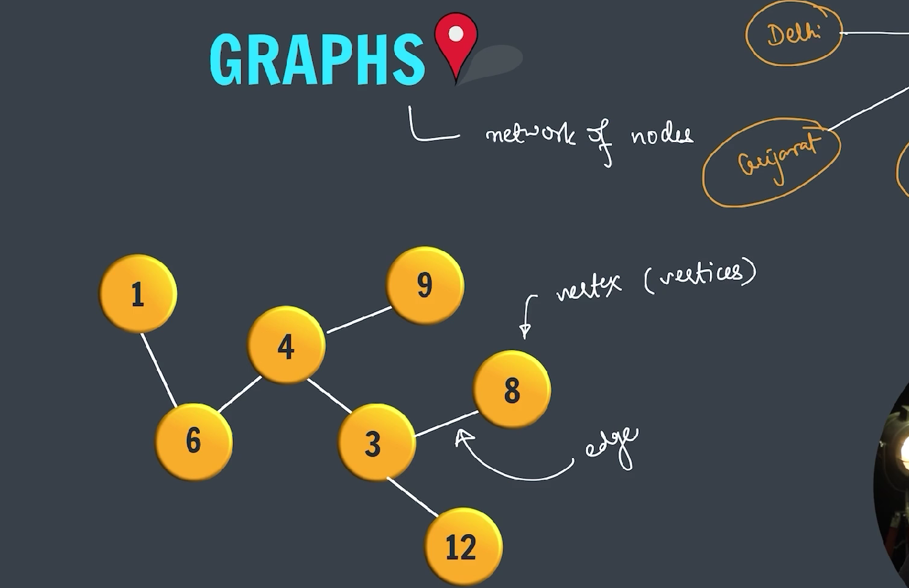
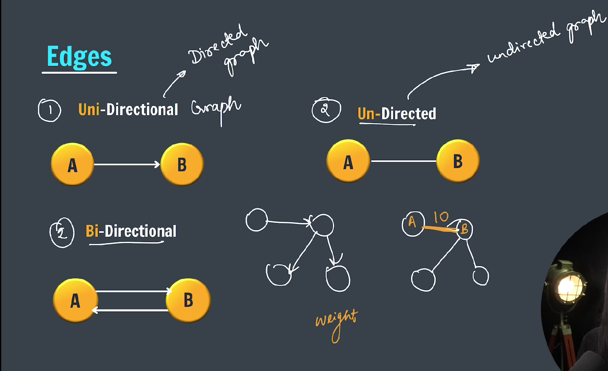
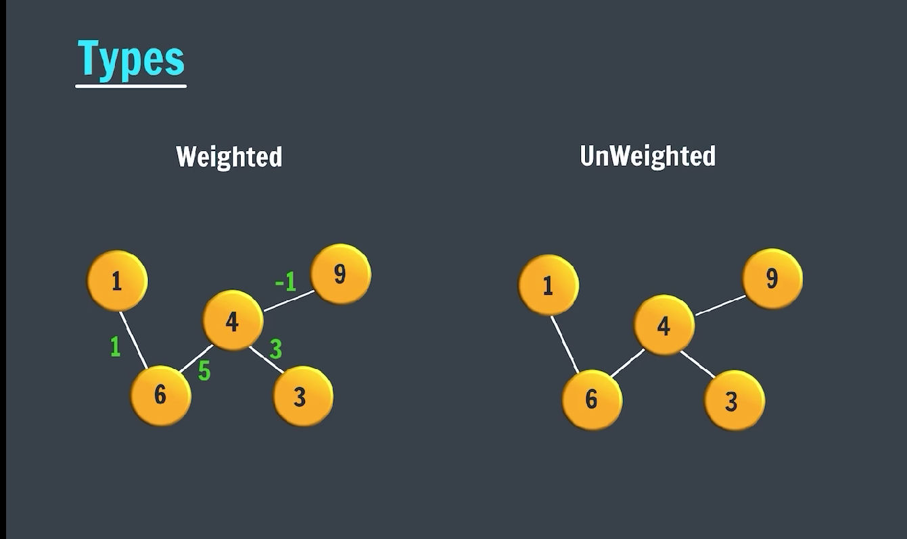
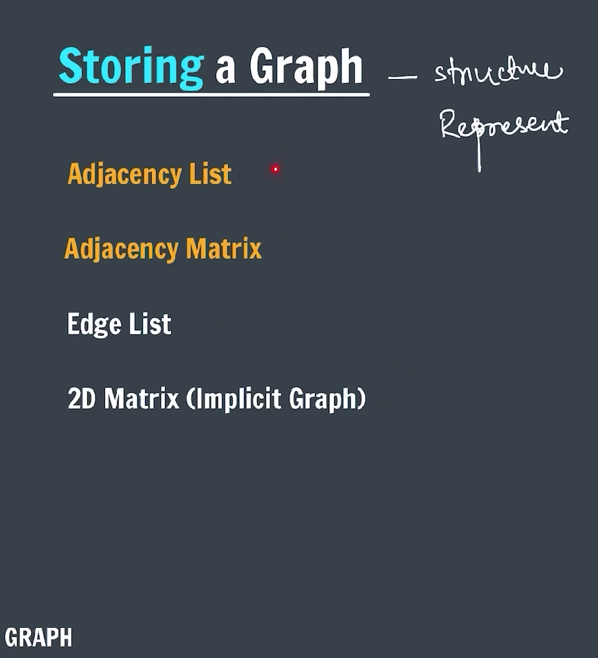
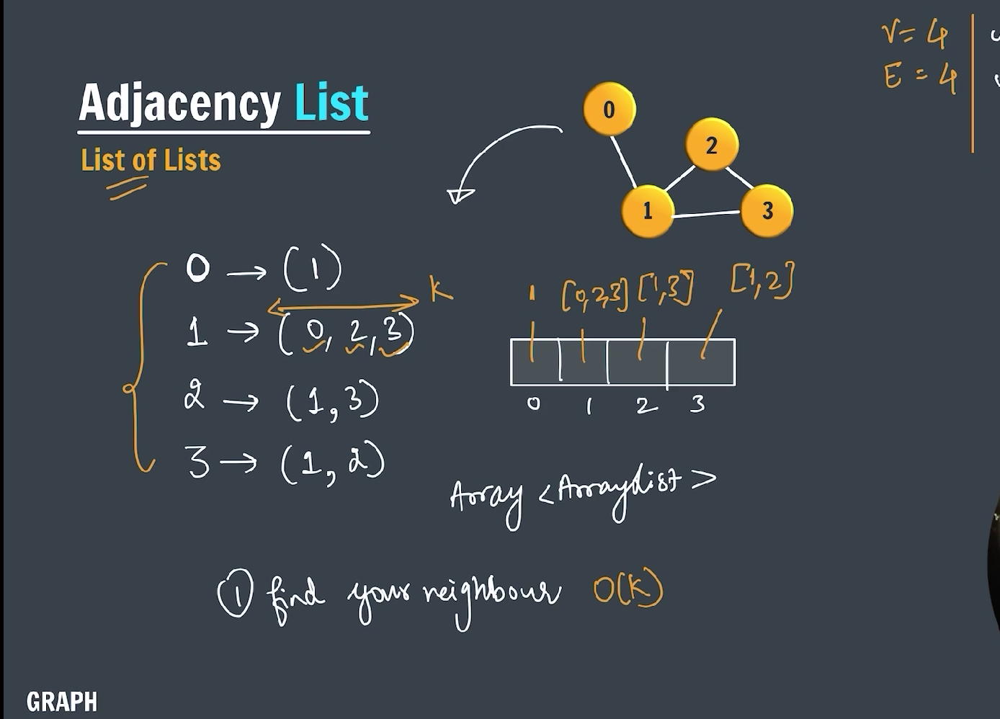
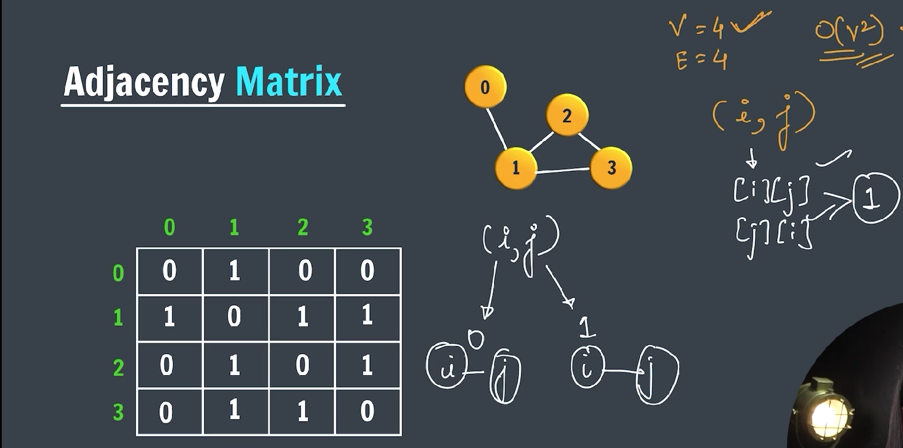

### Graph

A **graph** is a data structure that consists of:

- A set of **nodes** (also called **vertices**).
- A set of **edges** connecting pairs of nodes.

---



---

### Types of Graph (Based on edge)

> 1. Uni-Directional Graph
> 2. Un-Directional Graph
> 3. Bi-Directional Graph

---



---

### Types of Graph (Based on Weigth)

> 1. Weights Graph
> 2. Un-Weightd Graph

---



---

### Representation of Graph / Storing a Graph



---

1. **Adjacency List** (most common and efficient for sparse graphs)
2. **Adjacency Matrix**
3. **Edge List**

---

### ✅ 1. Graph Using **Adjacency List**

---



---

This is the most efficient and flexible way. You can use a `Map<Vertex, List<Vertex>>` or an array of lists.

#### ➤ Example: Undirected Graph using Adjacency List

```java
import java.util.*;

public class Graph {
    private Map<Integer, List<Integer>> adjList;

    public Graph() {
        adjList = new HashMap<>();
    }

    // Add a vertex
    public void addVertex(int vertex) {
        adjList.putIfAbsent(vertex, new ArrayList<>());
    }

    // Add an edge (undirected)
    public void addEdge(int v1, int v2) {
        adjList.putIfAbsent(v1, new ArrayList<>());
        adjList.putIfAbsent(v2, new ArrayList<>());

        adjList.get(v1).add(v2);
        adjList.get(v2).add(v1); // remove this for directed graph
    }

    // Print the graph
    public void printGraph() {
        for (int vertex : adjList.keySet()) {
            System.out.print(vertex + " -> ");
            System.out.println(adjList.get(vertex));
        }
    }

    public static void main(String[] args) {
        Graph graph = new Graph();

        graph.addEdge(1, 2);
        graph.addEdge(1, 3);
        graph.addEdge(2, 4);
        graph.addEdge(3, 4);
        graph.addEdge(4, 5);

        graph.printGraph();
    }
}
```

---

### ✅ 2. Graph Using **Adjacency Matrix**

---



---

Useful for **dense** graphs.

```java
public class GraphMatrix {
    private int[][] adjMatrix;
    private int numVertices;

    public GraphMatrix(int numVertices) {
        this.numVertices = numVertices;
        adjMatrix = new int[numVertices][numVertices];
    }

    public void addEdge(int i, int j) {
        adjMatrix[i][j] = 1;
        adjMatrix[j][i] = 1; // remove this for directed
    }

    public void printGraph() {
        for (int i = 0; i < numVertices; i++) {
            System.out.print(i + ": ");
            for (int j = 0; j < numVertices; j++) {
                System.out.print(adjMatrix[i][j] + " ");
            }
            System.out.println();
        }
    }

    public static void main(String[] args) {
        GraphMatrix graph = new GraphMatrix(5);
        graph.addEdge(0, 1);
        graph.addEdge(0, 4);
        graph.addEdge(1, 2);
        graph.addEdge(1, 3);
        graph.addEdge(1, 4);

        graph.printGraph();
    }
}
```

---

### ✅ 3. Directed vs Undirected Graph

- **Directed Graph**: Only one direction is added: `v1 → v2`
- **Undirected Graph**: Add both: `v1 → v2` and `v2 → v1`

---

### ✅ 4. Weighted Graph

```java
class WeightedGraph {
    private Map<Integer, List<Edge>> adjList = new HashMap<>();

    static class Edge {
        int dest, weight;
        Edge(int d, int w) {
            dest = d;
            weight = w;
        }

        public String toString() {
            return "(" + dest + ", weight: " + weight + ")";
        }
    }

    public void addEdge(int src, int dest, int weight) {
        adjList.putIfAbsent(src, new ArrayList<>());
        adjList.get(src).add(new Edge(dest, weight));
        // for undirected: add the reverse edge
        adjList.putIfAbsent(dest, new ArrayList<>());
        adjList.get(dest).add(new Edge(src, weight));
    }

    public void printGraph() {
        for (int node : adjList.keySet()) {
            System.out.println(node + " -> " + adjList.get(node));
        }
    }

    public static void main(String[] args) {
        WeightedGraph g = new WeightedGraph();
        g.addEdge(1, 2, 10);
        g.addEdge(1, 3, 5);
        g.addEdge(2, 4, 3);
        g.printGraph();
    }
}
```

---

### ✅ Summary of Use Cases

| Graph Type       | Recommended Representation     |
| ---------------- | ------------------------------ |
| Sparse Graph     | Adjacency List                 |
| Dense Graph      | Adjacency Matrix               |
| Weighted Graph   | Adjacency List with Edge class |
| Simple Edge List | List of `Edge` objects         |

---
