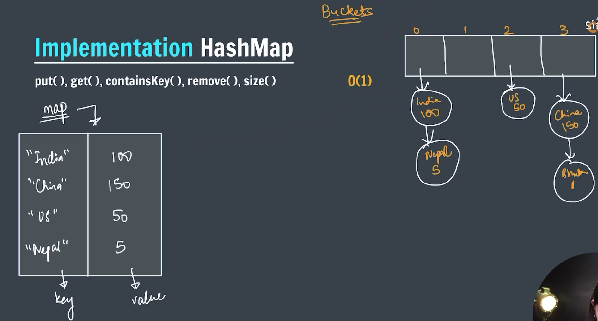
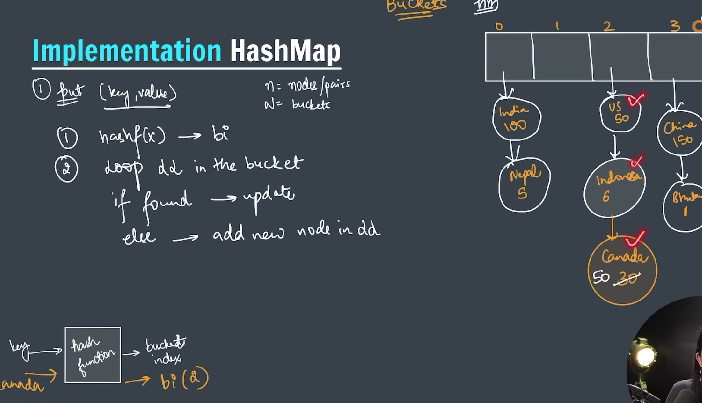
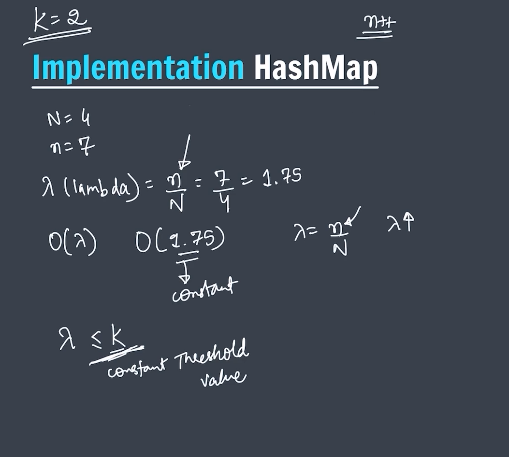
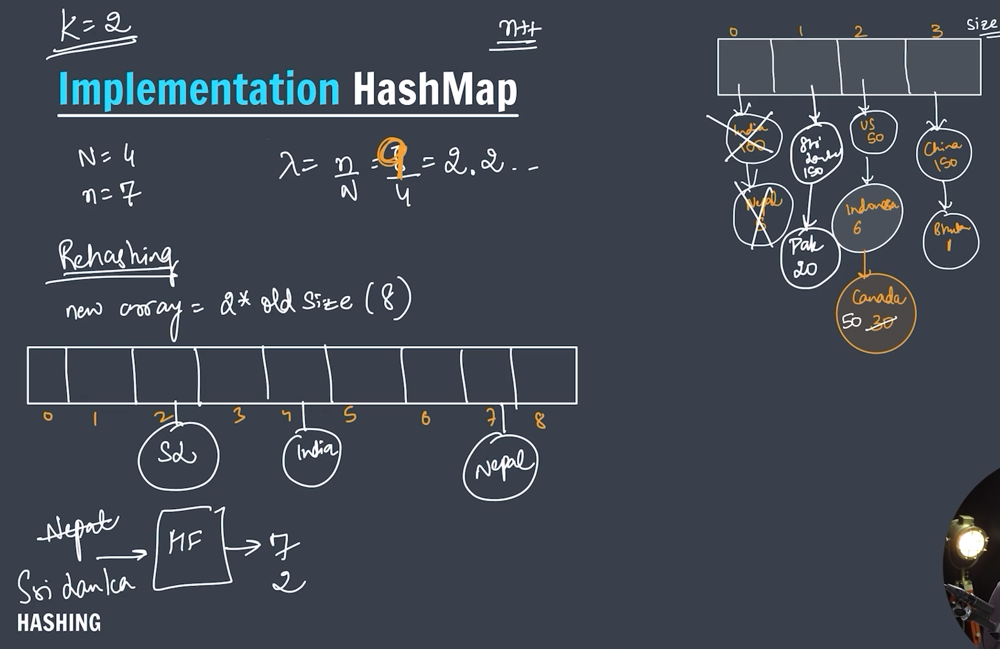
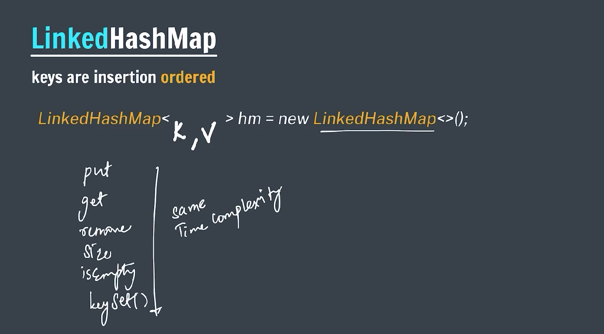

### HashMap (Key-Value pair)

`HashMap` is part of Java’s **Collection Framework** and is used to store **key-value pairs**. It uses **hashing** for fast access, making it one of the most efficient ways to store and retrieve data.


---

### ✅ Key Features

| Feature               | Description                              |
| --------------------- | ---------------------------------------- |
| Implements            | `Map<K, V>` interface                    |
| Underlying Structure  | Hash Table (array of buckets)            |
| Allows `null` keys?   | Yes, only one `null` key                 |
| Allows `null` values? | Yes                                      |
| Is it synchronized?   | No (not thread-safe)                     |
| Order maintained?     | No (use `LinkedHashMap` for ordered map) |
| Time Complexity       | O(1) for `put()`, `get()` (average case) |

---

### 🧪 Basic Example

```java

import java.util.HashMap;

public class hashMap {
    public static void main(String[] args) {
        HashMap<String, Integer> country = new HashMap<>();

        // -> to add data into HashMap we use put operation
        country.put("India", 150);
        country.put("Srilanka", 100);
        country.put("China", 200);
        country.put("Bhutan", 50);

        // -> get the element
        System.out.println(country.get("India"));

        // -> check whether it contains key or not
        System.out.println(country.containsKey("China"));
        System.out.println(country.containsValue(50));

        // -> remove entry with the help of key
        System.out.println(country.remove("Bhutan"));

        System.out.println(country.containsKey("Bhutan"));

        for (String key : country.keySet()) {
            System.out.println(key + " => " + country.get(key));
        }

    }
}

```

---


---

### 🔍 Important Methods

| Method                    | Description                      |
| ------------------------- | -------------------------------- |
| `put(K key, V value)`     | Adds or updates key-value pair   |
| `get(Object key)`         | Returns value for the given key  |
| `remove(Object key)`      | Removes the entry by key         |
| `containsKey(Object key)` | Checks if key exists             |
| `containsValue(Object v)` | Checks if value exists           |
| `keySet()`                | Returns a `Set` of keys          |
| `values()`                | Returns a `Collection` of values |
| `entrySet()`              | Returns a `Set<Map.Entry<K,V>>`  |
| `clear()`                 | Removes all mappings             |
| `size()`                  | Number of key-value mappings     |

---

### ⚙️ Internal Working of HashMap

1. Each key’s `hashCode()` is calculated.
2. The hash is converted to an index in the internal array (`table[]`).
3. If a collision occurs (multiple keys map to the same index):
   - Java uses **LinkedList** (before Java 8).
   - Uses **Balanced Tree (Red-Black Tree)** if the list is long (Java 8+).
4. On `get()`, Java hashes the key again and retrieves the value from the index.

---

### 🚫 Pitfalls to Avoid

- Don’t use **mutable objects** as keys unless you're very careful.
- `HashMap` is **not thread-safe** – use `ConcurrentHashMap` in multithreaded apps.
- Overriding `hashCode()` and `equals()` properly is critical for custom keys.

---

### Iterating over a `HashMap` using a `Set` data structures


---

```java

import java.util.HashMap;
import java.util.Set;

public class IterationOnHashMap {
    public static void main(String[] args) {

        HashMap<String, Integer> country = new HashMap<>();
        // insert operation
        country.put("India", 100);
        country.put("China", 150);
        country.put("US", 50);
        country.put("Indonesia", 6);
        country.put("Bhutan", 5);

        System.out.println(country);

        // Iteration on HashMap
        Set<String> keys = country.keySet();

        for (String key : keys) {
            System.out.println(key + " => " + country.get(key));
        }

    }
}
```

---

### HashMap Implementation

Implementing a **HashMap from scratch in Java** involves:

1. Defining an internal `Entry` class to hold key-value pairs.
2. Creating an array of `Entry` objects to act as buckets.
3. Implementing `put`, `get`, `remove`, and resizing logic.
4. Handling collisions using **chaining** (linked lists).

---



---



---



---

### ReHashing in HashMap

**Rehashing** is the process of resizing the internal array (bucket array) when the current one becomes too full, typically governed by the **load factor**. During rehashing:

1. A new, larger array is created (usually 2× the size).
2. All existing entries are **re-inserted** (rehashed) into the new array because the **index calculation depends on the array size**.

---

### ✅ Why is rehashing necessary?

- To maintain **O(1)** average time complexity for `put` and `get`.
- Prevent long chains (linked lists or trees) due to too many collisions.
- Triggered when `size / capacity > loadFactor`.

---



---

### 🔗 `LinkedHashMap` in Java – Explained

The `LinkedHashMap` is a subclass of `HashMap` that **maintains insertion order** or **access order** of its entries — unlike `HashMap`, which does **not guarantee order**.



---

### ✅ Key Features of `LinkedHashMap`

| Feature                  | Description                                                                        |
| ------------------------ | ---------------------------------------------------------------------------------- |
| **Ordering**             | Maintains a **doubly-linked list** of entries in **insertion** or **access** order |
| **Performance**          | Similar to `HashMap` — O(1) for `put`, `get`, `remove`                             |
| **Null keys/values**     | Allows one null key and multiple null values (same as `HashMap`)                   |
| **Load factor/capacity** | Same logic as `HashMap`                                                            |

---

### 📦 Internal Structure

```text
LinkedHashMap = HashMap + Doubly Linked List
```

Each entry maintains:

- `before` and `after` point to previous and next entries in insertion/access order.
- The `LinkedHashMap` maintains `head` and `tail` of the linked list.

---

### 🧠 Insertion vs Access Order

```java
// Insertion-order LinkedHashMap (default)
Map<String, Integer> map = new LinkedHashMap<>();

// Access-order LinkedHashMap
Map<String, Integer> map = new LinkedHashMap<>(16, 0.75f, true);
```

| Mode          | Behavior                                                                        |
| ------------- | ------------------------------------------------------------------------------- |
| **Insertion** | Keeps entries in the order they were added.                                     |
| **Access**    | Reorders entries so the most recently accessed entry is at the end of the list. |

---

### 🧪 Example: Insertion Order

```java
Map<String, Integer> map = new LinkedHashMap<>();

map.put("A", 1);
map.put("B", 2);
map.put("C", 3);

System.out.println(map); // Output: {A=1, B=2, C=3}
```

---

### 🧪 Example: Access Order

```java
Map<String, Integer> map = new LinkedHashMap<>(16, 0.75f, true);

map.put("A", 1);
map.put("B", 2);
map.put("C", 3);

map.get("A"); // Access A
System.out.println(map); // Output: {B=2, C=3, A=1}
```

---

### 🧹 LRU Cache Behavior (Eviction)

`LinkedHashMap` can be used to implement a simple **LRU cache** by overriding the `removeEldestEntry()` method:

```java
LinkedHashMap<Integer, String> lruCache = new LinkedHashMap<>(16, 0.75f, true) {
    protected boolean removeEldestEntry(Map.Entry<Integer, String> eldest) {
        return size() > 5; // Max 5 entries
    }
};
```

When a new item is added and the size exceeds 5, the **least recently accessed** entry is evicted automatically.

---

```java

import java.util.LinkedHashMap;

public class LinkedHashmapStructure {
    public static void main(String[] args) {

        // LinkedHashMap is mainly used to keep the insertion order
        LinkedHashMap<String, Integer> lhm = new LinkedHashMap<>();

        lhm.put("India", 100);
        lhm.put("China", 150);
        lhm.put("US", 50);

        System.out.println(lhm);
    }
}
```

---

### ✅ When to Use `LinkedHashMap`?

- When you need predictable iteration order (insertion or access).
- When building an LRU cache.
- When extending `HashMap` with ordered behavior is required.

---

### ❌ When Not to Use It

- If you don’t care about ordering → use `HashMap` (less overhead).
- If you want **sorted order** → use `TreeMap`.

---

## 🌳 What is a `TreeMap`?

A **`TreeMap`** is a special kind of map (key-value store) in Java that keeps the **keys in sorted order** automatically.

Think of it like a dictionary where the words (keys) are always sorted A → Z.

---

## ✅ Example

```java

import java.util.TreeMap;

public class TreeMapStructure {

    public static void main(String[] args) {

        // it keeps the keys in the sorted order and the internal data used is ->
        // Red-Black Tree
        TreeMap<String, Integer> treemap = new TreeMap<>();

        treemap.put("India", 100);
        treemap.put("China", 150);
        treemap.put("US", 50);

        System.out.println(treemap);
    }

}

```

### 🖨️ Output:

```
{China=150, India=100, US=50}
```

> Notice how the keys are **sorted alphabetically**, even though we added them in a different order.

---

## 🔍 Key Features of `TreeMap`

| Feature                        | Description                                                            |
| ------------------------------ | ---------------------------------------------------------------------- |
| 🔢 **Sorted keys**             | Automatically keeps keys in **ascending order**                        |
| 🧠 **Based on Red-Black Tree** | Uses a self-balancing binary search tree internally (not a hash table) |
| ❌ **No null keys**            | Cannot store `null` as a key (unlike `HashMap`)                        |
| ✅ **Null values allowed**     | You _can_ use null values                                              |
| 🕐 **Time complexity**         | O(log n) for `put`, `get`, `remove` (slower than HashMap, but sorted)  |

---

## ✅ Common Methods

```java
map.put("key", value);   // Add key-value
map.get("key");          // Get value by key
map.remove("key");       // Remove entry
map.firstKey();          // Smallest key
map.lastKey();           // Largest key
map.headMap("China");   // All keys < "orange"
map.tailMap("India");   // All keys ≥ "banana"
```

---

## 🧠 How is it different from HashMap?

| Feature      | `HashMap`          | `TreeMap`               |
| ------------ | ------------------ | ----------------------- |
| 🔢 Ordering  | No order (random)  | Keys always sorted      |
| ⚡ Speed     | O(1) average       | O(log n)                |
| 🧱 Structure | Uses hash table    | Uses red-black tree     |
| ❓ Null keys | 1 null key allowed | ❌ No null keys allowed |

---

## ✅ When to Use `TreeMap`

Use `TreeMap` when:

- You need to iterate over keys in **sorted order**.
- You need **range queries**, like "get all keys between X and Y".
- You want to avoid using `Collections.sort()` manually on keys.

---
