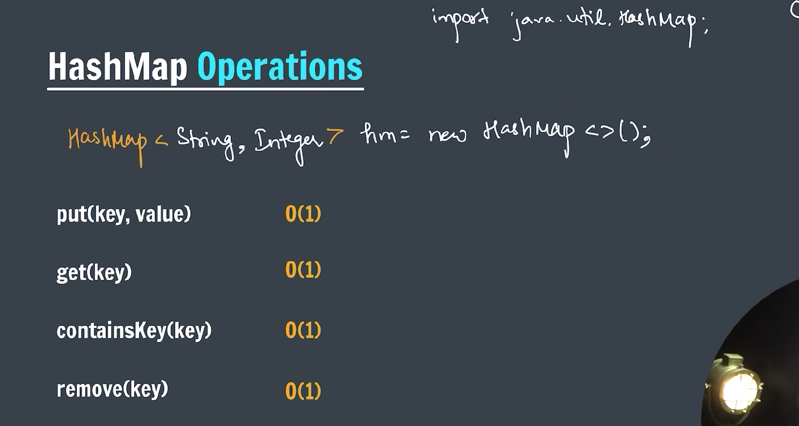

### HashMap (Key-Value pair)

`HashMap` is part of Java’s **Collection Framework** and is used to store **key-value pairs**. It uses **hashing** for fast access, making it one of the most efficient ways to store and retrieve data.


---

### ✅ Key Features

| Feature               | Description                              |
| --------------------- | ---------------------------------------- |
| Implements            | `Map<K, V>` interface                    |
| Underlying Structure  | Hash Table (array of buckets)            |
| Allows `null` keys?   | Yes, only one `null` key                 |
| Allows `null` values? | Yes                                      |
| Is it synchronized?   | No (not thread-safe)                     |
| Order maintained?     | No (use `LinkedHashMap` for ordered map) |
| Time Complexity       | O(1) for `put()`, `get()` (average case) |

---

### 🧪 Basic Example

```java

import java.util.HashMap;

public class hashMap {
    public static void main(String[] args) {
        HashMap<String, Integer> country = new HashMap<>();

        // -> to add data into HashMap we use put operation
        country.put("India", 150);
        country.put("Srilanka", 100);
        country.put("China", 200);
        country.put("Bhutan", 50);

        // -> get the element
        System.out.println(country.get("India"));

        // -> check whether it contains key or not
        System.out.println(country.containsKey("China"));
        System.out.println(country.containsValue(50));

        // -> remove entry with the help of key
        System.out.println(country.remove("Bhutan"));

        System.out.println(country.containsKey("Bhutan"));

        for (String key : country.keySet()) {
            System.out.println(key + " => " + country.get(key));
        }

    }
}

```

---



---

### 🔍 Important Methods

| Method                    | Description                      |
| ------------------------- | -------------------------------- |
| `put(K key, V value)`     | Adds or updates key-value pair   |
| `get(Object key)`         | Returns value for the given key  |
| `remove(Object key)`      | Removes the entry by key         |
| `containsKey(Object key)` | Checks if key exists             |
| `containsValue(Object v)` | Checks if value exists           |
| `keySet()`                | Returns a `Set` of keys          |
| `values()`                | Returns a `Collection` of values |
| `entrySet()`              | Returns a `Set<Map.Entry<K,V>>`  |
| `clear()`                 | Removes all mappings             |
| `size()`                  | Number of key-value mappings     |

---

### ⚙️ Internal Working of HashMap

1. Each key’s `hashCode()` is calculated.
2. The hash is converted to an index in the internal array (`table[]`).
3. If a collision occurs (multiple keys map to the same index):
   - Java uses **LinkedList** (before Java 8).
   - Uses **Balanced Tree (Red-Black Tree)** if the list is long (Java 8+).
4. On `get()`, Java hashes the key again and retrieves the value from the index.

---

### 🚫 Pitfalls to Avoid

- Don’t use **mutable objects** as keys unless you're very careful.
- `HashMap` is **not thread-safe** – use `ConcurrentHashMap` in multithreaded apps.
- Overriding `hashCode()` and `equals()` properly is critical for custom keys.

---

### Iterating over a `HashMap` using a `Set` data structures


---

```java

import java.util.HashMap;
import java.util.Set;

public class IterationOnHashMap {
    public static void main(String[] args) {

        HashMap<String, Integer> country = new HashMap<>();
        // insert operation
        country.put("India", 100);
        country.put("China", 150);
        country.put("US", 50);
        country.put("Indonesia", 6);
        country.put("Bhutan", 5);

        System.out.println(country);

        // Iteration on HashMap
        Set<String> keys = country.keySet();

        for (String key : keys) {
            System.out.println(key + " => " + country.get(key));
        }

    }
}
```
