### HashSet

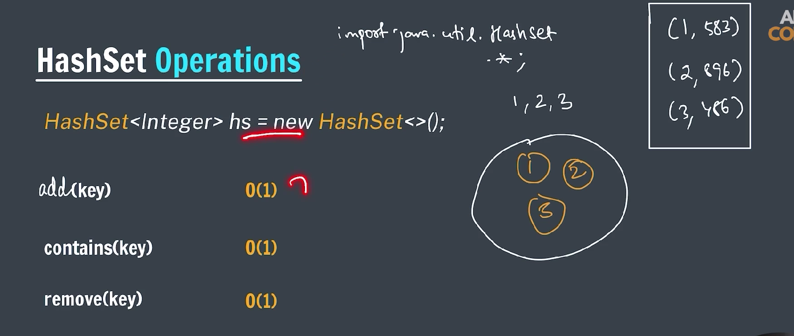

### What is a HashSet?

- **HashSet** is a part of Java’s **Collection Framework**.
- It implements the **Set** interface.
- It stores **unique elements** (no duplicates allowed).
- It is **unordered**, meaning it does not guarantee any specific order of elements.
- It uses a **hash table** internally for storage, which allows **constant-time performance** for basic operations like add, remove, contains, etc.

---

### Key Characteristics

| Feature       | Description                                                      |
| ------------- | ---------------------------------------------------------------- |
| Duplicates    | Not allowed (only one copy of each element)                      |
| Order         | No guaranteed order                                              |
| Null elements | Allows one null element                                          |
| Thread safety | Not synchronized (use `Collections.synchronizedSet()` if needed) |
| Performance   | Fast operations due to hashing                                   |

---

### Basic Usage Example

```java

import java.util.HashSet;

public class set {
    public static void main(String[] args) {

        HashSet<String> set = new HashSet<>();

        set.add("Apple");
        set.add("Banana");
        set.add("Cherry");
        set.add("Apple");

        if (set.contains("Banana")) {
            System.out.println("Banana is present.");
        }

        for (String fruit : set) {
            System.out.println(fruit);
        }

        System.out.println(set);
    }
}

```

---

### Common Methods

| Method               | Description                   |
| -------------------- | ----------------------------- |
| `add(E e)`           | Adds the specified element    |
| `remove(Object o)`   | Removes the specified element |
| `contains(Object o)` | Checks if element is present  |
| `size()`             | Returns number of elements    |
| `isEmpty()`          | Checks if set is empty        |
| `clear()`            | Removes all elements          |

---

### Iteration on HashSet

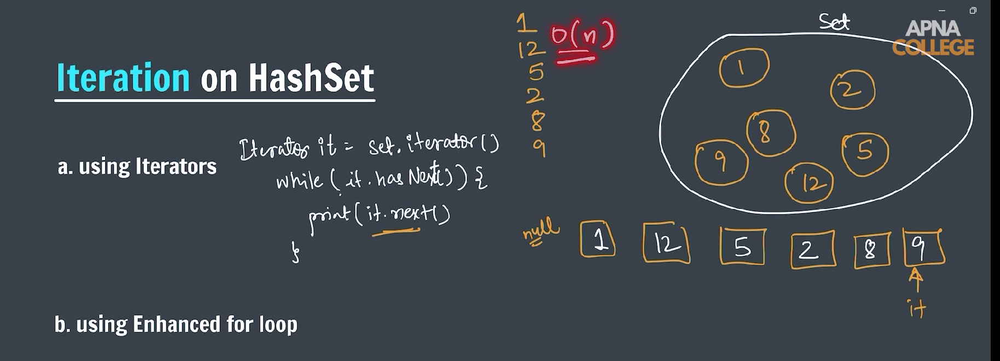

---

```java

import java.util.HashSet;
import java.util.Iterator;

public class IterationUsingIterator {
    public static void main(String[] args) {

        HashSet<String> set = new HashSet<>();

        set.add("Apple");
        set.add("Mango");
        set.add("Banana");
        set.add("Orange");

        // iteration by using iterator
        @SuppressWarnings("rawtypes")
        Iterator it = set.iterator();

        while (it.hasNext()) {
            System.out.println(it.next());
        }

        // advanced for loop
        for (String item : set) {
            System.out.println(item);
        }
    }
}
```

---

### LinkedHashSet (Hash Table + Linked List)

A `LinkedHashSet` in Java is a part of the Java Collections Framework. It is a **hash table** and **linked list** implementation of the `Set` interface, with predictable iteration order.

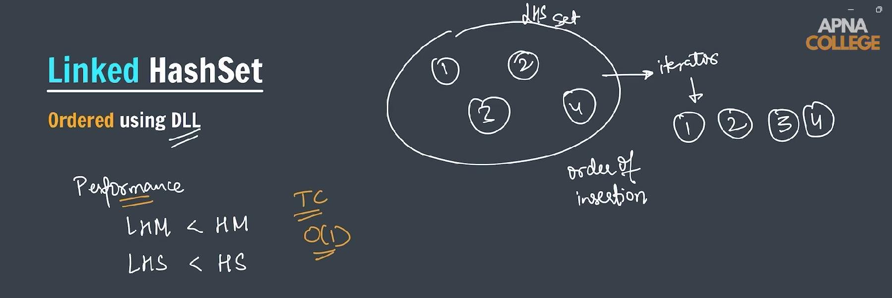

---

### Key Features of `LinkedHashSet`:

1. **No Duplicate Elements**: Like all sets, it does not allow duplicate elements.
2. **Maintains Insertion Order**: Unlike `HashSet`, it maintains the order in which elements were inserted.
3. **Backed by a Hash Table**: It uses a hash table internally, like `HashSet`, but also maintains a **doubly-linked list** to keep track of the order.
4. **Null Elements Allowed**: It allows one `null` element.

---

### Declaration:

```java
LinkedHashSet<Type> set = new LinkedHashSet<>();
```

### Example Usage:

```java

import java.util.Iterator;
import java.util.LinkedHashSet;

public class LinkedHashSetImplementation {
    public static void main(String[] args) {

        LinkedHashSet<String> lSet = new LinkedHashSet<>();

        lSet.add("Apple");
        lSet.add("Mango");
        lSet.add("Guave");
        lSet.add("Orange");

        System.out.println(lSet);

        @SuppressWarnings("rawtypes")
        Iterator it = lSet.iterator();

        while (it.hasNext()) {
            System.out.println(it.next());
        }

        System.out.println(lSet.remove("Apple"));
        System.out.println(lSet);

    }
}

```

---

### Common Methods:

| Method               | Description                                                  |
| -------------------- | ------------------------------------------------------------ |
| `add(E e)`           | Adds the specified element to the set if not already present |
| `remove(Object o)`   | Removes the specified element                                |
| `contains(Object o)` | Returns true if the set contains the specified element       |
| `size()`             | Returns the number of elements                               |
| `clear()`            | Removes all the elements                                     |
| `isEmpty()`          | Checks if the set is empty                                   |
| `iterator()`         | Returns an iterator over the elements in insertion order     |

---

### When to Use `LinkedHashSet`:

Use `LinkedHashSet` when:

- You need a collection with **no duplicates**
- You want to **preserve insertion order**
- You want **fast lookups**, additions, and deletions (similar to `HashSet`)

---

---

### TreeSet (Red-Black tree) -> Sorted order & Duplicate will be ignored

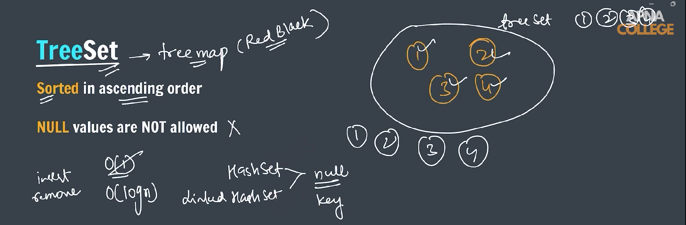

---

### What is `TreeSet` in Java?

`TreeSet` is a **SortedSet** implementation based on a **Red-Black Tree** (a kind of self-balancing binary search tree).

---

### Key Characteristics:

- **Sorted Order:** Maintains elements in **ascending natural order** (or by a custom comparator you provide).
- **No Duplicates:** Like all sets, it does **not allow duplicates**.
- **NavigableSet:** Supports operations like `first()`, `last()`, `higher()`, `lower()` etc.
- **Performance:** Basic operations (`add()`, `remove()`, `contains()`) run in **O(log n)** time due to the tree structure.
- **Null Elements:** Does **not allow null elements** (throws `NullPointerException` if you try to add null).

---

### How to Use `TreeSet`:

```java

import java.util.Iterator;
import java.util.TreeSet;

public class TreeSetImplementation {
    public static void main(String[] args) {

        TreeSet<Integer> tSet = new TreeSet<>();

        tSet.add(50);
        tSet.add(10);
        tSet.add(30);
        tSet.add(20);
        tSet.add(40);
        tSet.add(30);

        System.out.println(tSet.first());
        System.out.println(tSet.last());
        System.out.println(tSet.higher(25));
        System.out.println(tSet.lower(30));

        System.out.println(tSet);

        @SuppressWarnings("rawtypes")
        Iterator it = tSet.iterator();

        while (it.hasNext()) {
            System.out.print(it.next() + " ");
        }

        System.out.println();

        TreeSet<String> ts = new TreeSet<>();

        // Always store data in sorted order
        ts.add("Mango");
        ts.add("Banana");
        ts.add("Guava");
        ts.add("Orange");
        System.out.println(ts);

    }
}

```

---

### Common Methods:

| Method               | Description                                       |
| -------------------- | ------------------------------------------------- |
| `add(E e)`           | Adds element maintaining sorted order             |
| `remove(Object o)`   | Removes specified element                         |
| `contains(Object o)` | Checks if element exists                          |
| `first()`            | Returns smallest element                          |
| `last()`             | Returns largest element                           |
| `higher(E e)`        | Returns least element greater than `e`            |
| `lower(E e)`         | Returns greatest element less than `e`            |
| `pollFirst()`        | Retrieves and removes the smallest element        |
| `pollLast()`         | Retrieves and removes the largest element         |
| `iterator()`         | Returns iterator over elements in ascending order |

---

### When to Use `TreeSet`:

- You want **sorted and unique elements**.
- You need to perform range queries or get next higher/lower elements easily.
- Performance with ordered data is important (logarithmic time complexity).

---

### Count Distinct Element

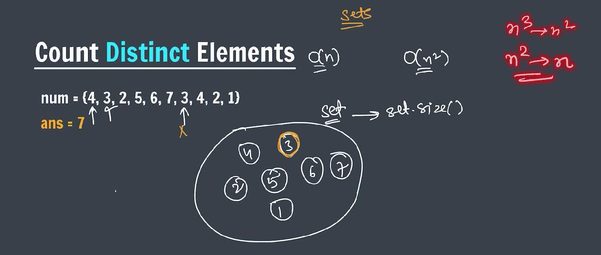

---

```java

import java.util.HashMap;
import java.util.HashSet;

public class CountDistinctElement {
    public static void main(String[] args) {

        int nums[] = { 4, 3, 2, 5, 6, 7, 3, 4, 2, 1 };

        HashSet<Integer> arr = new HashSet<>();

        for (int i = 0; i < nums.length; i++) {

            arr.add(nums[i]);
        }

        System.out.println(arr.size());

        // using HashMap
        HashMap<Integer, Integer> map = new HashMap<>();
        for (int i = 0; i < nums.length; i++) {
            if (map.containsKey(nums[i])) {
                map.put(nums[i], map.getOrDefault(nums[i], 0) + 1);
            }
            map.put(nums[i], 0);
        }

        System.out.println(map.size());

    }
}
```

---

### Find Union and Intersection of two array

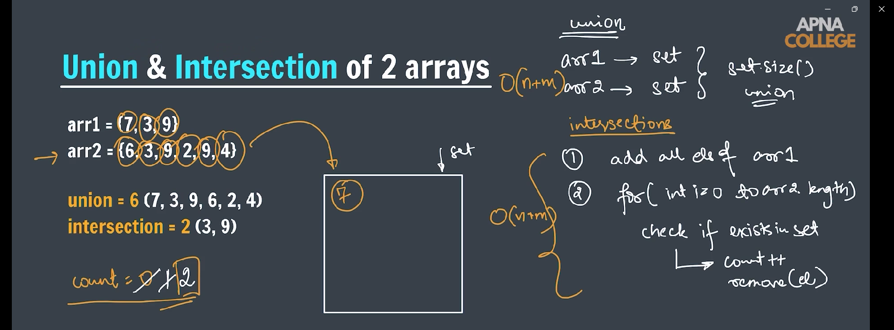

---

```java

import java.util.HashSet;

public class UnionAndIntersection {

    public static void unionOfArray(int arr1[], int arr2[]) {
        HashSet<Integer> union = new HashSet<>();

        for (int i = 0; i < arr1.length; i++) {
            union.add(arr1[i]);
        }
        for (int i = 0; i < arr2.length; i++) {
            union.add(arr2[i]);
        }

        System.out.println("Union of arr1 and arr2.");
        System.out.println(union);
        System.out.println(union.size());
    }

    public static void intersection(int arr1[], int arr2[]) {
        HashSet<Integer> set = new HashSet<>();
        for (int i = 0; i < arr1.length; i++) {
            set.add(arr1[i]);
        }

        HashSet<Integer> ans = new HashSet<>();
        for (int i = 0; i < arr2.length; i++) {
            if (set.contains(arr2[i])) {
                ans.add(arr2[i]);
            } else {
                continue;
            }
        }

        System.out.println("Intersection of arr1 and arr2.");
        System.out.println(ans);
    }

    public static void main(String[] args) {
        int arr1[] = { 7, 3, 9 };
        int arr2[] = { 6, 3, 9, 2, 9, 4 };

        // Union of two array
        unionOfArray(arr1, arr2);

        // intersection of two array
        intersection(arr1, arr2);
    }
}
```

---

### Find Itinerary for tickets

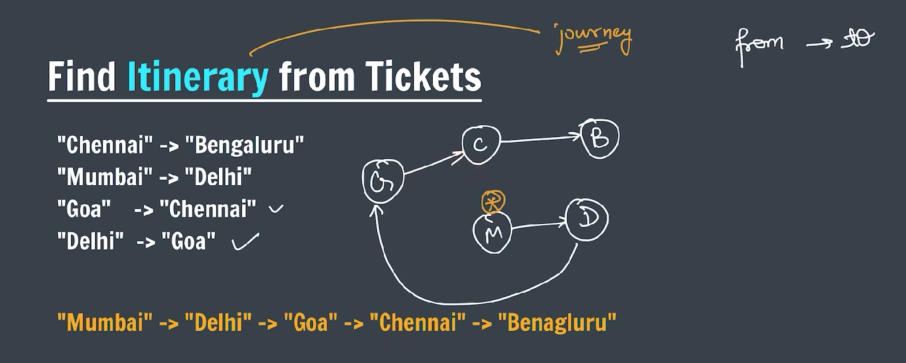

---

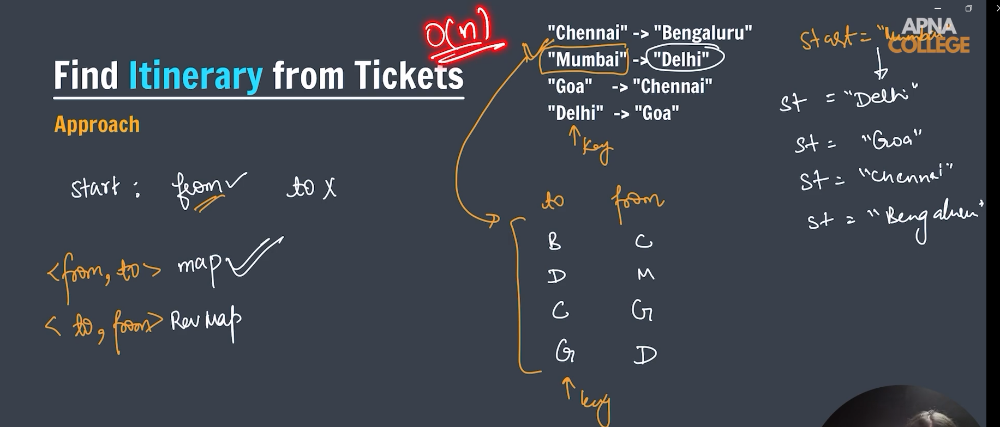

---

```java

import java.util.HashMap;

public class Itinerary {

    public static String getStartPoint(HashMap<String, String> tickets) {
        HashMap<String, String> revMap = new HashMap<>();

        for (String key : tickets.keySet()) {
            revMap.put(tickets.get(key), key);
        }

        for (String key : tickets.keySet()) {
            if (!revMap.containsKey(key)) {
                return key;
            }
        }

        return null;
    }

    public static void main(String[] args) {
        HashMap<String, String> tickets = new HashMap<>();

        tickets.put("Chennai", "Banglore");
        tickets.put("Mumbai", "Delhi");
        tickets.put("Goa", "Chennai");
        tickets.put("Delhi", "Goa");

        String start = getStartPoint(tickets);

        System.out.print(start);
        for (@SuppressWarnings("unused")
        String key : tickets.keySet()) {
            System.out.print(" -> " + tickets.get(start));
            start = tickets.get(start);
        }
    }
}
```

---

### Largest subarray with sum 0 (use HashMap)

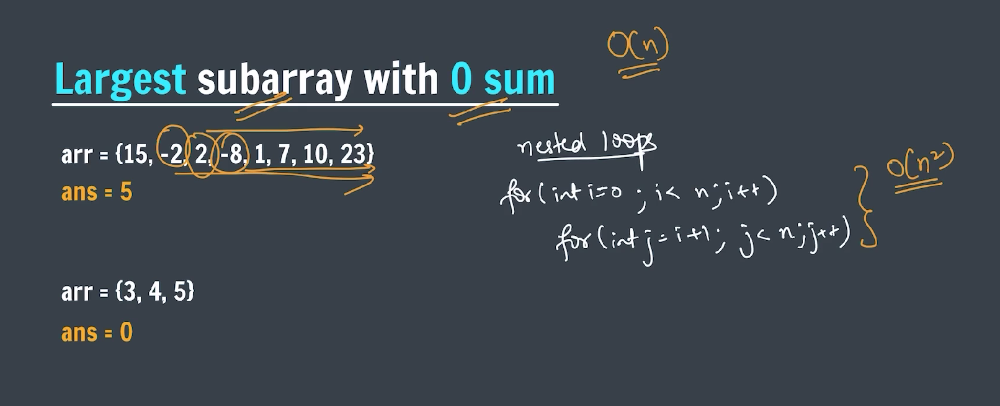

---

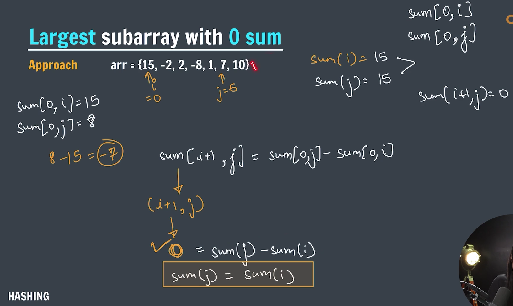

---

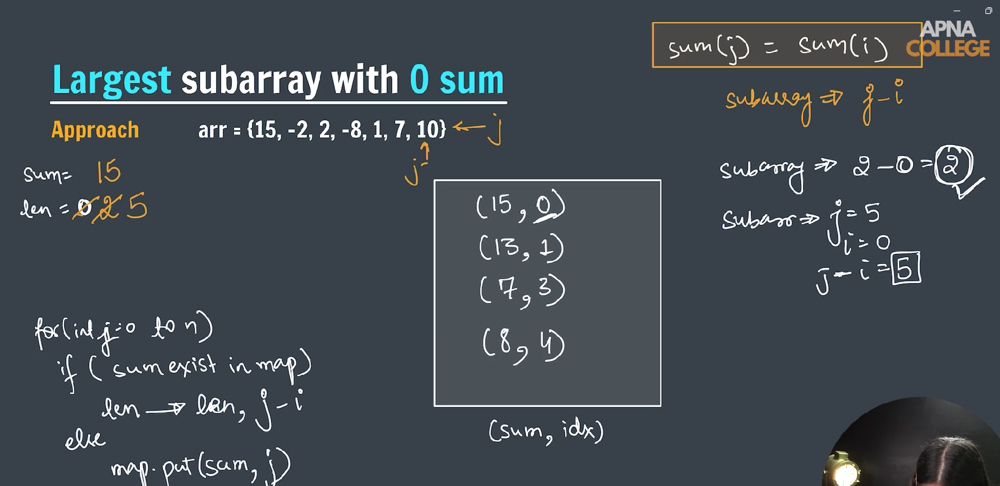

---

```java

import java.util.HashMap;

public class LargestSubarrayWithSumZero {

    public static int bruteForceLargestSum(int arr[]) {

        int count = 0;
        for (int i = 0; i < arr.length; i++) {
            int c = 0;
            int sum = arr[i];
            for (int j = i + 1; j < arr.length; j++) {

                sum += arr[j];
                // c++;
                if (sum == 0) {
                    c = j - i + 1;
                }
            }
            count = Math.max(count, c);

        }

        return count;
    }

    public static int largestSubarray(int arr[]) {
        HashMap<Integer, Integer> map = new HashMap<>();

        int sum = 0;
        int maxLength = 0;

        for (int i = 0; i < arr.length; i++) {
            sum += arr[i];

            if (sum == 0) {
                maxLength = i + 1;
            }

            if (map.containsKey(sum)) {
                maxLength = Math.max(maxLength, i - map.get(sum));
            } else {
                map.put(sum, i);
            }
        }

        return maxLength;
    }

    public static void main(String args[]) {

        int arr[] = { 15, -2, 2, -8, 1, 7, 10, 23 };

        // System.out.println(bruteForceLargestSum(arr));

        System.out.println(largestSubarray(arr));
    }
}
```

---

### Find Sum equals to k

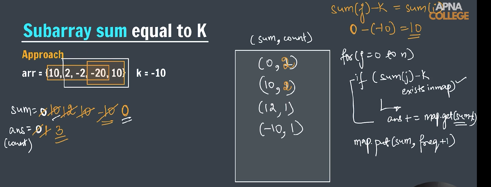

---

```java
package Hashing.HashSet;

import java.util.HashMap;

public class SumEqualsToK {
    public static int countEqualsK(int arr[], int k) { // O(n)

        HashMap<Integer, Integer> map = new HashMap<>();

        map.put(0, 1);

        int sum = 0;
        int count = 0;

        for (int j = 0; j < arr.length; j++) {
            sum += arr[j];

            if (map.containsKey(sum - k)) {
                count += map.get(sum - k);
            }

            map.put(sum, map.getOrDefault(sum, 0) + 1);
        }

        return count;
    }

    public static void main(String[] args) {
        // int arr[] = { 1, 2, 3 };
        int arr[] = { 10, 2, -2, -20, 10 };
        int k = 10;

        System.out.println(countEqualsK(arr, k));
    }
}
```

---
