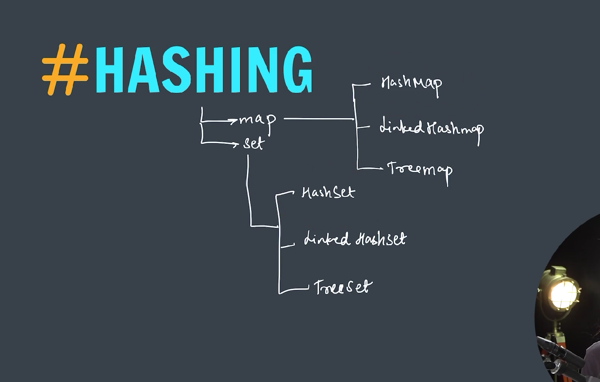

### Hashing

**Hashing** in data structures is a technique used to map data of arbitrary size to fixed-size values, typically for quick data retrieval. In **Java**, hashing is most commonly used in **hash-based collections**, such as:

- `HashMap`
- `HashSet`
- `Hashtable`
- `LinkedHashMap`



---

### 🔑 What is Hashing?

Hashing involves using a **hash function** to compute an index (hash code) into an array of buckets or slots, from which the desired value can be found.

#### Hash Function:

A hash function takes an input (or key) and returns an integer (hash code), which is used to determine where to store the object in a hash table.

---

### ⚙️ Java Hashing Example with `HashMap`

```java
import java.util.HashMap;

public class HashingExample {
    public static void main(String[] args) {
        HashMap<String, Integer> map = new HashMap<>();

        // Adding key-value pairs
        map.put("apple", 10);
        map.put("banana", 20);
        map.put("orange", 30);

        // Accessing values
        System.out.println("Value for key 'banana': " + map.get("banana"));

        // Checking for a key
        if (map.containsKey("apple")) {
            System.out.println("Map contains key 'apple'");
        }

        // Iterating over keys and values
        for (String key : map.keySet()) {
            System.out.println(key + " => " + map.get(key));
        }
    }
}
```

---

### 📌 How Hashing Works Internally in Java (e.g., HashMap)

1. The key's `hashCode()` is called to get the hash.
2. The hash is mapped to an index in an internal array (buckets).
3. If a collision occurs (same index), Java uses a **LinkedList** or **Balanced Tree** (Java 8+) at that bucket to store multiple entries.

---

### 🔐 Important Concepts:

| Concept      | Description                                                                                              |
| ------------ | -------------------------------------------------------------------------------------------------------- |
| `hashCode()` | Method used to get an integer representation of the object. Must be consistent with `equals()` for keys. |
| `equals()`   | Determines if two keys are logically equal.                                                              |
| Collision    | When two keys hash to the same index. Resolved using chaining (LinkedList) or open addressing.           |
| Load Factor  | Determines when to resize the hash table (default is 0.75).                                              |
| Rehashing    | When the capacity exceeds the load factor, the hash table is resized and all entries are rehashed.       |

---

### ✅ Best Practices:

- Always override both `hashCode()` and `equals()` when using custom objects as keys.
- Use immutable objects as keys to prevent unexpected behavior.
- Be mindful of hash collisions, though Java handles them internally.
