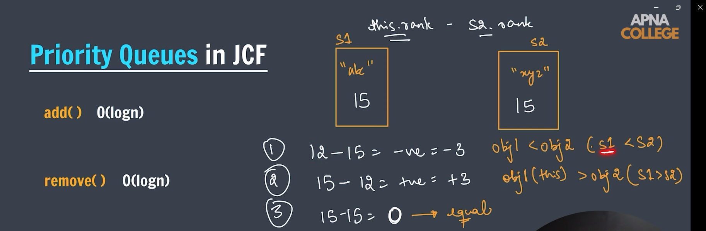
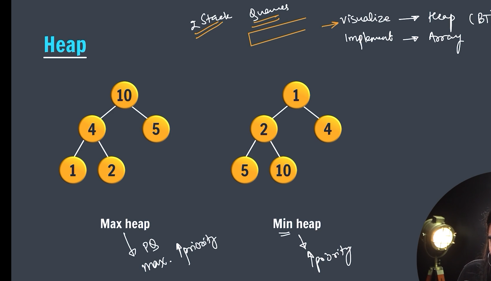
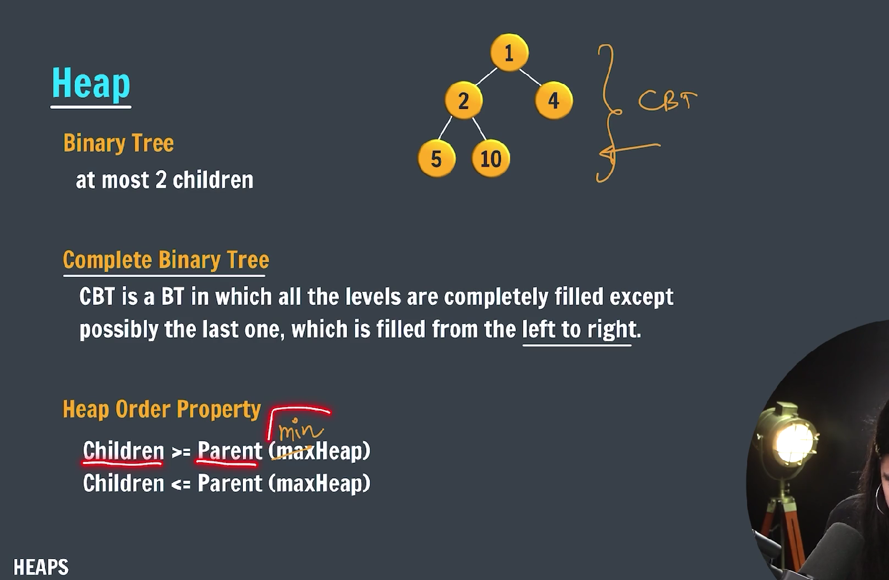
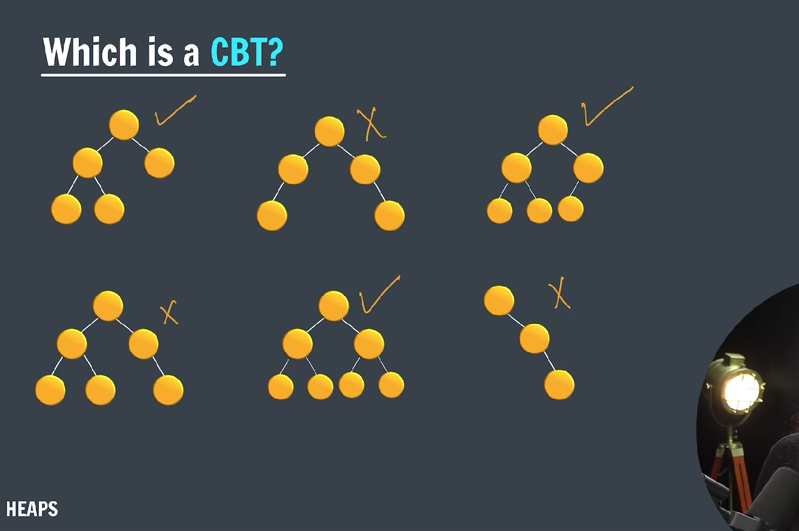
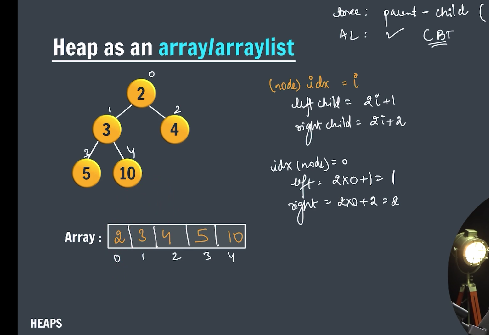
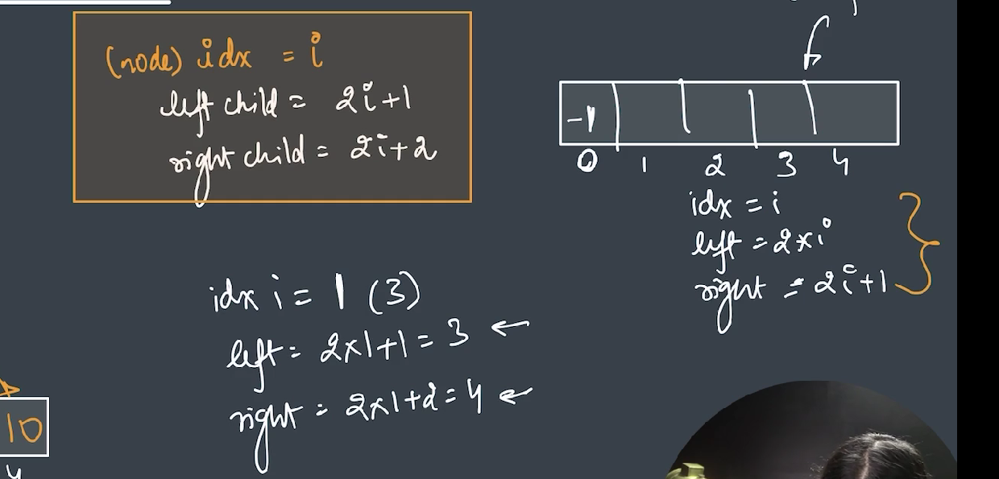
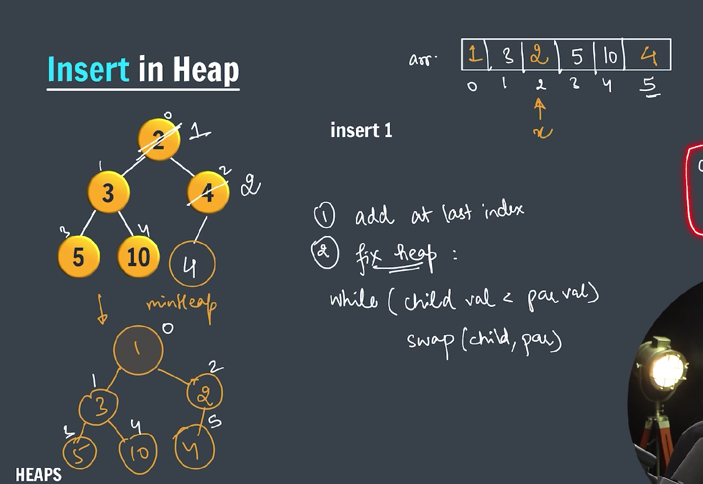
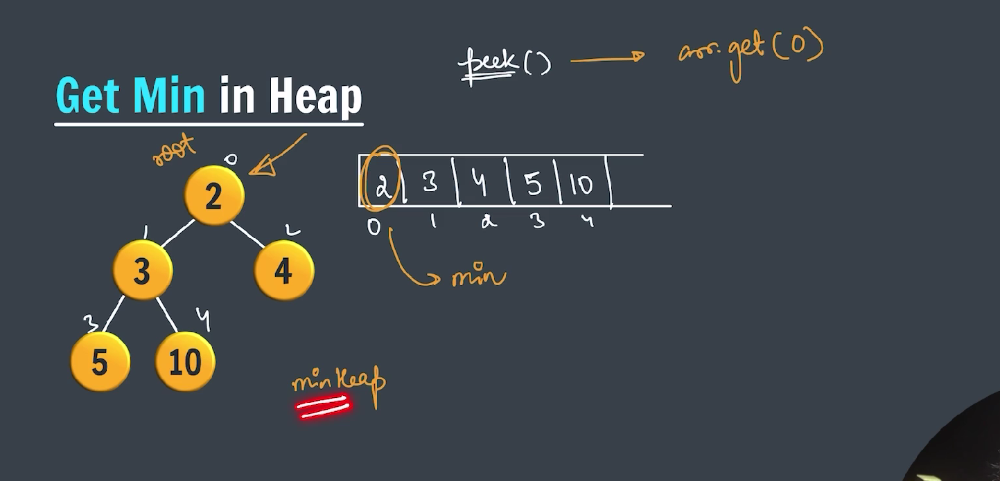
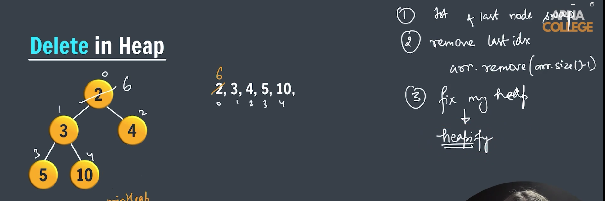
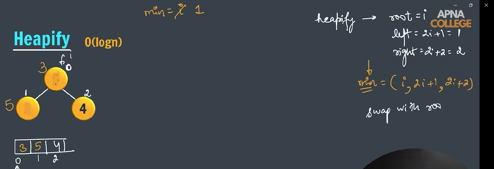

### PriorityQueue in java

In Java, `PriorityQueue` is a part of the **Java Collections Framework** and is found in the `java.util` package. It is a **queue** data structure where elements are ordered according to their **natural ordering** or by a **custom comparator** provided at the time of queue construction.

### ✅ Key Features:

- **Implements**: `Queue<E>`, `Collection<E>`
- **Underlying structure**: Binary heap (usually a min-heap)
- **Not thread-safe**
- **Allows duplicates**
- **Null elements are not permitted**

---

## 🔧 Basic Syntax

```java
import java.util.PriorityQueue;

PriorityQueue<Integer> pq = new PriorityQueue<>();
```

---

## 📌 Example: Natural Ordering (Min-Heap)

```java
import java.util.PriorityQueue;

public class PriorityqueueInJCF {
    public static void main(String[] args) {
        PriorityQueue<Integer> pq = new PriorityQueue<>();

        pq.add(3);
        pq.add(4);
        pq.add(2);
        pq.add(7);

        while (!pq.isEmpty()) {
            System.out.println(pq.peek());
            pq.poll();

        }
    }
}
```

---

## 📘 Common Methods

| Method             | Description                                    |
| ------------------ | ---------------------------------------------- |
| `add(E e)`         | Inserts element, throws exception if fails     |
| `offer(E e)`       | Inserts element, returns false if fails        |
| `peek()`           | Retrieves, but does not remove, head           |
| `poll()`           | Retrieves and removes head                     |
| `remove(Object o)` | Removes a single instance of specified element |
| `size()`           | Returns the number of elements                 |
| `isEmpty()`        | Checks if the queue is empty                   |

---

## PriorityQueue (PQ) for objects



---

```java

import java.util.Comparator;
import java.util.PriorityQueue;

public class PriorityQueueObjects {
    static class Student implements Comparable<Student> { // overriding
        String name;
        int rank;

        public Student(String name, int rank) {
            this.name = name;
            this.rank = rank;
        }

        @Override
        public int compareTo(Student s2) {
            return this.rank - s2.rank;
        }
    }

    public static void main(String[] args) {
        PriorityQueue<Student> pq = new PriorityQueue<>(Comparator.reverseOrder());

        pq.add(new Student("A", 4));
        pq.add(new Student("B", 5));
        pq.add(new Student("C", 2));
        pq.add(new Student("D", 12));

        while (!pq.isEmpty()) {
            System.out.println(pq.peek().name + " -> " + pq.peek().rank);
            pq.remove();
        }

    }
}
```

---

## Heap

---

### What is a Heap?

A **Heap** is a specialized tree-based data structure that satisfies the **heap property**:

---



---

- **Max-Heap:** In a max-heap, for any given node **C**, if **P** is a parent node of **C**, then the key (value) of **P** is **greater than or equal to** the key of **C**.
- **Min-Heap:** In a min-heap, for any given node **C**, if **P** is a parent node of **C**, then the key of **P** is **less than or equal to** the key of **C**.

This property makes heaps useful for implementing priority queues, where you want quick access to the highest or lowest priority element.

---



### Key Characteristics

---



---

- Heaps are **complete binary trees**: all levels are fully filled except possibly the last, which is filled from left to right.
- The root of the max-heap is the **maximum element**; the root of the min-heap is the **minimum element**.
- Commonly implemented using arrays (list) to take advantage of the complete binary tree property.

---

### Operations on Heap

1. **Insertion**

   - Insert the element at the bottom (end of the array).
   - "Heapify up" (also called sift-up or bubble-up) to restore heap property.

2. **Deletion (usually of root)**

   - Remove the root (max or min element).
   - Replace root with the last element.
   - "Heapify down" (sift-down) to restore heap property.

3. **Peek**

   - Get the root element (max or min) without removing it.

4. **Heapify**

   - Convert an arbitrary array into a heap in O(n) time.

---

### Example of a Max-Heap

```
        100
       /    \
     50      30
    /  \    /
  20   40  10
```

- The parent is always greater than or equal to its children.

---

### Uses of Heaps

- **Priority Queues**
- **Heap Sort**
- **Finding K largest or smallest elements**
- Efficient algorithms like **Dijkstra’s shortest path**

---

### Heap as an Array (ArrayList)

Since a heap is a **complete binary tree**, it can be efficiently stored as a simple array (or ArrayList). We don’t need pointers like in linked trees because the position of nodes can be calculated mathematically using indices.

---



---

### Index Relationships in the Array

---



---

Assuming **0-based indexing** (the root is at index 0):

- For a node at **index i**:
  - **Left child index** = `2 * i + 1`
  - **Right child index** = `2 * i + 2`
  - **Parent index** = `(i - 1) // 2` (integer division)

---

### Visual Example

Consider this heap:

```
        100
       /    \
     50      30
    /  \    /
  20   40  10
```

Array representation (0-based):

| Index | Value |
| ----- | ----- | -------------------- |
| 0     | 100   | ← root               |
| 1     | 50    | ← left child of 100  |
| 2     | 30    | ← right child of 100 |
| 3     | 20    | ← left child of 50   |
| 4     | 40    | ← right child of 50  |
| 5     | 10    | ← left child of 30   |

---

### Example calculations:

- Node at index 1 (value 50):

  - Parent index: `(1 - 1) // 2 = 0` → parent value 100
  - Left child index: `2 * 1 + 1 = 3` → child value 20
  - Right child index: `2 * 1 + 2 = 4` → child value 40

- Node at index 2 (value 30):
  - Parent index: `(2 - 1) // 2 = 0` → parent value 100
  - Left child index: `2 * 2 + 1 = 5` → child value 10
  - Right child index: `2 * 2 + 2 = 6` → no child (index out of range)

---

### Why is this helpful?

- No extra space needed for pointers.
- Easy to traverse parents and children using simple arithmetic.
- Efficient in memory and speed for heap operations.

---

### Min-Heap using an ArrayList (Dynamic Array)

- The heap elements are stored in a list.
- The root is at index `0`.
- Parent and child indices are calculated as before:
  - **Parent:** `(i - 1) // 2`
  - **Left child:** `2 * i + 1`
  - **Right child:** `2 * i + 2`

---

### Example — Min-Heap as ArrayList:

Say you have this min-heap tree:

```
        10
      /    \
    20      15
   /  \    /
  40  50  60
```

Stored as ArrayList:

```
[10, 20, 15, 40, 50, 60]
```

- Index 0 → 10 (root)
- Index 1 → 20 (left child of 10)
- Index 2 → 15 (right child of 10)
- Index 3 → 40 (left child of 20)
- Index 4 → 50 (right child of 20)
- Index 5 → 60 (left child of 15)

---

### Insert in ArrayList Representation

Let’s say we want to insert `12`:

- Append `12` at the end:

```
[10, 20, 15, 40, 50, 60, 12]
```

- Index of `12` is 6
- Parent index = `(6 - 1) // 2 = 2`
- Compare `12` with `15`: since `12 < 15`, swap:

```
[10, 20, 12, 40, 50, 60, 15]
```

- New index of inserted element is 2
- Parent index = `(2 - 1) // 2 = 0`
- Compare `12` with `10`: `12 > 10` so stop.

---

### Java Code for Insertion in Min-Heap



---

```java
static class Heap {
    ArrayList<Integer> heap = new ArrayList<>();

    public void add(int data) {

        // insert data at the last index
        heap.add(data);

        int x = heap.size() - 1; // x is child index
        int par = (x - 1) / 2;

        while (heap.get(x) < heap.get(par)) {

            // swaping
            int temp = heap.get(x);
            heap.set(x, heap.get(par));
            heap.set(par, temp);

            x = par;
            par = (x-1)/2;
        }

    }

    public int peek() {
        return heap.get(0);
    }
}
```

---

### Java Code for Peek in Min-Heap



---

```java
public int peek() {
    return heap.get(0);
}
```

---

### Java Code for delete in Min-Heap



---



---

```java
private void heapify(int idx) {
    int left = 2 * idx + 1;
    int right = 2 * idx + 2;
    int minIdx = idx;

    if (left < heap.size() && heap.get(minIdx) > heap.get(left)) {
        minIdx = left;
    }
    if (right < heap.size() && heap.get(minIdx) > heap.get(right)) {
        minIdx = right;
    }

    if (minIdx != idx) {
        int temp = heap.get(minIdx);
        heap.set(idx, heap.get(minIdx));
        heap.set(minIdx, temp);

        heapify(minIdx);
    }

}

public int remove() {
    int data = heap.get(0);

    // swap first and last
    int temp = heap.get(0);
    heap.set(0, heap.get(heap.size() - 1));
    heap.set(heap.size() - 1, temp);

    // remove last
    heap.remove(heap.size() - 1);

    // heapify
    heapify(0);

    return data;
}

```

---

### Full Code for Min-Heap

```java

import java.util.ArrayList;

public class InsertDataIntoHeap {
    static class Heap {
        ArrayList<Integer> heap = new ArrayList<>();

        public void add(int data) {

            // insert data at the last index
            heap.add(data);

            int x = heap.size() - 1; // x is child index
            int par = (x - 1) / 2;

            while (heap.get(x) < heap.get(par)) {

                // swaping
                int temp = heap.get(x);
                heap.set(x, heap.get(par));
                heap.set(par, temp);

                x = par;
                par = (x - 1) / 2;
            }

        }

        public int peek() {
            return heap.get(0);
        }

        private void heapify(int idx) {
            int left = 2 * idx + 1;
            int right = 2 * idx + 2;
            int minIdx = idx;

            if (left < heap.size() && heap.get(minIdx) > heap.get(left)) {
                minIdx = left;
            }
            if (right < heap.size() && heap.get(minIdx) > heap.get(right)) {
                minIdx = right;
            }

            if (minIdx != idx) {
                int temp = heap.get(minIdx);
                heap.set(idx, heap.get(minIdx));
                heap.set(minIdx, temp);

                heapify(minIdx);
            }

        }

        public int remove() {
            int data = heap.get(0);

            // swap first and last
            int temp = heap.get(0);
            heap.set(0, heap.get(heap.size() - 1));
            heap.set(heap.size() - 1, temp);

            // remove last
            heap.remove(heap.size() - 1);

            // heapify
            heapify(0);

            return data;
        }

        public boolean isEmpty() {
            return heap.size() == 0;
        }
    }

    public static void main(String[] args) {

        // similar to PriorityQueue in fact PriorityQueue internally implements this heap structure

        Heap heap = new Heap();
        heap.add(3);
        heap.add(4);
        heap.add(1);
        heap.add(5);

        while (!heap.isEmpty()) {
            System.out.println(heap.peek());
            heap.remove();
        }

    }
}

```

---

### Max-Heap Using ArrayList

- The heap is stored as a list (like Python’s list or Java’s ArrayList).
- Root is at index 0.
- Parent/Child indices:

  - **Parent:** `(i - 1) // 2`
  - **Left child:** `2 * i + 1`
  - **Right child:** `2 * i + 2`

---

### Insert in Max-Heap (ArrayList)

**Steps:**

1. Append the new value to the end of the list.
2. Bubble it **up** (heapify up) by swapping it with its parent if it’s **greater** than the parent.
3. Repeat until heap property restored or it becomes the root.

---

### Example

Initial max-heap:

```
[100, 50, 30, 20, 40, 10]
```

Insert `60`:

- Add `60` at the end:

```
[100, 50, 30, 20, 40, 10, 60]
```

- Index 6, parent index `(6-1)//2=2`
- Compare `60` and `30` → `60 > 30` → swap

```
[100, 50, 60, 20, 40, 10, 30]
```

- New index 2, parent index `(2-1)//2=0`
- Compare `60` and `100` → `60 < 100` → stop.

---

### Java code for Max-Heap

```java

import java.util.ArrayList;

public class InsertDataIntoMaxHeap {
    static class Heap {

        ArrayList<Integer> maxHeap = new ArrayList<>();

        public void add(int data) {

            maxHeap.add(data);

            int x = maxHeap.size() - 1; // child index
            int par = (x - 1) / 2; // parent index

            while (maxHeap.get(x) > maxHeap.get(par)) {
                // swap values
                int temp = maxHeap.get(x);
                maxHeap.set(x, maxHeap.get(par));
                maxHeap.set(par, temp);

                x = par;
                par = (x - 1) / 2;
            }
        }

        public int peek() {
            return maxHeap.get(0);
        }

        private void heapify(int idx) {
            int left = idx * 2 + 1;
            int right = idx * 2 + 2;
            int minIdx = idx;

            if (left < maxHeap.size() && maxHeap.get(left) > maxHeap.get(minIdx)) {
                minIdx = left;
            }

            if (right < maxHeap.size() && maxHeap.get(right) > maxHeap.get(minIdx)) {
                minIdx = right;
            }

            if (minIdx != idx) {
                int temp = maxHeap.get(minIdx);
                maxHeap.set(idx, maxHeap.get(minIdx));
                maxHeap.set(minIdx, temp);

                heapify(minIdx);
            }

        }

        public int remove() {

            int data = maxHeap.get(0);

            // swap with last index
            int temp = maxHeap.get(0);
            maxHeap.set(0, maxHeap.get(maxHeap.size() - 1));
            maxHeap.set(maxHeap.size() - 1, temp);

            // heapify

            heapify(0);

            return data;

        }

        public boolean isEmpty() {
            return maxHeap.size() == 0;
        }
    }

    public static void main(String[] args) {
        Heap heap = new Heap();

        heap.add(3);
        heap.add(4);
        heap.add(1);
        heap.add(5);

        while (!heap.isEmpty()) {
            System.out.println(heap.peek());
            heap.remove();
        }
    }
}
```

---
