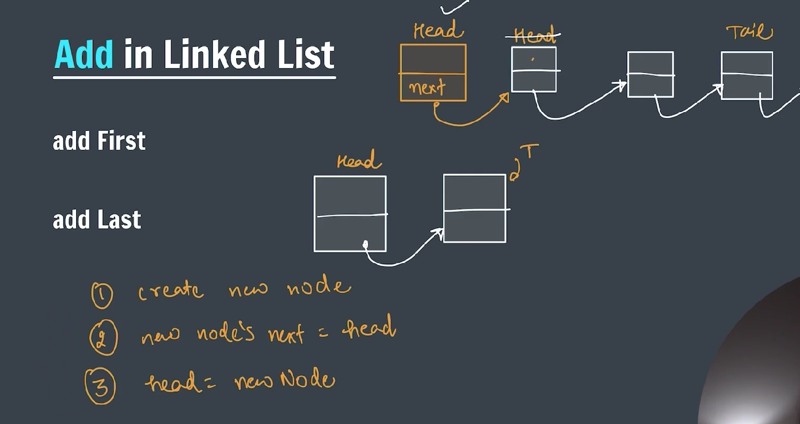
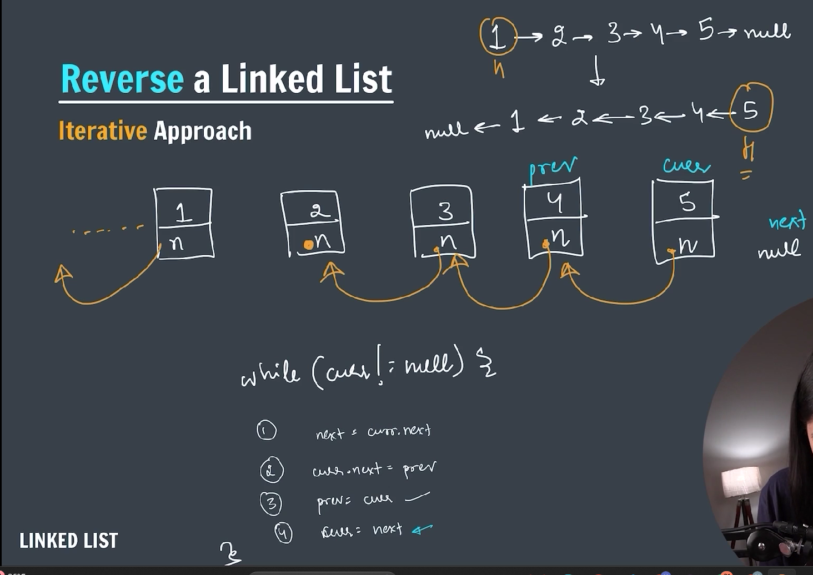

### LinkedList

---


---

A **LinkedList** in Java is a linear data structure from the **Java Collections Framework** that stores elements in a **sequence of nodes**, where each node contains:

1. The **data** (the element),
2. A **reference (pointer)** to the next node (and in a **doubly-linked list**, also the previous node).

It allows **efficient insertion and removal** of elements from both ends and in the middle, but **slower random access** compared to arrays.

---

### 🔹 Java `LinkedList` Class

Java provides a built-in `LinkedList` class in the `java.util` package. It implements:

- **List** (so it's ordered and indexable),
- **Deque** (so it can be used as a queue or stack),
- **Queue** and **Deque** interfaces.

---

### 📦 Importing

```java
import java.util.LinkedList;
```

---

### ✅ Example Usage:

```java
import java.util.LinkedList;

public class Main {
    public static void main(String[] args) {
        LinkedList<String> list = new LinkedList<>();

        list.add("A");
        list.add("B");
        list.addFirst("Start");
        list.addLast("End");

        System.out.println(list);  // Output: [Start, A, B, End]

        list.remove("B");
        list.removeFirst();

        System.out.println(list);  // Output: [A, End]
    }
}
```

---

### ⚙️ Key Operations

| Method               | Description                        |
| -------------------- | ---------------------------------- |
| `add(E element)`     | Adds to the end                    |
| `addFirst(E e)`      | Adds to the beginning              |
| `addLast(E e)`       | Adds to the end                    |
| `remove()`           | Removes first element              |
| `removeFirst()`      | Removes first element              |
| `removeLast()`       | Removes last element               |
| `get(int index)`     | Returns the element at given index |
| `contains(Object o)` | Checks if element exists           |
| `size()`             | Returns size of list               |

---

### 🔁 Internal Structure (for Doubly Linked List):

```
null <- [Start] <-> [A] <-> [End] -> null
```

Each node stores references to:

- The **previous** node
- The **next** node

---

### 🔍 When to Use `LinkedList` vs `ArrayList`:

| Feature              | `LinkedList`            | `ArrayList`           |
| -------------------- | ----------------------- | --------------------- |
| Access (get/set)     | Slow (O(n))             | Fast (O(1))           |
| Insert/Delete front  | Fast (O(1))             | Slow (O(n))           |
| Insert/Delete middle | Moderate (O(n))         | Slow (O(n))           |
| Insert/Delete end    | Fast (O(1))             | Fast (O(1) amortized) |
| Memory overhead      | Higher (extra pointers) | Lower                 |

---

### 🔁 Add to the Linkedlist:



---

### 🔁 Add First to the Linkedlist:

```java
public void addFirst(int data) { // constant time O(1)
        // Step 1 -> Create new node
    Node newNode = new Node(data);

        // if head is null
    if (head == null) {
        head = tail = newNode;
        return;
    }

        // step 2 -> assign head to newNode
    newNode.next = head;

        // step 3 -> update head
    head = newNode;

}
```

---

### 🔁 Add last to the Linkedlist:

```java
public void addLast(int data) {
    Node newNode = new Node(data);

    if (head == null) {
        head = tail = newNode;
        return;
    }

    Node temp = head;
    while (temp.next != null) {
        temp = temp.next;
    }
    temp.next = newNode;
    newNode.next = null;

    // tail.next = newNode;
    // tail = newNode;
}
```

---

### 🔁 Print the Linkedlist:

```java
public void printList() {

    if (head == null) {
        System.out.println("Linkedlist is empty.");
    }

    Node temp = head;

    while (temp != null) {
        System.out.print(temp.data + "->");
        temp = temp.next;
    }
    System.out.println("null");
}
```

---

### 🔁 Add middle to the Linkedlist:

```java
public void addMiddle(int data, int idx) {
    Node newNode = new Node(data);
    if (head == null) {
        head = tail = newNode;
        return;
    }

    Node temp = head;

    int i = 0;
    while (i < idx - 1) {
        temp = temp.next;
        i++;
    }

    newNode.next = temp.next;
    temp.next = newNode;
}
```

---

### 🔁 Add middle to the Linkedlist:

```java
public void getSize() {
        int size = 0;
        if (head == null) {
            System.out.println("Size is: 0");
            return;
        }

        Node temp = head;
        while (temp != null) {
            size++;
            temp = temp.next;
        }

        System.out.println("Size is: " + size);
}
```

---

### 🔁 Remove operation on Linkedlist:

---

### 🔁 Remove first operation on Linkedlist:

```java
public int removeFirst() {

        if (head == null) {
            System.out.println("Linkedlist is empty.");
            return Integer.MIN_VALUE;
        } else if (head.next == null) {
            int val = head.data;
            head = tail = null;
            return val;
        }
        int val = head.data;
        head = head.next;
        return val;
}
```

---

### 🔁 Search key iteratively on Linkedlist:

```java
// search key iteratively
public int iterativeSearch(int key) {

    if (head == null) {
        return -1;
    }
    int idx = 0;
    Node temp = head;
    while (temp != null) {
        if (temp.data == key) {
            return idx;
        }
        idx++;
        temp = temp.next;
    }

    return -1;
}

```

---

### 🔁 Remove last element in Linkedlist:

```java
// remove last element from a linkedlist
public int removeLast() {

        if (head == null) {
            System.out.println("Element can not be removed.");
            return Integer.MIN_VALUE;
        }

        else if (head.next == null) {
            int val = head.data;
            head = tail = null;
            return val;
        }

        Node temp = head;
        while (temp.next.next != null) {
            temp = temp.next;
        }

        int val = temp.next.data;
        temp.next = null;

        return val;

}
```

---

### 🔁 Search element recursively in Linkedlist:

```java
// search key recursively

public int helper(Node head, int key) {
    if (head == null) {
        return -1;
    }
    if (head.data == key) {
        return 0;
    }

    int idx = helper(head.next, key);
    if (idx == -1) {
        return -1;
    }

    return idx + 1;
}

public int recSearch(int key) {
    return helper(head, key);
}
```

---

### 🔁 Reverse a Linkedlist:



---

```java
// reverse a linkedlist
public void reverseList() {

    Node prev = null;
    Node curr = tail = head;
    Node next;

    while (curr != null) {
        next = curr.next;
        curr.next = prev;
        prev = curr;
        curr = next;
    }

    head = prev;

}
```

---
