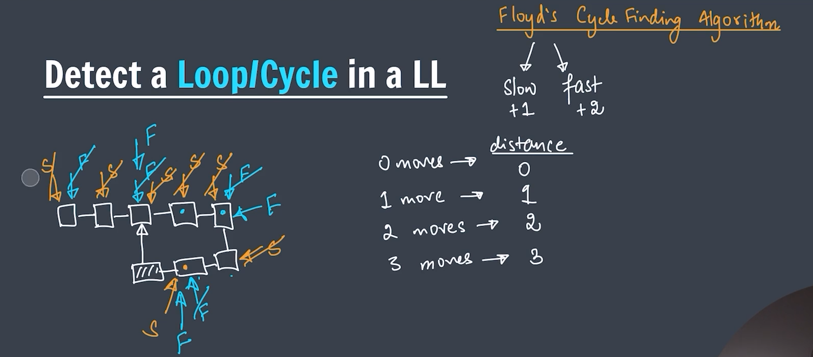
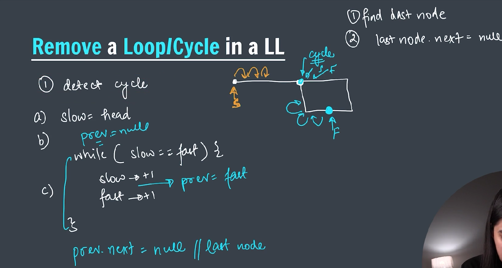
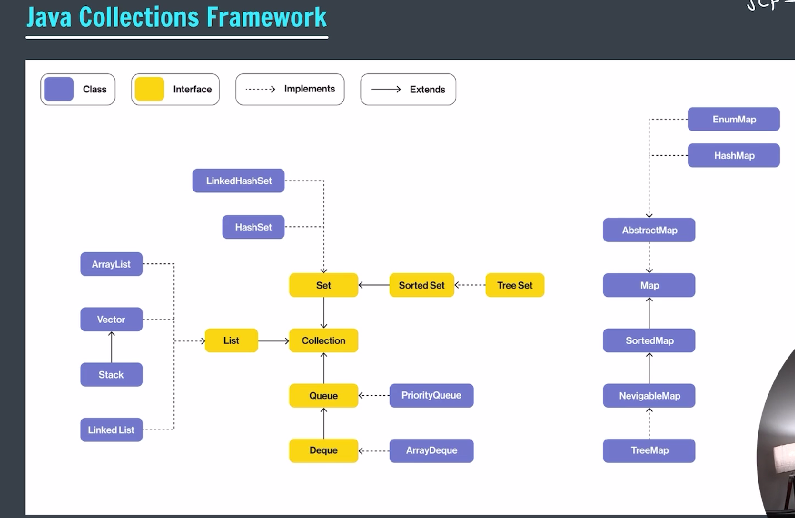

### LinkedList

---


---

A **LinkedList** in Java is a linear data structure from the **Java Collections Framework** that stores elements in a **sequence of nodes**, where each node contains:

1. The **data** (the element),
2. A **reference (pointer)** to the next node (and in a **doubly-linked list**, also the previous node).

It allows **efficient insertion and removal** of elements from both ends and in the middle, but **slower random access** compared to arrays.

---

### 🔹 Java `LinkedList` Class

Java provides a built-in `LinkedList` class in the `java.util` package. It implements:

- **List** (so it's ordered and indexable),
- **Deque** (so it can be used as a queue or stack),
- **Queue** and **Deque** interfaces.

---

### 📦 Importing

```java
import java.util.LinkedList;
```

---

### ✅ Example Usage:

```java
import java.util.LinkedList;

public class Main {
    public static void main(String[] args) {
        LinkedList<String> list = new LinkedList<>();

        list.add("A");
        list.add("B");
        list.addFirst("Start");
        list.addLast("End");

        System.out.println(list);  // Output: [Start, A, B, End]

        list.remove("B");
        list.removeFirst();

        System.out.println(list);  // Output: [A, End]
    }
}
```

---

### ⚙️ Key Operations

| Method               | Description                        |
| -------------------- | ---------------------------------- |
| `add(E element)`     | Adds to the end                    |
| `addFirst(E e)`      | Adds to the beginning              |
| `addLast(E e)`       | Adds to the end                    |
| `remove()`           | Removes first element              |
| `removeFirst()`      | Removes first element              |
| `removeLast()`       | Removes last element               |
| `get(int index)`     | Returns the element at given index |
| `contains(Object o)` | Checks if element exists           |
| `size()`             | Returns size of list               |

---

### 🔁 Internal Structure (for Doubly Linked List):

```
null <- [Start] <-> [A] <-> [End] -> null
```

Each node stores references to:

- The **previous** node
- The **next** node

---

### 🔍 When to Use `LinkedList` vs `ArrayList`:

| Feature              | `LinkedList`            | `ArrayList`           |
| -------------------- | ----------------------- | --------------------- |
| Access (get/set)     | Slow (O(n))             | Fast (O(1))           |
| Insert/Delete front  | Fast (O(1))             | Slow (O(n))           |
| Insert/Delete middle | Moderate (O(n))         | Slow (O(n))           |
| Insert/Delete end    | Fast (O(1))             | Fast (O(1) amortized) |
| Memory overhead      | Higher (extra pointers) | Lower                 |

---

### 🔁 Add to the Linkedlist:


---

### 🔁 Add First to the Linkedlist:

```java
public void addFirst(int data) { // constant time O(1)
        // Step 1 -> Create new node
    Node newNode = new Node(data);

        // if head is null
    if (head == null) {
        head = tail = newNode;
        return;
    }

        // step 2 -> assign head to newNode
    newNode.next = head;

        // step 3 -> update head
    head = newNode;

}
```

---

### 🔁 Add last to the Linkedlist:

```java
public void addLast(int data) {
    Node newNode = new Node(data);

    if (head == null) {
        head = tail = newNode;
        return;
    }

    Node temp = head;
    while (temp.next != null) {
        temp = temp.next;
    }
    temp.next = newNode;
    newNode.next = null;

    // tail.next = newNode;
    // tail = newNode;
}
```

---

### 🔁 Print the Linkedlist:

```java
public void printList() {

    if (head == null) {
        System.out.println("Linkedlist is empty.");
    }

    Node temp = head;

    while (temp != null) {
        System.out.print(temp.data + "->");
        temp = temp.next;
    }
    System.out.println("null");
}
```

---

### 🔁 Add middle to the Linkedlist:

```java
public void addMiddle(int data, int idx) {
    Node newNode = new Node(data);
    if (head == null) {
        head = tail = newNode;
        return;
    }

    Node temp = head;

    int i = 0;
    while (i < idx - 1) {
        temp = temp.next;
        i++;
    }

    newNode.next = temp.next;
    temp.next = newNode;
}
```

---

### 🔁 Add middle to the Linkedlist:

```java
public void getSize() {
        int size = 0;
        if (head == null) {
            System.out.println("Size is: 0");
            return;
        }

        Node temp = head;
        while (temp != null) {
            size++;
            temp = temp.next;
        }

        System.out.println("Size is: " + size);
}
```

---

### 🔁 Remove operation on Linkedlist:

---

### 🔁 Remove first operation on Linkedlist:

```java
public int removeFirst() {

        if (head == null) {
            System.out.println("Linkedlist is empty.");
            return Integer.MIN_VALUE;
        } else if (head.next == null) {
            int val = head.data;
            head = tail = null;
            return val;
        }
        int val = head.data;
        head = head.next;
        return val;
}
```

---

### 🔁 Search key iteratively on Linkedlist:

```java
// search key iteratively
public int iterativeSearch(int key) {

    if (head == null) {
        return -1;
    }
    int idx = 0;
    Node temp = head;
    while (temp != null) {
        if (temp.data == key) {
            return idx;
        }
        idx++;
        temp = temp.next;
    }

    return -1;
}

```

---

### 🔁 Remove last element in Linkedlist:

```java
// remove last element from a linkedlist
public int removeLast() {

        if (head == null) {
            System.out.println("Element can not be removed.");
            return Integer.MIN_VALUE;
        }

        else if (head.next == null) {
            int val = head.data;
            head = tail = null;
            return val;
        }

        Node temp = head;
        while (temp.next.next != null) {
            temp = temp.next;
        }

        int val = temp.next.data;
        temp.next = null;

        return val;

}
```

---

### 🔁 Search element recursively in Linkedlist:

```java
// search key recursively

public int helper(Node head, int key) {
    if (head == null) {
        return -1;
    }
    if (head.data == key) {
        return 0;
    }

    int idx = helper(head.next, key);
    if (idx == -1) {
        return -1;
    }

    return idx + 1;
}

public int recSearch(int key) {
    return helper(head, key);
}
```

---

### 🔁 Reverse a Linkedlist:


---

```java
// reverse a linkedlist
public void reverseList() {

    Node prev = null;
    Node curr = tail = head;
    Node next;

    while (curr != null) {
        next = curr.next;
        curr.next = prev;
        prev = curr;
        curr = next;
    }

    head = prev;

}
```

---

### 🔁 Remove Nth node from the last in Linkedlist:

```java
public void removeNthFromLast(int n) {
        int sz = 0;
        Node temp = head;
        while (temp != null) {
            sz++;
            temp = temp.next;
        }

        if (n == sz) {
            head = head.next;
            return;
        }

        // if not null
        int i = 1;
        int ifromstart = sz - n;
        Node prev = head;
        while (i < ifromstart) {
            prev = prev.next;
            i++;
        }

        prev.next = prev.next.next;
        return;
}
```

---

### 🔁 Detecting a cycle in Linkedlist:



---

**_Floyd's Cycle Detection Algorithm || (Tortoise and Hare)_**

```java
// detecting a cycle in linkedlist
public boolean isCycle() {
        Node slow = head;
        Node fast = head;

        while (fast != null && fast.next != null) {
            slow = slow.next;
            fast = fast.next.next;

            if (slow == fast) {
                return true;
            }
        }

        return false;
}

```

---

### 🔁 Detecting a cycle in Linkedlist and removing it:



---

```java
// remove cycle in linkedlist
public void removeCycle() {

        // find cycle

        Node slow = head;
        Node fast = head;

        boolean cycle = true;

        while (fast != null && fast.next != null) {
            slow = slow.next;
            fast = fast.next.next;

            if (slow == fast) {
                cycle = true;
                break;
            }
        }

        if (cycle == false) {
            return;
        }

        // find point to remove

        slow = head;
        Node prev = null;

        while (slow != fast) {
            prev = fast;
            slow = slow.next;
            fast = fast.next;
        }

        // remove cycle

        prev.next = null;
}

```

---

The **Java Collection Framework (JCF)** is a unified architecture in Java for representing and manipulating **groups of objects**, known as **collections**. It provides **interfaces**, **implementations (classes)**, and **algorithms** to manage collections efficiently.

---

### ✅ **Key Components of Java Collection Framework**

#### 1. **Interfaces** (Abstract Data Types)

These define various types of collections:

- `Collection` – root interface
  - `List` – ordered collection (e.g., `ArrayList`, `LinkedList`)
  - `Set` – no duplicate elements (e.g., `HashSet`, `TreeSet`)
  - `Queue` – holds elements prior to processing (e.g., `PriorityQueue`)
  - `Map` – key-value pairs (not a true child of `Collection` but part of JCF)

#### 2. **Implementations** (Concrete Classes)

These are actual data structures:

- `ArrayList`, `LinkedList` – implementations of `List`
- `HashSet`, `TreeSet`, `LinkedHashSet` – implementations of `Set`
- `HashMap`, `TreeMap`, `LinkedHashMap` – implementations of `Map`
- `PriorityQueue`, `ArrayDeque` – implementations of `Queue`

#### 3. **Algorithms**

Utility methods in `Collections` class:

- Sorting: `Collections.sort()`
- Searching: `Collections.binarySearch()`
- Shuffling: `Collections.shuffle()`
- Thread safety: `Collections.synchronizedList()`, etc.

---

### 🔄 Why Use Java Collection Framework?

- **Reusability**: Common data structures provided out-of-the-box
- **Interoperability**: Interfaces make it easy to swap implementations
- **Efficiency**: Optimized and well-tested implementations
- **Type Safety**: Use of **generics** (`List<String>`, `Map<Integer, String>`) helps avoid type errors
- **Flexibility**: Supports custom objects and algorithms

---

### 📌 Example:

```java
import java.util.*;

public class Example {
    public static void main(String[] args) {
        List<String> names = new ArrayList<>();
        names.add("Alice");
        names.add("Bob");
        names.add("Charlie");

        Collections.sort(names);

        for (String name : names) {
            System.out.println(name);
        }
    }
}
```

---



---

### 🔁 Linkedlist by the use of Collection framework:

```java
package LinkedList;

import java.util.LinkedList;

public class linkedlist_Collections {
    public static void main(String[] args) {

        // creation
        LinkedList<Integer> linkedlist = new LinkedList<>();

        // adding
        linkedlist.add(1);
        linkedlist.add(2);
        linkedlist.add(3);
        linkedlist.add(4);
        linkedlist.add(5);
        linkedlist.addFirst(0);

        // printing
        System.out.println(linkedlist);

        // reomve

        linkedlist.removeFirst();
        linkedlist.removeLast();

        System.out.println(linkedlist);

    }
}
```

---

### 📌 Output:

[0, 1, 2, 3, 4, 5]
[1, 2, 3, 4]

---

---

### 📘 What is a Doubly Linked List (DLL) in Java?

A **Doubly Linked List** is a type of linked list where each node contains:

1. A **data** field.
2. A **reference to the next node**.
3. A **reference to the previous node**.

This makes it **bidirectional**, unlike a singly linked list which only goes forward.

---

### 📦 Structure of a Doubly Linked List Node:

```java
class Node {
    int data;
    Node prev;
    Node next;

    Node(int data) {
        this.data = data;
        this.prev = null;
        this.next = null;
    }
}
```

---

### 🛠 Basic Operations of a DLL:

Here’s a simple Java implementation:

```java
public class DoublyLinkedList {
    Node head;

    // Insert at the front
    public void insertAtFront(int data) {
        Node newNode = new Node(data);
        newNode.next = head;
        if (head != null) {
            head.prev = newNode;
        }
        head = newNode;
    }

    // Insert at the end
    public void insertAtEnd(int data) {
        Node newNode = new Node(data);
        if (head == null) {
            head = newNode;
            return;
        }

        Node temp = head;
        while (temp.next != null) {
            temp = temp.next;
        }

        temp.next = newNode;
        newNode.prev = temp;
    }

    // Delete a node
    public void deleteNode(int key) {
        Node temp = head;

        // Find the node to delete
        while (temp != null && temp.data != key) {
            temp = temp.next;
        }

        if (temp == null) return; // Not found

        if (temp.prev != null) temp.prev.next = temp.next;
        else head = temp.next;

        if (temp.next != null) temp.next.prev = temp.prev;
    }

    // Display forward
    public void displayForward() {
        Node temp = head;
        while (temp != null) {
            System.out.print(temp.data + " ");
            temp = temp.next;
        }
        System.out.println();
    }

    // Display backward
    public void displayBackward() {
        Node temp = head;
        if (temp == null) return;

        // Go to the end
        while (temp.next != null) {
            temp = temp.next;
        }

        // Print in reverse
        while (temp != null) {
            System.out.print(temp.data + " ");
            temp = temp.prev;
        }
        System.out.println();
    }
}
```

---

### 📌 Example Usage:

```java
public class Main {
    public static void main(String[] args) {
        DoublyLinkedList dll = new DoublyLinkedList();

        dll.insertAtEnd(10);
        dll.insertAtEnd(20);
        dll.insertAtFront(5);
        dll.insertAtEnd(30);

        System.out.print("Forward: ");
        dll.displayForward(); // 5 10 20 30

        System.out.print("Backward: ");
        dll.displayBackward(); // 30 20 10 5

        dll.deleteNode(20);
        System.out.print("After deletion: ");
        dll.displayForward(); // 5 10 30
    }
}
```

---

### ✅ Advantages of Doubly Linked List:

- Easy to traverse both forward and backward.
- Easier deletion of nodes compared to singly linked lists.

### ❌ Disadvantages:

- More memory (stores an extra `prev` pointer).
- More complex insertion/deletion logic than singly linked list.

---
