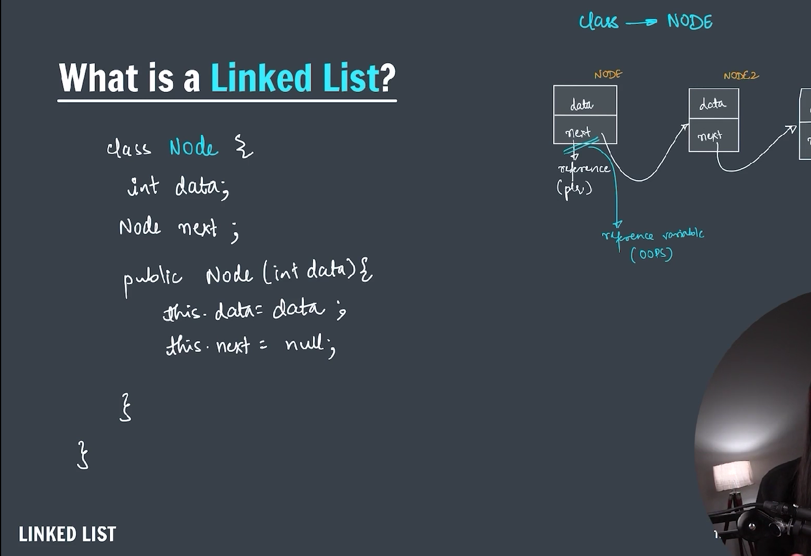

### LinkedList

---



---

A **LinkedList** in Java is a linear data structure from the **Java Collections Framework** that stores elements in a **sequence of nodes**, where each node contains:

1. The **data** (the element),
2. A **reference (pointer)** to the next node (and in a **doubly-linked list**, also the previous node).

It allows **efficient insertion and removal** of elements from both ends and in the middle, but **slower random access** compared to arrays.

---

### 🔹 Java `LinkedList` Class

Java provides a built-in `LinkedList` class in the `java.util` package. It implements:

- **List** (so it's ordered and indexable),
- **Deque** (so it can be used as a queue or stack),
- **Queue** and **Deque** interfaces.

---

### 📦 Importing

```java
import java.util.LinkedList;
```

---

### ✅ Example Usage:

```java
import java.util.LinkedList;

public class Main {
    public static void main(String[] args) {
        LinkedList<String> list = new LinkedList<>();

        list.add("A");
        list.add("B");
        list.addFirst("Start");
        list.addLast("End");

        System.out.println(list);  // Output: [Start, A, B, End]

        list.remove("B");
        list.removeFirst();

        System.out.println(list);  // Output: [A, End]
    }
}
```

---

### ⚙️ Key Operations

| Method               | Description                        |
| -------------------- | ---------------------------------- |
| `add(E element)`     | Adds to the end                    |
| `addFirst(E e)`      | Adds to the beginning              |
| `addLast(E e)`       | Adds to the end                    |
| `remove()`           | Removes first element              |
| `removeFirst()`      | Removes first element              |
| `removeLast()`       | Removes last element               |
| `get(int index)`     | Returns the element at given index |
| `contains(Object o)` | Checks if element exists           |
| `size()`             | Returns size of list               |

---

### 🔁 Internal Structure (for Doubly Linked List):

```
null <- [Start] <-> [A] <-> [End] -> null
```

Each node stores references to:

- The **previous** node
- The **next** node

---

### 🔍 When to Use `LinkedList` vs `ArrayList`:

| Feature              | `LinkedList`            | `ArrayList`           |
| -------------------- | ----------------------- | --------------------- |
| Access (get/set)     | Slow (O(n))             | Fast (O(1))           |
| Insert/Delete front  | Fast (O(1))             | Slow (O(n))           |
| Insert/Delete middle | Moderate (O(n))         | Slow (O(n))           |
| Insert/Delete end    | Fast (O(1))             | Fast (O(1) amortized) |
| Memory overhead      | Higher (extra pointers) | Lower                 |

---

### 🔁 Add to the Linkedlist:


