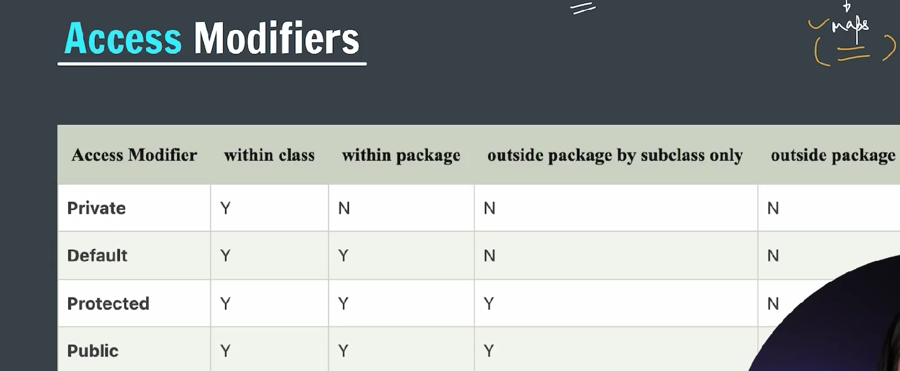

### OOP -> Object oriented programming

---

### What is OOPs?

OOPs is a programming paradigm based on the concept of **“objects”**, which can contain data (attributes) and code (methods). It helps in organizing complex programs by modeling real-world entities.

---

### Key Concepts of OOPs in Java:

1. **Class**

   - Blueprint or template for creating objects.
   - Defines attributes (fields) and behaviors (methods).

2. **Object**

   - Instance of a class.
   - Represents an entity with state and behavior.

3. **Encapsulation**

   - Wrapping data (variables) and code (methods) together into a single unit (class).
   - Data hiding using access modifiers (`private`, `public`, `protected`).
   - Example: Using getters and setters to access private data.

4. **Inheritance**

   - Mechanism where one class acquires properties and behaviors (methods) of another class.
   - Promotes code reuse.
   - Syntax: `class Child extends Parent`

5. **Polymorphism**

   - Ability to take many forms.
   - Two types in Java:
     - **Compile-time Polymorphism (Method Overloading)**: Same method name, different parameters.
     - **Run-time Polymorphism (Method Overriding)**: Subclass provides specific implementation of a method already defined in parent class.

6. **Abstraction**
   - Hiding complex implementation details and showing only essential features.
   - Achieved using abstract classes and interfaces.

---

### Example to illustrate OOPs concepts in Java:

```java
// Class definition
class Animal {
    private String name;

    public Animal(String name) {
        this.name = name;
    }

    // Encapsulation: getter method
    public String getName() {
        return name;
    }

    // Method to be overridden
    public void sound() {
        System.out.println("Animal makes a sound");
    }
}

// Inheritance and Polymorphism
class Dog extends Animal {
    public Dog(String name) {
        super(name);
    }

    // Overriding method
    @Override
    public void sound() {
        System.out.println("Dog barks");
    }
}

public class Main {
    public static void main(String[] args) {
        Animal myAnimal = new Animal("Generic Animal");
        myAnimal.sound();  // Output: Animal makes a sound

        Dog myDog = new Dog("Buddy");
        myDog.sound();     // Output: Dog barks

        System.out.println("Dog's name is: " + myDog.getName());
    }
}
```

---

### What are Access Modifiers?

Access modifiers in Java control the **visibility** and **accessibility** of classes, methods, and variables. They define **who can access** these members.

---



### Types of Access Modifiers in Java

| Modifier                  | Class | Package | Subclass (same package) | Subclass (different package) | World (everywhere) |
| ------------------------- | ----- | ------- | ----------------------- | ---------------------------- | ------------------ |
| **public**                | Yes   | Yes     | Yes                     | Yes                          | Yes                |
| **protected**             | Yes   | Yes     | Yes                     | Yes                          | No                 |
| **default** (no modifier) | Yes   | Yes     | Yes                     | No                           | No                 |
| **private**               | Yes   | No      | No                      | No                           | No                 |

---

### Detailed Explanation

1. **public**

   - The member is accessible **from anywhere** in your program.
   - Used when you want to make your class, method, or variable globally accessible.

2. **private**

   - The member is accessible **only within the class** where it is declared.
   - Most restrictive access level, mainly used for encapsulation.

3. **protected**

   - The member is accessible within the **same package** and also by **subclasses** (even if they are in different packages).
   - Useful for inheritance where subclasses need access to superclass members.

4. **default (package-private)**
   - No keyword (just omit any modifier).
   - The member is accessible only **within the same package**.
   - Not accessible from subclasses or classes outside the package.

---

```java
class BankAccount {
    public String username;
    private String password;

    public void setPassword(String newPass) {
        this.password = newPass;
    }

    public void printPassword() {
        System.out.println(password);
    }
}
```

---
