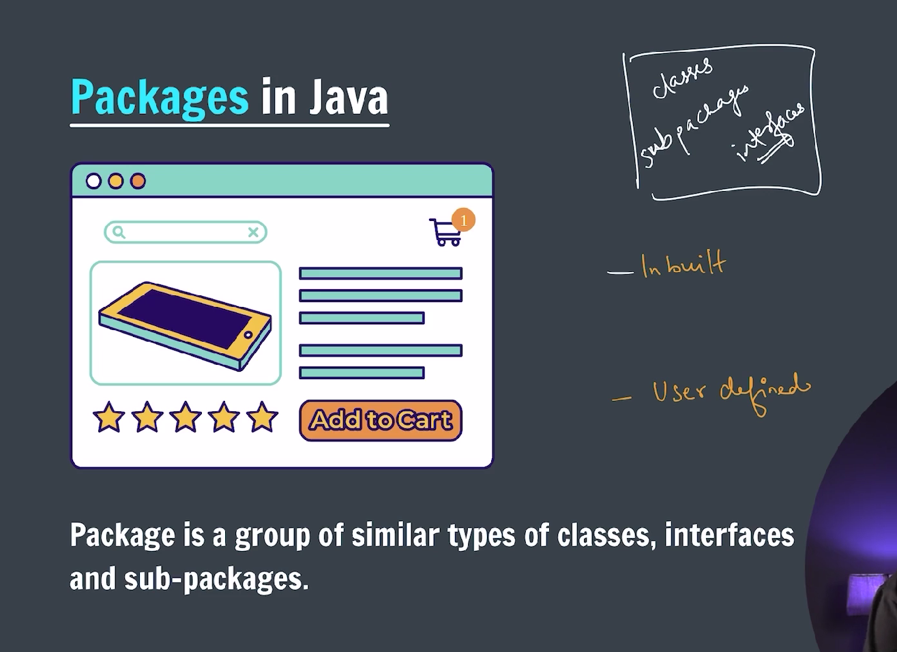

### OOP -> Object oriented programming

---

### What is OOPs?

OOPs is a programming paradigm based on the concept of **“objects”**, which can contain data (attributes) and code (methods). It helps in organizing complex programs by modeling real-world entities.

---

### Key Concepts of OOPs in Java:

1. **Class**

   - Blueprint or template for creating objects.
   - Defines attributes (fields) and behaviors (methods).

2. **Object**

   - Instance of a class.
   - Represents an entity with state and behavior.

3. **Encapsulation**

   - Wrapping data (variables) and code (methods) together into a single unit (class).
   - Data hiding using access modifiers (`private`, `public`, `protected`).
   - Example: Using getters and setters to access private data.

4. **Inheritance**

   - Mechanism where one class acquires properties and behaviors (methods) of another class.
   - Promotes code reuse.
   - Syntax: `class Child extends Parent`

5. **Polymorphism**

   - Ability to take many forms.
   - Two types in Java:
     - **Compile-time Polymorphism (Method Overloading)**: Same method name, different parameters.
     - **Run-time Polymorphism (Method Overriding)**: Subclass provides specific implementation of a method already defined in parent class.

6. **Abstraction**
   - Hiding complex implementation details and showing only essential features.
   - Achieved using abstract classes and interfaces.

---

### Example to illustrate OOPs concepts in Java:

```java
// Class definition
class Animal {
    private String name;

    public Animal(String name) {
        this.name = name;
    }

    // Encapsulation: getter method
    public String getName() {
        return name;
    }

    // Method to be overridden
    public void sound() {
        System.out.println("Animal makes a sound");
    }
}

// Inheritance and Polymorphism
class Dog extends Animal {
    public Dog(String name) {
        super(name);
    }

    // Overriding method
    @Override
    public void sound() {
        System.out.println("Dog barks");
    }
}

public class Main {
    public static void main(String[] args) {
        Animal myAnimal = new Animal("Generic Animal");
        myAnimal.sound();  // Output: Animal makes a sound

        Dog myDog = new Dog("Buddy");
        myDog.sound();     // Output: Dog barks

        System.out.println("Dog's name is: " + myDog.getName());
    }
}
```

---

### What are Access Modifiers?

Access modifiers in Java control the **visibility** and **accessibility** of classes, methods, and variables. They define **who can access** these members.

---


### Types of Access Modifiers in Java

| Modifier                  | Class | Package | Subclass (same package) | Subclass (different package) | World (everywhere) |
| ------------------------- | ----- | ------- | ----------------------- | ---------------------------- | ------------------ |
| **public**                | Yes   | Yes     | Yes                     | Yes                          | Yes                |
| **protected**             | Yes   | Yes     | Yes                     | Yes                          | No                 |
| **default** (no modifier) | Yes   | Yes     | Yes                     | No                           | No                 |
| **private**               | Yes   | No      | No                      | No                           | No                 |

---

### Detailed Explanation

1. **public**

   - The member is accessible **from anywhere** in your program.
   - Used when you want to make your class, method, or variable globally accessible.

2. **private**

   - The member is accessible **only within the class** where it is declared.
   - Most restrictive access level, mainly used for encapsulation.

3. **protected**

   - The member is accessible within the **same package** and also by **subclasses** (even if they are in different packages).
   - Useful for inheritance where subclasses need access to superclass members.

4. **default (package-private)**
   - No keyword (just omit any modifier).
   - The member is accessible only **within the same package**.
   - Not accessible from subclasses or classes outside the package.

---

```java
class BankAccount {
    public String username;
    private String password;

    public void setPassword(String newPass) {
        this.password = newPass;
    }

    public void printPassword() {
        System.out.println(password);
    }
}
```

---

### Getter and Setter


### What are Getters and Setters?

- **Getters** and **Setters** are methods used to **access** and **update** the value of private variables from outside the class.
- They are part of the **Encapsulation** principle in OOP, which hides the internal state of an object and allows controlled access.

---

### Why use Getters and Setters?

- To **protect** your variables from unauthorized or invalid access/modification.
- To **control** how a variable is accessed or updated (e.g., validation before setting a value).
- To maintain **flexibility** by not exposing variables directly.

---

### How to write Getters and Setters?

- **Getter:** Returns the value of a private variable.
- **Setter:** Sets or updates the value of a private variable.

---

### Example

```java

public class GetAndSet {

    public static void main(String[] args) {
        Pen2 p1 = new Pen2();
        p1.setColor("Blue");

        System.out.println(p1.getColor());

        // set tip
        p1.setTip(5);

        System.out.println(p1.getTip());

    }

}

class Pen2 {
    private String color;
    private int tip;

    // getter for pen color
    String getColor() {
        return this.color;
    }

    // setter for pen color
    void setColor(String color) {
        this.color = color;
    }

    // getter for pen tip
    int getTip() {
        return this.tip;
    }

    // setter for pen tip
    void setTip(int tip) {
        this.tip = tip;
    }
}
```

---

## 🏛️ 1. **Encapsulation**


---

> **Definition:** Bundling data (variables) and methods (functions) that operate on the data into a single unit (class), and restricting direct access to some of the object's components.

- Achieved using **private fields** and **public getters/setters**.
- Promotes **data hiding** and **security**.

**Example:**

```java
class Student {
    private String name;

    public void setName(String name) {
        this.name = name;
    }

    public String getName() {
        return name;
    }
}
```

---

## 🧬 2. **Inheritance**


---

> **Definition:** A mechanism where one class acquires the properties and behaviors of another class.

- Promotes **code reusability**.
- `extends` keyword is used.

**Example:**

```java
class Animal {
    void sound() {
        System.out.println("Animal makes sound");
    }
}

class Dog extends Animal {
    void bark() {
        System.out.println("Dog barks");
    }
}
```

---

### 1. **Single Inheritance**

One class inherits from another.

```java
class Animal {
    void eat() {
        System.out.println("This animal eats food.");
    }
}

class Dog extends Animal {
    void bark() {
        System.out.println("The dog barks.");
    }
}

public class Test {
    public static void main(String[] args) {
        Dog d = new Dog();
        d.eat();  // inherited method
        d.bark();
    }
}
```

---

### 2. **Multiple Inheritance (via Interfaces)**

Java does **not support multiple inheritance with classes** directly (to avoid ambiguity), but supports it with interfaces.

```java
interface Printable {
    void print();
}

interface Showable {
    void show();
}

class Test implements Printable, Showable {
    public void print() {
        System.out.println("Printing...");
    }
    public void show() {
        System.out.println("Showing...");
    }

    public static void main(String[] args) {
        Test obj = new Test();
        obj.print();
        obj.show();
    }
}
```

---

### 3. **Multilevel Inheritance**

A class inherits from a class which itself inherits from another class.

```java
class Animal {
    void eat() {
        System.out.println("This animal eats food.");
    }
}

class Dog extends Animal {
    void bark() {
        System.out.println("Dog barks.");
    }
}

class BabyDog extends Dog {
    void weep() {
        System.out.println("Baby dog weeps.");
    }
}

public class Test {
    public static void main(String[] args) {
        BabyDog bd = new BabyDog();
        bd.eat();
        bd.bark();
        bd.weep();
    }
}
```

---

### 4. **Hierarchical Inheritance**

Multiple classes inherit from the same superclass.

```java
class Animal {
    void eat() {
        System.out.println("This animal eats food.");
    }
}

class Dog extends Animal {
    void bark() {
        System.out.println("Dog barks.");
    }
}

class Cat extends Animal {
    void meow() {
        System.out.println("Cat meows.");
    }
}

public class Test {
    public static void main(String[] args) {
        Dog d = new Dog();
        d.eat();
        d.bark();

        Cat c = new Cat();
        c.eat();
        c.meow();
    }
}
```

---

### 5. **Hybrid Inheritance**

A combination of two or more types. In Java, since multiple inheritance is allowed only via interfaces, hybrid inheritance usually involves interfaces + classes.

---

## 🎭 3. **Polymorphism**


---

> **Definition:** One interface, many implementations. An object can take many forms.

### Two types:

- **Compile-time (Method Overloading)**
- **Run-time (Method Overriding)**

**Example (Overloading)**


```java

class Calculator {

    // Method Overloading concept the method names are but either the number of
    // arguments are different or data type of argument is different
    void sum(int a, int b) {
        System.out.println(a + b);
    }

    void sum(float a, float b) {
        System.out.println(a + b);
    }

    void sum(int a, int b, int c) {
        System.out.println(a + b + c);
    }

}

public class MethodOverloading {
    public static void main(String[] args) {

        Calculator cal = new Calculator();
        cal.sum(21, 22);
        cal.sum(2.8f, 9.1f);
        cal.sum(34, 32, 12);

    }
}
```

**Example (Overriding):**


```java
class Animal {
    void sound() {
        System.out.println("Animal sound");
    }
}

class Cat extends Animal {
    @Override
    void sound() {
        System.out.println("Meow");
    }
}
```

---

> **Method Overloading vs Method Overriding**

---

## 🔷 Method Overloading

### ✅ Definition:

**Method Overloading** is when **multiple methods** in the **same class** have the **same name** but **different parameters** (number, type, or order of parameters). This is a type of **compile-time polymorphism**.

### 📌 Key Points:

- Occurs within a **single class**
- Methods have the **same name** but **different parameter lists**
- Return type **can be different**, but it **does not help in overloading alone**
- It improves code readability

### 🔧 Example:

```java
class Calculator {
    int add(int a, int b) {
        return a + b;
    }

    double add(double a, double b) {
        return a + b;
    }

    int add(int a, int b, int c) {
        return a + b + c;
    }
}
```

### 🟢 Usage:

```java
Calculator calc = new Calculator();
System.out.println(calc.add(5, 10));           // Calls int version
System.out.println(calc.add(5.5, 4.5));         // Calls double version
System.out.println(calc.add(1, 2, 3));          // Calls 3-arg version
```

---

## 🔷 Method Overriding

### ✅ Definition:

**Method Overriding** occurs when a **subclass** provides a specific implementation of a method that is already defined in its **superclass**. This is a type of **runtime polymorphism**.

### 📌 Key Points:

- Involves **inheritance** (i.e., parent and child class)
- Method in the child class must have the **same name, return type, and parameters** as in the parent class
- Used to implement **dynamic (runtime) polymorphism**
- Access modifier in child class **cannot be more restrictive** than in the parent class

### 🔧 Example:

```java
class Animal {
    void makeSound() {
        System.out.println("Animal makes a sound");
    }
}

class Dog extends Animal {
    @Override
    void makeSound() {
        System.out.println("Dog barks");
    }
}
```

### 🟢 Usage:

```java
Animal myDog = new Dog();
myDog.makeSound();  // Output: Dog barks
```

---

## 🔁 Key Differences Between Overloading and Overriding:

| Feature           | Method Overloading                      | Method Overriding                          |
| ----------------- | --------------------------------------- | ------------------------------------------ |
| Polymorphism Type | Compile-time (static) polymorphism      | Runtime (dynamic) polymorphism             |
| Involves          | Same class                              | Inheritance (subclass and superclass)      |
| Method Signature  | Must be different                       | Must be exactly the same                   |
| Return Type       | Can be different (if signature differs) | Must be same or covariant                  |
| Access Modifier   | Can be anything                         | Cannot be more restrictive than superclass |
| Annotation        | Not required                            | Commonly uses `@Override`                  |

---

## 🌫️ 4. **Abstraction**

> **Definition:** Hiding internal implementation details and showing only essential features.


- Achieved using **abstract classes** or **interfaces**.
- Focuses on **what** an object does, not **how** it does it.

**Example:**

```java
abstract class Vehicle {
    abstract void start();
}

class Car extends Vehicle {
    void start() {
        System.out.println("Car starts with key");
    }
}
```

---

**Abstract classes**


---

```java

abstract class Animal {
    void eat() {
        System.out.println("Eating...");
    }

    abstract void walk();
}

class Horse extends Animal {

    void walk() {
        System.out.println("Walks on 4 legs");
    }
}

class Chicken extends Animal {
    void walk() {
        System.out.println("Walks on 2 legs");
    }
}

public class AbstractClass {

    public static void main(String[] args) {

        Horse horse = new Horse();
        horse.eat();
        horse.walk();

        Chicken chik = new Chicken();
        chik.eat();
        chik.walk();
    }

}
```

---

### 📌 Summary Table

| Pillar        | Key Concept         | Benefit                        |
| ------------- | ------------------- | ------------------------------ |
| Encapsulation | Data hiding         | Security & Control             |
| Inheritance   | Reuse behavior      | Code reusability               |
| Polymorphism  | Many forms          | Flexibility & Scalability      |
| Abstraction   | Hide implementation | Simplicity & Focus on behavior |

---

### 🏗️ Constructor in OOP (Java)


---

A **constructor** in Java is a **special method** used to **initialize objects** of a class. It is called **automatically** when a new object is created using the `new` keyword.

---

## 🔑 Key Features of Constructors:

- Has the **same name** as the class.
- **No return type**, not even `void`.
- Can be **overloaded** (i.e., you can have multiple constructors with different parameters).
- Called **automatically** when the object is created.

---

## 🧱 Types of Constructors in Java

### 1. **Default Constructor**

- Provided by Java if no constructor is defined.
- Takes no arguments.

```java
class Car {
    Car() {
        System.out.println("Car object created");
    }
}

public class Main {
    public static void main(String[] args) {
        Car myCar = new Car();  // Output: Car object created
    }
}
```

---

### 2. **Parameterized Constructor**

- Takes arguments to initialize the object with specific values.

```java
class Car {
    String model;

    Car(String m) {
        model = m;
    }

    void show() {
        System.out.println("Model: " + model);
    }
}

public class Main {
    public static void main(String[] args) {
        Car myCar = new Car("Tesla");
        myCar.show();  // Output: Model: Tesla
    }
}
```

---

### 3. **Copy Constructor** _(Manually defined in Java)_

- Used to create a copy of an existing object.

```java
class Car {
    String model;

    Car(String m) {
        model = m;
    }

    // Copy constructor
    Car(Car c) {
        model = c.model;
    }

    void show() {
        System.out.println("Model: " + model);
    }
}

public class Main {
    public static void main(String[] args) {
        Car car1 = new Car("BMW");
        Car car2 = new Car(car1);  // Copy of car1
        car2.show();  // Output: Model: BMW
    }
}
```

---

## 🧠 Why Use Constructors?

- To ensure every object is initialized properly.
- Improves **readability** and **maintainability**.
- Supports **constructor overloading** for flexible initialization.

---

## 🔄 Constructor vs Method

| Feature     | Constructor       | Method                 |
| ----------- | ----------------- | ---------------------- |
| Name        | Same as class     | Any valid name         |
| Return Type | No return type    | Must have return type  |
| Called When | Object is created | Called explicitly      |
| Purpose     | Initialize object | Define object behavior |

---

### 🔁 Shallow Copy vs Deep Copy in Java


---

In Java, **copying an object** can be done in two main ways: **shallow copy** and **deep copy**.

These refer to how the copy handles **object references** inside the original object.

---

## 🌊 Shallow Copy

### ✅ Definition:

A **shallow copy** copies the object and **only references** to other objects. The nested objects are **not copied**, just their **references**.

> Both original and copy share the same sub-objects.

---

## 🧱 Deep Copy

### ✅ Definition:

A **deep copy** creates a **fully independent copy** of the object, including its referenced objects.

> Original and copy do **not** share references.

---

## 🧠 Summary Table

| Feature           | Shallow Copy                         | Deep Copy                              |
| ----------------- | ------------------------------------ | -------------------------------------- |
| Copies Object     | ✅ Yes                               | ✅ Yes                                 |
| Copies References | ✅ (shared)                          | ❌ (creates new copies)                |
| Memory Usage      | Low                                  | Higher (due to duplicated sub-objects) |
| Independence      | ❌ Changes affect original copy      | ✅ Fully independent                   |
| Complexity        | Simple (use `clone()` or assignment) | More complex (manual cloning needed)   |

---

---

## 📦 Packages in Java

### ✅ What is a Package?

A **package** in Java is a **namespace** that organizes a set of related classes and interfaces. Conceptually, it’s like a **folder** or **directory** on your computer where related files are grouped together.

> Package ia a group of similar types of **classes**, **Interfaces** and **sub-packages**



---

### 🔹 Why Use Packages?

- **Organize classes logically** (like grouping similar functionality)
- **Avoid name conflicts** (e.g., two classes with the same name can exist in different packages)
- **Control access** with package-level access modifiers
- **Easier maintenance and code reuse**

---

### 🔹 Types of Packages:

1. **Built-in Packages**  
   Provided by Java (e.g., `java.lang`, `java.util`, `java.io`)
2. **User-defined Packages**  
   Created by the programmer to organize code

---

### 🔹 How to Create a Package?

Use the `package` keyword as the first line in your `.java` file:

```java

public class MyClass {
    public void display() {
        System.out.println("Hello from MyClass in package com.example.myapp");
    }
}
```

- The package name typically follows the **reverse domain name** convention (like `com.company.project`).

---

### 🔹 How to Use Packages?

To use classes from another package, you use the `import` statement:

```java
import com.example.myapp.MyClass;

public class Test {
    public static void main(String[] args) {
        MyClass obj = new MyClass();
        obj.display();
    }
}
```

Or import all classes in the package:

```java
import com.example.myapp.*;
```

---

### 🔹 Default Package

If you don’t specify a package, your classes go into the **default package** (no package). It’s fine for small programs but not recommended for larger projects.

---

### 🔹 Package Access Levels

- **public:** Accessible from any other package
- **protected / default (no modifier):** Accessible within the same package (default access is package-private)
- **private:** Not accessible outside the class itself

---

### 🔹 Example Directory Structure

Suppose package `com.example.myapp`:

```
project_root/
└── com/
    └── example/
        └── myapp/
            └── MyClass.java
```

---

### Summary:

| Feature           | Description                                |
| ----------------- | ------------------------------------------ |
| Purpose           | Organize classes and interfaces            |
| Declaration       | `package packageName;` at the top          |
| Usage             | Use `import` to access classes in packages |
| Naming Convention | Usually reverse domain names               |

---

### What is an Interface in Java?

An **interface** in Java is a reference type, similar to a class, that can contain only constants, method signatures (abstract methods), default methods, static methods, and nested types. Interfaces cannot contain instance fields or constructors.

They are used to specify a contract that a class can implement. When a class implements an interface, it agrees to provide concrete implementations for the abstract methods declared in the interface.


---

### Key Characteristics of Interfaces:

- **Abstract methods only:** Before Java 8, interfaces could only have abstract methods (methods without a body). From Java 8 onward, interfaces can also have default and static methods with implementations.
- **No constructors:** Interfaces cannot be instantiated on their own.
- **Multiple inheritance:** A class can implement multiple interfaces, allowing multiple inheritance of type.
- **All methods are public:** Interface methods are implicitly public and abstract (unless they are default or static methods).
- **Constants only:** All fields are `public static final` by default.

---

### Syntax

```java
public interface Animal {
    void eat();
    void sleep();
}
```

---

### Implementing an Interface

```java
public class Dog implements Animal {
    @Override
    public void eat() {
        System.out.println("Dog is eating");
    }

    @Override
    public void sleep() {
        System.out.println("Dog is sleeping");
    }
}
```

---

### Default and Static Methods (Java 8+)

```java
public interface Vehicle {
    void drive();

    default void start() {
        System.out.println("Vehicle started");
    }

    static void service() {
        System.out.println("Vehicle serviced");
    }
}
```

---

### Why Use Interfaces?

- **Multiple inheritance of type:** Java doesn’t support multiple inheritance of classes but allows a class to implement multiple interfaces.
- **Abstraction:** Defines a contract that implementing classes must follow.
- **Loose coupling:** Code can work with interfaces rather than specific implementations.

---

### What is `static` in Java?

The `static` keyword is used to indicate that a **member (variable or method) belongs to the class itself, rather than to any specific instance of that class**.


---

### Where can you use `static`?

- **Static variables (class variables)**
- **Static methods**
- **Static blocks**
- **Static nested classes**

---

### 1. **Static Variables**

- Also called **class variables**.
- Shared by all instances of the class.
- Only one copy exists regardless of how many objects you create.

**Example:**

```java
public class Counter {
    static int count = 0;

    public Counter() {
        count++;
    }

    public static void displayCount() {
        System.out.println("Count: " + count);
    }
}

public class Test {
    public static void main(String[] args) {
        new Counter();
        new Counter();
        Counter.displayCount();  // Output: Count: 2
    }
}
```

---

### 2. **Static Methods**

- Belong to the class, not instances.
- Can be called without creating an object.
- Can only directly access static variables and call other static methods.
- Cannot use `this` or `super` keywords.

**Example:**

```java
public class MathUtils {
    public static int add(int a, int b) {
        return a + b;
    }
}

public class Test {
    public static void main(String[] args) {
        int sum = MathUtils.add(5, 3);
        System.out.println(sum);  // Output: 8
    }
}
```

---

### 3. **Static Blocks**

- Used to initialize static variables.
- Executed when the class is loaded.

```java
public class Example {
    static int x;

    static {
        x = 10;
        System.out.println("Static block executed");
    }
}

public class Test {
    public static void main(String[] args) {
        System.out.println(Example.x);  // Output: Static block executed \n 10
    }
}
```

---

### 4. **Static Nested Classes**

- Nested classes declared `static`.
- Can be instantiated without an instance of the outer class.
- Cannot access non-static members of the outer class.

```java
public class Outer {
    static class Inner {
        void display() {
            System.out.println("Static nested class");
        }
    }
}

public class Test {
    public static void main(String[] args) {
        Outer.Inner inner = new Outer.Inner();
        inner.display();  // Output: Static nested class
    }
}
```

---

### Summary

| Feature             | Description                                 |
| ------------------- | ------------------------------------------- |
| Static Variable     | Shared among all instances                  |
| Static Method       | Can be called without an object             |
| Static Block        | Runs once when class loads                  |
| Static Nested Class | Nested class that can be instantiated alone |

---

### Super keyword


```java

class Animal {
    String color;

    Animal() {
        System.out.println("Animal constructor is called");
    }
}

class Horse extends Animal {
    Horse() {
        super.color = "Brown";
        System.out.println("Horse constructor is called");
    }
}

public class Super {
    public static void main(String[] args) {

        Horse h = new Horse();
        System.out.println(h.color);

    }
}
```
