### Queue -> FIFO

A **Queue** in Java is a linear data structure that follows the **First-In-First-Out (FIFO)** principle — the element that is added first is removed first. It's useful for scenarios like task scheduling, buffering, and breadth-first search.

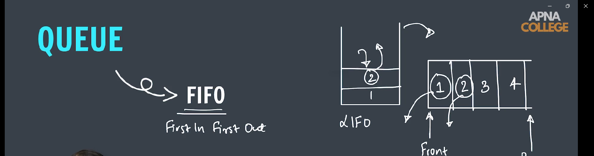

---

### 🧱 Queue Basics in Java

Java provides the `Queue` interface in the `java.util` package. It is typically implemented using classes like:

- `LinkedList`
- `PriorityQueue`
- `ArrayDeque`

> `Queue` is an interface, so you cannot instantiate it directly.

---

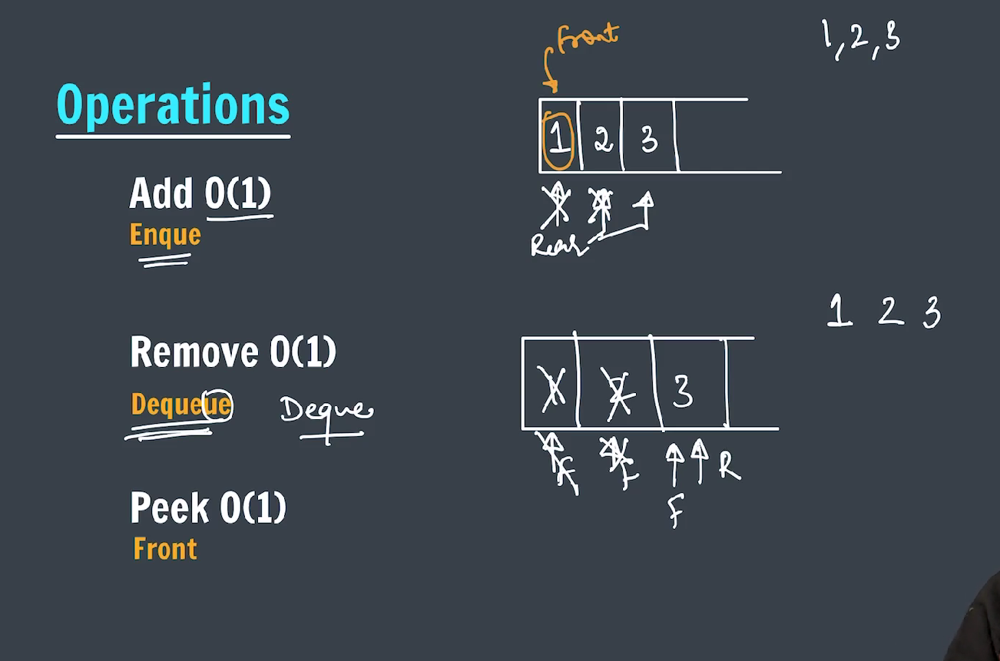

---

### ✅ Key Methods in `Queue` Interface

| Method      | Description                                                     |
| ----------- | --------------------------------------------------------------- |
| `add()`     | Inserts the element. Throws exception if fails.                 |
| `offer()`   | Inserts the element. Returns false if fails.                    |
| `remove()`  | Removes and returns the head. Throws exception if empty.        |
| `poll()`    | Removes and returns the head. Returns null if empty.            |
| `element()` | Retrieves, doesn't remove, the head. Throws exception if empty. |
| `peek()`    | Retrieves, doesn't remove, the head. Returns null if empty.     |

---

### 🧠 When to Use a Queue?

- Print job scheduling
- CPU or disk scheduling
- Asynchronous data transfer (like I/O buffers)
- BFS (Breadth-First Search)

---

### Queue implementation using Array

```java

public class QueueArrayImplementation {
    static class Queue {
        static int arr[];
        static int size;
        static int rear;

        Queue(int n) {
            arr = new int[n];
            size = n;
            rear = -1;
        }

        // isEmpty() function
        public static boolean isEmpty() {
            return rear == -1;
        }

        // add function
        public static void add(int data) {
            if (rear == size - 1) {
                System.out.println("Queue is full");
                return;
            }

            rear = rear + 1;
            arr[rear] = data;
        }

        // remove function
        public static int remove() {
            if (isEmpty()) {
                System.out.println("Queue is empty");
                return -1;
            }

            int front = arr[0];

            for (int i = 0; i < rear; i++) {
                arr[i] = arr[i + 1];
            }
            rear = rear - 1;

            return front;
        }

        // peek function
        public static int peek() {
            if (isEmpty()) {
                System.out.println("Empty Queue");
                return -1;
            }

            return arr[0];
        }
    }

    @SuppressWarnings("static-access")
    public static void main(String[] args) {
        Queue queue = new Queue(5);

        queue.isEmpty();

        queue.add(1);
        queue.add(2);
        queue.add(3);

        // System.out.println(queue.peek());

        // System.out.println(queue.remove());
        // System.out.println(queue.remove());
        // System.out.println(queue.remove());
        // System.out.println(queue.size);
        // System.out.println(queue.isEmpty());

        while (!queue.isEmpty()) {
            System.out.println(queue.peek());
            queue.remove();
        }

        queue.peek();

    }
}
```

---

### Queue implementation using Linkedlist

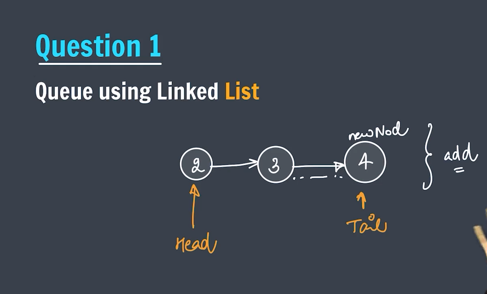

---

```java

public class QueueLinkedlistImplementation {
    static class Node {
        int data;
        Node next;

        Node(int data) {
            this.data = data;
            this.next = null;
        }
    }

    static class Queue {
        static Node head = null;
        static Node tail = null;

        // isEmpty function
        public static boolean isEmpty() {
            return head == null && tail == null;
        }

        // add function
        public static void add(int data) {
            Node newNode = new Node(data);
            if (head == null) {
                head = tail = newNode;
                return;
            }

            tail.next = newNode;
            tail = newNode;
        }

        // remove function
        public static int remove() {
            if (isEmpty()) {
                System.out.println("Queue is empty.");
                return -1;
            }

            int front = head.data;

            if (head == tail) {
                head = tail = null;
            } else {
                head = head.next;
            }

            return front;
        }

        // peek function
        public static int peek() {
            if (isEmpty()) {
                System.out.println("Queue is empty.");
                return -1;
            }

            return head.data;
        }
    }

    @SuppressWarnings("static-access")

    public static void main(String[] args) {

        Queue queue = new Queue();
        queue.add(1);
        queue.add(2);
        queue.add(3);

        while (!queue.isEmpty()) {

            System.out.println(queue.peek());
            queue.remove();

        }
    }
}
```

---

### Queue implementation using JCF -> Java Collection Framework

To implement a **Queue** using **Java Collections Framework (JCF)**, you typically use the `Queue` interface, with classes like `LinkedList` or `ArrayDeque` providing the actual implementation.

Here’s a simple example using `LinkedList`, which is the most straightforward way to implement a queue:

---

### ✅ Queue using Java Collections Framework

```java
import java.util.LinkedList;
import java.util.Queue;

public class QueueExample {
    public static void main(String[] args) {
        // Create a queue using LinkedList
        Queue<String> queue = new LinkedList<>();

        // Enqueue (add elements)
        queue.add("Alice");
        queue.add("Bob");
        queue.add("Charlie");

        // Display the queue
        System.out.println("Queue: " + queue);

        // Peek (view the front element)
        System.out.println("Front element: " + queue.peek());

        // Dequeue (remove elements)
        System.out.println("Removed: " + queue.remove());

        // Display the queue after removal
        System.out.println("Queue after removal: " + queue);
    }
}
```

---

### 🔍 Output:

```
Queue: [Alice, Bob, Charlie]
Front element: Alice
Removed: Alice
Queue after removal: [Bob, Charlie]
```

---

### 🧠 Notes:

- `add()` – Adds an element to the rear of the queue.
- `peek()` – Returns the head of the queue without removing it.
- `remove()` – Removes the head of the queue and returns it.

You can also use `ArrayDeque` for a more performant, non-thread-safe queue implementation:

```java
Queue<String> queue = new ArrayDeque<>();
```

---

### Queue (Interface) implementation using LinkedList (class) vs ArrayDeque (class)

The main differences between implementing a **Queue** using **`LinkedList`** vs **`ArrayDeque`** in Java lie in **performance**, **memory usage**, and **suitability for queue operations**.

Here's a breakdown:

---

### ✅ **1. Class Hierarchy & Usage**

| Feature      | `LinkedList`                            | `ArrayDeque`                    |
| ------------ | --------------------------------------- | ------------------------------- |
| Implements   | `List`, `Deque`, `Queue`                | `Deque`, `Queue`                |
| Backed by    | Doubly-linked list                      | Resizable circular array        |
| Suitable for | General-purpose queue + list operations | Fast queue and stack operations |

---

### ✅ **2. Performance Comparison**

| Operation        | `LinkedList`         | `ArrayDeque`                 |
| ---------------- | -------------------- | ---------------------------- |
| Enqueue (add)    | O(1)                 | O(1) amortized               |
| Dequeue (remove) | O(1)                 | O(1) amortized               |
| Random access    | O(n)                 | O(1) (not allowed via index) |
| Memory usage     | More (node pointers) | Less (compact array)         |

- `ArrayDeque` is generally **faster and more memory-efficient** than `LinkedList` for queue operations.
- `LinkedList` allows for **more flexibility** (like bidirectional traversal, or using it as a list), but at a **cost of performance and memory**.

---

### ✅ **3. Practical Considerations**

| Aspect                | `LinkedList`                        | `ArrayDeque`                         |
| --------------------- | ----------------------------------- | ------------------------------------ |
| Thread-safe?          | ❌ (Not thread-safe)                | ❌ (Not thread-safe)                 |
| Allows null elements? | ✅ Yes                              | ❌ No                                |
| Better for            | Linked data access                  | Fast FIFO or LIFO (Stack) operations |
| Memory overhead       | High (stores two pointers per node) | Low (just a growing array)           |

---

### ✅ **Code Snippet Comparison**

**LinkedList:**

```java
Queue<String> queue = new LinkedList<>();
queue.add("A");
queue.remove();
```

**ArrayDeque:**

```java
Queue<String> queue = new ArrayDeque<>();
queue.add("A");
queue.remove();
```

---

### 🧠 Which One to Use?

- ✅ Use **`ArrayDeque`** when:

  - You only need **queue or stack operations**.
  - You want **better performance** and **lower memory usage**.

- ❗ Avoid **`LinkedList`** unless:
  - You need **list-like behavior** or **frequent insertions/removals in the middle** (which Queue doesn't typically need).

---

### Queue implementation by the help of two stack

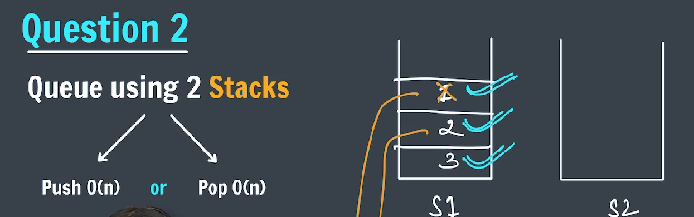
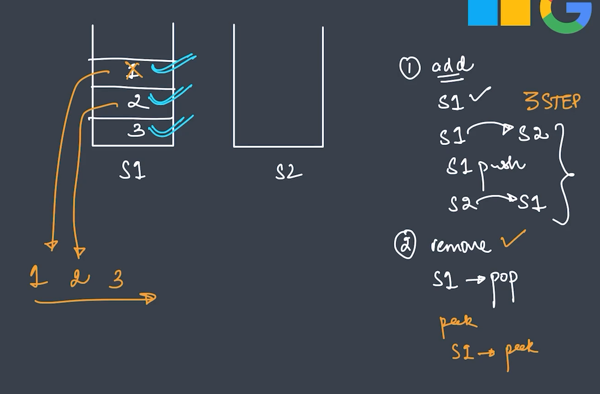

---

```java

import java.util.Stack;

public class QueueUsingStacks {
    static class Queue {
        static Stack<Integer> s1 = new Stack<>();
        static Stack<Integer> s2 = new Stack<>();

        // isEmpty()
        public static boolean isEmpty() {
            return s1.isEmpty();
        }

        // add
        public static void add(int data) {
            while (!s1.isEmpty()) {
                s2.push(s1.pop());
            }

            s1.push(data);

            while (!s2.isEmpty()) {
                s1.push(s2.pop());
            }
        }

        // remove function
        public static int remove() {
            if (s1.isEmpty()) {
                System.out.println("Queue is empty.");
                return -1;
            }

            return s1.pop();
        }

        // peek function
        public static int peek() {
            if (s1.isEmpty()) {
                System.out.println("Queue is empty.");
                return -1;
            }

            return s1.peek();
        }
    }

    @SuppressWarnings("static-access")
    public static void main(String[] args) {
        Queue queue = new Queue();

        queue.add(1);
        queue.add(2);
        queue.add(3);

        while (!queue.isEmpty()) {

            System.out.println(queue.peek());
            queue.remove();

        }
    }
}
```

---

### Implement Stack using two Queue

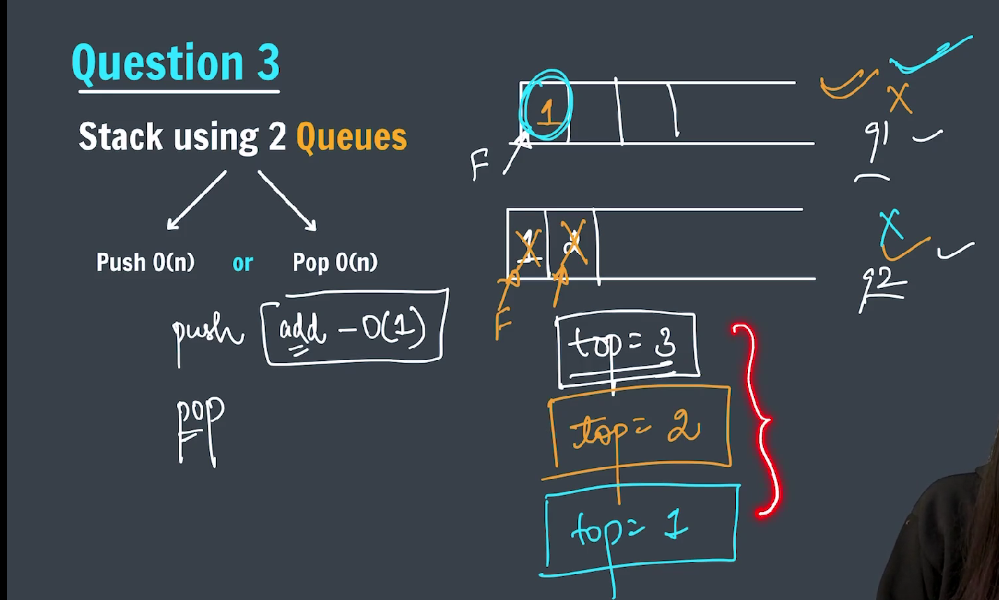

---

```java

import java.util.LinkedList;
import java.util.Queue;

public class StackUsingTwoQueue {
    static class Stack {
        static Queue<Integer> q1 = new LinkedList<>();
        static Queue<Integer> q2 = new LinkedList<>();

        // isEmpty function
        public static boolean isEmpty() {
            return q1.isEmpty() && q2.isEmpty();
        }

        // add function
        public static void push(int data) {
            if (!q1.isEmpty()) {
                q1.add(data);
            } else {
                q2.add(data);
            }
        }

        // remove function
        public static int pop() {

            if (isEmpty()) {
                System.out.println("Stack is Empty.");
                return -1;
            }
            int top = -1;

            // case 1
            if (!q1.isEmpty()) {
                while (!q1.isEmpty()) {
                    top = q1.remove();
                    if (q1.isEmpty()) {
                        break;
                    }
                    q2.add(top);
                }

            }

            // case 2
            else {
                while (!q2.isEmpty()) {
                    top = q2.remove();
                    if (q2.isEmpty()) {
                        break;
                    }
                    q1.add(top);
                }
            }

            return top;

        }

        // peek function
        public static int peek() {
            if (isEmpty()) {
                System.out.println("Stack is empty.");
                return -1;
            }

            int top = -1;

            if (!q1.isEmpty()) {
                while (!q1.isEmpty()) {
                    top = q1.remove();
                    q2.add(top);
                }
            } else {
                while (!q2.isEmpty()) {
                    top = q2.remove();
                    q1.add(top);
                }
            }

            return top;
        }
    }

    @SuppressWarnings("static-access")

    public static void main(String[] args) {
        Stack stack = new Stack();

        stack.push(1);
        stack.push(2);
        stack.push(3);

        while (!stack.isEmpty()) {
            System.out.println(stack.peek());
            stack.pop();
        }
    }
}
```

---

---

### Find First Non-Repeating Letter in a String

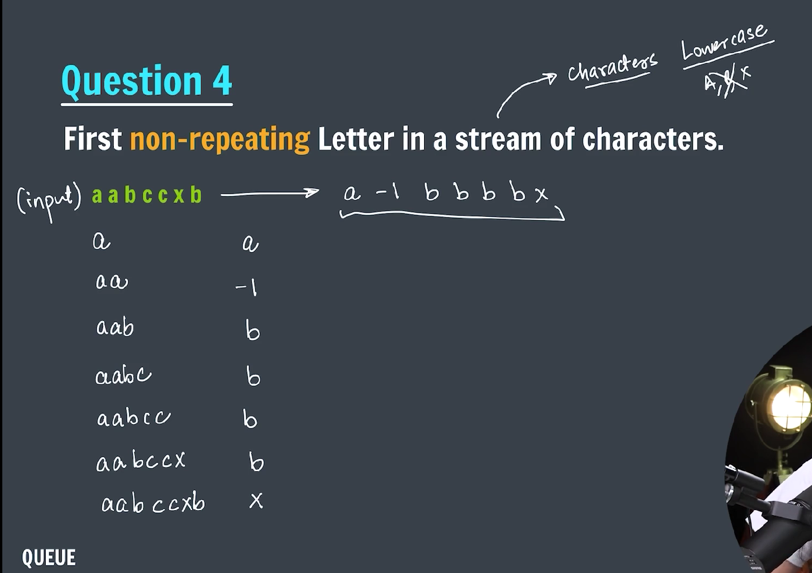
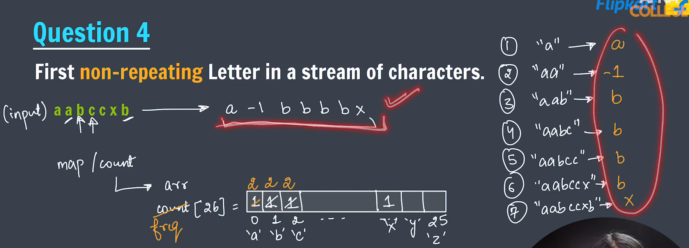
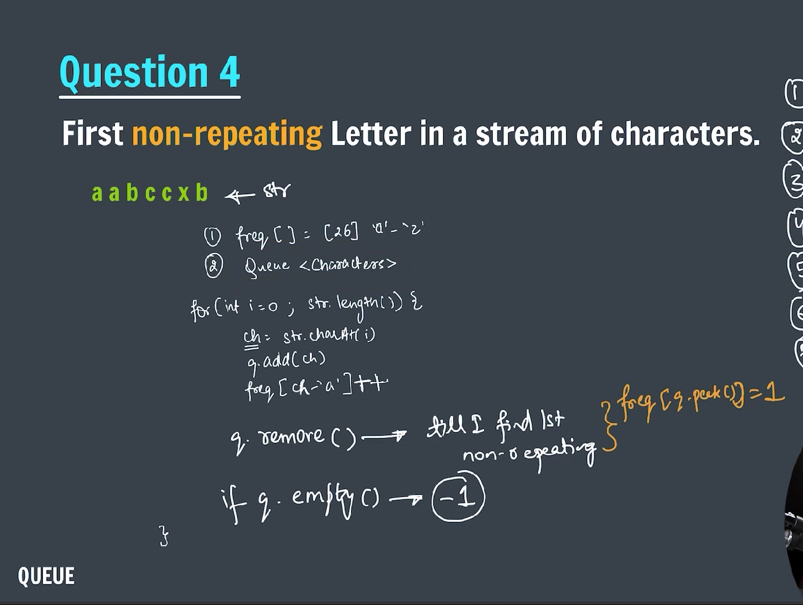

---

```java

import java.util.LinkedList;
import java.util.Queue;
import java.util.Scanner;

public class FirstNonRepeatingCharacter {

    public static void printNonRepeating(String str) {
        int freq[] = new int[26]; // 'a' -> 'z'
        Queue<Character> q = new LinkedList<>();

        for (char ch : str.toCharArray()) {
            q.add(ch);
            freq[ch - 'a']++;

            while (!q.isEmpty() && freq[q.peek() - 'a'] > 1) {
                q.remove();
            }

            if (q.isEmpty()) {
                System.out.print("-1 ");
            }
            System.out.print(q.peek() + " ");
        }
        System.out.println();
    }

    public static void main(String[] args) {

        // String str = "aabxxccbvsrt";
        // String str = "aabccxb";

        Scanner sc = new Scanner(System.in);
        System.out.print("Enter string: ");
        String str = sc.nextLine();

        printNonRepeating(str);

        sc.close();

    }
}
```

---

### Interleave the First Half of the Queue with Second Half

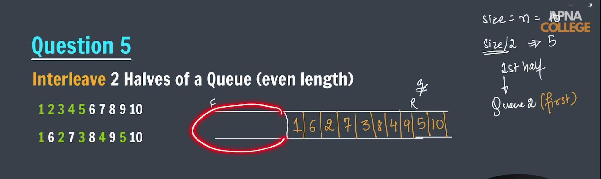
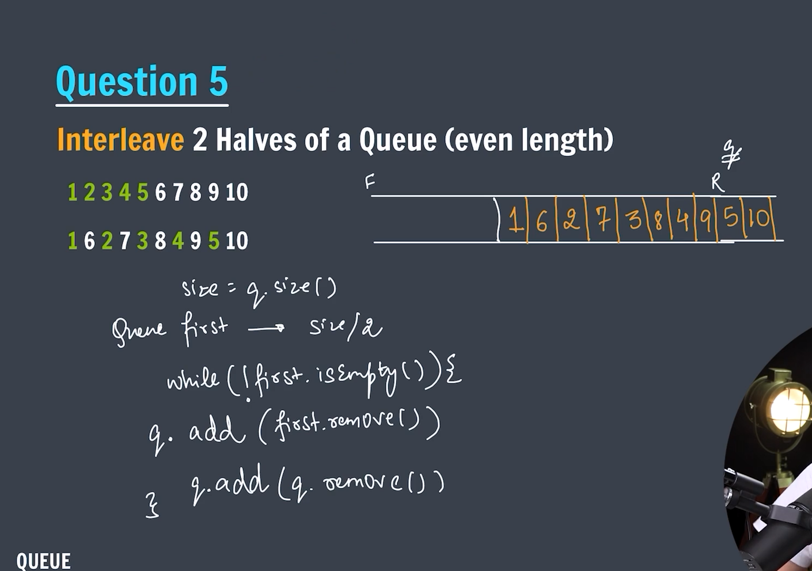

---

```java

import java.util.LinkedList;
import java.util.Queue;
import java.util.Scanner;
import java.util.Stack;

public class Interleave2Half {

    public static void interleave(Queue<Integer> q) {

        Queue<Integer> firstHalf = new LinkedList<>();
        int size = q.size();
        for (int i = 0; i < size / 2; i++) {
            firstHalf.add(q.remove());
        }

        while (!q.isEmpty()) {
            q.add(firstHalf.remove());
            q.add(q.remove());
        }
    }

    public static void main(String[] args) {
        // int arr[] = { 1, 2, 3, 4, 5, 6, 7, 8, 9, 10 };
        // int n = arr.length;

        // **************************** By using Stack *****************************
        // Stack<Integer> stack1 = new Stack<>();
        // Stack<Integer> stack2 = new Stack<>();

        // for (int i = 0; i < n; i++) {
        // if (i < n / 2) {
        // stack1.push(arr[i]);
        // } else {
        // stack2.push(arr[i]);
        // }
        // }

        // Stack<Integer> ans = new Stack<>();
        // while (!stack1.isEmpty() && !stack2.isEmpty()) {
        // ans.push(stack2.pop());
        // ans.push(stack1.pop());
        // }

        // while (!ans.isEmpty()) {
        // System.out.print(ans.pop() + " ");
        // }

        // System.out.println();

        // ****************************** By using Queue
        // *****************************************
        // int arr[] = { 1, 2, 3, 4, 5, 6, 7, 8, 9, 10 };

        Scanner sc = new Scanner(System.in);
        System.out.print("Enter the number of elements to be get added into Queue: ");
        int n = sc.nextInt();
        Queue<Integer> element = new LinkedList<>();

        System.out.println("Enter elements into queue one after another.");
        for (int i = 0; i < n; i++) {
            element.offer(sc.nextInt());
        }

        int size = element.size();
        Queue<Integer> firstHalf = new LinkedList<>();
        for (int i = 0; i < size / 2; i++) {
            firstHalf.offer(element.remove());
        }

        Queue<Integer> finalAns = new LinkedList<>();

        while (!firstHalf.isEmpty() && !element.isEmpty()) {
            finalAns.add(firstHalf.remove());
            finalAns.add(element.remove());
        }

        System.out.println("The final interleaved elements are: ");
        while (!finalAns.isEmpty()) {
            System.out.print(finalAns.peek() + " ");
            finalAns.remove();
        }

        sc.close();

    }
}
```

---

### Reverse a Queue

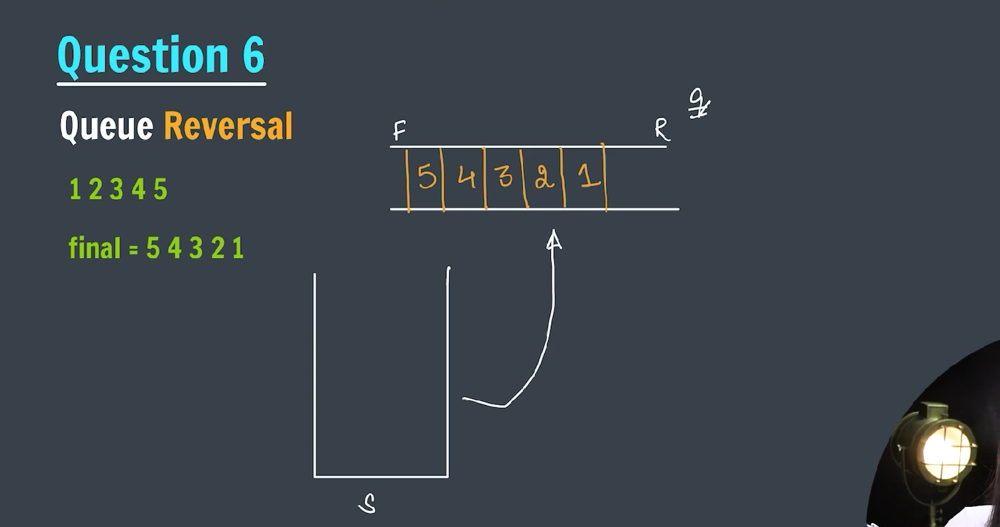

---

```java

import java.util.Scanner;
import java.util.Stack;
import java.util.LinkedList;
import java.util.Queue;

public class QueueReversal {

    public static void reverseQueue(Queue<Integer> q) {
        System.out.println("Reverse the queue.");
        Stack<Integer> stack = new Stack<>();

        while (!q.isEmpty()) {
            stack.push(q.remove());
        }

        while (!stack.isEmpty()) {
            q.add(stack.pop());
        }
    }

    public static void main(String[] args) {

        // int element[] = { 1, 2, 3, 4, 5 };
        Scanner sc = new Scanner(System.in);
        System.out.print("Enter the number of elements to be entered in the queue. -> ");
        int n = sc.nextInt();

        System.out.println("Enter the elements in the queue.");
        Queue<Integer> q = new LinkedList<>();
        for (int i = 0; i < n; i++) {
            q.add(sc.nextInt());
        }

        // **************** Calling the reverseQueue function ***********************
        reverseQueue(q);

        // System.out.println("Reverse the elements in the queue.");
        // Stack<Integer> stack = new Stack<>();
        // while (!q.isEmpty()) {
        // stack.push(q.remove());
        // }

        // while (!stack.isEmpty()) {
        // q.add(stack.pop());
        // }

        while (!q.isEmpty()) {
            System.out.print(q.remove() + " ");
        }

        sc.close();

    }
}
```

---

### Deque Data Structure

A **Deque** (Double-Ended Queue) in Java is a linear collection that supports element insertion and removal at both ends — front and back.

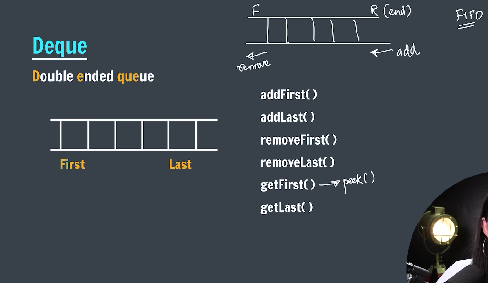

---

### Key points about Deque:

- You can add, remove, and examine elements from both ends.
- Can be used as a stack, queue, or double-ended queue.
- Implementations include `ArrayDeque` and `LinkedList`.

---

### Deque Interface in Java

The `Deque` interface is part of `java.util` package:

```java
import java.util.Deque;
import java.util.ArrayDeque;
```

---

### Common methods in Deque

| Method            | Description                                          |
| ----------------- | ---------------------------------------------------- |
| `addFirst(E e)`   | Inserts element at the front                         |
| `addLast(E e)`    | Inserts element at the end                           |
| `offerFirst(E e)` | Inserts element at the front, returns false if fails |
| `offerLast(E e)`  | Inserts element at the end, returns false if fails   |
| `removeFirst()`   | Removes and returns first element                    |
| `removeLast()`    | Removes and returns last element                     |
| `pollFirst()`     | Removes and returns first element or null if empty   |
| `pollLast()`      | Removes and returns last element or null if empty    |
| `getFirst()`      | Retrieves, but does not remove, first element        |
| `getLast()`       | Retrieves, but does not remove, last element         |
| `peekFirst()`     | Retrieves first element or null if empty             |
| `peekLast()`      | Retrieves last element or null if empty              |

---

### Example using `ArrayDeque`:

```java

import java.util.Deque;
import java.util.LinkedList;

public class DEQUE {
    public static void main(String[] args) {
        Deque<Integer> deque = new LinkedList<>();

        deque.addFirst(1);// 1
        deque.addFirst(2); // 2 1
        deque.addLast(3); // 2 1 3
        deque.addLast(4); // 2 1 3 4
        System.out.println(deque);
        deque.removeFirst();
        System.out.println(deque);
        deque.removeLast();
        System.out.println(deque);

        System.out.println("First element = " + deque.getFirst());
        System.out.println("Last element = " + deque.getLast());

    }
}

```

---

### When to use Deque?

- Use `Deque` when you need to add/remove elements from both ends efficiently.
- Use `ArrayDeque` for most cases — it’s faster than `LinkedList` as Deque.
- Use `LinkedList` if you need to frequently insert/remove from middle or want a doubly linked list structure.

---

### Implement Stack by using Deque

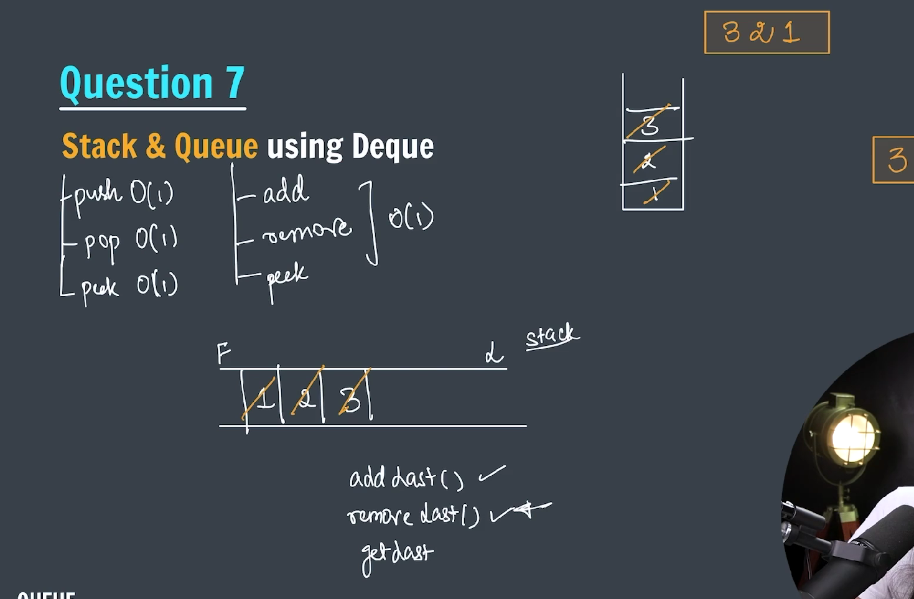

---

```java

import java.util.Deque;
import java.util.LinkedList;

public class StackUsingDeque {
    static class Stack {

        Deque<Integer> deque = new LinkedList<>();

        // isEmpty function
        public boolean isEmpty() {
            return deque.isEmpty();
        }

        // push operation
        public void push(int data) {
            deque.addLast(data);
        }

        // pop operation
        public int pop() {
            return deque.removeLast();
        }

        // peek operation
        public int peek() {
            return deque.getLast();
        }
    }

    public static void main(String[] args) {
        Stack stack = new Stack();

        System.out.println(stack.isEmpty());

        stack.push(1);
        stack.push(2);
        stack.push(3);

        while (!stack.isEmpty()) {
            System.out.println(stack.peek());
            stack.pop();
        }

    }
}
```

### Implement Queue using Deque

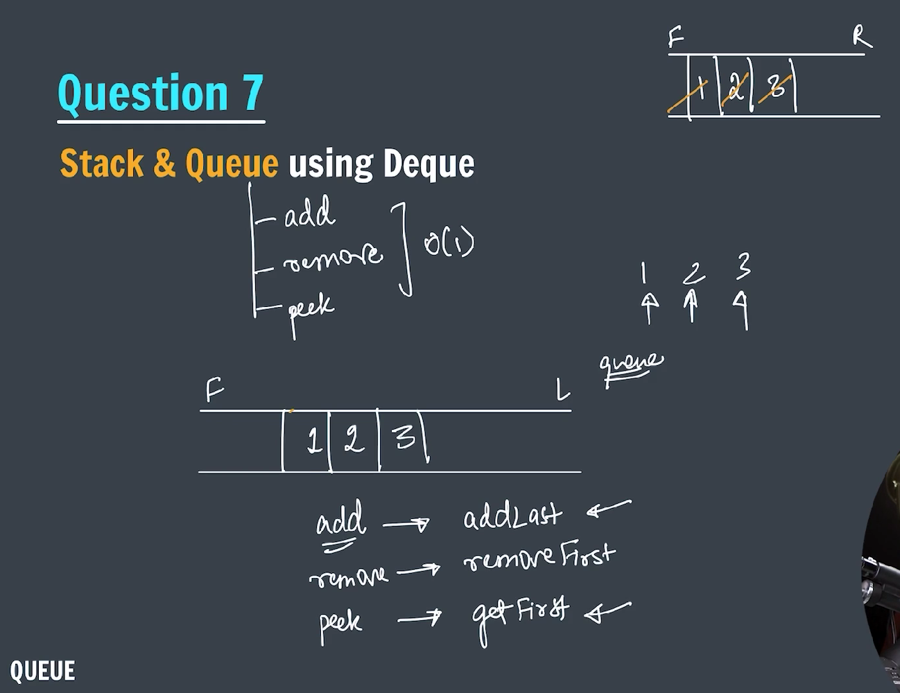

---

```java

import java.util.Deque;
import java.util.LinkedList;

public class QueueUsingDeque {
    static class Queue {
        Deque<Integer> deque = new LinkedList<>();

        // isEmpty function
        public boolean isEmpty() {
            return deque.isEmpty();
        }

        // add function
        public void add(int data) {
            deque.addLast(data);
        }

        // remove function
        public int remove() {
            return deque.removeFirst();
        }

        // peek function
        public int peek() {
            return deque.getFirst();
        }
    }

    public static void main(String[] args) {
        Queue queue = new Queue();

        queue.isEmpty();
        queue.add(1);
        queue.add(2);
        queue.add(3);

        while (!queue.isEmpty()) {
            System.out.println(queue.peek());
            queue.remove();
        }
    }
}
```
