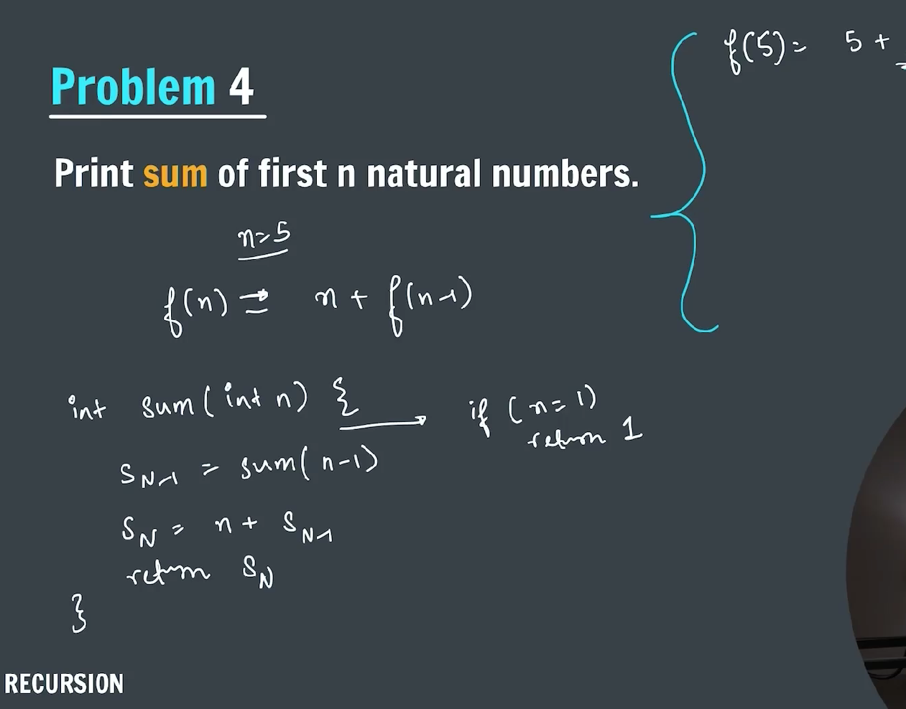
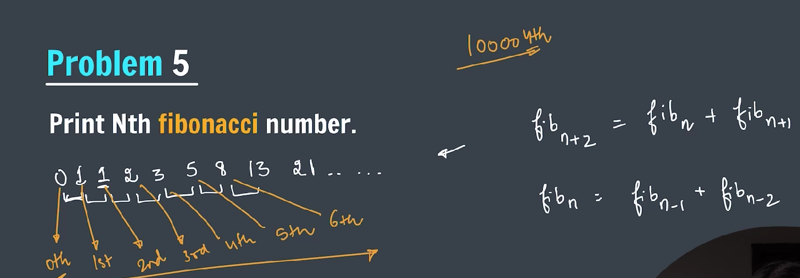
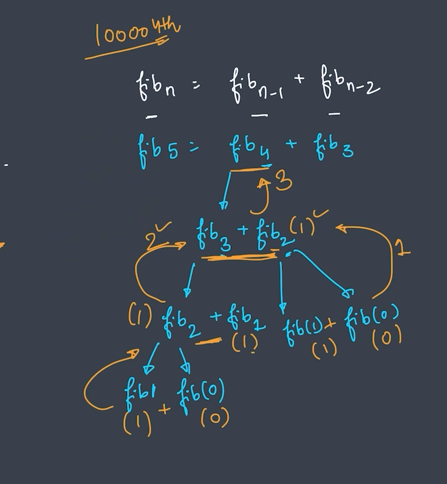
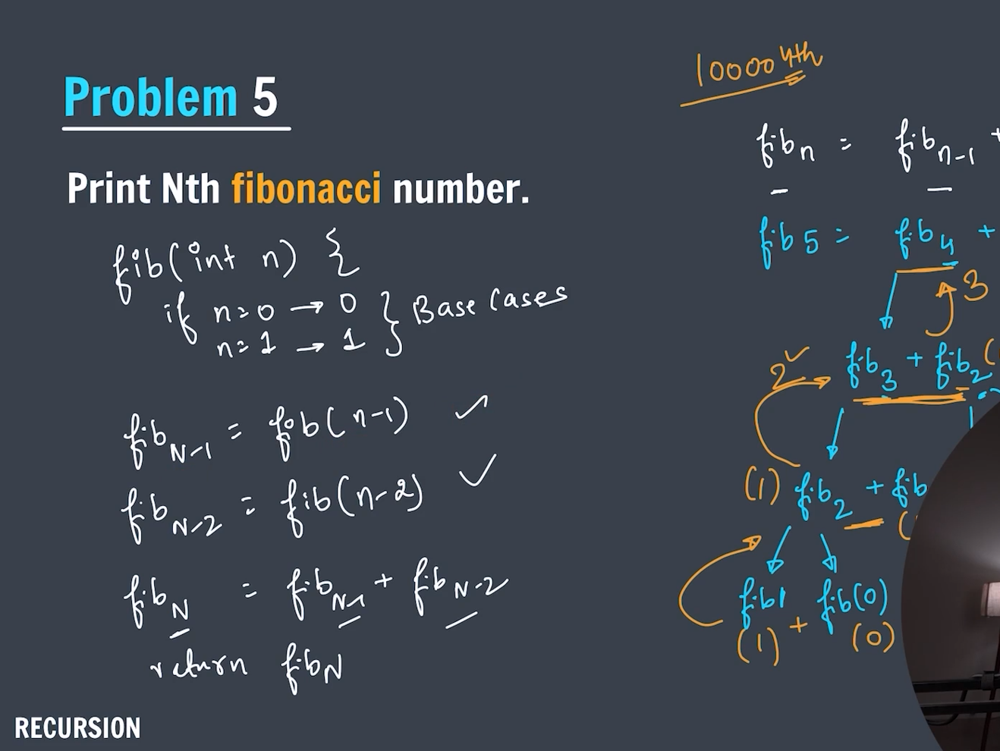
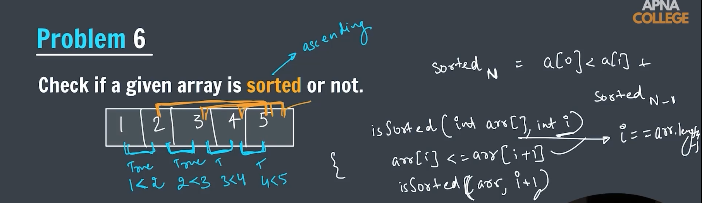
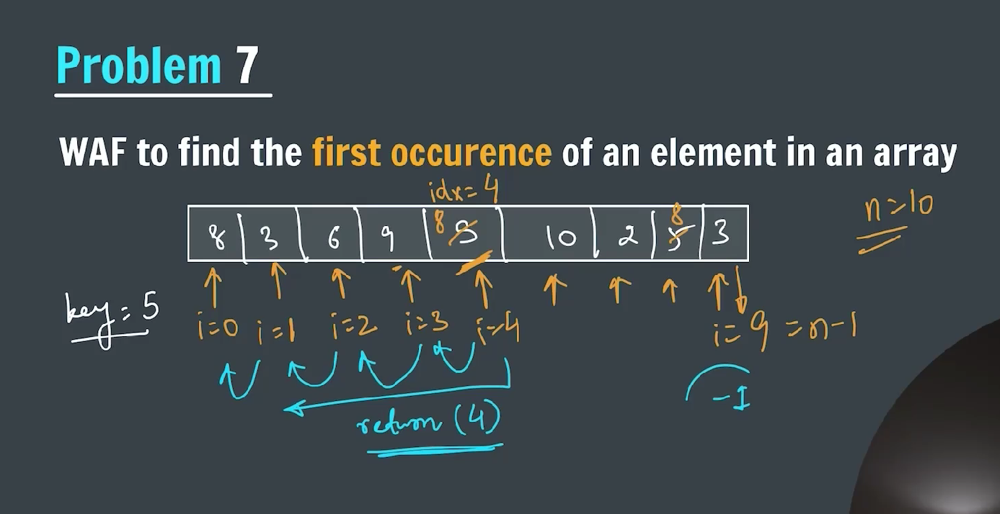

### Recursion -> (Recursion is a method of solving a computational problem where the solution depends on a solutions to smallerinstance of the same problem)

**_-> In other words a function that calls itself_**


**_-> How a recursive function gets called_**


**_-> Three steps in recursive function_**


**_-> Problem to print a number from n to 1 in decreasing order_**


```java
package Recursion;

import java.util.Scanner;

public class printNumberFromNto1 {
    public static void printNumber(int n) {
        if (n == 0) {
            return;
        }

        System.out.print(n + " ");

        printNumber(n - 1);

    }

    public static void main(String[] args) {
        Scanner sc = new Scanner(System.in);
        System.out.print("Enter a number: ");
        int n = sc.nextInt();

        printNumber(n);
        sc.close();
    }
}
```

**_Stack Overflow_**


**_-> Problem to print a number from 1 to n increasing order_**

**_Call Stack_**


```java
package Recursion;

import java.util.Scanner;

public class printNumberFrom1toN {
    public static void printNumber(int n) {

        if (n == 0) {
            return;
        }

        printNumber(n - 1);

        System.out.print(n + " ");

    }

    public static void main(String[] args) {
        Scanner sc = new Scanner(System.in);
        System.out.print("Enter the number: ");
        int n = sc.nextInt();

        printNumber(n);

        sc.close();
    }
}
```

**_-> Problem to calculate the factorial of n_**
**_(0! = 1)_**


```java
package Recursion;

import java.util.Scanner;

public class factorial {
    static int factorialOfN(int n) {
        if (n == 0) {
            return 1;
        }

        return n * factorialOfN(n - 1);
    }

    public static void main(String[] args) {
        Scanner sc = new Scanner(System.in);
        System.out.print("Enter the n for factorial: ");
        int n = sc.nextInt();

        System.out.println("The factorial of " + n + " is: " + factorialOfN(n));

        sc.close();
    }

}
```

**_-> Problem to calculate sum of n natural number_**


```java
package Recursion;

import java.util.Scanner;

public class sumOfNaturalNumber {
    public static int NaturalSum(int n) {

        if (n == 0) {
            return 0;
        }

        return n + (NaturalSum(n - 1));

    }

    public static void main(String[] args) {
        Scanner sc = new Scanner(System.in);
        System.out.print("Enter the value of N: ");
        int n = sc.nextInt();

        System.out.println("Sum of N natural number: " + NaturalSum(n));

        sc.close();
    }
}
```

**_-> Problem to print nth fibonacci number_**




```java
package Recursion;

import java.util.Scanner;

public class fibonacci {
    static int fibonacciNumber(int n) {

        if (n == 0 || n == 1) {
            return n;
        }

        return fibonacciNumber(n - 1) + fibonacciNumber(n - 2);

    }

    public static void main(String[] args) {
        Scanner sc = new Scanner(System.in);
        System.out.print("Enter n to get fibonacci: ");
        int n = sc.nextInt();

        System.out.println("The nth fibonacci number is: " + fibonacciNumber(n));

        sc.close();
    }
}
```

**_-> Problem to check whether the array is sorted or not_**


```java
package Recursion;

import java.util.Scanner;

public class arrayIsSortedOrNot {
    public static boolean isSorted(int arr[], int index) {

        if (arr.length <= 1 || index == arr.length - 1) {
            return true;
        }

        if (arr[index] > arr[index + 1]) {
            return false;
        }

        return isSorted(arr, index + 1);

    }

    public static void main(String args[]) {

        Scanner sc = new Scanner(System.in);
        System.out.print("Enter the size of array: ");
        int n = sc.nextInt();
        System.out.println("Enter the elements in array: ");

        int arr[] = new int[n];

        // arr={12,34,45,56,89};

        for (int i = 0; i < n; i++) {
            arr[i] = sc.nextInt();
        }

        System.out.println(isSorted(arr, 0));

        sc.close();

    }
}
```

**_-> Find the first occurence of the element_**


```java
package Recursion;

import java.util.Scanner;

public class firstOccurence {
    public static int fOccurence(int arr[], int key, int index) {
        if (index == arr.length) {
            return -1;
        }

        if (key == arr[index]) {
            return index;
        }

        return fOccurence(arr, key, index + 1);

    }

    public static void main(String[] args) {

        Scanner sc = new Scanner(System.in);
        System.out.print("Enter key value: ");
        int key = sc.nextInt();
        System.out.print("Enter the length of the array: ");
        int n = sc.nextInt();

        System.out.print("Enter the elements in the array: ");
        int arr[] = new int[n];

        for (int i = 0; i < n; i++) {
            arr[i] = sc.nextInt();
        }

        // arr[] = {8,3,6,9,5,10,2,5,3};

        System.out.println("The first occurence of the element found at: " + fOccurence(arr, key, 0));

        sc.close();

    }
}
```
