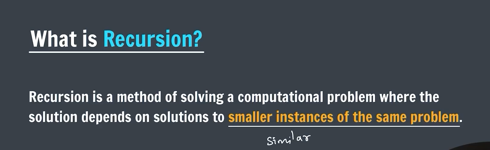
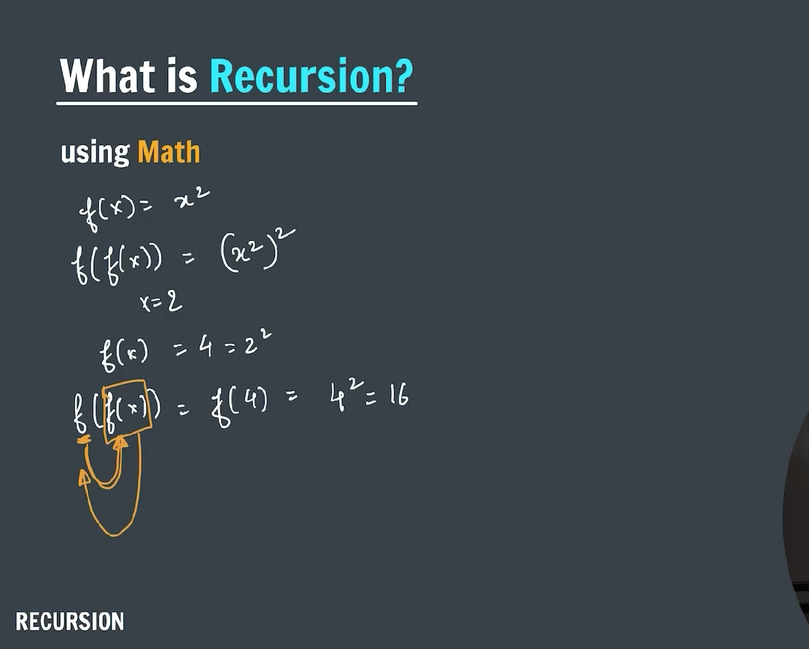
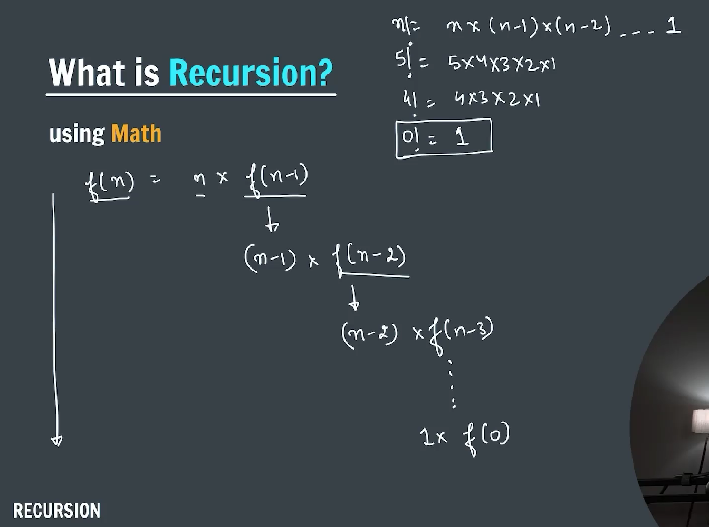
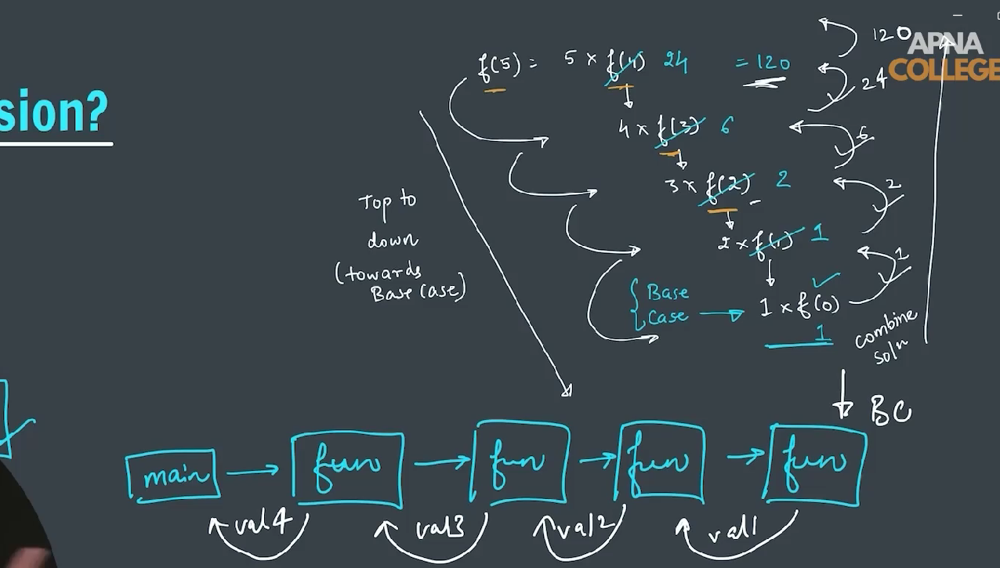
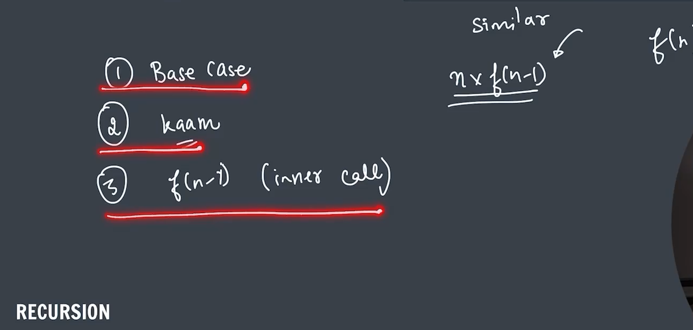
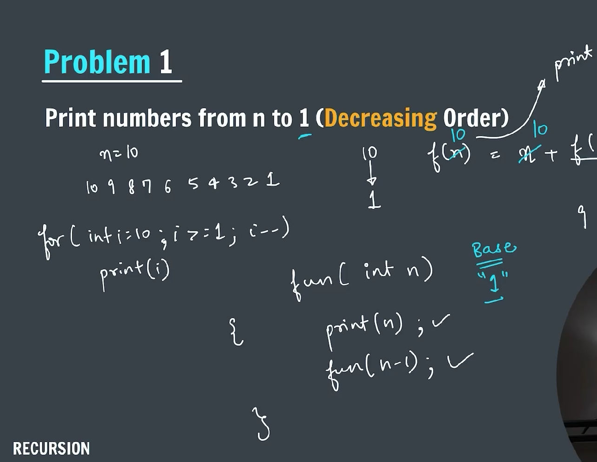
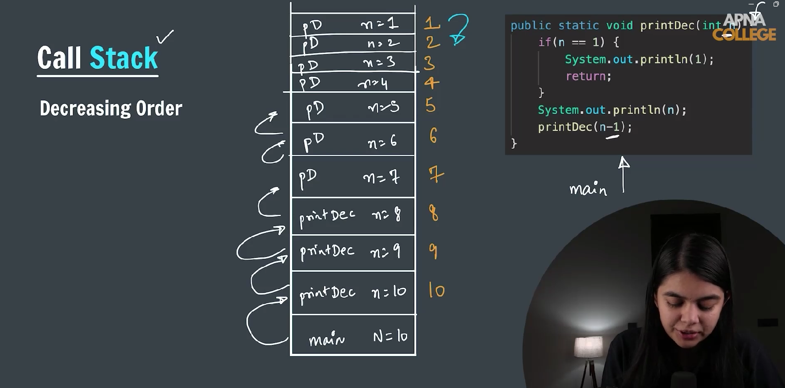
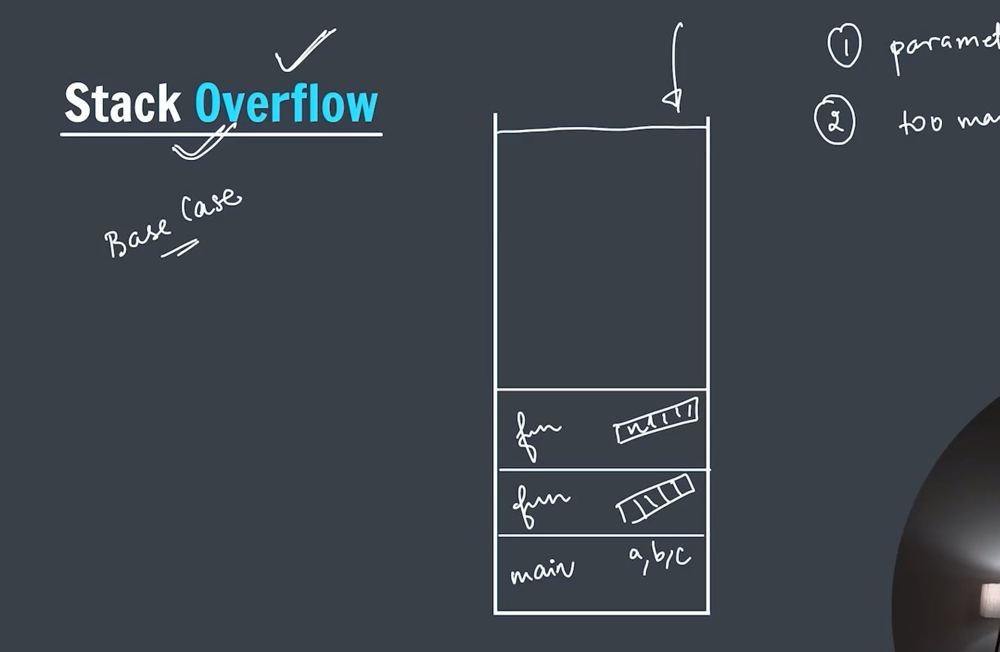
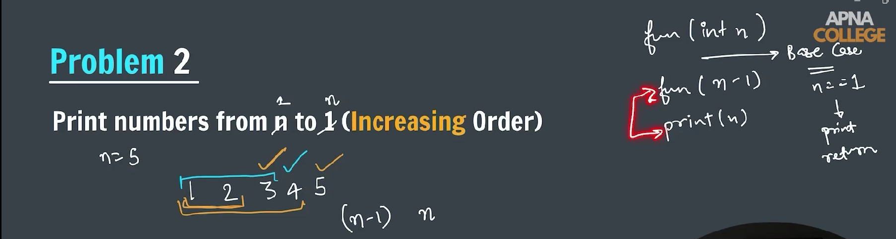
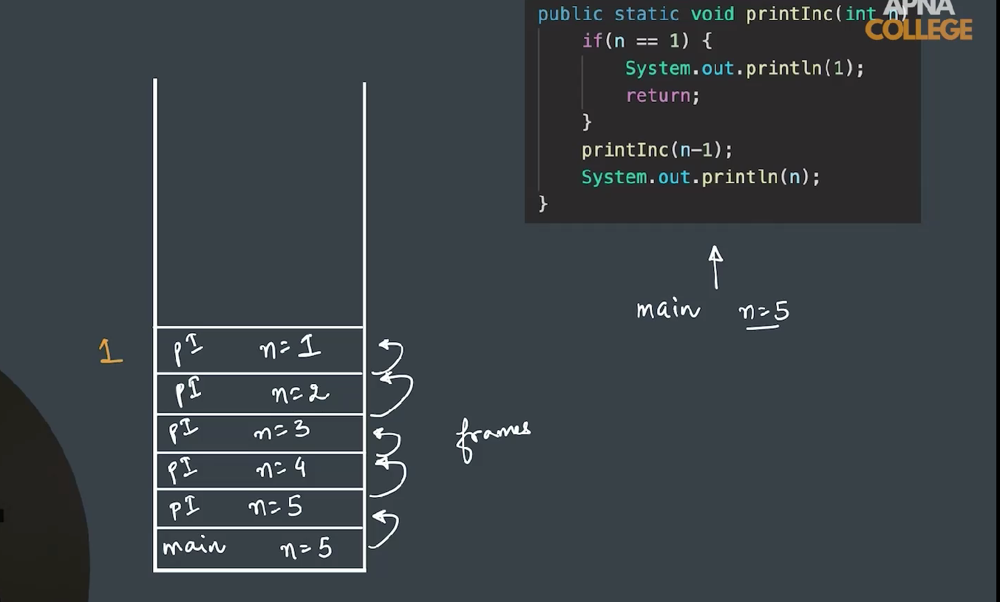

### Recursion -> (Recursion is a method of solving a computational problem where the solution depends on a solutions to smallerinstance of the same problem)





**_-> How a recursive function gets called_**


**_-> Three steps in recursive function_**


**_-> Problem to print a number from n to 1 in decreasing order_**



```java
package Recursion;

import java.util.Scanner;

public class printNumberFromNto1 {
    public static void printNumber(int n) {
        if (n == 0) {
            return;
        }

        System.out.print(n + " ");

        printNumber(n - 1);

    }

    public static void main(String[] args) {
        Scanner sc = new Scanner(System.in);
        System.out.print("Enter a number: ");
        int n = sc.nextInt();

        printNumber(n);
        sc.close();
    }
}
```

**_Stack Overflow_**


**_-> Problem to print a number from 1 to n increasing order_**

**_Call Stack_**


```java
package Recursion;

import java.util.Scanner;

public class printNumberFrom1toN {
    public static void printNumber(int n) {

        if (n == 0) {
            return;
        }

        printNumber(n - 1);

        System.out.print(n + " ");

    }

    public static void main(String[] args) {
        Scanner sc = new Scanner(System.in);
        System.out.print("Enter the number: ");
        int n = sc.nextInt();

        printNumber(n);

        sc.close();
    }
}
```
