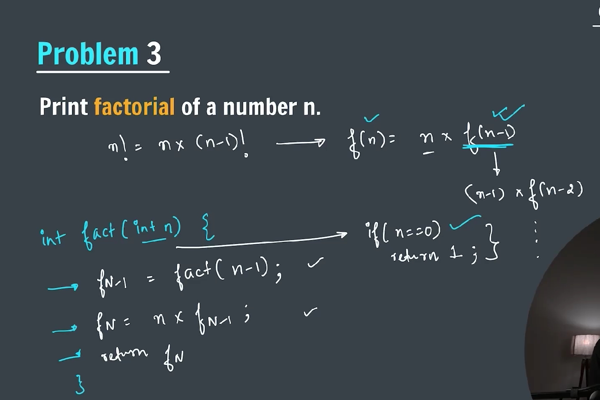

### Recursion -> (Recursion is a method of solving a computational problem where the solution depends on a solutions to smallerinstance of the same problem)

**_-> In other words a function that calls itself_**


**_-> How a recursive function gets called_**


**_-> Three steps in recursive function_**


**_-> Problem to print a number from n to 1 in decreasing order_**


```java
package Recursion;

import java.util.Scanner;

public class printNumberFromNto1 {
    public static void printNumber(int n) {
        if (n == 0) {
            return;
        }

        System.out.print(n + " ");

        printNumber(n - 1);

    }

    public static void main(String[] args) {
        Scanner sc = new Scanner(System.in);
        System.out.print("Enter a number: ");
        int n = sc.nextInt();

        printNumber(n);
        sc.close();
    }
}
```

**_Stack Overflow_**


**_-> Problem to print a number from 1 to n increasing order_**

**_Call Stack_**


```java
package Recursion;

import java.util.Scanner;

public class printNumberFrom1toN {
    public static void printNumber(int n) {

        if (n == 0) {
            return;
        }

        printNumber(n - 1);

        System.out.print(n + " ");

    }

    public static void main(String[] args) {
        Scanner sc = new Scanner(System.in);
        System.out.print("Enter the number: ");
        int n = sc.nextInt();

        printNumber(n);

        sc.close();
    }
}
```

**_-> Problem to calculate the factorial of n_**
**_(0! = 1)_**


```java
package Recursion;

import java.util.Scanner;

public class factorial {
    static int factorialOfN(int n) {
        if (n == 0) {
            return 1;
        }

        return n * factorialOfN(n - 1);
    }

    public static void main(String[] args) {
        Scanner sc = new Scanner(System.in);
        System.out.print("Enter the n for factorial: ");
        int n = sc.nextInt();

        System.out.println("The factorial of " + n + " is: " + factorialOfN(n));

        sc.close();
    }

}
```

**_-> Problem to calculate sum of n natural number_**


```java
package Recursion;

import java.util.Scanner;

public class sumOfNaturalNumber {
    public static int NaturalSum(int n) {

        if (n == 0) {
            return 0;
        }

        return n + (NaturalSum(n - 1));

    }

    public static void main(String[] args) {
        Scanner sc = new Scanner(System.in);
        System.out.print("Enter the value of N: ");
        int n = sc.nextInt();

        System.out.println("Sum of N natural number: " + NaturalSum(n));

        sc.close();
    }
}
```

**_-> Problem to print nth fibonacci number_**


```java
package Recursion;

import java.util.Scanner;

public class fibonacci {
    static int fibonacciNumber(int n) {

        if (n == 0 || n == 1) {
            return n;
        }

        return fibonacciNumber(n - 1) + fibonacciNumber(n - 2);

    }

    public static void main(String[] args) {
        Scanner sc = new Scanner(System.in);
        System.out.print("Enter n to get fibonacci: ");
        int n = sc.nextInt();

        System.out.println("The nth fibonacci number is: " + fibonacciNumber(n));

        sc.close();
    }
}
```
