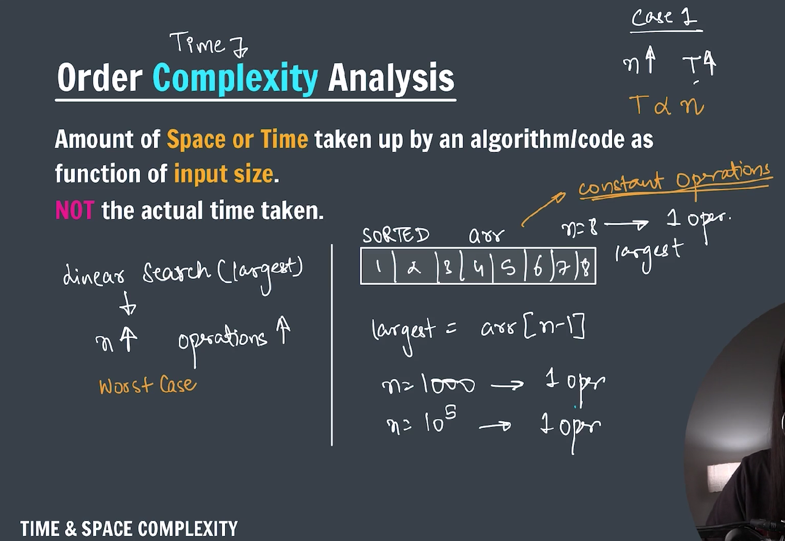
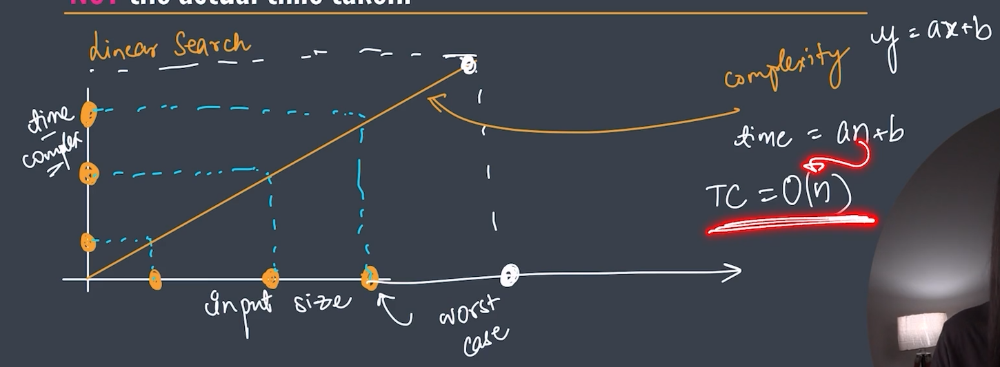
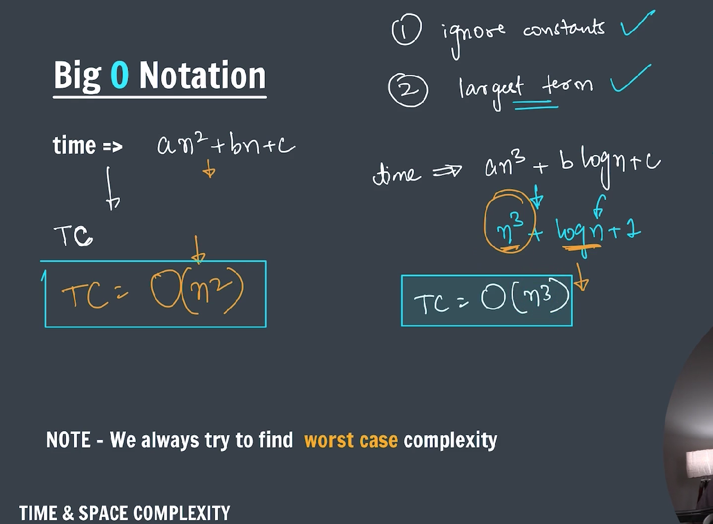

### Time and Space complexity(TC)

---

### Time Complexity(TC) :

**_-> The amount of time taken by an algorithm/code based on input size is Time Complexity_**

---

### Space Complexity(SC) :

**_-> The amount of space taken by an algorithm/code based on input is Space Complexity_**

#### Time is directly proportional to number: $t \propto n$

---

**Big O notation(Upper bound)** is a mathematical concept used in computer science to describe the **performance or complexity** of an algorithm in terms of time or space as the input size grows.

---

### 🔹 **What Does Big O Measure?**

It primarily measures:

1. **Time Complexity** – how the runtime grows as input size increases.
2. **Space Complexity** – how the memory usage grows with input size.

---

### 🔹 **Why Use Big O?**

To understand:

- **Scalability** of algorithms.
- How they perform with **large inputs**.
- Which algorithms are **more efficient**.

---

### 🔹 **How It Works:**

Big O expresses the **upper bound** of an algorithm's growth rate.

For example:

- If an algorithm takes time proportional to `n`, we say it's **O(n)**.
- If it takes time proportional to `n²`, we say it's **O(n²)**.

---

### 🔹 **Common Big O Complexities (from best to worst):**

| Complexity | Name             | Example                                  |
| ---------- | ---------------- | ---------------------------------------- |
| O(1)       | Constant time    | Accessing an array element               |
| O(log n)   | Logarithmic time | Binary search                            |
| O(n)       | Linear time      | Loop through array                       |
| O(n log n) | Log-linear time  | Merge sort, quicksort (average)          |
| O(n²)      | Quadratic time   | Bubble sort, nested loops                |
| O(2ⁿ)      | Exponential time | Solving traveling salesman (brute force) |
| O(n!)      | Factorial time   | Solving all permutations                 |

---

### 🔹 **Key Points:**

- Big O ignores **constants and lower-order terms**.
  - `O(2n)` is still **O(n)**.
  - `O(n + log n)` is **O(n)**.
- It describes the **worst-case scenario** (usually).

---

