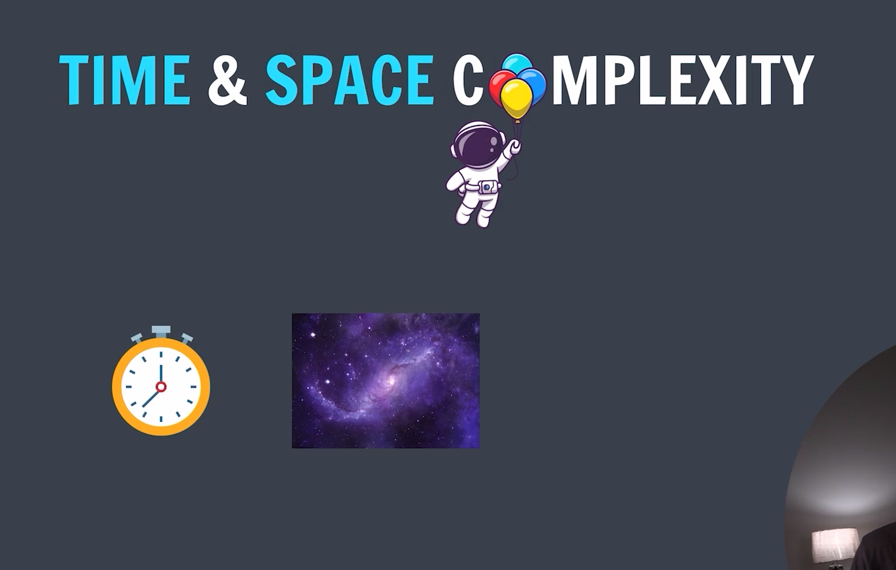

### Time and Space complexity(TC)

### Time Complexity(TC) :

**_-> The amount of time taken by an algorithm/code based on input size is Time Complexity_**

### Space Complexity(SC) :

**_-> The amount of space taken by an algorithm/code based on input is Space Complexity_**

#### Time is directly proportional to number: $t \propto n$
