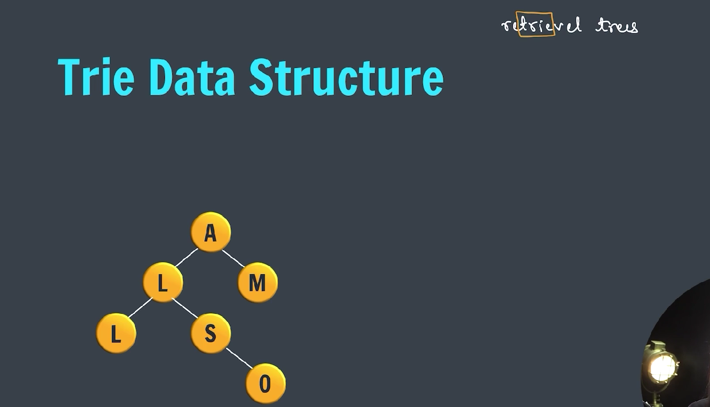
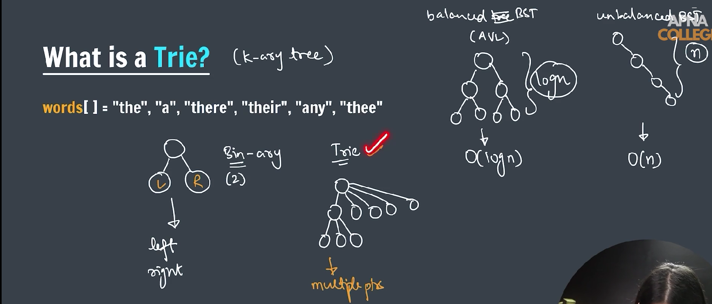
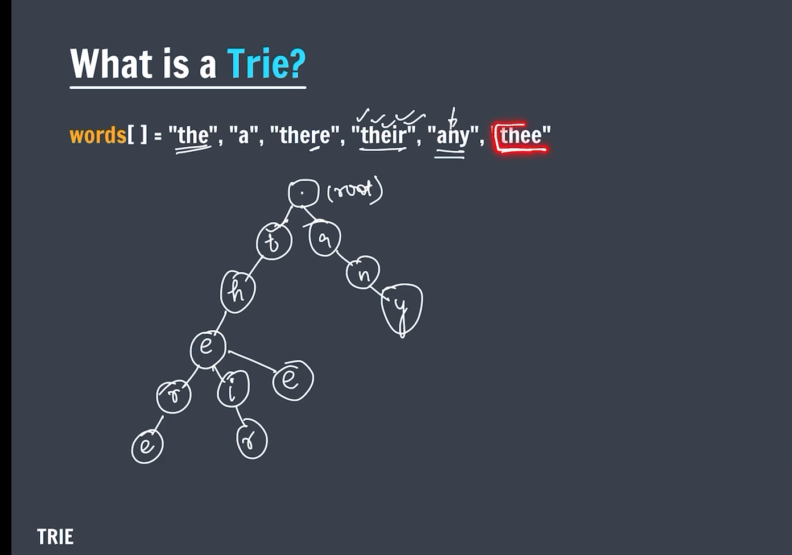
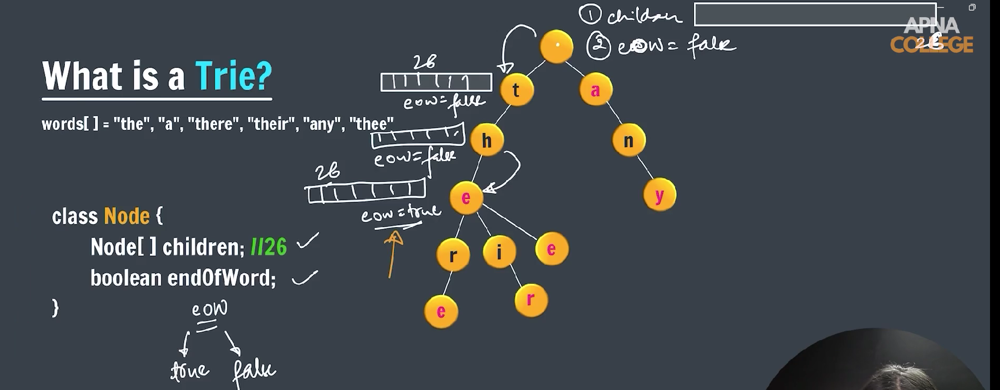
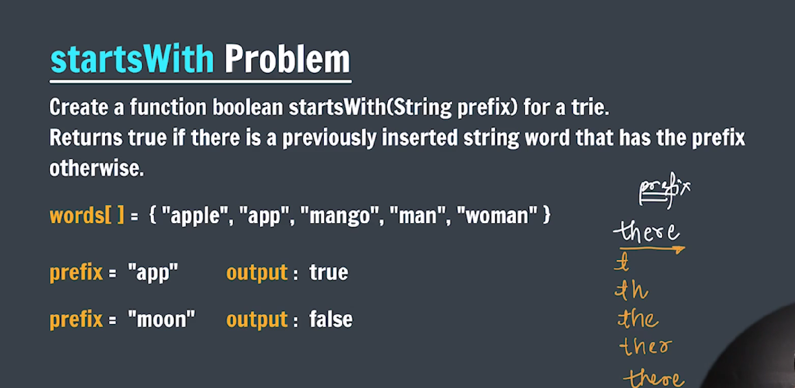
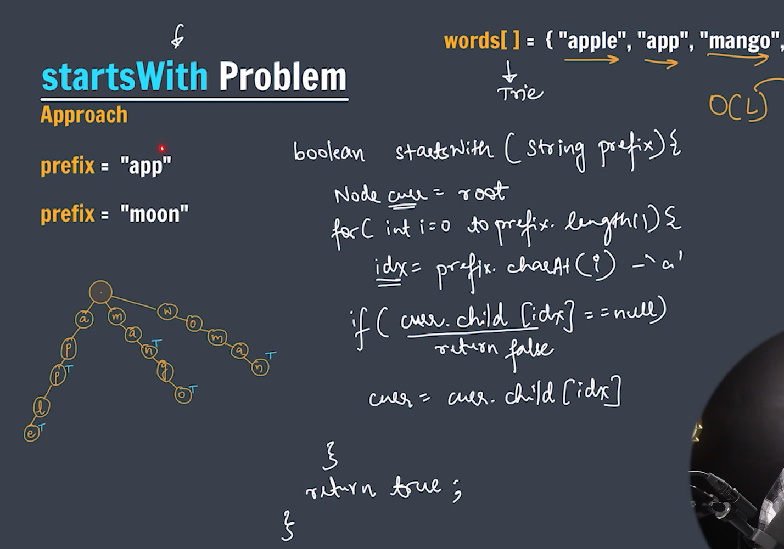

### Trie Data Structure



---



---



---

### What is a Trie?

- A **Trie** (pronounced “try”) is a special tree-like data structure used to store collections of strings.
- It’s also called a **prefix tree** because it stores keys (usually words) by their prefixes.
- Each node represents a character of a word.
- Words with common prefixes share the same path from the root to those prefix nodes.

---

### How does it work?

- You start at the root node, which is empty.
- For each character in a word, you move down a child node corresponding to that character.
- If the child node doesn’t exist, you create it.
- Once you reach the end of the word, you mark that node to indicate a word ends there.
- This way, you can quickly check if a word exists or if any word starts with a certain prefix.

---

### Why use a Trie?

- **Fast lookups:** Searching for words or prefixes is very efficient.
- **Autocomplete:** Easily find all words that start with a given prefix.
- **Spell-checking:** Quickly verify if a word exists.
- **Memory:** It can save memory when many words share prefixes.

---

### Trie Implementation



---

```java

public class Trie {

    static class Node {
        Node children[] = new Node[26];
        boolean eow = false;

        Node() {
            for (int i = 0; i < 26; i++) {
                children[i] = null;
            }
        }
    }

    public static Node root = new Node();

    public static void insert(String word) { // O(L)
        Node curr = root;

        for (int level = 0; level < word.length(); level++) {
            int idx = word.charAt(level) - 'a';

            if (curr.children[idx] == null) {
                curr.children[idx] = new Node();
            }
            curr = curr.children[idx];
        }

        curr.eow = true;
    }

    public static boolean search(String key) {
        Node curr = root;

        for (int level = 0; level < key.length(); level++) {
            int idx = key.charAt(level) - 'a';

            if (curr.children[idx] == null) {
                return false;
            }

            curr = curr.children[idx];
        }

        return curr.eow == true;
    }

    public static boolean startsWith(String prefix) {
        Node curr = root;

        for (int level = 0; level < prefix.length(); level++) {
            int idx = prefix.charAt(level) - 'a';
            if (curr.children[idx] == null) {
                return false;
            }

            curr = curr.children[idx];
        }

        return true;
    }

    public static void main(String args[]) {

        String words[] = { "the", "a", "there", "their", "any", "thee" };

        for (int i = 0; i < words.length; i++) {
            insert(words[i]);
        }

        System.out.println(search("thee"));
        System.out.println(search("thor"));
        System.out.println(search("any"));
        System.out.println(search("an"));

        System.out.println(startsWith("th"));
        System.out.println(startsWith("the"));

    }
}
```

---

### Trie Starts With Problem



---



---

```java

public class StartWithTrie {

    static class Node {
        Node children[] = new Node[26];
        boolean eow = false;

        Node() {
            for (int i = 0; i < 26; i++) {
                children[i] = null;
            }
        }
    }

    public static Node root = new Node();

    static void insert(String word) {
        Node curr = root;

        for (int level = 0; level < word.length(); level++) {
            int idx = word.charAt(level) - 'a';
            if (curr.children[idx] == null) {
                curr.children[idx] = new Node();
            }

            curr = curr.children[idx];
        }

        curr.eow = true;
    }

    static boolean startsWith(String prefix) {
        Node curr = root;

        for (int level = 0; level < prefix.length(); level++) {
            int idx = prefix.charAt(level) - 'a';
            if (curr.children[idx] == null) {
                return false;
            }
            curr = curr.children[idx];
        }

        return true;
    }

    public static void main(String[] args) {

        String words[] = { "apple", "app", "mango", "man", "woman" };

        for (int i = 0; i < words.length; i++) {
            insert(words[i]);
        }

        System.out.println(startsWith("app"));
    }
}
```
