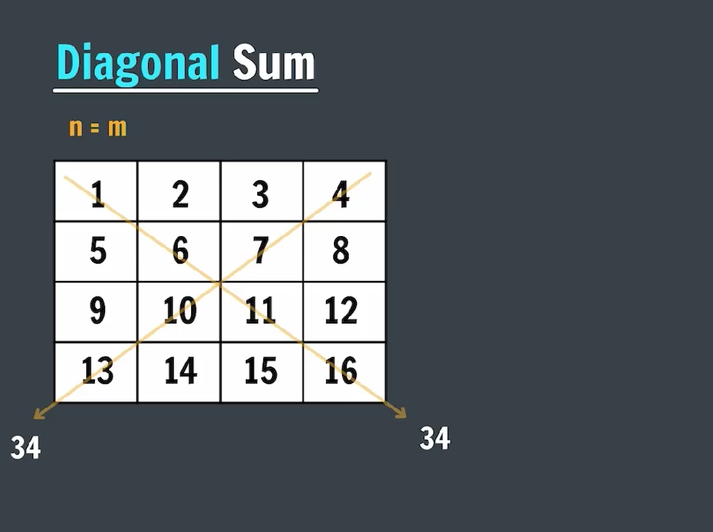
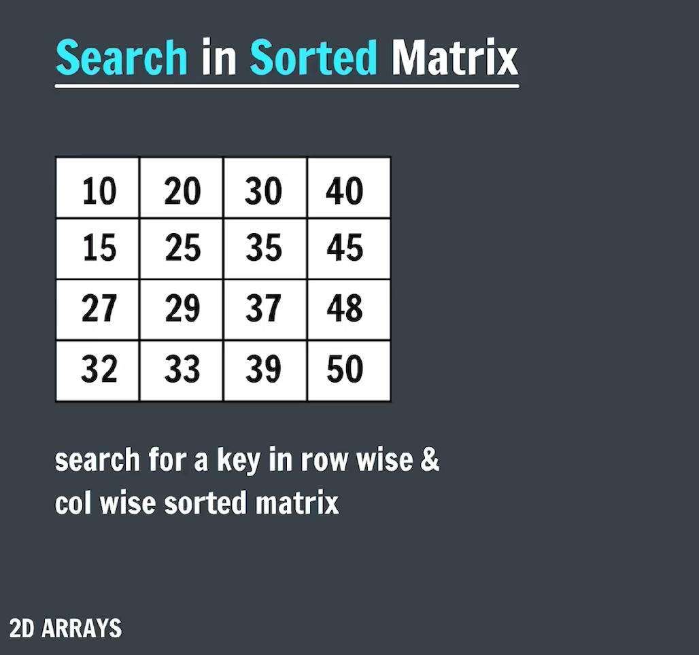

### 2D Array

#### -> 2D array is a two-dimensional array consiting of rows and columns


### Real life examples of 2D Array


### Representation of 2D Array


#### -> Creation of 2D Array

```java
package Two2DArray;

import java.util.Scanner;

public class CreationOf2DArray {
    public static void main(String[] args) {

        int arr[][] = new int[3][4];

        Scanner sc = new Scanner(System.in);
        System.out.println("Enter the elements of the 2D array: ");
        for (int i = 0; i < 3; i++) {
            for (int j = 0; j < 3; j++) {
                arr[i][j] = sc.nextInt();
            }
        }

        System.out.println("The elements of the 2D array are: ");
        for (int i = 0; i < 3; i++) {
            for (int j = 0; j < 3; j++) {
                System.out.print(arr[i][j] + " ");
            }
            System.out.println();
        }

        sc.close();

    }
}
```

### 2D Array in memory


#### -> Spiral Matrix


#### CODE

```java
package Two2DArray;

public class spiral {

    public static void spiralPrint(int arr[][]) {
        int startRow = 0;
        int startCol = 0;
        int endRow = arr.length - 1;
        int endCol = arr[0].length - 1;

        while (startRow <= endRow && startCol <= endCol) {
            // top
            for (int j = startCol; j <= endCol; j++) {
                System.out.print(arr[startRow][j] + " ");
            }

            // right
            for (int i = startRow + 1; i <= endRow; i++) {
                System.out.print(arr[i][endCol] + " ");
            }

            // bottom
            for (int j = endCol - 1; j >= startCol; j--) {
                System.out.print(arr[endRow][j] + " ");
            }

            // left
            for (int j = endRow - 1; j >= startRow + 1; j--) {
                System.out.print(arr[j][startCol] + " ");
            }

            startRow++;
            startCol++;
            endRow--;
            endCol--;
        }
    }

    public static void main(String[] args) {
        int arr[][] = {
                { 1, 2, 3, 4 },
                { 5, 6, 7, 8 },
                { 9, 10, 11, 12 },
                { 13, 14, 15, 16 }
        };

        System.out.println("Spiral Print of the 2D array: ");
        spiralPrint(arr);
    }
}
```

#### -> Diagonal Sum of 2D matrix



```java
package Two2DArray;

import java.util.Scanner;

public class diagonalSum {
    public static void main(String[] args) {
        Scanner sc = new Scanner(System.in);
        System.out.println("Enter the number of rows and columns of the square matrix: ");
        System.out.print("Rows: ");
        int n = sc.nextInt();
        System.out.print("Columns: ");
        int m = sc.nextInt();

        int arr[][] = new int[n][m];
        System.out.println("Enter the elements of the 2D array: ");
        for (int i = 0; i < n; i++) {
            for (int j = 0; j < m; j++) {
                arr[i][j] = sc.nextInt();
            }
        }

        for (int i = 0; i < n; i++) {
            for (int j = 0; j < m; j++) {
                System.out.print(arr[i][j] + " ");
            }
            System.out.println();
        }

        int sum = 0;
        for (int i = 0; i < n; i++) {
            for (int j = 0; j < m; j++) {
                if (i == j) {
                    sum = sum + arr[i][j];
                } else if (i + j == n - 1) {
                    sum += arr[i][j];
                }
            }
        }

        System.out.println("The sum of the diagonal elements is: " + sum);
        sc.close();

    }
}
```

#### -> Search in 2D sorted array



```java
package Two2DArray;

import java.util.Scanner;

public class searchInSortedMatrix {

    public static boolean stairCaseSearch(int[][] arr, int key) {
        int row = 0, col = arr[0].length - 1;

        while (row < arr.length && col >= 0) {
            if (arr[row][col] == key) {
                System.out.println("Element found at position: (" + row + ", " + col + ")");
                return true;
            } else if (key < arr[row][col]) {
                col--;
            } else {
                row++;
            }
        }

        return false;
    }

    public static void main(String[] args) {
        Scanner sc = new Scanner(System.in);
        System.out.println("Enter the number of rows and columns of the matrix: ");
        System.out.print("Rows: ");
        int n = sc.nextInt();
        System.out.print("Column: ");
        int m = sc.nextInt();

        int arr[][] = new int[n][m];
        System.out.println("Enter the elements of the 2D Array: ");
        for (int i = 0; i < n; i++) {
            for (int j = 0; j < m; j++) {
                arr[i][j] = sc.nextInt();
            }
        }

        System.out.println("The elements of the 2D Array are: ");
        for (int i = 0; i < n; i++) {
            for (int j = 0; j < m; j++) {
                System.out.print(arr[i][j] + " ");
            }
            System.out.println();
        }

        System.out.print("Enter the element to search: ");
        int key = sc.nextInt();

        if (stairCaseSearch(arr, key)) {
            System.out.println("Element found");
        } else {
            System.out.println("Element not found");
        }

        sc.close();
    }
}
```
