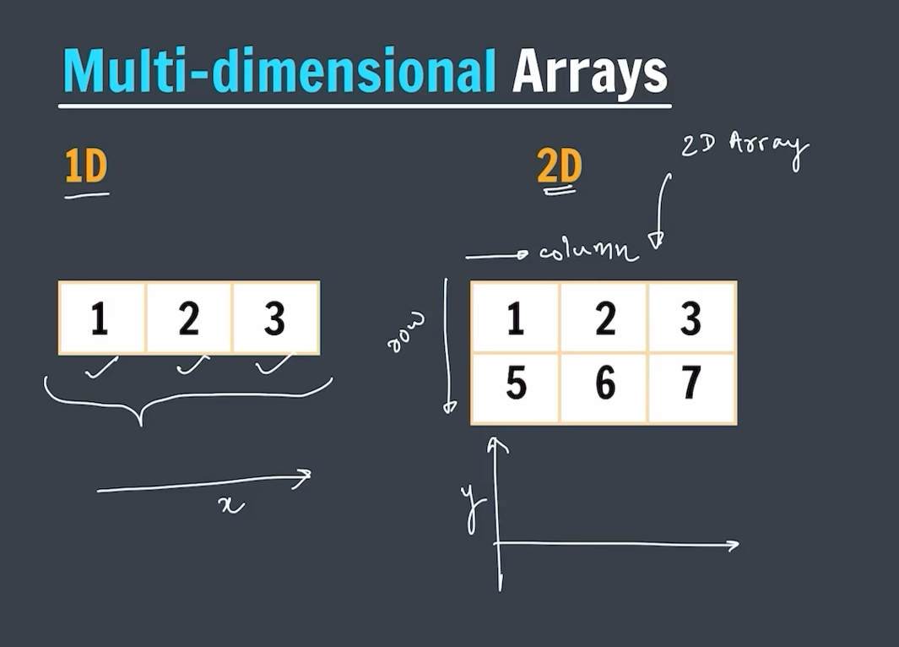
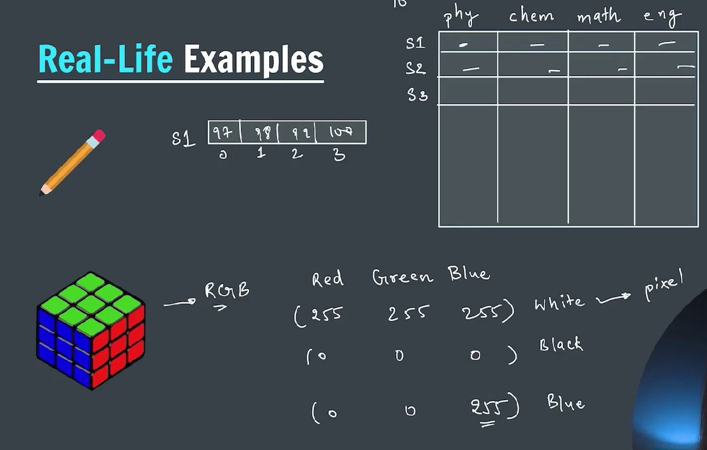
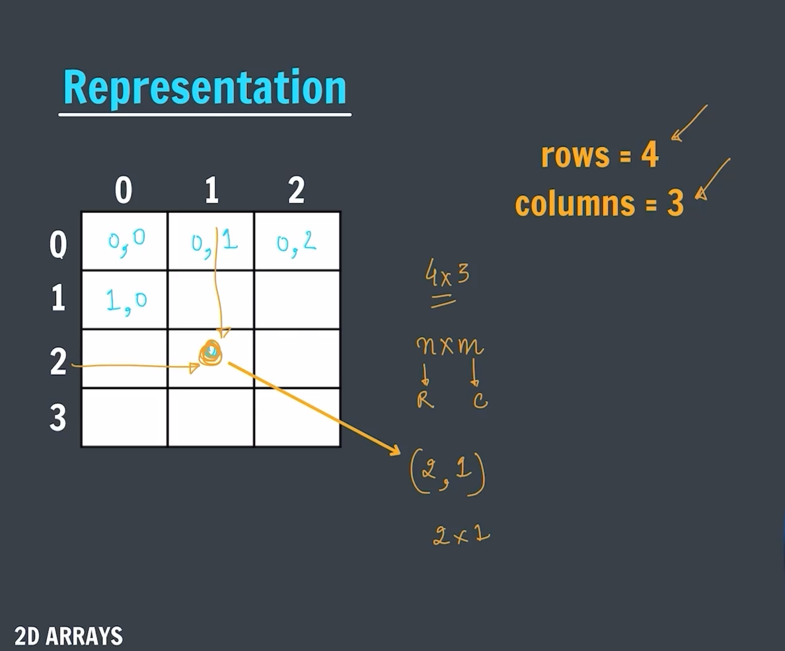
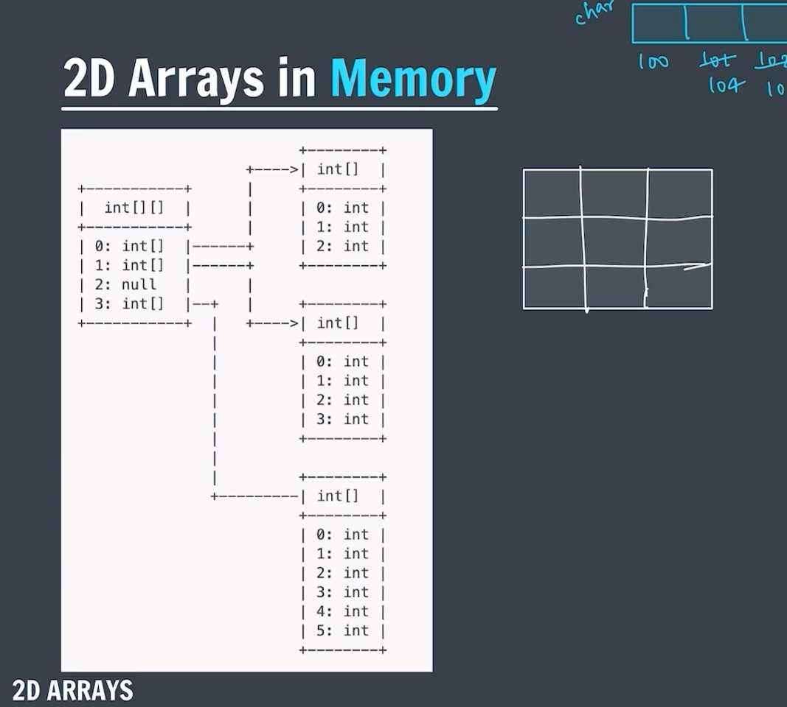
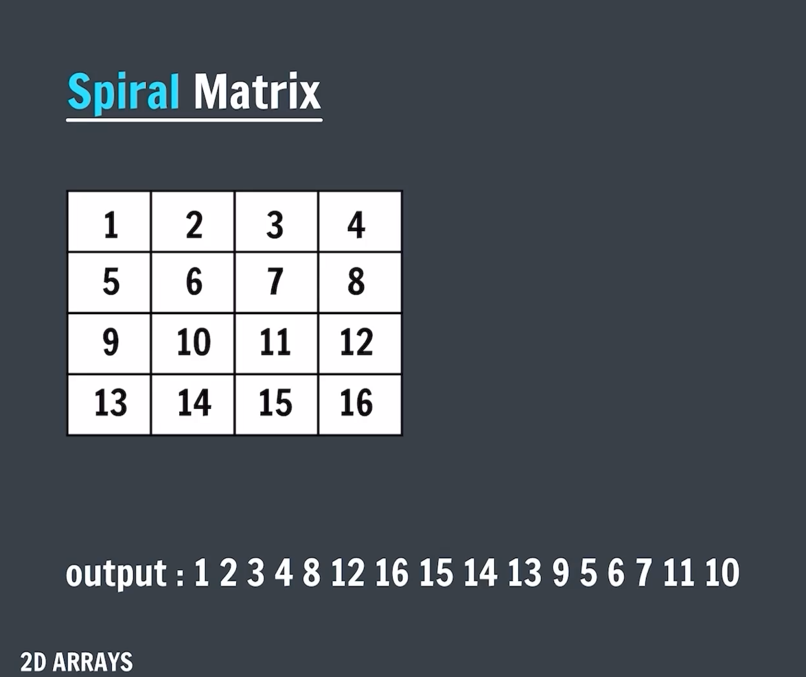

### 2D Array

#### -> 2D array is a two-dimensional array consiting of rows and columns



### Real life examples of 2D Array



### Representation of 2D Array



#### -> Creation of 2D Array

```java
package Two2DArray;

import java.util.Scanner;

public class CreationOf2DArray {
    public static void main(String[] args) {

        int arr[][] = new int[3][4];

        Scanner sc = new Scanner(System.in);
        System.out.println("Enter the elements of the 2D array: ");
        for (int i = 0; i < 3; i++) {
            for (int j = 0; j < 3; j++) {
                arr[i][j] = sc.nextInt();
            }
        }

        System.out.println("The elements of the 2D array are: ");
        for (int i = 0; i < 3; i++) {
            for (int j = 0; j < 3; j++) {
                System.out.print(arr[i][j] + " ");
            }
            System.out.println();
        }

        sc.close();

    }
}
```

### 2D Array in memory



#### -> Spiral Matrix


