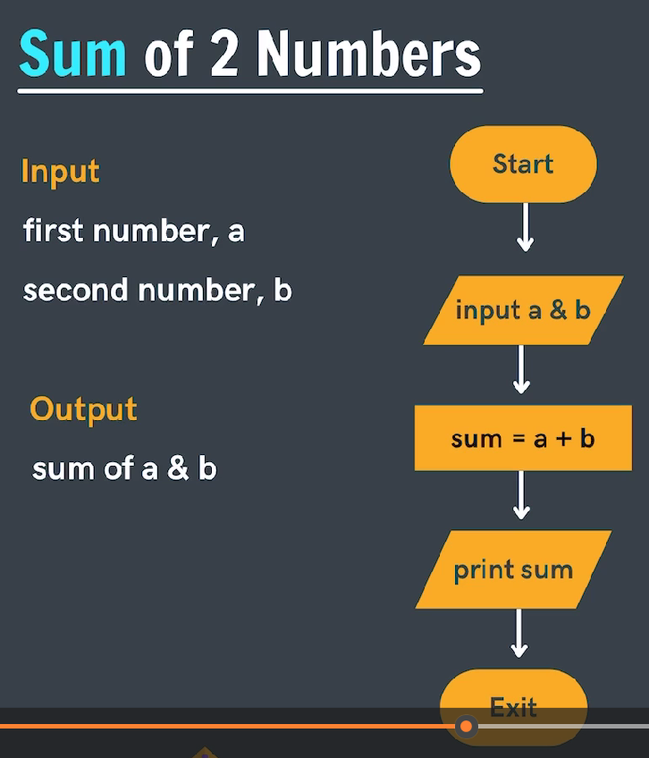
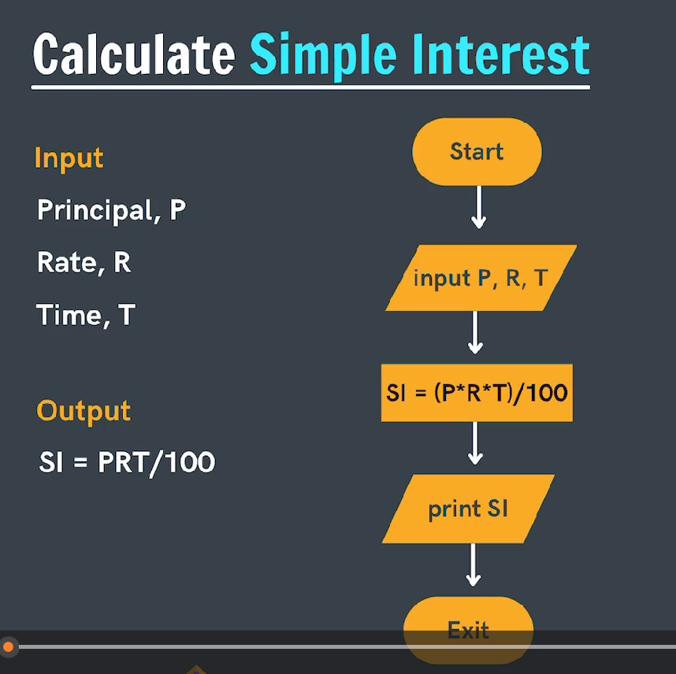
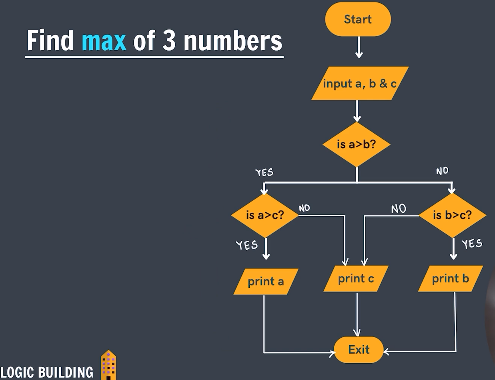

# Flowchart Components

This document outlines common components used in flowcharts, as depicted in the provided image.

## 1. Start/Exit

- **Shape:** Oval
- **Purpose:** Represents the beginning or end of a flowchart.
- **Example:** "Start"

## 2. Input/Output

- **Shape:** Parallelogram
- **Purpose:** Represents operations where data is input into the system or output from the system.
- **Examples:**
  - "Read N" (Input)
  - "Print 'Hi'" (Output)

## 3. Process

- **Shape:** Rectangle
- **Purpose:** Represents a set of operations that change value, form, or location of data. It's an action or function performed.
- **Example:** "name = 'Shradha'"

## 4. Decision

- **Shape:** Diamond
- **Purpose:** Represents a point where a decision is made, typically a question with "yes/no" or "true/false" answers, leading to different paths.
- **Example:** "is marks>33?"




# Java Program to Calculate the Sum of Two Numbers

This Java program prompts the user to enter two integer numbers and then calculates and displays their sum.

```java
package flowchart;

import java.util.Scanner;

public class sum_of_two_number {
    public static void main(String[] args) {
        // Create a Scanner object to read input from the console
        Scanner sc = new Scanner(System.in);

        // Prompt the user for the first number and read it
        System.out.println("Enter first number: ");
        int a = sc.nextInt();

        // Prompt the user for the second number and read it
        System.out.println("Enter second number: ");
        int b = sc.nextInt();

        // Calculate the sum of the two numbers
        int sum = a + b;

        // Print the calculated sum to the console
        System.out.println("The sum of two number is: " + sum);

        // Close the scanner to release system resources
        sc.close();
    }
}
```



# Java Program to Calculate Simple Interest

This Java program calculates the simple interest based on the principal amount, rate of interest, and time period provided by the user.

## Formula Used:

Simple Interest (SI) = (Principal × Rate × Time) / 100

```java
package flowchart;

import java.util.Scanner;

public class simple_interest {
    public static void main(String[] args) {
        // Create a Scanner object to read input from the console
        Scanner sc = new Scanner(System.in);

        // Prompt the user for the principal amount and read it
        System.out.print("Enter principal amount: ");
        double principal = sc.nextDouble();

        // Prompt the user for the rate of interest and read it
        System.out.print("Enter rate of interest: ");
        double rate = sc.nextDouble();

        // Prompt the user for the time period and read it
        System.out.print("Enter time period: ");
        double time = sc.nextDouble();

        // Calculate the simple interest using the formula
        double SI = (principal * rate * time) / 100;

        // Print the calculated simple interest to the console
        System.out.println("The simple interest is: " + SI);

        // Close the scanner to release system resources
        sc.close();
    }
}
```



# Java Program to Find the Maximum of Three Numbers

This Java program takes three integer inputs from the user and then determines and prints the largest among them.

```java
package flowchart;

import java.util.Scanner;

public class max_of_3 {
    public static void main(String[] args) {
        Scanner sc = new Scanner(System.in);
        System.out.print("Enter first number: ");
        int a = sc.nextInt();
        System.out.print("Enter second number: ");
        int b = sc.nextInt();
        System.out.print("Enter third number: ");
        int c = sc.nextInt();

        int max;
        // Using if-else if-else to find the maximum
        if (a > b && a > c) {
            max = a;
        } else if (b > a && b > c) {
            max = b;
        } else {
            max = c;
        }
        System.out.println("The maximum of the three number is: " + max);
        sc.close(); // Closing the scanner to prevent resource leaks
    }
}
```
