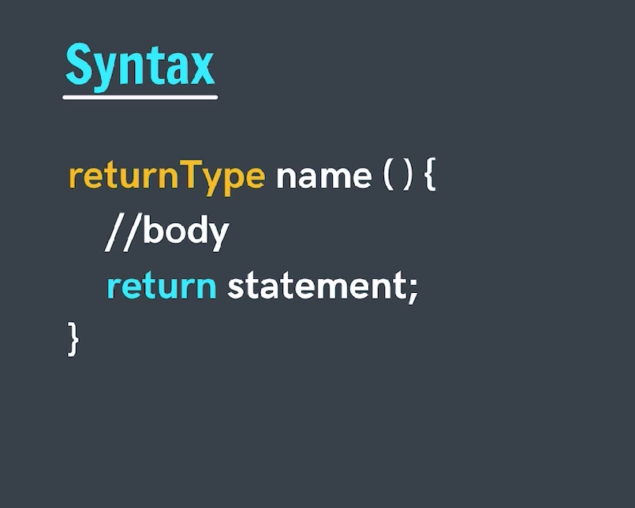
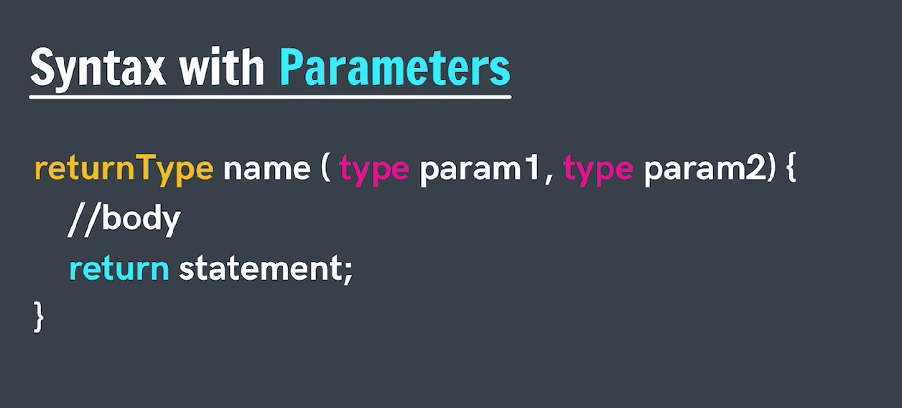
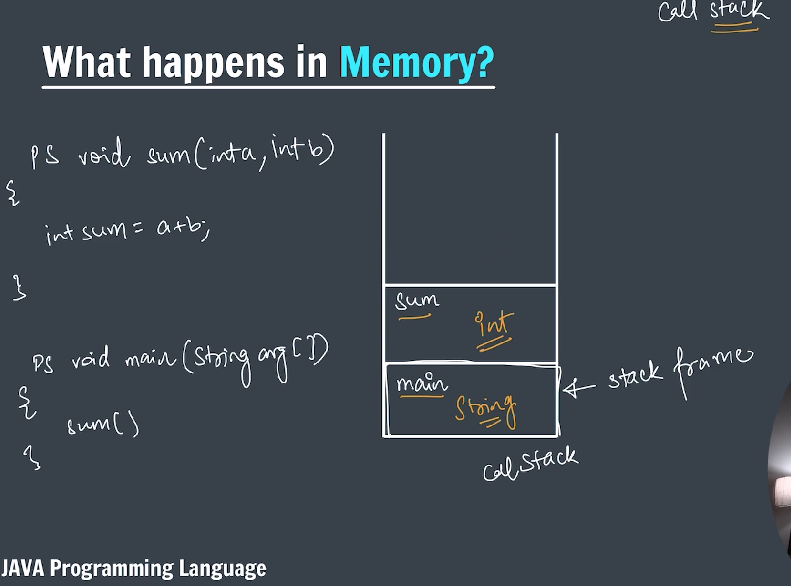
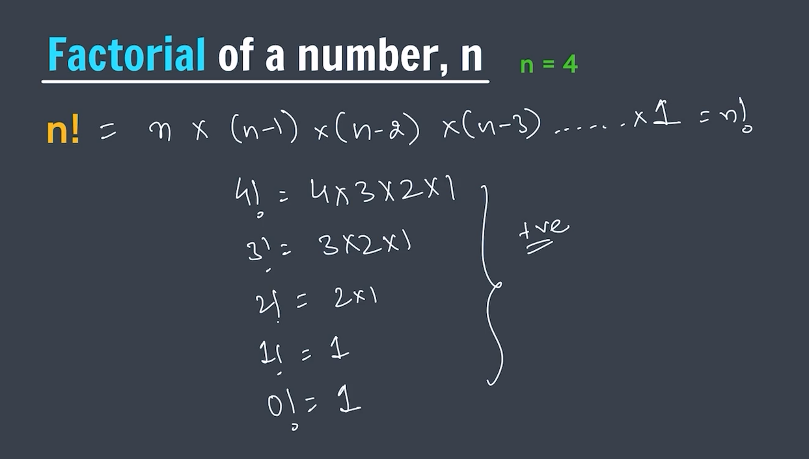

# FUNCTIONS OR METHODS

**In general English, "function" means some work.**

**_In Java, a function (more accurately called a method) is a block of code that can be reused._**


### SYNTAX



**_Functions without parameter:_**

```java
package functionsAndMethods;

public class functionsWithoutPara {

    public static void printHello() {
        System.out.println("Hello, World!");
        System.out.println("Hello, World!");
        System.out.println("Hello, World!");
    }

    public static void main(String[] args) {

        // Calling the function
        printHello();

    }
}

```

**_Functions with parameter_**


CODE

```java
package functionsAndMethods;

import java.util.Scanner;

public class functionwithpara {

    // Function to add two numbers
    public static int calculateSum(int a, int b) {
        return a + b;
    }

    public static void main(String[] args) {
        Scanner sc = new Scanner(System.in);
        System.out.print("Enter the first number: ");
        int a = sc.nextInt();
        System.out.print("Enter the second number: ");
        int b = sc.nextInt();
        int sum = calculateSum(a, b);
        System.out.println("The sum of " + a + " and " + b + " is: " + sum);
        sc.close();
    }
}


```



**_Java always Call by value_**

```java
package functionsAndMethods;

public class callByValue {

    public static void swap(int a, int b) {
        // swap by the help of temprary variable
        int temp = a;
        a = b;
        b = temp;

        // swap without using temporary variable
        /*
         * a = a + b;
         * b = a - b;
         * a = a - b;
         */

        /*
         * This function swaps the values of a and b, but since Java is a pass-by-value
         * (call-by-value)
         * language, the original values of a and b in the main method remain unchanged.
         */

        System.out.println("The value of a and b in the swap functin");
        System.out.println("A = " + a);
        System.out.println("B = " + b);

    }

    public static void main(String[] args) {
        int a = 5;
        int b = 10;

        // calling swap function
        swap(a, b); /*
                     * This will not change the value of a and b in the main method because
                     * it creates a copy of those variable and send that to swap function.
                     * Hence, After executing swap function it can not change original value of a
                     * and b.
                     */

        System.out.println("The value of a and b in the main method");
        System.out.println("A = " + a);
        System.out.println("B = " + b);
    }
}

```

**_->Calculate the product of two number_**

```java
package functionsAndMethods;

import java.util.Scanner;

public class productOfTwoNum {

    // Function to calculate the product of two number
    static int calculateProduct(int a, int b) {
        return a * b;
    }

    public static void main(String[] args) {
        Scanner sc = new Scanner(System.in);
        System.out.print("Enter the first number: ");
        int a = sc.nextInt();
        System.out.print("Enter the second number: ");
        int b = sc.nextInt();

        int product = calculateProduct(a, b);
        System.out.println("The product of two numbers " + a + " and " + b + " is: " + product);
        sc.close();
    }
}

```

**_->Calculate the factorial of N_**


```java
package functionsAndMethods;

import java.util.Scanner;

public class factorial {

    // Function to calculate factorial of a number
    static int calculateFactorial(int n) {
        /*
         * Using recursive approach to calculate factorial
         */
        if (n == 0 || n == 1) {
            return 1;
        }
        return n * calculateFactorial(n - 1);

        /*
         * Using iterative(for loop) approach to calculate factorial
         */
        // int factorial = 1;
        // for (int i = 1; i <= n; i++) {
        // factorial = factorial * i;
        // }
        // return factorial;
    }

    public static void main(String[] args) {
        Scanner sc = new Scanner(System.in);
        System.out.print("Enter a number to calculate its factorial: ");
        int n = sc.nextInt();

        int factorial = calculateFactorial(n);
        System.out.println("The factorial of " + n + " is: " + factorial);
        sc.close();

    }
}

```
