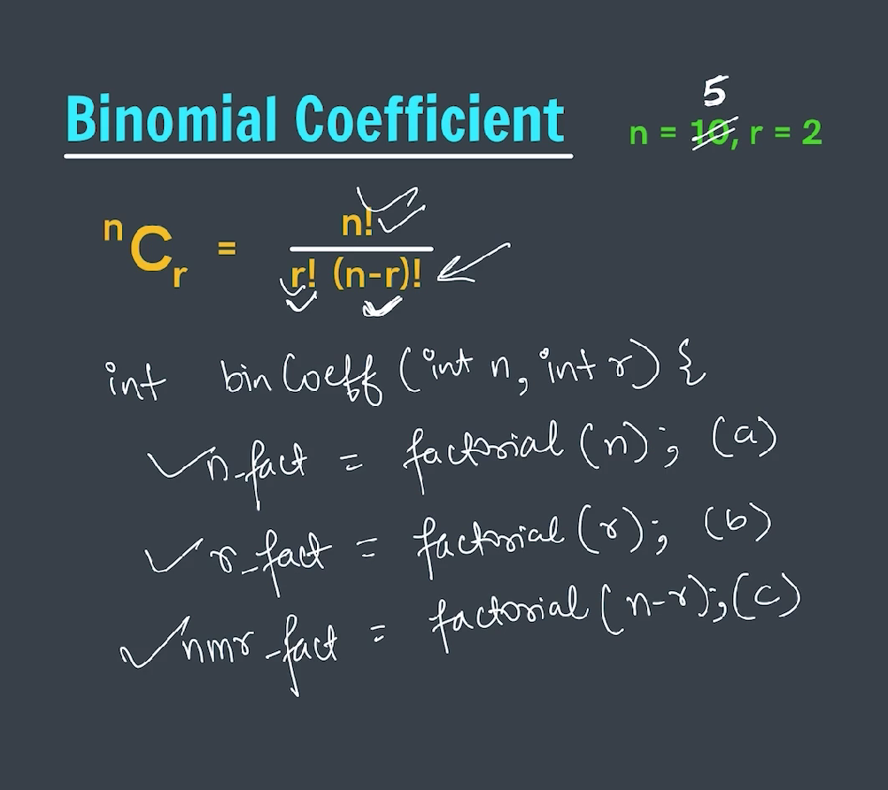
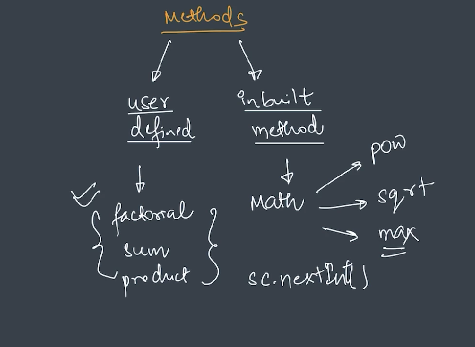
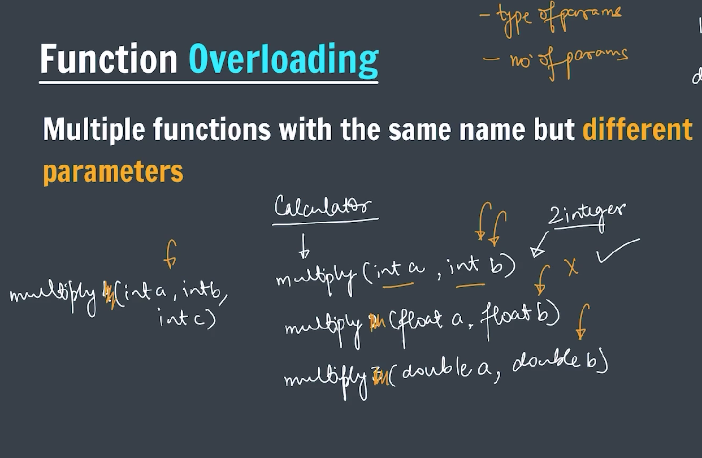
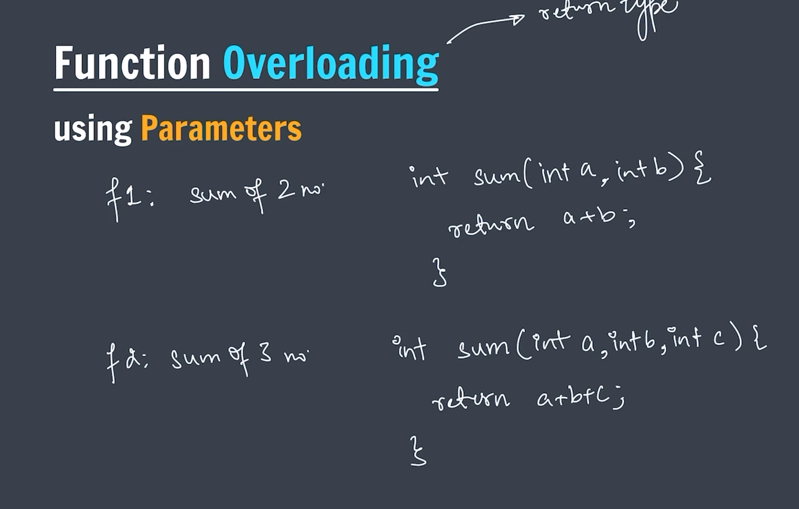
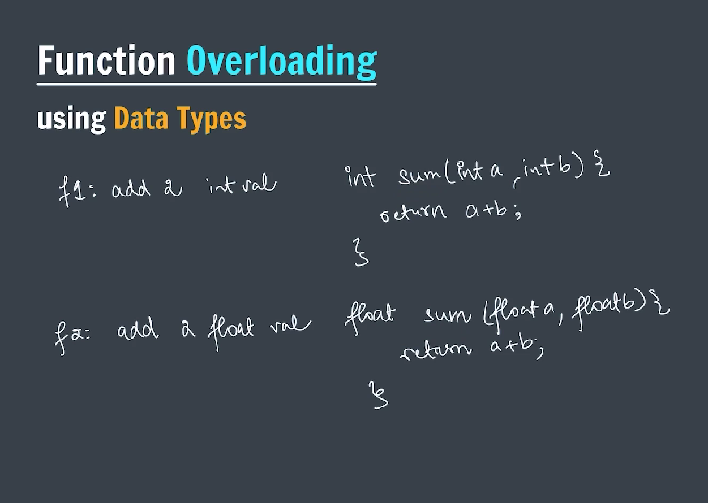

# FUNCTIONS OR METHODS

**In general English, "function" means some work.**

**_In Java, a function (more accurately called a method) is a block of code that can be reused._**


### SYNTAX


**_Functions without parameter:_**

```java
package functionsAndMethods;

public class functionsWithoutPara {

    public static void printHello() {
        System.out.println("Hello, World!");
        System.out.println("Hello, World!");
        System.out.println("Hello, World!");
    }

    public static void main(String[] args) {

        // Calling the function
        printHello();

    }
}

```

**_Functions with parameter_**


CODE

```java
package functionsAndMethods;

import java.util.Scanner;

public class functionwithpara {

    // Function to add two numbers
    public static int calculateSum(int a, int b) {
        return a + b;
    }

    public static void main(String[] args) {
        Scanner sc = new Scanner(System.in);
        System.out.print("Enter the first number: ");
        int a = sc.nextInt();
        System.out.print("Enter the second number: ");
        int b = sc.nextInt();
        int sum = calculateSum(a, b);
        System.out.println("The sum of " + a + " and " + b + " is: " + sum);
        sc.close();
    }
}


```


**_Java always Call by value_**

```java
package functionsAndMethods;

public class callByValue {

    public static void swap(int a, int b) {
        // swap by the help of temprary variable
        int temp = a;
        a = b;
        b = temp;

        // swap without using temporary variable
        /*
         * a = a + b;
         * b = a - b;
         * a = a - b;
         */

        /*
         * This function swaps the values of a and b, but since Java is a pass-by-value
         * (call-by-value)
         * language, the original values of a and b in the main method remain unchanged.
         */

        System.out.println("The value of a and b in the swap functin");
        System.out.println("A = " + a);
        System.out.println("B = " + b);

    }

    public static void main(String[] args) {
        int a = 5;
        int b = 10;

        // calling swap function
        swap(a, b); /*
                     * This will not change the value of a and b in the main method because
                     * it creates a copy of those variable and send that to swap function.
                     * Hence, After executing swap function it can not change original value of a
                     * and b.
                     */

        System.out.println("The value of a and b in the main method");
        System.out.println("A = " + a);
        System.out.println("B = " + b);
    }
}

```

**_->Calculate the product of two number_**

```java
package functionsAndMethods;

import java.util.Scanner;

public class productOfTwoNum {

    // Function to calculate the product of two number
    static int calculateProduct(int a, int b) {
        return a * b;
    }

    public static void main(String[] args) {
        Scanner sc = new Scanner(System.in);
        System.out.print("Enter the first number: ");
        int a = sc.nextInt();
        System.out.print("Enter the second number: ");
        int b = sc.nextInt();

        int product = calculateProduct(a, b);
        System.out.println("The product of two numbers " + a + " and " + b + " is: " + product);
        sc.close();
    }
}

```

**_->Calculate the factorial of N_**


```java
package functionsAndMethods;

import java.util.Scanner;

public class factorial {

    // Function to calculate factorial of a number
    static int calculateFactorial(int n) {
        /*
         * Using recursive approach to calculate factorial
         */
        if (n == 0 || n == 1) {
            return 1;
        }
        return n * calculateFactorial(n - 1);

        /*
         * Using iterative(for loop) approach to calculate factorial
         */
        // int factorial = 1;
        // for (int i = 1; i <= n; i++) {
        // factorial = factorial * i;
        // }
        // return factorial;
    }

    public static void main(String[] args) {
        Scanner sc = new Scanner(System.in);
        System.out.print("Enter a number to calculate its factorial: ");
        int n = sc.nextInt();

        int factorial = calculateFactorial(n);
        System.out.println("The factorial of " + n + " is: " + factorial);
        sc.close();

    }
}

```

**_->Calculate Binomial Coefficient_**
$$ C(n, k) = \frac{n!}{k! \times (n-k)!} $$

### Example:

To calculate the number of ways to choose 2 items from a set of 4 items (C(4, 2)):

$$ C(4, 2) = \frac{4!}{2! \times (4-2)!} = \frac{4!}{2! \times 2!} = \frac{4 \times 3 \times 2 \times 1}{(2 \times 1) \times (2 \times 1)} = \frac{24}{2 \times 2} = \frac{24}{4} = 6 $$

```java
package functionsAndMethods;

import java.util.Scanner;

public class binomialCoefficient {

    // Function to calculate Binomial Coefficient C(n,r)
    static int calculateBinomialCoefficient(int n, int r) {
        if (r > n) {
            return 0;
        }
        if (r == 0 || r == n) {
            return 1;
        }

        return calculateBinomialCoefficient(n - 1, r - 1) + calculateBinomialCoefficient(n - 1, r);
    }

    public static void main(String[] args) {
        // Binomial Coefficient is a way to calculate the number of ways to choose k
        // elements from a set of n elements.
        // It is denoted as C(n, k) or nCk and is calculated using the formula:
        // C(n, r) = n! / (r! * (n - r)!)

        Scanner sc = new Scanner(System.in);
        System.out.print("Enter the value of n: ");
        int n = sc.nextInt();
        System.out.print("Enter the value of r: ");
        int r = sc.nextInt();
        int binomialCoefficient = calculateBinomialCoefficient(n, r);
        System.out.println("The Binomial Coefficient C(" + n + ", " + r + ") is: " + binomialCoefficient);
        sc.close();
    }
}

```

#### -> Another way of solving Binomial Coefficient question



#### -> Types of methods



#### -> Function Overloading



#### -> Function Overloading using parameter



```java
package functionsAndMethods;

import java.util.Scanner;

// Function Overloading Example in Java
// This program demonstrates function overloading by defining multiple 'add' methods with different parameters.
public class functionOverloading {

    // Function to add two integers
    public static int add(int a, int b) {
        return a + b;
    }

    // Function to add three integers
    public static int add(int a, int b, int c) {
        return a + b + c;
    }

    public static void main(String[] args) {
        Scanner sc = new Scanner(System.in);
        System.out.print("Enter the first number: ");
        int a = sc.nextInt();
        System.out.print("Enter the second number: ");
        int b = sc.nextInt();
        System.out.print("Enter the third number: ");
        int c = sc.nextInt();

        System.out.println("Addition of two numbers: " + add(a, b));
        System.out.println("Addition of three numbers: " + add(a, b, c));

        sc.close();
    }
}

```

#### -> Function Overloading Using Data Types



```java
package functionsAndMethods;

public class functionOverloadingUsingDTypes {

    /*
     * Function Overloading Example in Java
     * This program demonstrates function overloading by defining multiple 'add'
     * methods with different data types.
     */

    // Function to add two integers
    static int add(int a, int b) {
        return a + b;
    }

    // Function to add two floats
    static float add(float a, float b) {
        return a + b;
    }

    // Function to add two doubles
    static double add(double a, double b) {
        return a + b;
    }

    // Function to add two strings
    static String add(String a, String b) {
        return a + b;
    }

    public static void main(String[] args) {
        System.out.println("Addition of two integers: " + add(5, 10));
        System.out.println("Addition of two floats: " + add(5.4f, 6.9f));
        System.out.println("Addition of two doubles: " + add(5.5, 10.5));
        System.out.println("Addition of two strings: " + add("Hello, ", "World!"));
    }
}
```
