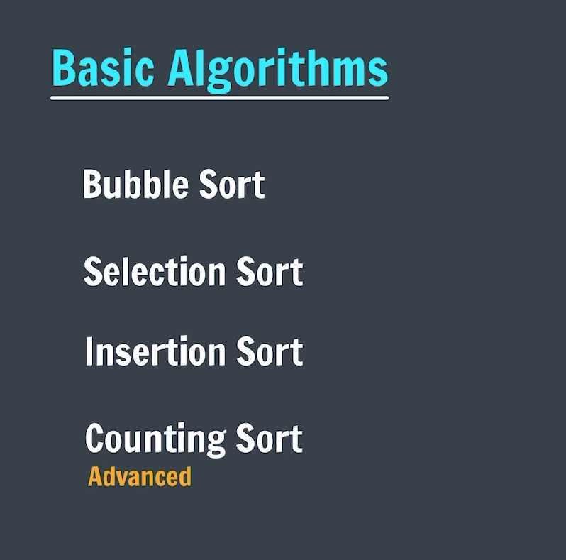
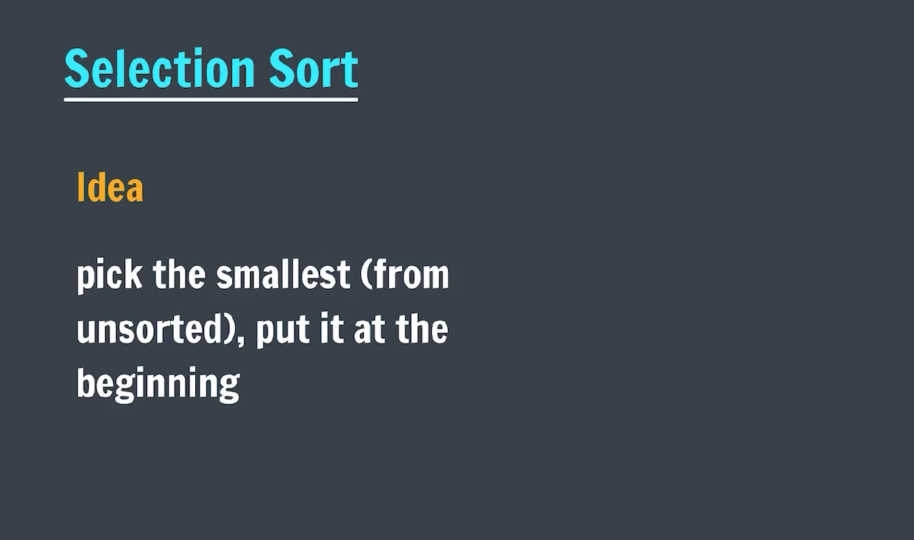

### SORTING

**_-> Sorting_**




**_-> Bubble sort_**


```java
package sorting;

import java.util.Scanner;

public class bubbleSort {
    public static void main(String[] args) {
        Scanner sc = new Scanner(System.in);
        System.out.print("Enter the number of elements to be get added: ");
        int n = sc.nextInt();

        System.out.println("Enter elements into array: ");
        int arr[] = new int[n];
        for (int i = 0; i < n; i++) {
            arr[i] = sc.nextInt();
        }

        System.out.println("Bubble Sort: ");
        for (int i = 0; i < n; i++) {
            for (int j = i + 1; j < n; j++) {
                if (arr[i] > arr[j]) {
                    int temp = arr[i];
                    arr[i] = arr[j];
                    arr[j] = temp;
                }
            }
        }

        System.out.println("After sort");
        for (int i = 0; i < n; i++) {
            System.out.print(arr[i] + " ");
        }

        sc.close();
    }
}
```

**_->Selection sort_**


```java
package sorting;

import java.util.Scanner;

public class selectionSort {
    public static void selection(int arr[]) {

        for (int i = 0; i < arr.length - 1; i++) {
            int minPos = i;
            for (int j = i + 1; j < arr.length - 1; j++) {
                if (arr[minPos] > arr[j]) {
                    minPos = j;
                }
            }

            int temp = arr[minPos];
            arr[minPos] = arr[i];
            arr[i] = temp;

        }

    }

    public static void main(String[] args) {
        Scanner sc = new Scanner(System.in);
        System.out.print("Enter the length of the array: ");
        int n = sc.nextInt();

        System.out.println("Enter the elements into the array: ");
        int arr[] = new int[n];

        for (int i = 0; i < n; i++) {
            arr[i] = sc.nextInt();
        }

        System.out.println("***Selection Sort***");
        System.out.println("After sorting: ");
        selection(arr);
        for (int i = 0; i < n; i++) {
            System.out.print(arr[i] + " ");
        }

        sc.close();
    }
}
```
