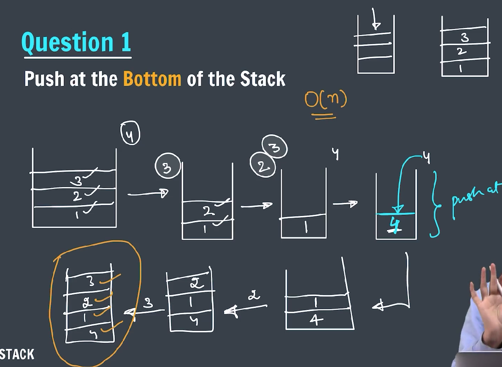
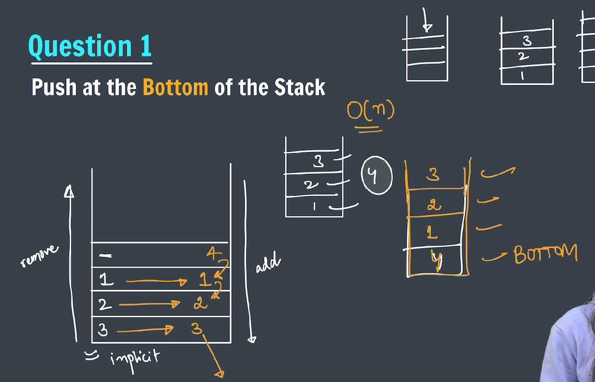
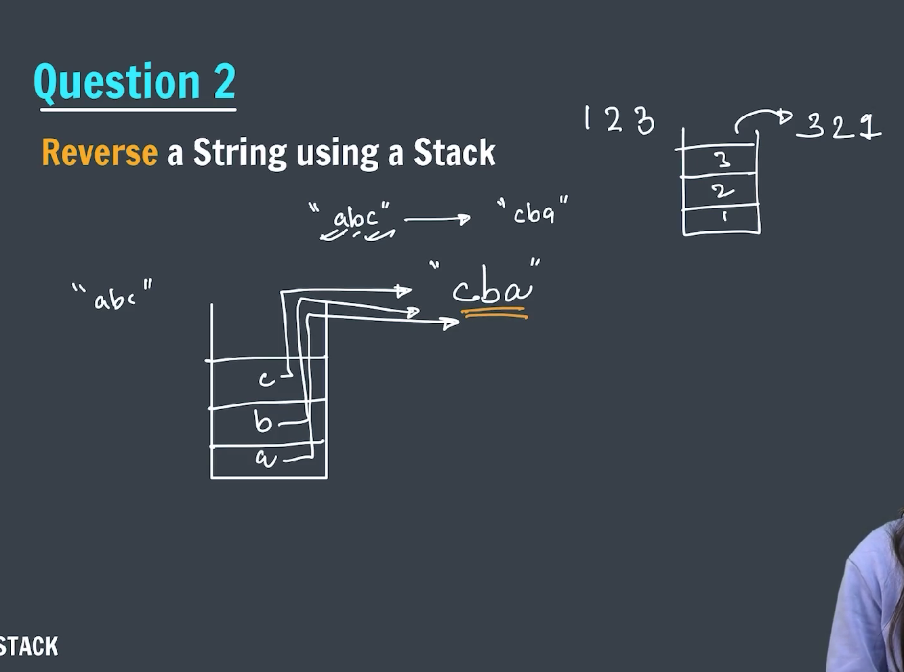
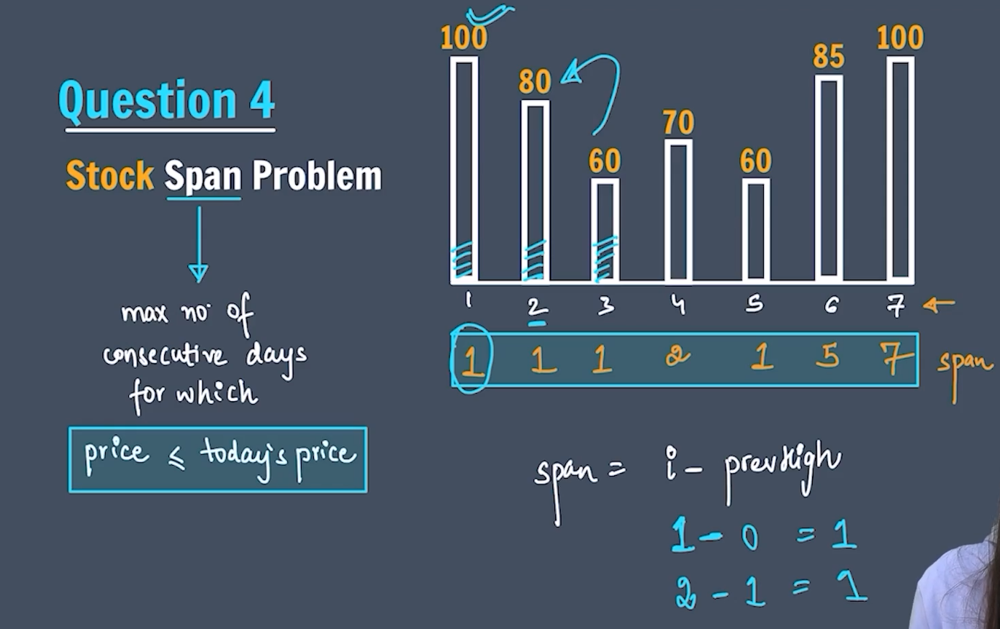
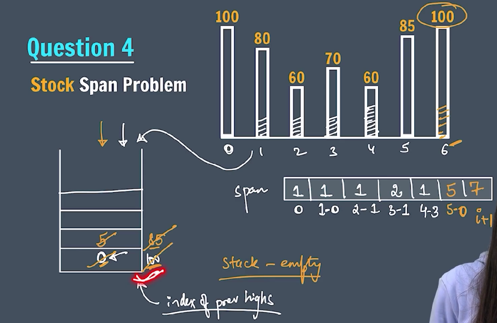

### Questions

---

### `push` at the bottom of the stack



---



---

```java
package stack.Questions;

import java.util.Stack;

public class PushAtTheBottom {

    static void pushAtBottom(Stack<Integer> stack, int value) {

        if (stack.isEmpty()) {
            stack.push(value);
            return;
        }

        int top = stack.pop();
        pushAtBottom(stack, value);

        stack.push(top);

    }

    public static void main(String[] args) {

        Stack<Integer> stack1 = new Stack<>();
        // initially push 10,11,12
        stack1.push(10);
        stack1.push(11);
        stack1.push(12);
        System.out.println("Stack: " + stack1);

        // push 20 at the bottom
        pushAtBottom(stack1, 20);

        System.out.println("Stack: " + stack1);

        while (!stack1.isEmpty()) {
            System.out.println(stack1.peek());
            stack1.pop();
        }

    }
}
```

---

### `Reverse` a string by using stack



---

```java
package stack.Questions;

import java.util.Stack;

public class ReverseString {

    public static String reverseString(String str) {

        Stack<Character> stack = new Stack<>();
        int i = 0;
        while (i < str.length()) {
            stack.push(str.charAt(i));
            i++;
        }

        StringBuilder sb = new StringBuilder();
        while (!stack.isEmpty()) {
            sb.append(stack.pop());
        }

        return sb.toString();

    }

    public static void main(String[] args) {

        String str = "india";

        System.out.println("Reversed string: " + reverseString(str));

    }
}
```

---

### `Reverse` a stack

```java
package stack.Questions;

import java.util.Stack;

public class ReverseStack {

    public static void pushAtBottom(Stack<Integer> stack, int data) {

        if (stack.isEmpty()) {
            stack.push(data);
            return;
        }

        int top = stack.pop();
        pushAtBottom(stack, data);
        stack.push(top);
    }

    public static void reverseStack(Stack<Integer> stack) {
        if (stack.isEmpty()) {
            return;
        }

        int top = stack.pop();
        reverseStack(stack);

        pushAtBottom(stack, top);

    }

    public static void main(String[] args) {

        Stack<Integer> stack = new Stack<>();
        stack.add(1);
        stack.add(2);
        stack.add(3);

        System.out.println(stack);

        reverseStack(stack);
        System.out.println(stack);

        System.out.println("Reversed stack: ");
        while (!stack.isEmpty()) {
            System.out.print(stack.pop() + " ");
        }

    }
}
```

---

### Stock span problem

For each element in the array (usually representing stock prices on consecutive days), the span is the number of consecutive days before it (including the current day) for which the price was less than or equal to the current day's price.



---



---

### Explanation of the examples:

#### Example 1:

Input: `[100, 80, 60, 70, 60, 75, 85]`

Output: `[1, 1, 1, 2, 1, 4, 6]`

- For `100`: No previous prices, so span is 1.
- For `80`: Previous price `100` is higher, so span is 1.
- For `60`: Previous price `80` is higher, so span is 1.
- For `70`: Previous prices `60` and `70` are <= `70`, but `80` is higher. So span is 2.
- For `60`: Previous price `70` is higher, so span is 1.
- For `75`: Previous prices `60, 70, 60, 75` are <= `75`, so span is 4.
- For `85`: Previous prices `75, 60, 70, 60, 80` are <= `85`, so span is 6.

---

#### Example 2:

Input: `[10, 4, 5, 90, 120, 80]`

Output: `[1, 1, 2, 4, 5, 1]`

- For `10`: No previous prices, so span is 1.
- For `4`: Previous price `10` is higher, so span is 1.
- For `5`: Previous price `4` is less or equal, so span is 2 (`4, 5`).
- For `90`: Previous prices `5, 4, 10` all less or equal, so span is 4.
- For `120`: Previous prices `90, 5, 4, 10` all less or equal, so span is 5.
- For `80`: Previous price `120` is higher, so span is 1.

---

```java
package stack.Questions;

import java.util.Scanner;
import java.util.Stack;

public class StockSpanProblem {

    public static int[] stockSpan(int stock[]) {
        int span[] = new int[stock.length];

        Stack<Integer> spanStock = new Stack<>();

        span[0] = 1;
        spanStock.push(0);

        for (int i = 1; i < stock.length; i++) {
            int currPrice = stock[i];
            while (!spanStock.isEmpty() && currPrice > stock[spanStock.peek()]) {
                spanStock.pop();
            }

            if (spanStock.isEmpty()) {
                span[i] = i + 1;
            }

            span[i] = i - spanStock.peek();
            spanStock.push(i);

        }

        return span;

    }

    public static void main(String[] args) {
        // int arr[] = { 100, 80, 60, 70, 60, 85, 100 };

        Scanner sc = new Scanner(System.in);
        System.out.print("Enter the length of the stock array size: ");
        int n = sc.nextInt();
        System.out.print("Enter the stock array values: ");
        int stock[] = new int[n];
        for (int i = 0; i < n; i++) {
            stock[i] = sc.nextInt();
        }

        int span[] = stockSpan(stock);

        for (int i = 0; i < span.length; i++) {
            System.out.print((i < span.length - 1) ? span[i] + ", " : span[i]);
        }

        sc.close();

    }

}
```

---
