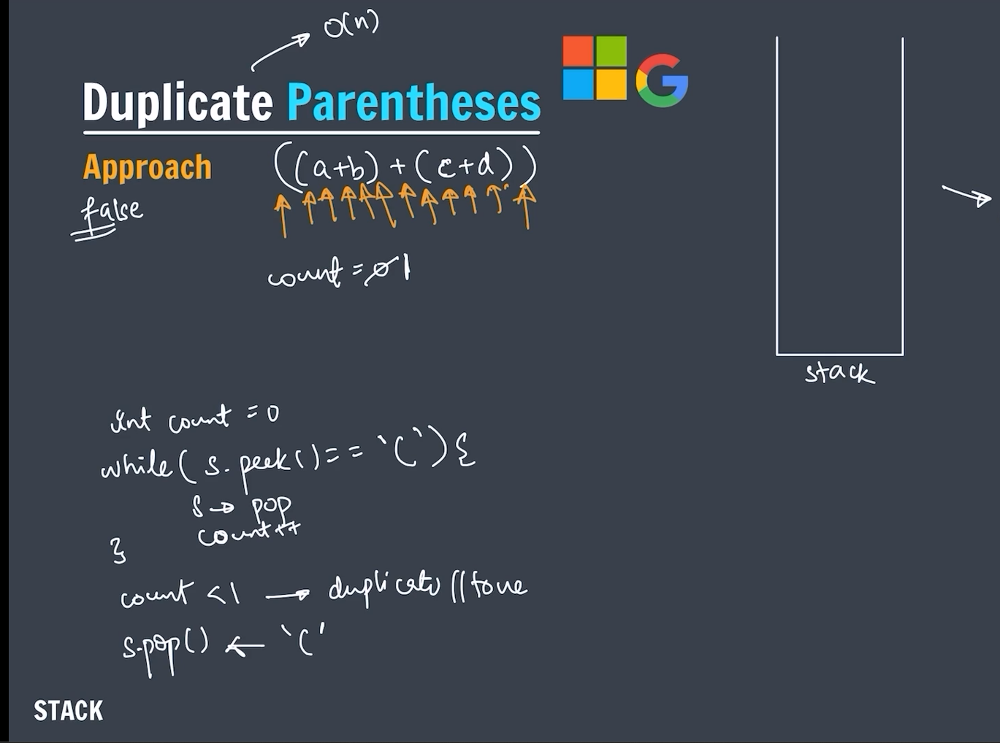

### Questions

---

### `push` at the bottom of the stack


---


---

```java

import java.util.Stack;

public class PushAtTheBottom {

    static void pushAtBottom(Stack<Integer> stack, int value) {

        if (stack.isEmpty()) {
            stack.push(value);
            return;
        }

        int top = stack.pop();
        pushAtBottom(stack, value);

        stack.push(top);

    }

    public static void main(String[] args) {

        Stack<Integer> stack1 = new Stack<>();
        // initially push 10,11,12
        stack1.push(10);
        stack1.push(11);
        stack1.push(12);
        System.out.println("Stack: " + stack1);

        // push 20 at the bottom
        pushAtBottom(stack1, 20);

        System.out.println("Stack: " + stack1);

        while (!stack1.isEmpty()) {
            System.out.println(stack1.peek());
            stack1.pop();
        }

    }
}
```

---

### `Reverse` a string by using stack


---

```java

import java.util.Stack;

public class ReverseString {

    public static String reverseString(String str) {

        Stack<Character> stack = new Stack<>();
        int i = 0;
        while (i < str.length()) {
            stack.push(str.charAt(i));
            i++;
        }

        StringBuilder sb = new StringBuilder();
        while (!stack.isEmpty()) {
            sb.append(stack.pop());
        }

        return sb.toString();

    }

    public static void main(String[] args) {

        String str = "india";

        System.out.println("Reversed string: " + reverseString(str));

    }
}
```

---

### `Reverse` a stack

```java

import java.util.Stack;

public class ReverseStack {

    public static void pushAtBottom(Stack<Integer> stack, int data) {

        if (stack.isEmpty()) {
            stack.push(data);
            return;
        }

        int top = stack.pop();
        pushAtBottom(stack, data);
        stack.push(top);
    }

    public static void reverseStack(Stack<Integer> stack) {
        if (stack.isEmpty()) {
            return;
        }

        int top = stack.pop();
        reverseStack(stack);

        pushAtBottom(stack, top);

    }

    public static void main(String[] args) {

        Stack<Integer> stack = new Stack<>();
        stack.add(1);
        stack.add(2);
        stack.add(3);

        System.out.println(stack);

        reverseStack(stack);
        System.out.println(stack);

        System.out.println("Reversed stack: ");
        while (!stack.isEmpty()) {
            System.out.print(stack.pop() + " ");
        }

    }
}
```

---

### Stock span problem

For each element in the array (usually representing stock prices on consecutive days), the span is the number of consecutive days before it (including the current day) for which the price was less than or equal to the current day's price.


---


---

### Explanation of the examples:

#### Example 1:

Input: `[100, 80, 60, 70, 60, 75, 85]`

Output: `[1, 1, 1, 2, 1, 4, 6]`

- For `100`: No previous prices, so span is 1.
- For `80`: Previous price `100` is higher, so span is 1.
- For `60`: Previous price `80` is higher, so span is 1.
- For `70`: Previous prices `60` and `70` are <= `70`, but `80` is higher. So span is 2.
- For `60`: Previous price `70` is higher, so span is 1.
- For `75`: Previous prices `60, 70, 60, 75` are <= `75`, so span is 4.
- For `85`: Previous prices `75, 60, 70, 60, 80` are <= `85`, so span is 6.

---

#### Example 2:

Input: `[10, 4, 5, 90, 120, 80]`

Output: `[1, 1, 2, 4, 5, 1]`

- For `10`: No previous prices, so span is 1.
- For `4`: Previous price `10` is higher, so span is 1.
- For `5`: Previous price `4` is less or equal, so span is 2 (`4, 5`).
- For `90`: Previous prices `5, 4, 10` all less or equal, so span is 4.
- For `120`: Previous prices `90, 5, 4, 10` all less or equal, so span is 5.
- For `80`: Previous price `120` is higher, so span is 1.

---

```java

import java.util.Scanner;
import java.util.Stack;

public class StockSpanProblem {

    public static int[] stockSpan(int stock[]) {
        int span[] = new int[stock.length];

        Stack<Integer> spanStock = new Stack<>();

        span[0] = 1;
        spanStock.push(0);

        for (int i = 1; i < stock.length; i++) {
            int currPrice = stock[i];
            while (!spanStock.isEmpty() && currPrice > stock[spanStock.peek()]) {
                spanStock.pop();
            }

            if (spanStock.isEmpty()) {
                span[i] = i + 1;
            }

            span[i] = i - spanStock.peek();
            spanStock.push(i);

        }

        return span;

    }

    public static void main(String[] args) {
        // int arr[] = { 100, 80, 60, 70, 60, 85, 100 };

        Scanner sc = new Scanner(System.in);
        System.out.print("Enter the length of the stock array size: ");
        int n = sc.nextInt();
        System.out.print("Enter the stock array values: ");
        int stock[] = new int[n];
        for (int i = 0; i < n; i++) {
            stock[i] = sc.nextInt();
        }

        int span[] = stockSpan(stock);

        for (int i = 0; i < span.length; i++) {
            System.out.print((i < span.length - 1) ? span[i] + ", " : span[i]);
        }

        sc.close();

    }

}
```

---

### Find next greater element (Using Stack)

### TC : `O(n)`

---


---

### ✅ Problem:

For each element in the array, find the next element to the right that is **greater** than it. If no such element exists, return `-1` for that position.

---

```java

import java.util.Scanner;
import java.util.Stack;

public class NextGreaterElement {

    public static int[] nextGreater(int greater[]) {

        int nGreater[] = new int[greater.length];

        Stack<Integer> findGreater = new Stack<>();

        for (int i = greater.length - 1; i >= 0; i--) {
            int element = greater[i];
            while (!findGreater.isEmpty() && findGreater.peek() <= element) {
                findGreater.pop();
            }

            nGreater[i] = findGreater.isEmpty() ? -1 : findGreater.peek();

            findGreater.push(element);
        }

        return nGreater;
    }

    public static void main(String[] args) {
        // int elements[] = { 6, 8, 0, 1, 3 };

        /*
         *
         * Approach 1 -> Brute force approach
         *
         * Scanner sc = new Scanner(System.in);
         * System.out.print("Enter the size of the elements array: ");
         * int n = sc.nextInt();
         * System.out.print("Enter elements in elements array: ");
         * int elements[] = new int[n];
         * for (int i = 0; i < n; i++) {
         * elements[i] = sc.nextInt();
         * }
         *
         * int nextGreater[] = new int[n];
         * for (int i = 0; i < elements.length; i++) {
         * for (int j = i + 1; j < elements.length; j++) {
         * if (elements[i] < elements[j]) {
         * nextGreater[i] = elements[j];
         * break;
         * } else {
         * nextGreater[i] = -1;
         * }
         * }
         * }
         * nextGreater[n - 1] = -1;
         *
         * for (int i = 0; i < n; i++) {
         * System.out.print((i < n - 1) ? nextGreater[i] + ", " : nextGreater[i]);
         * }
         * System.out.println();
         *
         * sc.close();
         *
         */

        Scanner sc = new Scanner(System.in);
        System.out.print("Enter the length of the array: ");
        int n = sc.nextInt();
        System.out.println("Enter elements in array: ");
        int greater[] = new int[n];
        for (int i = 0; i < n; i++) {
            greater[i] = sc.nextInt();
        }

        int nGreater[] = nextGreater(greater);

        for (int i = 0; i < n; i++) {
            System.out.print((i < n - 1) ? nGreater[i] + ", " : nGreater[i]);
        }

        sc.close();

    }
}
```

---

### 🔍 Explanation:

- Start from the **rightmost** element.
- Use a **stack** to keep track of possible greater elements.
- For each element:
  - Pop all smaller or equal elements from the stack.
  - If the stack is empty, no greater element → `-1`.
  - Otherwise, top of the stack is the NGE.
  - Push the current element onto the stack for future comparisons.

---

### Valid Parantheses

To check if a string of **parentheses is valid** (i.e., every opening bracket has a corresponding closing bracket in the correct order), you can use a **stack**.

---


---

### 🔍 Explanation:

- Push all **opening brackets** onto the stack.
- On encountering a **closing bracket**, check if it matches the top of the stack:
  - If not, it's invalid.
  - If yes, pop the stack and continue.
- At the end, the string is valid only if the **stack is empty**.

---

### ✅ Example Inputs & Outputs:

| Input      | Output |
| ---------- | ------ |
| `"()"`     | true   |
| `"()[]{}"` | true   |
| `"(]"`     | false  |
| `"([)]"`   | false  |
| `"{[]}"`   | true   |

---

```java

import java.util.Stack;
import java.util.Scanner;

public class ValidParantheses {
    public static boolean parantheses(String brackets) {

        Stack<Character> storeParantheses = new Stack<>();

        for (int i = 0; i < brackets.length(); i++) {
            char bracket = brackets.charAt(i);
            if (bracket == '(' || bracket == '{' || bracket == '[') {
                storeParantheses.push(bracket);
            }

            else {
                if (storeParantheses.isEmpty()) {
                    return false;
                }
                char top = storeParantheses.pop();
                if ((bracket == ')' && top != '(') ||
                        (bracket == '}' && top != '{') ||
                        (bracket == ']' && top != '[')) {
                    return false;
                }

            }
        }

        return storeParantheses.isEmpty();

    }

    public static void main(String[] args) {

        Scanner sc = new Scanner(System.in);
        System.out.print("Enter a parantheses string: ");
        String brackets = sc.nextLine();

        System.out.println((parantheses(brackets)) ? brackets + " is a valid parantheses."
                : brackets + " is not a valid parantheses.");

        sc.close();

    }
}
```

---

### Duplicate parentheses

Detecting **duplicate parentheses** in a Java expression is a common problem that can be efficiently solved using a **stack**. Duplicate parentheses mean there are extra parentheses that do not affect the expression, like `"((a+b))"` — the outer pair is unnecessary.

---




---

### ✅ Problem Example:

```java
Input:  ((a+b))
Output: true  // Duplicate parentheses

Input:  (a+(b)/c)
Output: false  // No duplicates

Input:  (a+b*(c-d))
Output: false  // No duplicates
```

---

### 💡 Approach:

Use a **stack** to process the expression:

- Traverse the characters of the expression.
- Push each character onto the stack **until a closing parenthesis `)`** is encountered.
- When you find a closing parenthesis:
  - Check the top of the stack.
  - If you immediately find an opening parenthesis `'('`, it means there were no operators or operands between `()` → **duplicate**.
  - Else, pop until you find `'('` (i.e., remove the expression inside parentheses).

---

```java

import java.util.Stack;
import java.util.Scanner;

public class DuplicateParentheses {

    public static boolean hasDuplicateParentheses(String expression) {

        Stack<Character> parentheses = new Stack<>();
        for (char ch : expression.toCharArray()) {

            if (ch == ')') {
                int count = 0;

                while (!parentheses.isEmpty() && parentheses.peek() != '(') {

                    parentheses.pop();
                    count++;
                }

                if (!parentheses.isEmpty()) {
                    parentheses.pop();
                }

                if (count == 0) {
                    return true;
                }
            } else {
                parentheses.push(ch);
            }
        }

        return false;
    }

    public static void main(String[] args) {
        Scanner sc = new Scanner(System.in);
        System.out.print("Enter the expression: ");
        String expression = sc.nextLine();

        System.out.println(hasDuplicateParentheses(expression));

        sc.close();
    }

}
```
