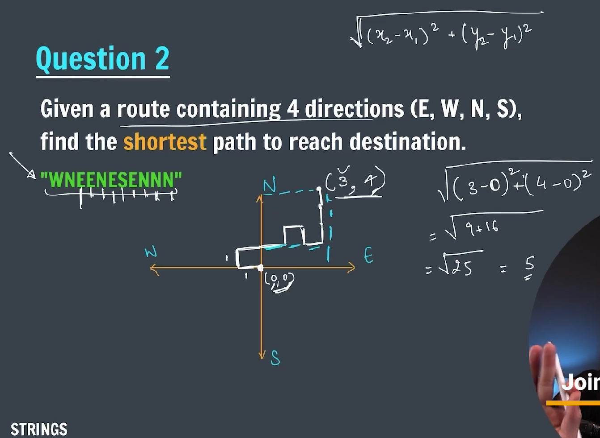
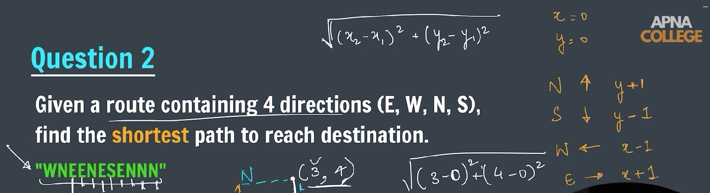
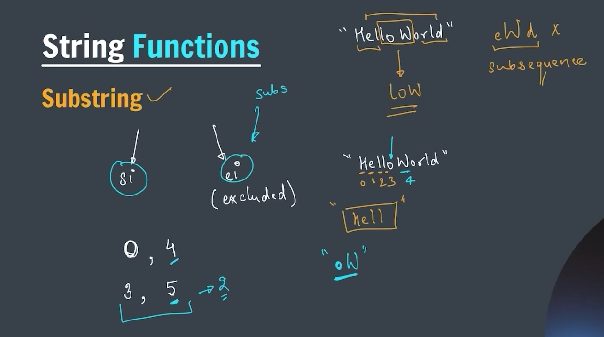

### String Data Structure

**_How to create String_**

```java
package strings;

import java.util.Scanner;

public class string {
    public static void main(String[] args) {
        char arr[] = { 'a', 'b', 'c', 'd' };

        String str = new String(arr);

        System.out.println(str);

        Scanner sc = new Scanner(System.in);
        System.out.println("Get the string input from user : ");
        String s = sc.next();

        System.out.println(s);

        System.out.println("String length function");
        System.out.println(s.length());

        sc.close();

    }
}
```

**_Program to check whether given string is palindrome or not_**
**_-> CODE_**

```java
package strings;

import java.util.Scanner;

public class palindrome {

    public static boolean isPalindrome(String str) {

        int start = 0;
        int end = str.length() - 1;

        while (start < end) {
            if (str.charAt(start) != str.charAt(end)) {
                return false;
            }

            start++;
            end--;
        }

        return true;

    }

    static boolean isPalindrome(String str, int start, int end) {

        if (start >= end) {
            return true;
        }

        if (str.charAt(start) != str.charAt(end)) {
            return false;
        }

        // return isPalindrome(str, start + 1, end - 1);
        return isPalindrome(str, ++start, --end);

    }

    public static void main(String[] args) {

        Scanner sc = new Scanner(System.in);
        System.out.print("Enter a string to check: ");
        String str = sc.nextLine();

        System.out.println("Checking palindrome without use of recursion.");
        if (isPalindrome(str)) {
            System.out.println(str + " is a palindrome string.");
        } else {
            System.out.println(str + " is not a palindrome string.");
        }

        System.out.println("Checking palindrome with use of recursion.");
        if (isPalindrome(str, 0, str.length() - 1)) {
            System.out.println(str + " is a palindrome number.");
        } else {
            System.out.println(str + " is not a palindrome number.");
        }

        sc.close();

    }
}
```

**_Find shortest path in map_**



**_Program to find the shortest path_**
**_-> CODE_**

```java
package strings;

public class getShortestPath {

    static float shortestPath(String str) {

        int x = 0, y = 0;
        for (int i = 0; i < str.length(); i++) {
            char path = str.charAt(i);

            // south
            if (path == 'S') {
                y--;
            }
            // North
            else if (path == 'N') {
                y++;
            }
            // West
            else if (path == 'W') {
                x--;
            }
            // East
            else {
                x++;
            }
        }

        int x2 = x * x, y2 = y * y;

        return (float) Math.sqrt(x2 + y2);

    }

    public static void main(String[] args) {
        String path = "WNEENESENNN";

        float shortPath = shortestPath(path);

        System.out.println("Shortest path is: " + shortPath);

    }
}
```

**_Substring of the string_**


```java
package strings;

public class substr {

    public static String substring(String str, int si, int ei) {
        String subStr = "";

        for (int i = si; i < ei; i++) {
            subStr += str.charAt(i);
        }

        return subStr;

    }

    public static void main(String[] args) {
        String str = "HelloWorld";

        str = substring(str, 0, 5);
        System.out.println(str);
    }
}
```
